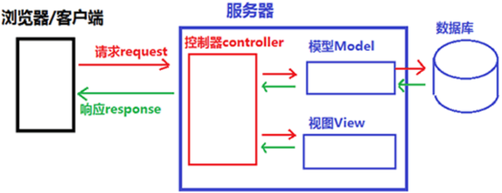
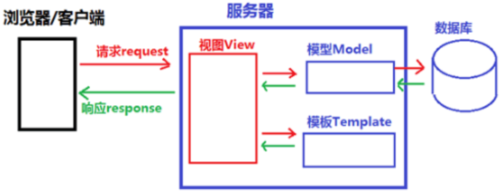
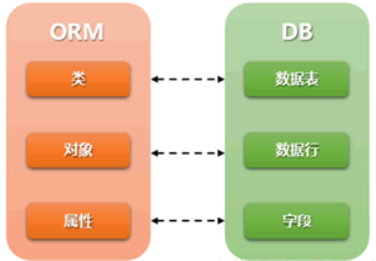
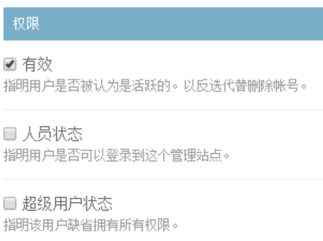
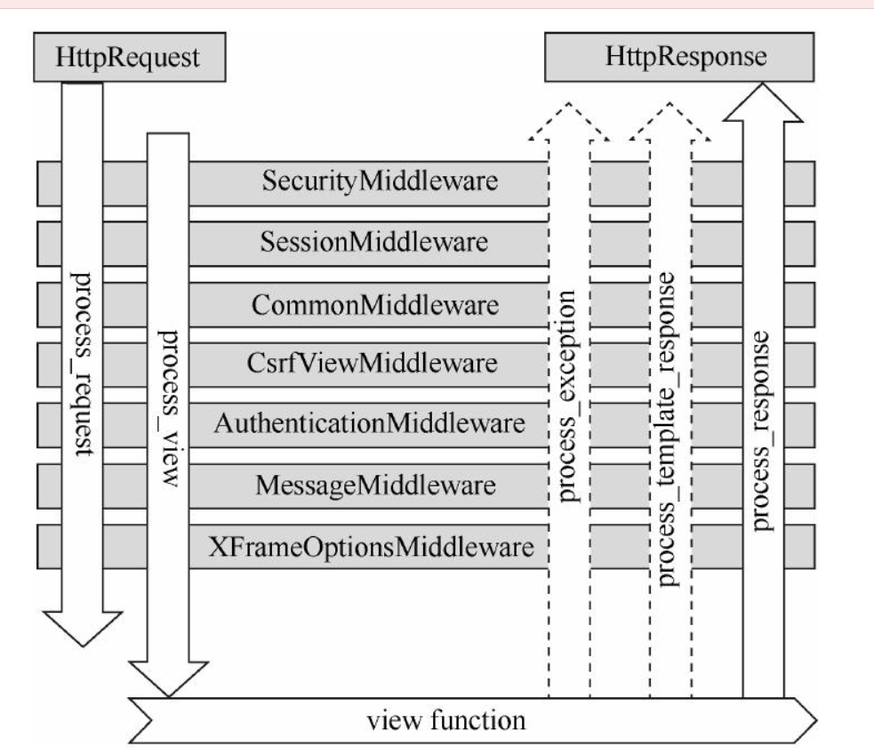
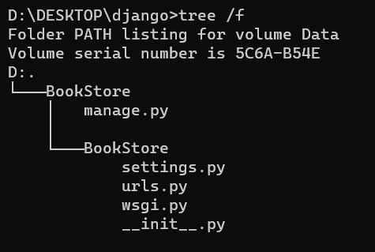

# 1. MTV 和 MVC 的区别


## 1.1 MVC 简述

MVC = Model + View + Controller

Model（模型）：数据存储层，数据表的定义，数据的增删改查

View（视图）：视图层，前端显示部分

Controller（控制器）：根据从 View 层来的指令来操作 Model 层的数据，在该层产生结果输出

## 1.2 MVC 请求与响应过程



1. 用户通过浏览器向服务器发送请求（request）
2. Controller 接收到请求（request）后向 Model 层和 View 层发送指令
3. Model 层接收到指令，从数据库选择业务数据交给 Controller 层
4. View 层接收到指令，加载页面，发送给 Controller 层
5. Controller 层接收到 Model 和 View 的数据后，组织成响应（response），发送给客户端
6. 浏览器解析收到的响应（response），把页面展示出来


## 1.3 MTV 简述

MTV = Model + Template + View

Model：数据存储层，数据表的定义，数据的增删改查

Template：模板层，也叫表示层，具体处理页面的展示（MVC：View）

View：业务逻辑层，连通 Model 和 Template（MVC：Controller）


## 1.4 MTV 请求与响应过程



1. 浏览器发送请求，View 层收到后给 Model 和 Template 发送指令
2. Model 处理数据后，返回数据给 View
3. Template 调用相应的模板，返回 View
4. View 先对模板进行渲染，再返回响应
5. 浏览器解析响应，页面展示


## 1.5 区别与联系

MTV 是 MVC 的一种细化，将 MVC 中的 View 进行分离，显示问题交给 Template，使得 View 更专注于实现前端业务逻辑。

Django 是有 Controller 层的，其由框架本身来实现。


# 2. Django ORM 应用模块


## 2.1 ORM 简述

ORM = Object Realtional Mapping 对象关系映射



| 字段          | 说明                                                         | 字段属性                                                     |
| ------------- | ------------------------------------------------------------ | ------------------------------------------------------------ |
| AutoFiled     | 默认自增主键（Primary_key=Ture），Django 默认建立id字段为主键。 |                                                              |
| CharFiled     | 字符类型                                                     | Max_length=32，字符长度需要明确                              |
| IntgerFiled   | 整型 int                                                     |                                                              |
| DateFiled     | 年月日                                                       | auto_now=True，数据被更新就会更新时间 ；auto_now_add=True，数据第一次参数时产生。 |
| DateTimeFiled | 年月日时分秒                                                 | 同上                                                         |
| DecimalFiled  | 混合精度的小数类型                                           | max_digits=3，限定数字的最大位数(包含小数位)；decimal_places=2，限制小数的最大位数。 |
| BooleanFiled  | 布尔字段，对应 tinyint 类型数据长度只有1位                   | 值为True或False                                              |
| TextFiled     | 用于大文本                                                   |                                                              |


## 2.2 定义数据表

Django 模型类 =  ORM 模块

```python
# 创建UserInfo数据表，有两个属性
from django.db import models
# 继承models.Model类
class UserInfo（models.Model）:
      name = models.CharFiled(max_length=100)
      password = models.CharFiled(max_length=100)
```

```python
# 再数据表中插入数据
UserInfo.objects.create(name='jay',password='abc123')
# 方法二
Obj=UserInfo（name="jay",password="abc123"）
Obj.name="john"
Obj.save()
```

ORM 管理器对象：每个继承自 `models.Model` 的模型类，都会有一个 objects 对象被同时继承下来，这个对象就叫做“管理器对象”，数据库的增删改查可以用 objects 管理器对象来实现。

```python
UserInfo.objects.all()#查询表中的所有记录
UserInfo.objects.filter(name_contains='j')#查询表中name含有“j”的所有记录,被使用较多
UserInfo.objects.get(name="john")#有且只有一个查询结果，如果超出一个或者没有,则抛出异常
UserInfo.objects.get(name="john").delete()#删除名字为john的记录
UserInfo.objects.get(name="john").update(name='TOM')#更新数据表的name为TOM
```


# 3. Django auth 应用模块

在设计开发任何一个站点的时候都需要有“用户”的概念。

从用户的注册、登陆、退出或者注销，到用户的浏览、订阅等，这些都需要用户管理系统来实现。

``` bash
+--------------+--------------+------+-----+---------+----------------+
| Field        | Type         | Null | Key | Default | Extra          |
+--------------+--------------+------+-----+---------+----------------+
| id           | int(11)      | NO   | PRI | NULL    | auto_increment |
| password     | varchar(128) | NO   |     | NULL    |                |
| last_login   | datetime(6)  | YES  |     | NULL    |                |
| is_superuser | tinyint(1)   | NO   |     | NULL    |                |
| username     | varchar(150) | NO   | UNI | NULL    |                |
| first_name   | varchar(30)  | NO   |     | NULL    |                |
| last_name    | varchar(150) | NO   |     | NULL    |                |
| email        | varchar(254) | NO   |     | NULL    |                |
| is_staff     | tinyint(1)   | NO   |     | NULL    |                |
| is_active    | tinyint(1)   | NO   |     | NULL    |                |
| date_joined  | datetime(6)  | NO   |     | NULL    |                |
+--------------+--------------+------+-----+---------+----------------+
```


```python
from django.contrib.auth.models import User

user=User.objects.create_user(username='c语言中文网',password='123456',email='664104694@qq.com')
user.save()#调用该方法保存数据 
user.set_password(password='12345abc')#会对原密码进行修改
```

```python
from django.contrib.auth import authenticate

user = authenticate(username='c语言中文网',password='12345abc')
```

```python
user.user_permission.add(permission)#给某个用户权限的添加权限
group = Group.objects.create(name=group_name)#添加新的用户组
group.save() #保存新建好的用户组
group.delete()#删除用户组
```


# 4. Django Admin 后台管理系统



# 5. Django 视图函数

```python
from django.http import HttpResponse
def Hello_my_django(request):
    return HttpResponse('<html><body>Hello my Django</body></html>')
```

视图层（View）的实现过程：

1. Django 收到请求，首先创建一个带有请求信息的 HttpRequset 对象

2. 将 HttpRequest 的对象 request 作为参数传递给视图函数
3. 视图函数接收参数后继续向下执行，选择加载对应的视图
4. 最后返回 HttpResponse 对象给浏览器


# 6. Django 模板系统

模板层（Template）实现：

1. 创建 Django 项目后，在项目的同级目录下创建一个名为 templates 文件夹
2. 这个文件夹将被 Django 自动识别
3. 过程由 Django 框架来实现，所以我们无需关心内部细节


# 7. Django 路由系统应用

```python
from django.conf.urls import url
from django.contrib import admin
from myject import views

urlpatterns = [
    url(r'admin/', admin.site.urls),
    url(r'^page$/',views.page_view),]
```


# 8. Django 中间件




# 9. Django Cache 缓存系统

Memcached 是 Django 支持的最快、最高效的分布式高效缓存系统，它是一种完全基于内存的缓存服务器。它被 Facebook 、维基百科等网站使用，从而减少数据库的访问并显著提高网站的性能。


# 10. 第一个项目

```bash
django-admin startproject BookStore # 创建一个名为BookStore的新项目
```



```bash
python manage.py runserver # 默认端口是8000
```

