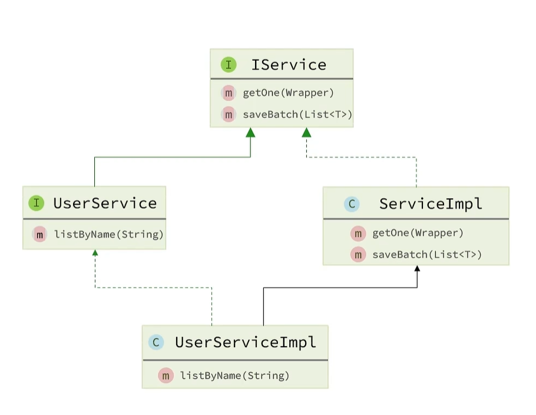
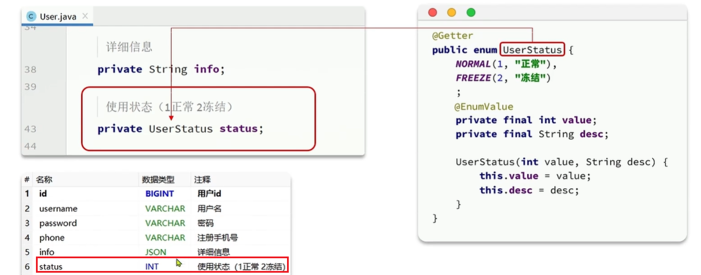
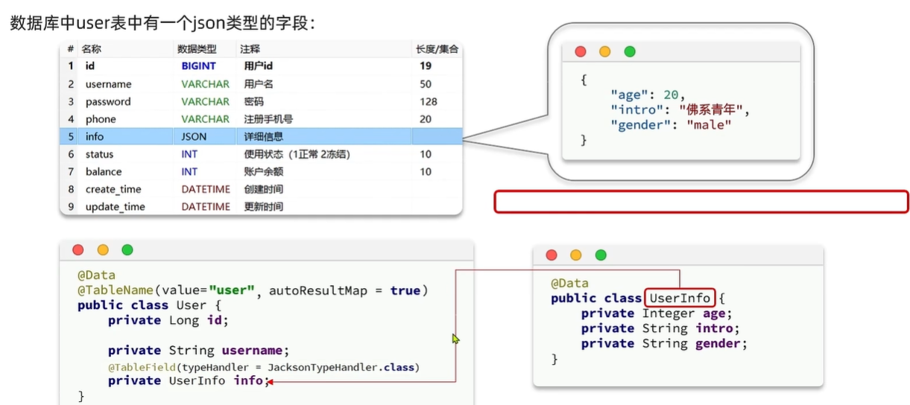

## 快速入门

### 引入MybatisPlus起步依赖

可以使用 mpp的 starter替代 mp的 starter

```xml
<dependency>
	<groupId>com.baomidou</groupId>
    <artifactId>mybatis-plus-boot-server</artifactId>
    <version>3.5.3.1</version>
</dependency>
```

### 定义 Mapper

```java
public interface UserMapper extends BaseMapper<User> {}
```


## 常用注解

### 基本原理

mpp通过扫描**实体类**，基于**反射**获得信息作为**数据库表**信息

### 转换约定

+ 类名**驼峰转下划线**作为表名：userName => user_name
+ 名为 **id**的字段作为主键
+ 成员变量名**驼峰转下划线**作为表字段名
+ is开头且为布尔值的成员变量：去掉 is驼峰转下划线

### 通过注解自定义

@TableName: 指定表名

@TableId: 指定表中主键字段信息

@TableField: 指定表中普通字段信息

```java
@TableName("tb_user")
public class User {
    
    /*
     * AUTO:数据库自增长；
     * INPUT:通过set方法自行输入；
     * ASSIGN_ID:分配 ID默认使用雪花算法（IdentifierGenerator::nextId）
     */
    @TableId(value="id", type=ASSIGN_ID)	
    pirvate Long id;	// 注意：一定要有主键，不然无法实现CRUD
    
    /*
     * 成员变量名与数据库字段名不一致
     */
    @TableField("username")
    private String name;
    
    /*
     * 成员变量以 is开头且是布尔值
     */
    @TableField("is_married")
    private Boolean isMarried;
    
    /*
     * 成员变量名是sql关键字 注意要用反引号
     */
    @TableField("`order`")
    private Integer order;
    
    /*
     * 成员变量在表中不存在
     */
    @TableFiedld(exist=false)
    private String address;
}
```


## 常见配置

```properties
mybatis-plus.mapper-locations=classpath*:mybatis/mapper/**/*.xml
```


## 条件构造器

```java
public interface xxxMapper extends BaseMapper<xxx> {}
```

### 1. 查询

```sql
select id, username, info, balance
from user
where username like 'o' and balance >= 1000
```

```java
QueryWrapper<User> qw = new QueryWrapper<>()
    .select("id", "username", "info", "balance")
    .like("username", "o") // %o%
    .ge("balance", 1000);
userMapper.selectList(qw);
```

### 2. 更新

```sql
update user
    set balance = 2000
    where (username = "jack")

update user
	set balance = balance - 200
	where id in (1, 2, 4)
```

```java
// 使用 QueryWrapper 更新时只能直接赋值，功能有限
User user = new User();
user.setBalance(2000);
QueryWrapper<User> qw = new QueryWrapper<>().eq("username", "jack");
userMapper.update(user,  );

// 使用 UpdateWrapper
List<Long> ids = List.of(1L, 2L, 4L);
UpdateWrapper<User> wrapper = new UpdateWrapper<>()
    .setSql("balance = balance - 200")
    .in("id", ids);
userMapper.update(null, wrapper);
```


## 自定义SQL

mybatis-plus 构建 where 条件，剩下的在 Mapper 实现

### 1. 基于 Wrapper构建 where条件

```java
List<Long> ids = List.of(1L, 2L, 4L);
int amount = 200;
LambdaQueryWrapper<User> wrapper = new LambdaQueryWrapper<>()
    .in(User::getId, ids);
userMapper.updateBalaceByIds(wrapper, amount);
```

### 2. 在 mapper方法中用 @Param注解声明 wrapper变量名称，必须是 ew

```java
// 必须是 ew 也可以使用 Constants.WRAPPER 替代
void updateBalanceByIds(@Param("ew") LambdaQueryWrapper<User> wrapper,
                        @Param("amount") int amount)
```

### 3. 自定义 SQL，并使用 wrapper条件

```xml
<update id="updateBalanceByIds">
	update tb_user set balance = balance - #{amount} 
    ${ew.customSqlSegment} <!-- wrapper 提供的 where 条件 -->
</update>
```


## Service 接口

### 1. IService 基础功能

 

```java
public interface UserService extends IService<User> {}
```

```java
public class UserServiceImpl
    extends ServiceImpl<UserMapper, User>
    implements UserService 
```


### 2. IService lambda 方法

+ 替代 mybatis 写在 xml 中的条件判断

```java
List<User> users = lambdaQuery()
    .like(name != null, User::getName, name)
    .eq(status != null, User::getStatus, status)
    .ge(minBalance != null, User::getBalance, minBalance)
    .le(maxBalance != null, User::getBalance, maxBalance)
    .list();
```

+ 业务逻辑的融入（实现 SQL后的处理逻辑）

```java
User user = getById(id);
int remainBalance = user.getBalance() - money;
lambdaUpdate()
    .set(User::getBalance, remainBalance)
    .set(remainBalance == 0, User::getStatus, 2)
    .eq(User::getId, id)
    .update();	// 注意：一定要写这个 update() 

```


## 静态工具查询（new）


### 使用场景

+ 在 Service 相互调用的时候可以使用静态工具来**避免循环依赖**
+ 与传统的 IService 方式不同的只是要**指定字节码**


### 循环依赖

+ 用户管理逻辑中（UserService）要查询地址，需要注入 AddressService
+ 地址管理逻辑中 （AddressService）要查询用户，需要注入 UserService
+ 不注入对应的 Service 但是要实现相关的功能：使用静态工具类 **或** 注入 Mapper


### 查询单个用户并关联地址

```java
// 先查vo的User部分再查vo的Address部分
public class UserVO { ...{public class User}, private List<AdressVO> addresses }

public List<UserVO> queryUserAndAddressById(long id) {
    User user = this.getById(id);
    if (user == null || user.getStatus() == 2) {
        throw new RuntimeException("用户状态异常！");
    }
    List<Address> addresses = Db.lambdaQuery(Address.class)	// 避免注入service规避循环依赖 
        .eq(Address::getUserId, id).list();
    UserVO userVO = BeanUtil.copyProperties(user, UserVO.class);
    if (CollUtils.isNotEmpty(address)) {
        userVO.setAddress(BeanUtil.copyToList(addresses, AddressVO.class));
    }
    return userVO;
}
```


### 批量查询用户并关联地址

```java
public List<UserVO> queryUserAndAddressByIds(List<Long> ids) {
    List<User> users = this.listByIds(ids);
    if (CollUtil.isEmpty(users)) {
        return Collections.emptyList();
    }
    List<Long> userIds = users.stream().map(User::getId).collect(Collectors.toList());
    List<Address> addresses = Db.lambdaQuery(Address.class).in(Address::getUserId, userIds).list();
    // address -> addressVO
    List<AddressVO> addressVOList = BeanUtils.copyToList(addresses, AddressVO.class); 
    
    Map<Long, List<AddressVO>> addressMap = new HashMap<>(0);
    if (CollUtil.isNotEmpty(addressVOList)) {
        addressMap = addressVOList.stream().collect(Collectors.groupingBy(AddressVO::getUserId));
    }
    
    List<UserVO> list = new ArrayList<>(users.size());
    for (User user : users) {
        UserVO vo = BeanUtil.copyProperties(user, UserVO.class);
        list.add(vo);
        vo.setAddresses(addressMap.get(user.getId()));
    }
    return list;
}
```


## 逻辑删除（扩展）

+ 可以指定删除标识（0：删除，1：存在）
+ 代码不需要动 mp 会在 SQL 中拼上逻辑删除相关的语句
+ 删除操作会变成更新删除标识为零的操作 `removeById -> updateById` 
+ 查询操作会在 `where` 条件上拼接对删除标识的判断
+ 由于所有数据库操作都要拼接逻辑删除的逻辑所以影响效率
+ 推荐使用数据库迁移而不是逻辑删除


## 枚举处理器（扩展）

+ 配置 `default-enum-type-handler`
+ `vo` 字段使用枚举类型，增加可读性
+ 在枚举类中与数据库对应的字段上加注解 `@EnumValue`
+ 在返回时，默认返回枚举项的名字
+ 要是想要返回数字或中文，需要使用 `@JsonValue`




## JSON 处理器（扩展）




## 分页插件

