# 1. 什么是Spring

## 1.1 简介与历史

+ 2002 年出现了Spring 框架的雏形：**interface21框架**
+ Spring框架以interface21框架为基础，经过重新设计，在2004年3月24日发布了正式版
+ **Rod Johnson** 是 Spring Framework 的创始人，然而他是音乐博士而非计算机博士
+ Spring框架的理念：**使现有的技术更加容易使用**，本身是一个**大杂烩**，整合了已有的技术框架


+ SSH：Struct2 + **Spring** + Hibernate
+ SSM：SpringMVC + **Spring** + Mybatis


## 1.2 优点

+ Spring 是一个免费的**开源框架**
+ Spring 是一个**轻量级**的，**非入侵式**的框架
+ 控制反转（**IOC**）面向切面编程（**AOP**）
+ 支持**事务**的处理，支持框架的**整合**

==总结一句话：Spring 就是一个轻量级的控制反转（ioc）和面向切面编程（AOP）的框架==


## 1.3 组成

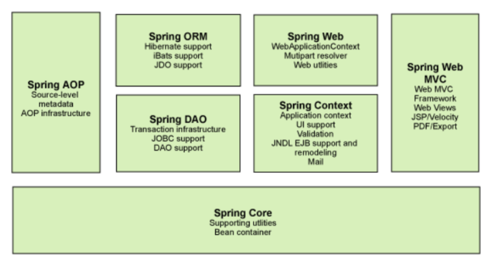


## 1.4 拓展

**现代化的 Java 开发，就是基于 Spring 的开发**

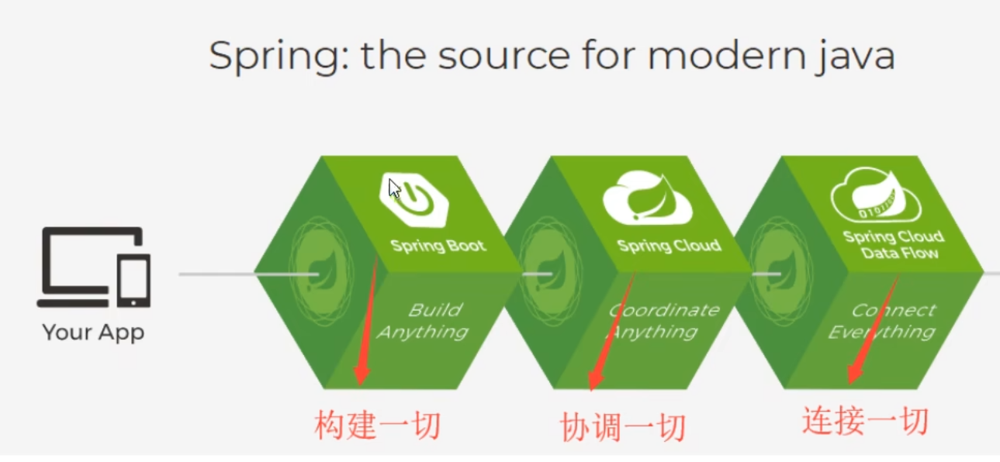

+ **Spring Boot**
  + 一个快速开发的脚手架
  + 基于 SpringBoot 可以快速的开发单个微服务
  + 约定大于配置
+ **Spring Cloud**
  + 微服务，基于 SpringBoot 实现


# 2. IOC 理论推导

## 2.1 实例（service调用dao）

1. UserDao 接口
2. UserDaoImpl 实现类
3. UserService 业务接口
4. UserServiceImpl 业务实现类

在之前的需求中，用户的需求更新可能会**让我们不得不更改原来的代码**

然而每一次更改都需要高昂的成本，促使我们研究工程方法，让更改变得模块化


我们使用一个**set 接口**来实现这一点

```java
private UserDao userDao;

public void setUserDao(UserDao userDao) {
    this.userDao = userDao;
}
```

+ **之前，对象需要程序主动创建**，控制权只在程序员手中
+ 使用了 **set 注入**之后，**程序不再有主动性，而是被动地接受对象**

这意味着，程序员不用再去管对象的创建了，系统的**耦合性因而大大降低**，我们可以更专注于业务的实现，这就是**IOC 的原型**

==dao== 业务层调用dao层，dao层不断新增功能模拟需求的更改

```java
// UserDao.java
package com.isaiah.dao;

public interface UserDao {
    void getUser();
}

--------------------------------------------------------------------------------------------------------

// UserDaoImpl.java: 默认demo实现，原始状态
package com.isaiah.dao;

public class UserDaoImpl implements UserDao {
    public void getUser() {
        System.out.println("默认获取用户的数据");
    }
}

--------------------------------------------------------------------------------------------------------

// UserDaoMySql.java: 新增更改一（MySql 支持）
package com.isaiah.dao;

public class UserDaoMySql implements UserDao {
    public void getUser() {
        System.out.println("MySql 获取用户数据");
    }
}

--------------------------------------------------------------------------------------------------------

// UserDaoOracle.java: 新增更改二（Oracle 支持）
package com.isaiah.dao;

public class UserDaoOracle implements UserDao {
    public void getUser() {
        System.out.println("Oracle 获取用户数据");
    }
}

--------------------------------------------------------------------------------------------------------

// UserDaoSQLServer.java: 新增更改三（SQLServer 支持）
package com.isaiah.dao;

public class UserDaoSQLServer implements UserDao {
    public void getUser() {
        System.out.println("SQLServer 获取用户数据");
    }
}
```

==service== 实现依赖倒转，由set方法注入抽象

```java
// 业务层获取用户信息的接口，主要功能是与dao层配合
package com.isaiah.service;

public interface UserService {
    void getUser();
}

--------------------------------------------------------------------------------------------------------

// 获取用户信息业务的具体实现
package com.isaiah.service;

import com.isaiah.dao.*;

// 业务层调用Dao 层，使用组合的逻辑关系
// 把Dao 层的对象加进来，实现对Dao 层的调用
public class UserServiceImpl implements UserService {
    /* dao 层更换模块，业务层就需要修改，已调用不同的实现类
    这种切换发生在代码层面使得项目的维护耗资巨大
    我们可以使用 set 注入来改变这一局面:
        我们先不急着决定选用哪一个实现类
        而是设置一个set 方法让用户来选择使用哪一个实现类
        从而实现依赖倒转
    set 注入是一种依赖注入:
        依赖注入是指当一个对象要与其他对象发生依赖关系时
        通过抽象来注入所依赖的对象
     */
//     private UserDao userDao = new UserDaoImpl();
//     private UserDao userDao = new UserDaoMySql();
//     private UserDao userDao = new UserDaoOracle();
//     private UserDao userDao = new UserDaoSQLServer();

//    public void getUser() {
//        userDao.getUser();
//    }
    private UserDao userDao;

    public void setUserDao(UserDao userDao) {
        this.userDao = userDao;
    }

    public void getUser() {
        userDao.getUser();
    }
}
```

==test== 在调用服务端的时候指定调用的实现类，实现依赖倒转 

```java
import com.isaiah.dao.UserDaoMySql;
import com.isaiah.service.UserService;
import com.isaiah.service.UserServiceImpl;

public class MyTest {
    public static void main(String[] args) {
        // 用户实际调用的是业务层，dao 层他们不需要接触
        UserService userService = new UserServiceImpl();

//        userService.getUser();
        ((UserServiceImpl) userService).setUserDao(new UserDaoMySql());
        userService.getUser();
    }
}
```

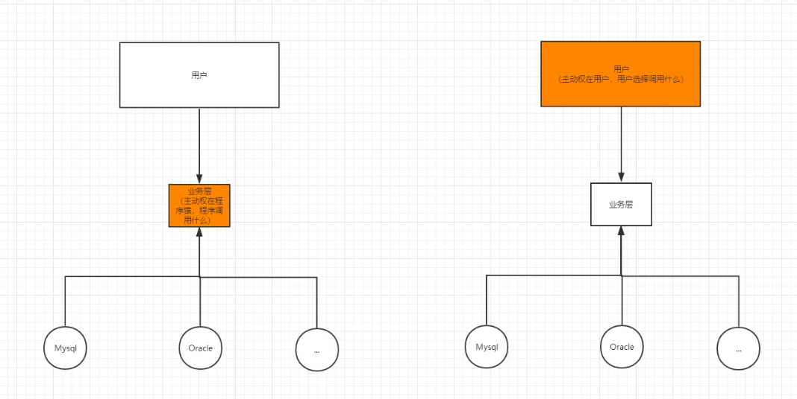


## 2.2 IOC 本质

控制反转IOC（inversion of control）是一种设计思想，依赖注入DI（dependency injection）是一种实现IOC 的方法

在没有IOC 的世界里，对象的创建和对象之间的依赖关系被硬编码在代码中

控制反转之后对象的创建工作被移交给了第三方

所谓控制反转，就是获得依赖对象的方式反转了


采用XML 方式配置Bean 的时候，Bean 的定义信息是和实现部分分离的

采用注解的方式配置Bean 则可以把定义信息和实现部分合为一体

Bean 的定义信息直接以注解的形式定义在实现类中，从而达到了零配置的目的


控制反转是一种**通过描述（XML或注解）**，并通过**第三方**，**生产或获取特定对象**的方式

在Spring 中实现控制反转的是**IOC 容器**，其实现方式是**依赖注入**

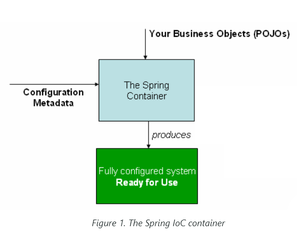


# 3. Hello Spring

## 3.1 Spring 例子（xml 指导 Spring 生成对象）

**Spring 创建的对象，都称为 Bean**

**id = 变量名**

**class = new 的对象**

**property 相当于给对象中的属性设置一个值**

```java
package com.isaiah.pojo;

public class Hello {
    private String str;

    public String getStr() {
        return str;
    }

    public void setStr(String str) {
        this.str = str;
    }

    @Override
    public String toString() {
        return "Hello{" +
                "str='" + str + '\'' +
                '}';
    }
}
```

```xml
<?xml version="1.0" encoding="UTF-8"?>
<beans xmlns="http://www.springframework.org/schema/beans"
       xmlns:xsi="http://www.w3.org/2001/XMLSchema-instance"
       xsi:schemaLocation="http://www.springframework.org/schema/beans
        https://www.springframework.org/schema/beans/spring-beans.xsd">
    <bean class="com.isaiah.pojo.Hello" id="hello">
        <property name="str" value="spring"/>
    </bean>
</beans>
```

Hello 对象是由Spring 创建的

Hello 对象的属性是由Spring 容器设置的

+ **控制：** （谁来控制对象的创建）
  + 之前对象是由程序本身创建的
  + Spring 出现，则可以由Spring 来创建

+ **反转：**
  + 程序本身不创建对象
  + 程序只是被动地接收对象
+ **依赖注入：**
  + 就是利用 set 方法来进行注入的
+ **IOC：**
  + 是一种编程思想，由主动的创建、管理对象，变成被动地接收对象

Spring 的出现使得我们彻底不用再到程序中改动了

要实现不同的操作，只需要在xml 配置文件中进行修改

所谓的IOC，一句话来说就是：==对象由Spring 来创建，管理，装配==


## 3.2 对 2.1 例子的修改

```xml
<?xml version="1.0" encoding="UTF-8"?>
<beans xmlns="http://www.springframework.org/schema/beans"
       xmlns:xsi="http://www.w3.org/2001/XMLSchema-instance"
       xsi:schemaLocation="http://www.springframework.org/schema/beans
        https://www.springframework.org/schema/beans/spring-beans.xsd">
<!--    使用Spring 生成三个对象-->
    <bean id="mySql" class="com.isaiah.dao.UserDaoMySql"/>
    <bean id="oracle" class="com.isaiah.dao.UserDaoOracle"/>
    <bean id="sqlServer" class="com.isaiah.dao.UserDaoSQLServer"/>
<!--    ref 引用已经创建好的对象-->
    <bean id="userService" class="com.isaiah.service.UserServiceImpl">
        <property name="userDao" ref="mySql"/>
    </bean>
</beans>
```

```java
import com.isaiah.service.UserService;
import org.springframework.context.ApplicationContext;
import org.springframework.context.support.ClassPathXmlApplicationContext;

public class MyTest {
    public static void main(String[] args) {
        // 在 Spring 的世界中不需要 new 实体
        // 所有的对象都由 Spring 进行创建
//        UserService userService = new UserServiceImpl();

        // 获取 applicationContext 得到 Spring 容器
        ApplicationContext context = new ClassPathXmlApplicationContext("beans.xml");
        // 得到了容器就得到了所有对象，需要什么 get 什么
        UserService userService = (UserService) context.getBean("userService");
        userService.getUser();
   
}
```

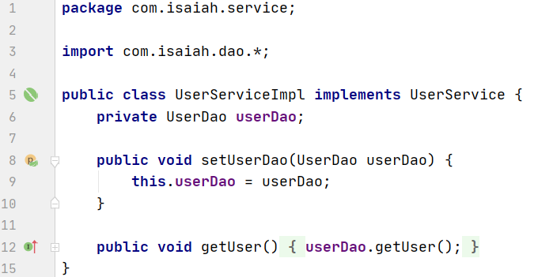

UserServiceImpl 不用变，Spring 通过 setUserDao 对对象赋值 property value


# 4. IOC 创建对象的方式

## 4.1 无参构造器创建对象（默认）

```java
package com.isaiah.pojo;

public class User {
    private String name;

    public User() {
        System.out.println("User 的无参构造器");
    }

    public String getName() {
        return name;
    }

    public void setName(String name) {
        this.name = name;
    }

    public void show() {
        System.out.println("name: " + name);
    }
}
```

**在配置文件加载的时候，容器（applicationContext）中管理的对象就已经初始化了**

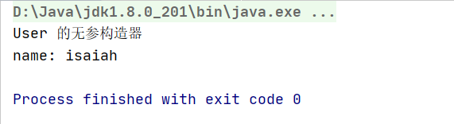


## 4.2 有参构造器创建对象

```java
package com.isaiah.pojo;

public class User {
    private String name;

    // 把无参构造器换成有参构造器
    public User(String name) {
		this.name = name;
    }

    public String getName() {
        return name;
    }

    public void setName(String name) {
        this.name = name;
    }

    public void show() {
        System.out.println("name: " + name);
    }
}

```

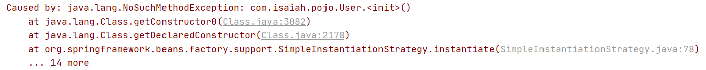

+ **根据 index 确定（constructor-arg index=“number”）**

```xml
<bean class="com.isaiah.pojo.User" id="user">
    <constructor-arg index="0" value="isaiah"/>
</bean>
```


+ **跟据类型确定（constructor-arg type）**==不推荐==

```xml
<bean class="com.isaiah.pojo.User" id="user">
    <constructor-arg type="java.lang.String" value="isaiah"/>
</bean>
```


+ **跟据参数名确定（constructor-arg name）**==推荐==

```xml
<bean class="com.isaiah.pojo.User" id="user">
    <constructor-arg name="name" value="isaiah"/>
</bean>
```


# 5. Spring 配置

```xml
<bean class="com.isaiah.pojo.User" id="user" name="user2,u2">
    <constructor-arg type="java.lang.String" value="isaiah"/>
</bean>
```

+ id：bean 的唯一标识，也就相当于是对象名

+ class：bean 对象所对应的全限定名

+ name：和alias 一样，也是指定id 的别名，不过name 可以指定多个别名

+ import：一般用于团队开发使用，它可以将多个配置文件导入合并为一个

  + ```xml
    <import resource="Xiao_Ming.xml"/>
    ```


# 6. 依赖注入 DI

## 6.1 构造器注入

见第 4.2 节：IOC 创建对象的方式 ---> 有参构造器创建对象

## 6.2 set 注入（重点）

```xml
<?xml version="1.0" encoding="UTF-8"?>
<beans xmlns="http://www.springframework.org/schema/beans"
       xmlns:xsi="http://www.w3.org/2001/XMLSchema-instance"
       xsi:schemaLocation="http://www.springframework.org/schema/beans
        https://www.springframework.org/schema/beans/spring-beans.xsd">

    <bean id="address" class="com.isaiah.pojo.Address"/>

    <bean id="student" class="com.isaiah.pojo.Student">
<!--        普通的注入-->
        <property name="name" value="isaiah"/>
<!--        引用别的Bean 注入-->
        <property name="address" ref="address"></property>
<!--        数组 array-->
        <property name="books">
            <array>
                <value>红楼梦</value>
                <value>西游记</value>
                <value>水浒传</value>
                <value>三国演义</value>
            </array>
        </property>
<!--        列表 list-->
        <property name="hobbies">
            <list>
                <value>coding</value>
                <value>gardening</value>
                <value>reading</value>
            </list>
        </property>
<!--        字典 map-->
        <property name="card">
            <map>
                <entry key="身份证" value="1234567788"></entry>
                <entry key="银行卡" value="1234233243"></entry>
            </map>
        </property>
<!--        集合 set-->
        <property name="games">
            <set>
                <value>LOL</value>
                <value>COC</value>
                <value>WOw</value>
            </set>
        </property>
<!--        null-->
        <property name="wife">
            <null/>
        </property>
<!--        properties-->
        <property name="info">
            <props>
                <prop key="driver">mysql</prop>
                <prop key="url">bing.com</prop>
                <prop key="username">root</prop>
                <prop key="password">123456</prop>
            </props>
        </property>
    </bean>

</beans>
```


## 6.3 拓展方式注入

+ **p-namespace：** p 命名空间注入，可以直接为对象注入属性的值，**p 相当于 property**

```xml
xmlns:p="http://www.springframework.org/schema/p"
```

```xml
<bean id="user" class="com.isaiah.pojo.User" p:name="isaiah" p:age="15"/>
```


+ **c-namespace：** c 命名空间注入，通过构造器注入，**c 相当于 construct-args**

```xml
xmlns:c="http://www.springframework.org/schema/c"
```

```xml
<bean id="user2" class="com.isaiah.pojo.User" c:name="isaiah" c:age="18"/>
```


# 7. Bean 的作用域

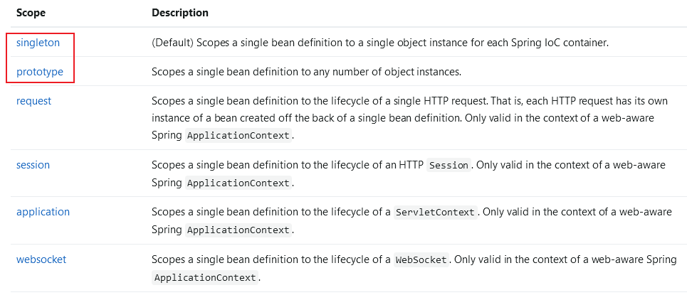

+ **singleton 单例模式**（Spring 默认机制）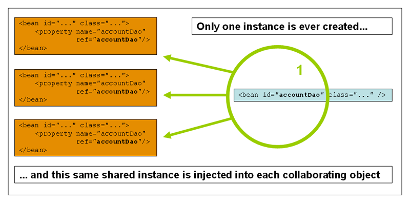

```xml
<bean id="user" class="" c:name="user2" c:age="" scope="singleton"/>
```

```xml
 @Test
public void test1() {
    ApplicationContext context = new ClassPathXmlApplicationContext("beans2.xml");
    User user = context.getBean("user", User.class);
    User user2 = context.getBean("user2", User.class);
    System.out.println(user == user2);	// true
}
```


+ **prototype 原型模式**（每次从容器中 getBean 的时候都会产生一个新的对象）

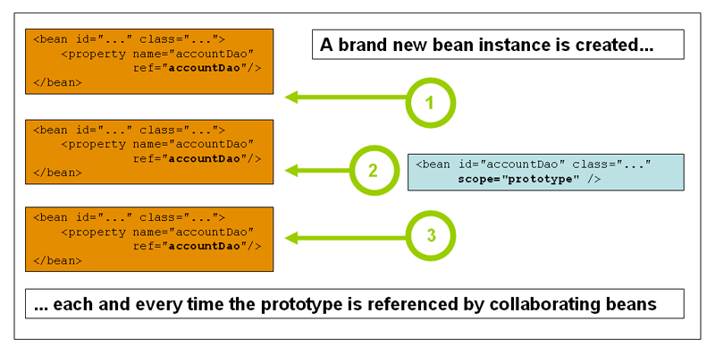

```xml
<bean id="user" class="" c:name="user2" c:age="" scope="prototype"/>
```

```xml
 @Test
public void test1() {
    ApplicationContext context = new ClassPathXmlApplicationContext("beans2.xml");
    User user = context.getBean("user", User.class);
    User user2 = context.getBean("user2", User.class);
    System.out.println(user == user2);	// false
}
```


# 8. Bean 的自动装配

+ 自动装配是 Spring 满足 bean 依赖的一种方式
+ Spring 会在上下文中寻找，自动给 bean 装配属性

**Spring 中有三种装配的方式：xml显式装配，java注解显式装配，隐式装配**

实验自动装配：

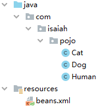

==Cat==

```java
package com.isaiah.pojo;

public class Cat {
    public void shout() {
        System.out.println("meow");
    }
}
```

==Dog==

```java
package com.isaiah.pojo;

public class Dog {
    public void shout() {
        System.out.println("wang");
    }
}
```

## 8.1 在 xml 中显式地装配（byName byType）

==Human==

```java
package com.isaiah.pojo;

public class Human {
    private Cat cat11;
    private Dog dog;
    private String name;

    public Cat getCat11() {
        return cat11;
    }

    public void setCat(Cat cat11) {
        this.cat11 = cat11;
    }

    public Dog getDog() {
        return dog;
    }

    public void setDog(Dog dog) {
        this.dog = dog;
    }

    public String getName() {
        return name;
    }

    public void setName(String name) {
        this.name = name;
    }
}
```

==xml==

```xml
<!-- id 需要和待装配的对象的属性名字相同 -->
<bean id="cat11" class="com.isaiah.pojo.Cat"/>
<bean id="dog" class="com.isaiah.pojo.Dog"/>

<!--
byName: 会在容器的上下文中查找，bean id 和自己属性名字相同的 bean
byType: 会在容器的上下文中查找，bean class 和自己属性类型相同的 bean
-->
<bean id="human" class="com.isaiah.pojo.Human" autowire="byName">
    <property name="name" value="isaiah"/>
</bean>
```

**小结：**

+ **byName** 的时候，需要保证所有需要的 bean 的 id 值和自动注入的属性名相同
+ **byType** 的时候
  + 需要保证待装配类的属性类型没有重复
  + 所有 bean 的 class 唯一

```shell
expected single matching bean but found 2: cat11,cat22
```

**注意：** （属性 == 字段）

+ 有属性类型重复的情况只能用 byName
+ set 方法的命名
    + 参数列表的形式参数名要和属性名对应
    + set 方法名不需要对应属性名


## 8.2 在 java 中显式地装配	@Autowired @Resource

java 从 jdk 1.5 开始支持注解，Spring 2.5 开始支持注解

```markdown
The introduction of annotation-based configuration raised the question of whether this approach is "better" than XML
```

**使用 Spring 的注解功能：**

+ 需要在applicationContext.xml 中**导入相应的约束**：**xmls:context**

+ 需要**配置注解的支持**：\<context:annotation-config/\>

```xml
<?xml version="1.0" encoding="UTF-8"?>
<beans xmlns="http://www.springframework.org/schema/beans"
       xmlns:xsi="http://www.w3.org/2001/XMLSchema-instance"
       xmlns:context="http://www.springframework.org/schema/context"
       xsi:schemaLocation="http://www.springframework.org/schema/beans
	http://www.springframework.org/schema/beans/spring-beans-3.0.xsd
	http://www.springframework.org/schema/context
	http://www.springframework.org/schema/context/spring-context-3.0.xsd ">
	
    <context:annotation-config/>
    
</beans>
```

### 8.2.1 @Autowired

直接在属性上使用即可，**也可以在 set 方法上使用**

被注解为 @Autowired 就可以**不用编写 set** 方法了

如果找不到对应的 bean，可以使用 **@Qualifier(value=“xxx”)** 去配置，即**指定一个 bean** 对象进行装配

==Human==

```java
package com.isaiah.pojo;

import org.springframework.beans.factory.annotation.Autowired;
import org.springframework.beans.factory.annotation.Qualifier;
import org.springframework.lang.Nullable;

public class Human {
    @Autowired
    @Qualifier(value="cat")
    private Cat cat11;
    // 如果显式定义了required 属性为false
    // 即表示这个属性可以为null
    // required 默认为true，即不允许为空
    @Autowired(required = false)
    private Cat cat22;
    @Autowired
    private Dog dog;
    @Nullable
    private String name;

    public Cat getCat11() {
        return cat11;
    }

    public Dog getDog() {
        return dog;
    }

    public String getName() {
        return name;
    }

    public void setName(String name) {
        this.name = name;
    }
}
```


### 8.2.2 @Resource

直接在属性上使用即可，**也可以在 set 方法上使用**

被注解为 @Resource 就可以**不用编写 set** 方法了

如果找不到，可以进行指定 **@Resource(name="xxx")**

==Human==

```java
package com.isaiah.pojo;

import org.springframework.lang.Nullable;

import javax.annotation.Resource;

public class Human {
    @Resource(name="cat")
    private Cat cat11;
    @Resource
    private Cat cat22;
    @Resource
    private Dog dog;
    @Nullable
    private String name;

    public Cat getCat11() {
        return cat11;
    }

    public Dog getDog() {
        return dog;
    }

    public String getName() {
        return name;
    }

    public void setName(String name) {
        this.name = name;
    }
}

```


### 8.2.3 @Autowired 和 @Resource 的总结

+ 两者都是用来自动装配的，都可以放在属性上面
+ **@Autowired 默认通过 byType** 的方式寻找唯一匹配的 bean，找不到再通过 byName 的方式
+ **@Resource 默认通过 byName 实现**，找不到则使用 byType 的方法


## 8.3 隐式地自动装配 bean（重要）

@Configuration 见下面10. 使用Java的方式配置Spring


# 9. 使用注解开发

Spring 4 之后要使用注解开发，就必须要保证aop 包的导入

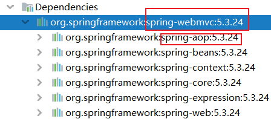

## 9.1 使用注解创建 bean	@Component

```java
package com.isaiah.pojo;

import org.springframework.stereotype.Component;

// 等价于 <bean id="user" class="com.isaiah.pojo.User"/>
@Component
public class User {
    ....
}
```


## 9.2 使用注解为属性注入	@Value(...)

```java
package com.isaiah.pojo;

import org.springframework.beans.factory.annotation.Value;
import org.springframework.stereotype.Component;

@Component
public class User {
    // 等价于 <property name="name" value="Sam"/>
    @Value("Sam")
    public String name = "isaiah";

    // 等价于 <property name="name" value="Tom"/>
    @Value("Tom")
    public void setName(String name) {
        this.name = name;
    }
}

```

```java
@Test
public void test1() {
    ApplicationContext ctx = new ClassPathXmlApplicationContext("applicationContext.xml");
    User user = ctx.getBean("user", User.class);
    System.out.println(user.name);
}
```

## 9.3 衍生的注解

@Component （pojo）有几个衍生注解，我们在web 开发中，会按照MVC 三层架构分层

+ dao @Repository
+ service @Service
+ controller @Controller
+ pojo @Component

这四个注解的功能是一样的，都是代表将某个类注册到Spring 中，装配 bean

## 9.4 自动装配配置

+ @Autowired：自动装配，通过类型，名字
  + 如果不能一一对应，需要@Qualifier(value=“xxx”)

+ @Nullable：类的属性标记了这个注解，表示这个属性可以为 null

+ @Resource：自动装配，通过名字，类型

## 9.5 作用域

@Scope(“singleton”) 单例模式

@Scope(“prototype”) 原型模式

## 9.6 xml 与注解

**xml 与注解的区别和联系：**

+ xml 更加万能，适用于任何场合，维护简单方便
+ 注解不能使用ref 引用其它的类，维护相对复杂

**xml 与注解的最佳实践：**

+ xml 用来管理 bean
+ 注解只负责完成属性的注入


# 10. 使用Java的方式配置Spring	@Configuration

现在完全不使用xml 去配置Spring 了，配置的事情全部交给Java 来做**（使用@Configuration替代@Component）**

JavaConfig 是Spring 的一个子项目，在Spring 4 之后，它成为了核心功能

**关于自动装配（隐式）**

+ 当Spring容器扫描@Configuration类时，
+ 会将其中的@Bean方法所返回的Bean实例注册到Spring容器中，
+ 这些Bean实例可以被其他的Bean自动装配

```java
@Configuration
public class AppConfig {

    @Bean
    public UserDao userDao() {
        return new UserDaoImpl();
    }

    @Bean
    public UserService userService() {
        return new UserServiceImpl(userDao());
    }
}
```

+ AppConfig声明了一个UserDao类型的Bean实例和一个UserService类型的Bean实例。
+ 在userService()方法中，使用了userDao()方法返回的UserDao实例，
+ 这个UserDao实例会被自动装配到userService()方法中

==实体类==

```java
package com.isaiah.pojo;

import org.springframework.beans.factory.annotation.Value;

public class User {
    @Value("isaiah")
    private String name;

    public String getName() {
        return name;
    }

    public void setName(String name) {
        this.name = name;
    }

    @Override
    public String toString() {
        return "User{" +
                "name='" + name + '\'' +
                '}';
    }
}
```

==配置类==

```java
package com.isaiah.config;

import com.isaiah.pojo.User;
import org.springframework.context.annotation.Bean;
import org.springframework.context.annotation.Configuration;

/**
 * 被注解的内容也会注册到Spring 容器中
 * 因为它本来就是一个 @Component 注解
 * 它标记一个配置类，作用和beans.xml 相同
 */
@Configuration
public class MyConfig {
    // 注册一个 bean，相当于xml 中的一个标签
    // bean 标签中的id 属性值，就等于这个方法的名字
    // bean 标签中的class 属性值，就等于这个方法的返回值
    @Bean
    public User user() {
        // 要返回注入到 bean 的对象
        return new User();
    }
}
```

==测试类==

```java
import com.isaiah.config.MyConfig;
import com.isaiah.pojo.User;
import org.junit.Test;
import org.springframework.context.ApplicationContext;
import org.springframework.context.annotation.AnnotationConfigApplicationContext;

public class MyTest {
    @Test
    public void test1() {
        // 如果完全使用配置类的方法，就需要通过 AnnotationConfig 上下文来获取容器
        // 通过配置类的 class 对象进行加载
        ApplicationContext context = new AnnotationConfigApplicationContext(MyConfig.class);
        User getUser = context.getBean("user", User.class);
        System.out.println(getUser.getName());
    }
}
```


# 11. 代理模式

**代理模式是Spring AOP 的底层**

代理模式分类：静态代理 + 动态代理

## 11.1 静态代理

### 11.1.1 静态代理组成部分

+ **抽象角色 Rent：** 一般会使用接口或抽象类来解决
+ **真实角色 Host： ** 被代理的角色
+ **代理角色 Proxy：** 代理真实角色，代理之后一般会做一些附属操作
+ **客户 Client：** 访问代理对象的人


### 11.1.2 代码步骤

**Rent 抽象角色（接口）**

```java
package com.isaiah.demo1;

public interface Rent {
    public void rent();
}
```

**Host 真实角色**

```java
package com.isaiah.demo1;

public class Host implements Rent {
    public void rent() {
        System.out.println("房东要出租房子");
    }
}
```

**Proxy 代理角色**

```java
package com.isaiah.demo1;

public class Proxy implements Rent {
    private Host host;

    public Proxy() {
    }

    public Proxy(Host host) {
        this.host = host;
    }

    public void rent() {
        host.rent();
    }

    // 看房
    public void seeHouse() {
        System.out.println("中介带你看房");
    }

    // 收中介费
    public void charge() {
        System.out.println("收中介费");
    }

    // 签合同
    public void construct() {
        System.out.println("签租赁合同");
    }
}
```

**Client 客户端访问代理角色**

```java
package com.isaiah.demo1;

public class Client {
    public static void main(String[] args) {
        // 房东要租房子
        Host host = new Host();
        // 代理，中介帮房东租房子
        // 但是代理角色一般有一些附属操作
        Proxy proxy = new Proxy(host);
        // 你不用面对房东
        // 直接找中介租房即可
        proxy.rent();
    }
}
```


### 11.2.3 代理模式的好处

+ 可以**使真实角色的操作更加纯粹**，不用去关注一些公共的业务
+ **公共业务交给了代理角色**，实现了业务的分工
+ 公共业务扩展的时候，**方便集中管理**

### 11.2.4 代理模式的缺点

+ 一个真实角色就会产生一个代理角色，代码量会翻倍，开发效率会变低

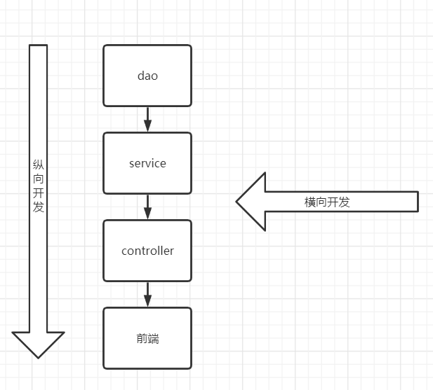

## 11.2 动态代理

### 11.2.1 动态代理的实现

+ 动态代理和静态代理做的事情是一样的
+ 动态代理的**代理类是运行时使用反射动态生成的**，不是我们直接写好的
+ 动态代理分为两大类：
  + **基于接口**的动态代理：jdk 的动态代理
  + **基于类**的动态代理：cglib 的动态代理
+ 步骤：
  + InnovationHandler
    + 定义一个实现 InnovationHandler 接口的代理处理器类
    + 这个类需要实现 invoke() 方法，
    + 它是代理类调用目标方法时会被调用的方法，可以加入增强处理逻辑

  + Proxy
    + 类加载器用于加载代理类，
    + 接口数组用于指定代理类实现的接口，
    + 代理处理器对象用于实现对目标方法的增强处理逻辑


需要了解两个类：

+ Proxy 代理
+ InnovationHandler 调用处理程序

```java
package com.isaiah.demo3;

public interface Rent {
    public void rent();
}

---------------------------------------------------------------------------
    
package com.isaiah.demo3;

public class Host implements Rent {
    public void rent() {
        System.out.println("房东要出租房子");
    }
}

---------------------------------------------------------------------------

package com.isaiah.demo3;

import java.lang.reflect.InvocationHandler;
import java.lang.reflect.Method;
import java.lang.reflect.Proxy;

// 我们会用这个类自动生成代理类
public class ProxyInvocationHandler implements InvocationHandler {
    // 被代理的接口
    private Rent rent;

    public void setRent(Rent rent) {
        this.rent = rent;
    }

    // 生成得到代理类
    public Object getProxy() {
        return Proxy.newProxyInstance(this.getClass().getClassLoader(), rent.getClass().getInterfaces(), this);
    }

    // 处理代理类，并返回结果
    @Override
    public Object invoke(Object proxy, Method method, Object[] args) throws Throwable {
        seeHouse();
        // 动态代理的本质，就是使用反射机制实现!
        Object invoke = method.invoke(rent, args);
        charge();
        return invoke;
    }

    public void seeHouse() {
        System.out.println("中介带着看房子");
    }

    public void charge() {
        System.out.println("收中介费");
    }
}


---------------------------------------------------------------------------

package com.isaiah.demo3;

public class Client {
    public static void main(String[] args) {
        // 真实角色
        Host host = new Host();

        // 代理角色: 现在没有
        ProxyInvocationHandler pih = new ProxyInvocationHandler();
        // 通过调用程序，来生成我们要调用的接口对象
        pih.setRent(host);
        // 动态生成的代理类
        Rent proxy = (Rent) pih.getProxy();
        proxy.rent();
    }
}

```

**from chat-gpt 1 interface 1 class**

```java
// 一个服务
public interface UserService {
    void save();
}

// 服务的实现
public class UserServiceImpl implements UserService {
    public void save() {
        System.out.println("User saved.");
    }
}

// 动态代理处理器
public class LoggingInvocationHandler implements InvocationHandler {
    private Object target;

    public LoggingInvocationHandler(Object target) {
        this.target = target;
    }

    public Object invoke(Object proxy, Method method, Object[] args)
            throws Throwable {
        System.out.println("Before method " + method.getName());
        Object result = method.invoke(target, args);
        System.out.println("After method " + method.getName());
        return result;
    }
}

public class Main {
    public static void main(String[] args) {
        // 一个服务的实现
        UserService userService = new UserServiceImpl();
        // new 服务处理器，指定某个服务的实现类
        InvocationHandler handler = new LoggingInvocationHandler(userService);
        // new 服务处理器代理
        UserService proxy = (UserService) Proxy.newProxyInstance(
                userService.getClass().getClassLoader(),
                new Class[] { UserService.class },
                handler);
        // 一个增强的方法
        proxy.save();
    }
}
```

**from chat-gpt 2 interfaces 1 class**

```java
public interface UserService {
    void save();
}

public interface ProductService {
    void addProduct();
}

// 实现类实现了两个接口
public class MyService implements UserService, ProductService {
    public void save() {
        System.out.println("User saved.");
    }

    public void addProduct() {
        System.out.println("Product added.");
    }
}

public class LoggingInvocationHandler implements InvocationHandler {
    private Object target;

    public LoggingInvocationHandler(Object target) {
        this.target = target;
    }

    public Object invoke(Object proxy, Method method, Object[] args)
            throws Throwable {
        System.out.println("Before method " + method.getName());
        Object result = method.invoke(target, args);
        System.out.println("After method " + method.getName());
        return result;
    }
}

public class Main {
    public static void main(String[] args) {
        MyService myService = new MyService();
        InvocationHandler handler = new LoggingInvocationHandler(myService);
        Object proxy = Proxy.newProxyInstance(
                myService.getClass().getClassLoader(),
                new Class[] { UserService.class, ProductService.class },
                handler);
        UserService userService = (UserService)proxy;
        ProductService productService = (ProductService)proxy;
        userService.save();
        productService.addProduct();
    }
}
```

**from chat-gpt 1 interfaces 2 classes**

```java
public interface MyInterface {
    void doSomething();
}

public class MyClassA implements MyInterface {
    public void doSomething() {
        System.out.println("MyClassA doSomething()");
    }
}

public class MyClassB implements MyInterface {
    public void doSomething() {
        System.out.println("MyClassB doSomething()");
    }
}

public class LoggingInvocationHandler implements InvocationHandler {
    private List<Object> targets;

    public LoggingInvocationHandler(List<Object> targets) {
        this.targets = targets;
    }

    public Object invoke(Object proxy, Method method, Object[] args)
            throws Throwable {
        System.out.println("Before method " + method.getName());
        for (Object target : targets) {
            method.invoke(target, args);
        }
        System.out.println("After method " + method.getName());
        return null;
    }
}

public class Main {
    public static void main(String[] args) {
        MyClassA myClassA = new MyClassA();
        MyClassB myClassB = new MyClassB();
        List<Object> targets = new ArrayList<>();
        targets.add(myClassA);
        targets.add(myClassB);
        InvocationHandler handler = new LoggingInvocationHandler(targets);
        MyInterface proxy = (MyInterface) Proxy.newProxyInstance(
                Main.class.getClassLoader(),
                new Class[] { MyInterface.class },
                handler);
        proxy.doSomething();
    }
}
```


### 11.2.2 动态代理的好处

+ 一个动态代理类**代理的是一个接口，一般就是对应一类业务**
+ 同上，一个动态代理类可以代理多个类，只要是实现了同一个接口即可


# 12. AOP

## 12.1 什么是AOP

AOP（Aspect Oriented Programming）意为：**面向切面编程**

通过**预编译**方式和运行期**动态代理**，实现程序公共能的统一维护

AOP 是 OOP 的延续，是软件开发中的一个热点，是函数式变成的一种衍生泛型

利用 AOP 可以**对业务逻辑中的各个部分进行隔离**，从而使业务逻辑的各个部分之间的耦合度降低

## 12.2 Spring在AOP中的作用

提供**声明式事务**；允许用户自定义切面

+ 横切关注点：跨越应用程序多个模块的方法和功能（日志，安全，缓存，，）
+ 切面（Aspect）：横切关注点模块化的特殊对象，是一个**类**
+ 通知（Advice）：切面必须要完成的工作，是一个类中的**方法**
+ 目标（Target）：被通知的**对象**
+ 代理（Proxy）：向目标对象**应用通知之后创建的对象**
+ 切入点（PointCut）：切面通知执行的**”地点“**的定义
+ 连接点（JointPoint）：**与切入点匹配的执行点**

## 12.3 使用Spring实现AOP

使用**AOP 织入**，需要**导入依赖**

```xml
<!-- https://mvnrepository.com/artifact/org.aspectj/aspectjweaver -->
<dependency>
    <groupId>org.aspectj</groupId>
    <artifactId>aspectjweaver</artifactId>
    <version>1.9.19</version>
</dependency>
```

```xml
<?xml version="1.0" encoding="utf-8" ?>
<beans xmlns="http://www.springframework.org/schema/beans"
       xmlns:xsi="http://www.w3.org/2001/XMLSchema-instance"
       xmlns:aop="http://www.springframework.org/schema/aop"
       xsi:schemaLocation="http://www.springframework.org/schema/beans
        https://www.springframework.org/schema/beans/spring-beans.xsd
       http://www.springframework.org/schema/aop
       https://www.springframework.org/schema/aop/spring-aop.xsd">

</beans>
```


==UserService==

```java
package com.isaiah.service;

public interface UserService {
    public void add();
    public void delete();
    public void update();
    public void select();
}
```

==UserServiceImpl==

```java
package com.isaiah.service;

public class UserServiceImpl implements UserService {

    public void add() {
        System.out.println("增加了一个用户");
    }

    public void delete() {
        System.out.println("删除了一个用户");
    }

    public void update() {
        System.out.println("更新了一个用户");
    }

    public void select() {
        System.out.println("查询了一个用户");
    }
}
```

==BeforeLog==

```java
package com.isaiah.log;

import org.springframework.aop.MethodBeforeAdvice;

import java.lang.reflect.Method;

public class BeforeLog implements MethodBeforeAdvice {
    /**
     * method: 要执行的目标对象的方法
     * args: 参数
     * target: 目标对象
      */
    public void before(Method method, Object[] args, Object target) throws Throwable {
        System.out.println(target.getClass().getName() + "'s " + method.getName() + " is executed");
    }
}
```

==AfterLog==

```java
package com.isaiah.log;

import org.springframework.aop.AfterReturningAdvice;

import java.lang.reflect.Method;

public class AfterLog implements AfterReturningAdvice {
    // returnValue: 返回值
    public void afterReturning(Object returnValue, Method method, Object[] args, Object target) throws Throwable {
        System.out.println(method.getName() + " is executed" + " and the rst is " + returnValue);
    }
}
```
==test==

```java
import com.isaiah.service.UserService;
import org.springframework.context.ApplicationContext;
import org.springframework.context.support.ClassPathXmlApplicationContext;

public class MyTest {
    public static void main(String[] args) {
        ApplicationContext context = new ClassPathXmlApplicationContext("applicationContext.xml");
        // 注意：动态代理代理的是接口
        UserService userService = context.getBean("userService", UserService.class);
        userService.add();
    }
}
```


### 12.3.1 使用原生Spring API接口（主要是接口实现）

```xml
<!--    注册bean-->
    <bean id="userService" class="com.isaiah.service.UserServiceImpl"/>
    <bean id="beforeLog" class="com.isaiah.log.BeforeLog"/>
    <bean id="afterLog" class="com.isaiah.log.AfterLog"/>

<!--    方式一：使用原生Spring API接口-->
<!--    配置aop-->
    <aop:config>
<!--        切入点, 表达式指定要执行的位置-->
        <aop:pointcut id="pointcut" expression="execution(* com.isaiah.service.UserServiceImpl.*(..))"/>
<!--        执行环绕增加-->
        <aop:advisor advice-ref="beforeLog" pointcut-ref="pointcut"/>
        <aop:advisor advice-ref="afterLog" pointcut-ref="pointcut"/>
    </aop:config>
```


### 12.3.2 自定义来实现AOP（主要是切面定义）

```java
package com.isaiah.diy;

public class DiyPointCut {
    public void before() {
        System.out.println("======方法执行前=========");
    }

    public void after() {
        System.out.println("======方法执行后=========");
    }
}
```

```xml
<!--    注册bean-->
    <bean id="userService" class="com.isaiah.service.UserServiceImpl"/>

<!--    方式二：自定义类-->
    <bean id="diy" class="com.isaiah.diy.DiyPointCut"/>
    <aop:config>
<!--        自定义切面，ref要引入的类-->
        <aop:aspect ref="diy">
<!--            切入点-->
            <aop:pointcut id="pointcut" expression="execution(* com.isaiah.service.UserServiceImpl.*(..))"/>
<!--            通知-->
            <aop:before method="before" pointcut-ref="pointcut"/>
            <aop:after method="after" pointcut-ref="pointcut"/>
        </aop:aspect>
    </aop:config>
```


### 12.3.3 使用注解实现

```java
package com.isaiah.diy;

import org.aspectj.lang.ProceedingJoinPoint;
import org.aspectj.lang.annotation.After;
import org.aspectj.lang.annotation.Around;
import org.aspectj.lang.annotation.Aspect;
import org.aspectj.lang.annotation.Before;

// 使用注解方式实现 AOP
@Aspect     // 标注这个类是一个切面
public class AnnotationPointCut {
    @Before("execution(* com.isaiah.service.UserServiceImpl.*(..))")
    public void before() {
        System.out.println("=====方法执行前=====");
    }

    @After("execution(* com.isaiah.service.UserServiceImpl.*(..))")
    public void after() {
        System.out.println("=====方法执行后=====");
    }

    // 在环绕增强中，我们可以给定一个参数，代表我们要
    @Around("execution(* com.isaiah.service.UserServiceImpl.*(..))")
    public void around(ProceedingJoinPoint point) throws Throwable {
        System.out.println("环绕前");
        Object proceed = point.proceed();
        System.out.println("环绕后");
    }
}
```

```xml
<!--    注册bean-->
    <bean id="userService" class="com.isaiah.service.UserServiceImpl"/>

<!--    方式三-->
    <bean id="annotationPointCut" class="com.isaiah.diy.AnnotationPointCut"/>
<!--    开启注解支持-->
    <aop:aspectj-autoproxy/>
```

```markdown
环绕前
=====方法执行前=====
增加了一个用户
=====方法执行后=====
环绕后
```


# 13. 整合MyBatis

## 13.1 环境搭建

```xml
<dependencies>
    <dependency>
        <groupId>junit</groupId>
        <artifactId>junit</artifactId>
        <version>4.12</version>
    </dependency>
    <dependency>
        <groupId>mysql</groupId>
        <artifactId>mysql-connector-java</artifactId>
        <version>8.0.32</version>
    </dependency>
    <dependency>
        <groupId>org.mybatis</groupId>
        <artifactId>mybatis</artifactId>
        <version>3.5.11</version>
    </dependency>
    <dependency>
        <groupId>org.springframework</groupId>
        <artifactId>spring-webmvc</artifactId>
        <version>6.0.5</version>
    </dependency>
    <dependency>
        <groupId>org.springframework</groupId>
        <artifactId>spring-jdbc</artifactId>
        <version>6.0.5</version>
    </dependency>
    <dependency>
        <groupId>org.aspectj</groupId>
        <artifactId>aspectjweaver</artifactId>
        <version>1.9.19</version>
    </dependency>
    <dependency>
        <groupId>org.mybatis</groupId>
        <artifactId>mybatis-spring</artifactId>
        <version>2.0.2</version>
    </dependency>
</dependencies>
```

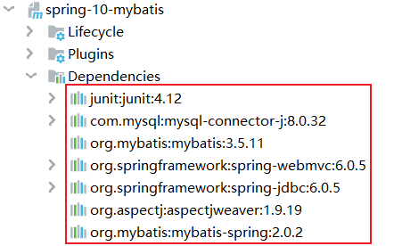

## 13.2 回忆MyBatis

### 13.2.1 mybatis 使用步骤

1. 编写实体类 User
2. 编写核心配置文件 mybatis-config.xml
3. 编写接口 mapper/UserMapper.class 或 dao/UserDao.xml
4. 编写Mapper.xml 放在 mapper 或 dao 文件夹下

### 13.2.2 mybatis 实例

注意：spring 连接数据库还需要 spring-jdbc

==mybatis-config.xml==

```xml
<?xml version="1.0" encoding="UTF-8" ?>
<!DOCTYPE configuration
        PUBLIC "-//mybatis.org//DTD Config 3.0//EN"
        "https://mybatis.org/dtd/mybatis-3-config.dtd">
<!--configuration 核心配置文件-->
<configuration>
<!--    别名-->
    <typeAliases>
        <package name="com.isaiah.pojo"/>
    </typeAliases>
    <environments default="development">
        <environment id="development">
            <transactionManager type="JDBC"/>
            <dataSource type="POOLED">
                <property name="driver" value="com.mysql.cj.jdbc.Driver"/>
                <property name="url" value="jdbc:mysql://localhost:3306/mybatis2?useSSL=true&amp;useUnicode=true&amp;characterEncoding=utf8"/>
                <property name="username" value="root"/>
                <property name="password" value="123456"/>
            </dataSource>
        </environment>
    </environments>

<!--注册Mapper-->
    <mappers>
        <mapper class="com.isaiah.mapper.UserMapper"/>
    </mappers>
</configuration>
```

==User==（lombok）

```java
package com.isaiah.pojo;

import lombok.Data;

@Data
public class User {
    private int id;
    private String name;
    private String pwd;
}
```

==UserMapper==

```java
package com.isaiah.mapper;

import com.isaiah.pojo.User;

import java.util.List;

public interface UserMapper {
    public List<User> selectUser();
}
```

==UserMapper.xml==

```xml
<?xml version="1.0" encoding="UTF-8" ?>
<!DOCTYPE mapper
        PUBLIC "-//mybatis.org//DTD Mapper 3.0//EN"
        "https://mybatis.org/dtd/mybatis-3-mapper.dtd">

<mapper namespace="com.isaiah.mapper.UserMapper">
    <select id="selectUser" resultType="user">
        select * from mybatis2.user
    </select>
</mapper>
```


### 13.2.3 mybatis 遗忘点

#### 13.2.3.1 类型别名 typeAliases

类型别名为实体类设置一个缩写名字，仅用于xml配置**替代冗余的全限定名书写**（mybatis-config.xml）

```xml
<typeAliases>
	<typeAlias alias="author" type="com.isaiah.pojo.Author"/>
</typeAliases>
```

也可以**指定一个包名**

```xml
<typeAliases>
	<package name="com.isaiah.pojo"/>
</typeAliases>
```

每一个在包中的 Java Bean 在每有 alias 注解的情况下，会使用 Bean 的首字母小写名称作为别名 com.isaiah.pojo.User -> user

若有注解，则别名为其注解值

```java
@Alias("author111")
public class Author {}
```


### 13.2.4 mybatis 踩坑

在核心配置文件的基础上改动几处即可

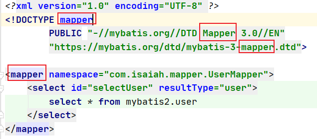

maven 静态资源固定问题（有的时候，maven并未把有些文件正确地放入target中，需要我们在pom中强调我们的需求）

将 src/main/java 下任何目录下的xml文件包含进来

```xml
<build>
    <resources>
        <resource>
            <directory>src/main/java</directory>
            <includes>
                <include>**/*.xml</include>
            </includes>
        </resource>
    </resources>
</build>
```

1 字节的 UTF-8 序列的字节 1 无效

（对于有中文注释的 xml 文件，需要把顶部的 `UTF-8` 替换为 `UTF8`，以下是在pom文件中批量地更改xml文件）

```xml
<properties>
    <project.build.sourceEncoding>UTF8</project.build.sourceEncoding>
</properties>
```


## 13.3 mybatis-spring

### 13.3.1 项目结构


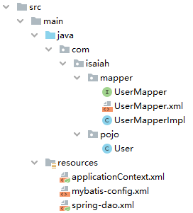

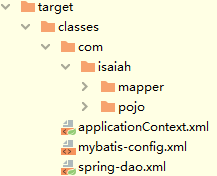

### 13.3.2 注意事项

一般把**别名和设置放在 mybatis-config.xml 中**，其它的部分（**DataSource**，**sqlSessionFactory**）交给 applicationContext.xml 处理

```xml
<?xml version="1.0" encoding="UTF-8" ?>
<!DOCTYPE configuration
        PUBLIC "-//mybatis.org//DTD Config 3.0//EN"
        "https://mybatis.org/dtd/mybatis-3-config.dtd">
<!--configuration 核心配置文件-->
<configuration>
<!--    别名-->
    <typeAliases>
        <package name="com.isaiah.pojo"/>
    </typeAliases>
<!--    <environments default="development">-->
<!--        <environment id="development">-->
<!--            <transactionManager type="JDBC"/>-->
<!--            <dataSource type="POOLED">-->
<!--                <property name="driver" value="com.mysql.cj.jdbc.Driver"/>-->
<!--                <property name="url" value="jdbc:mysql://localhost:3306/mybatis2?useSSL=true&amp;useUnicode=true&amp;characterEncoding=utf8"/>-->
<!--                <property name="username" value="root"/>-->
<!--                <property name="password" value="123456"/>-->
<!--            </dataSource>-->
<!--        </environment>-->
<!--    </environments>-->
<!--    <mappers>-->
<!--        <mapper class="com.isaiah.mapper.UserMapper"/>-->
<!--    </mappers>-->
</configuration>
```

spring-jdbc 和 spring-webmvc 的版本应该一致

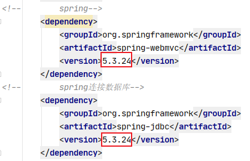

### 13.3.3 使用步骤

+ 编写数据源配置（spring-dao.xml	I）

```xml
<!--    DataSource：用spring的数据源替换mybatis的配置
        我们这里使用Spring提供的JDBC-->
        <bean id="dataSource" class="org.springframework.jdbc.datasource.DriverManagerDataSource">
            <property name="driverClassName" value="com.mysql.cj.jdbc.Driver"/>
            <property name="url" value="jdbc:mysql://localhost:3306/mybatis2?useSSL=true&amp;useUnicode=true&amp;characterEncoding=utf8"/>
            <property name="username" value="root"/>
            <property name="password" value="123456"/>
        </bean>
```

+ sqlSessionFactory（spring-dao.xml	II）

```xml
<!--    SQLSessionFactory 有set方法-->
        <bean id="sqlSessionFactory" class="org.mybatis.spring.SqlSessionFactoryBean">
            <property name="dataSource" ref="dataSource"/>
<!--        绑定mybatis配置文件-->
            <property name="configLocation" value="classpath:mybatis-config.xml"/>
            <property name="mapperLocations" value="classpath:com/isaiah/mapper/*.xml"/>
        </bean>
```

+ sqlSessionTemplate（spring-dao.xml	III）
    + **sqlSessionTemplate** 是 mybatis-spring 的核心
    + 作为 SqlSession 的一个实现，它可以**无缝代替代码中已经使用的 SqlSession**


```xml
<!--    SqlSessionTemplate: 相当于sqlSession-->
        <bean id="sqlSessionTemplate" class="org.mybatis.spring.SqlSessionTemplate">
<!--        只能使用构造器注入，因为没有set方法-->
            <constructor-arg index="0" ref="sqlSessionFactory"/>
        </bean>
```

+ 给接口加实现类（UserMapperImpl）

```java
package com.isaiah.mapper;

import com.isaiah.pojo.User;
import org.mybatis.spring.SqlSessionTemplate;

import java.util.List;

public class UserMapperImpl implements UserMapper {
    /**
     * 我们的所有操作都是用sqlSession执行，现在我们用sqlSessionTemplate
     */
    private SqlSessionTemplate sqlSessionTemplate;

    public void setSqlSessionTemplate(SqlSessionTemplate sqlSessionTemplate) {
        this.sqlSessionTemplate = sqlSessionTemplate;
    }

    public List<User> selectUser() {
        UserMapper mapper = sqlSessionTemplate.getMapper(UserMapper.class);
        return mapper.selectUser();
    }
}
```

+ 将实现类注入到Spring中（applicationContext.xml）

```xml
<?xml version="1.0" encoding="utf-8" ?>
<beans xmlns="http://www.springframework.org/schema/beans"
       xmlns:xsi="http://www.w3.org/2001/XMLSchema-instance"
       xsi:schemaLocation="http://www.springframework.org/schema/beans
        https://www.springframework.org/schema/beans/spring-beans.xsd">

    <import resource="spring-dao.xml"/>

    <bean id="userMapper" class="com.isaiah.mapper.UserMapperImpl">
        <property name="sqlSessionTemplate" ref="sqlSessionTemplate"/>
    </bean>
</beans>
```

+ 测试，验证功能

```java
import com.isaiah.mapper.UserMapper;
import com.isaiah.pojo.User;
import org.junit.Test;
import org.springframework.context.ApplicationContext;
import org.springframework.context.support.ClassPathXmlApplicationContext;

public class MyTest {
    @Test
    public void test1() {
        ApplicationContext context = new ClassPathXmlApplicationContext("applicationContext.xml");
        UserMapper userMapper = context.getBean("userMapper", UserMapper.class);
        for (User user : userMapper.selectUser()) {
            System.out.println(user);
        }
    }
}
```


### 13.3.4 另一种方式（SqlSessionDaoSupport）

sqlSessionDaoSupport 是一个抽象的支持类，用来提供 SqlSessionTemplate

调用 getSqlSession() 方法就会得到一个 SqlSessionTemplate，之后可以用于执行 SQL 方法

这样**可以不用注入 SqlSessionFactory**，因为在继承的抽象类里已经写好了

也可以不用写 SqlSessionTemplate 的 set 方法，因为在继承的抽象类中已经赋值了

注意：不要忘了配置 UserMapper 实现类

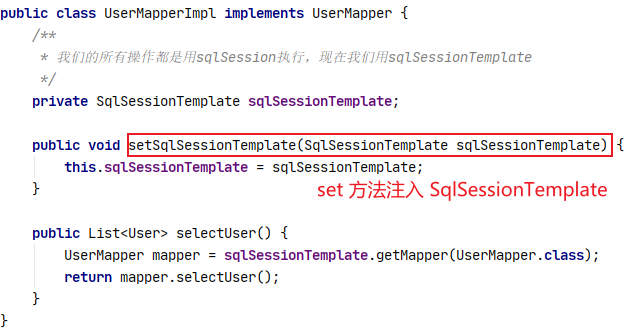

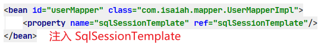


------->


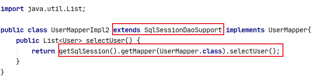

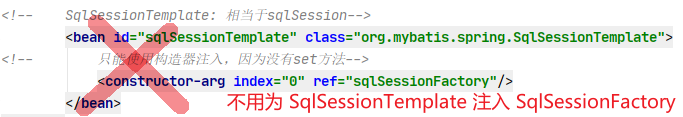

因为继承的抽象类里面已经写好了为SqlSessionTemplate 注入 Factory 的 set 方法

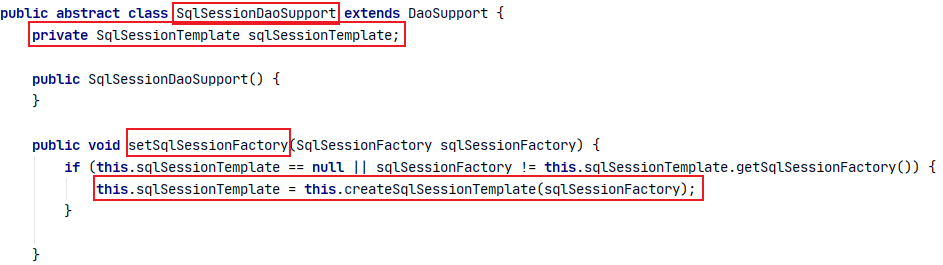

只需在实现类的 bean 中为继承的抽象类 SqlSessionDaoSupport 注入 SqlSessionFactory

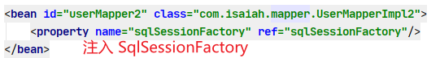

用 getSession 直接得到 SqlSessionTemplate

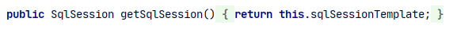


# 14. 声明式事务

## 14.1 回顾事务

事务的 ACID 原则：

+ 原子性：确保要么都提交成功，要么都提交失败
+ 一致性：资源和状态保持一致
+ 隔离性：多个业务可能操作同一个资源，防止数据损坏
+ 持久性：事务一旦提交，无论系统发生什么问题，结果都不会被影响，被持久化地写到存储器中

```java
package com.isaiah.pojo;

import lombok.AllArgsConstructor;
import lombok.Data;
import lombok.NoArgsConstructor;

@Data
@AllArgsConstructor
@NoArgsConstructor
public class User {
    private int id;
    private String name;
    private String pwd;
}

------------------------------------------------------------------------
    
package com.isaiah.mapper;

import com.isaiah.pojo.User;
import org.mybatis.spring.support.SqlSessionDaoSupport;

import java.util.List;

public class UserMapperImpl extends SqlSessionDaoSupport implements UserMapper {
    public List<User> selectUser() {
        User user = new User(8, "xiaohong", "123456");
        UserMapper mapper = getSqlSession().getMapper(UserMapper.class);
        // 成功添加一个用户
        mapper.addUser(user);
        // 故意写错 sql语句，删除特定用户失败
        mapper.deleteUser(6);
        // 筛选的结果显示添加用户的指令成功执行了
        // 删除用户的指令执行失败了
        // 我们希望两个指令绑定为一个事务：要么都成功，要么都失败
        return mapper.selectUser();
    }

    public int addUser(User user) {
        return getSqlSession().getMapper(UserMapper.class).addUser(user);
    }

    public int deleteUser(int id) {
        return getSqlSession().getMapper(UserMapper.class).deleteUser(id);
    }
}
```

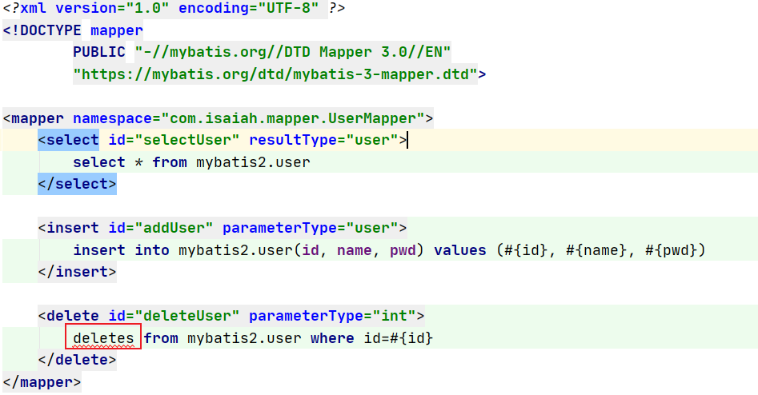


## 14.2 Spring 中的事务管理

+ 声明式事务：AOP（better）
+ 编程式事务：需要改变原有的代码

为一个或若干个 UserMapper 中的方法配置事务，并把这种规定（事务，通知）赋能给指定的方法（切入点）

```xml
<bean id="dataSource" class="org.springframework.jdbc.datasource.DriverManagerDataSource">
        <property name="driverClassName" value="com.mysql.cj.jdbc.Driver"/>
        <property name="url" value="jdbc:mysql://localhost:3306/mybatis2?useSSL=true&amp;useUnicode=true&amp;characterEncoding=utf8"/>
        <property name="username" value="root"/>
        <property name="password" value="123456"/>
    </bean>

    <bean id="sqlSessionFactory" class="org.mybatis.spring.SqlSessionFactoryBean">
        <property name="dataSource" ref="dataSource"/>
        <property name="configLocation" value="mybatis-config.xml"/>
        <property name="mapperLocations" value="com/isaiah/mapper/*.xml"/>
    </bean>

<!--    配置声明式事务-->
    <bean id="transactionManager" class="org.springframework.jdbc.datasource.DataSourceTransactionManager">
        <property name="dataSource" ref="dataSource"/>
    </bean>
<!--    结合AOP实现事务的织入-->
<!--    配置事务通知-->
    <tx:advice id="txAdvice" transaction-manager="transactionManager">
<!--        给那些方法配置事务-->
<!--        配置事物的传播特性-->
        <tx:attributes>
            <tx:method name="select*"/>
        </tx:attributes>
    </tx:advice>
<!--    配置事务切入-->
    <aop:config>
        <aop:pointcut id="txPointCut" expression="execution(* com.isaiah.mapper.UserMapper.select*(..))"/>
        <aop:advisor advice-ref="txAdvice" pointcut-ref="txPointCut"/>
    </aop:config>
```

业务一般都需要事务，一般是增删改

```xml
<tx:method name="add*" propagation="REQUIRED"/>
<tx:method name="delete" propagation="REQUIRED"/>
<tx:method name="update" propagation="REQUIRED"/>
<tx:method name="query" read-only="true"/>
<tx:method name="*"/>	默认是 propagation="REQUIRED"
```


