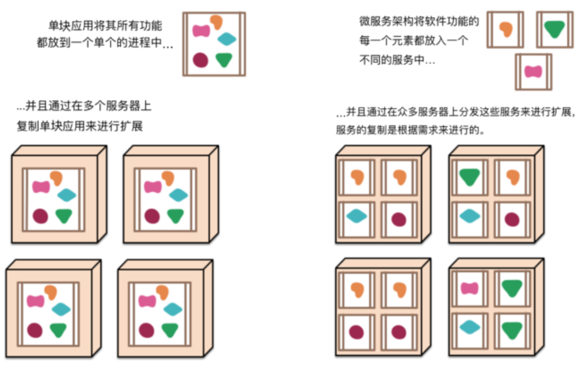
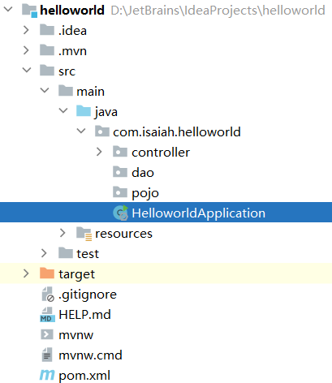
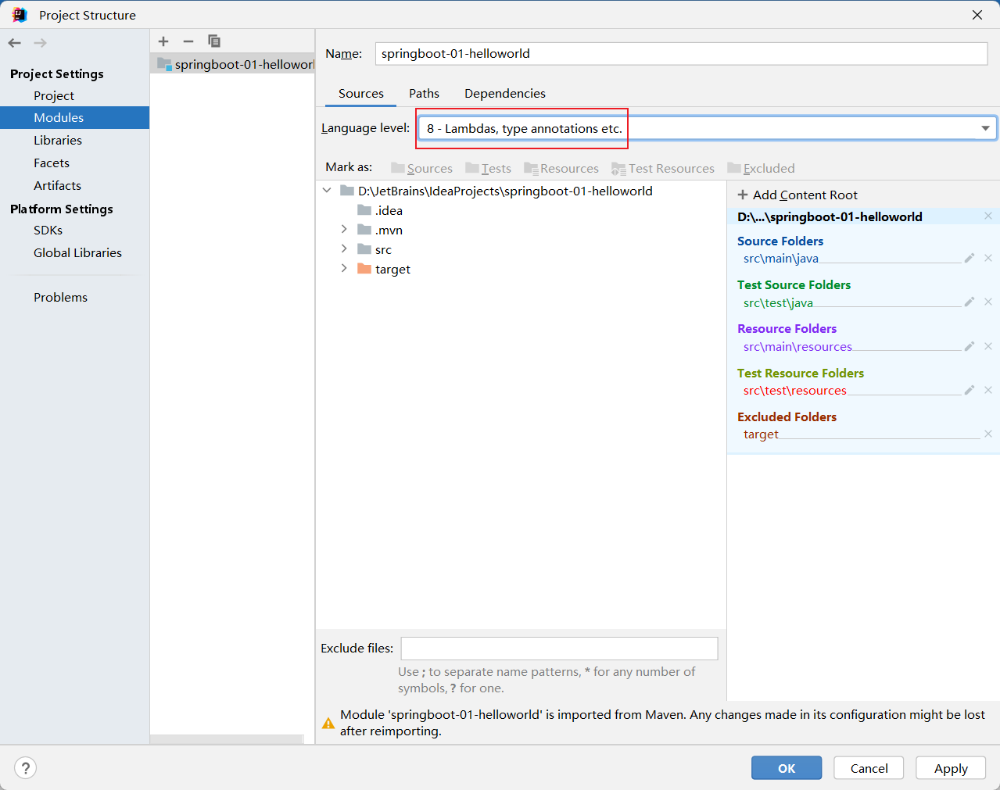
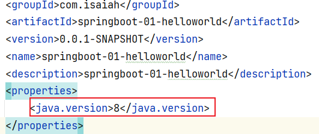
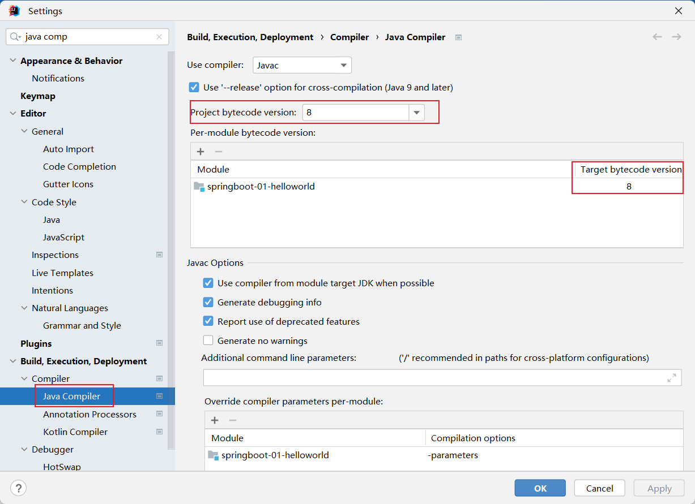
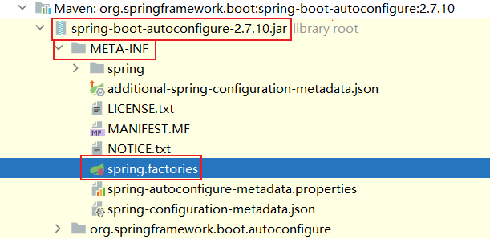
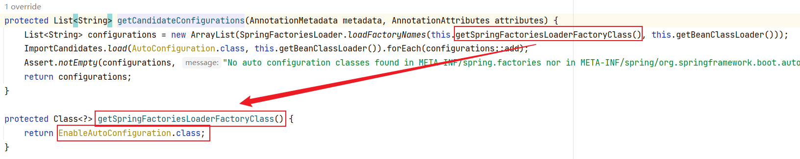
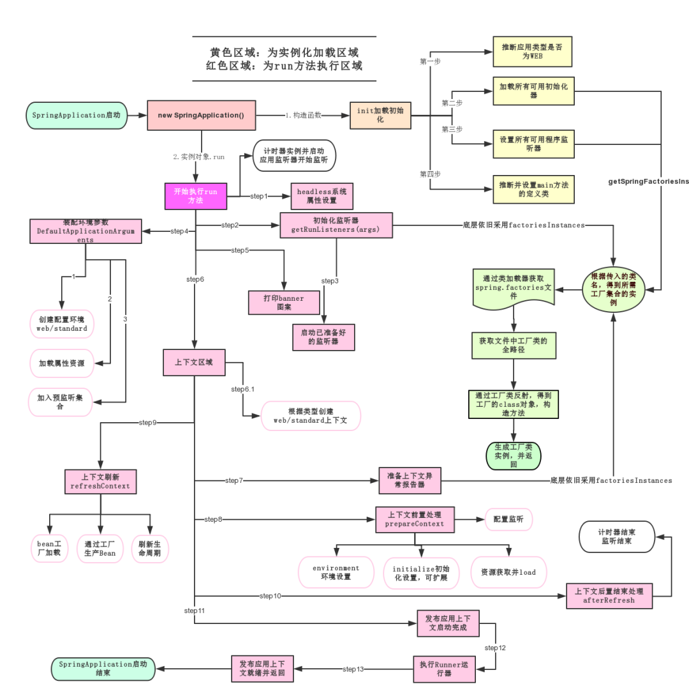
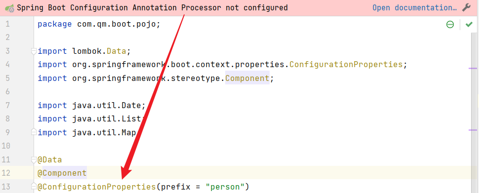
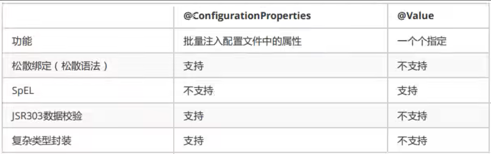

# 1. 微服务阶段

## 1.1 历史阶段

**JavaSE**：OOP

**MySQL**：持久化

**html + css + js + jquery + 框架**：视图

**javaweb**：开发 MVC 三层架构

**ssm**：框架，简化了开发流程，配置也开始较为复杂

## 1.2 微服务阶段

### 1.2.1 SpringBoot

**SpringBoot**：spring 再简化

为了降低 java 开发的复杂性，spring 采用了**四种关键的策略**：

+ 基于 pojo 的轻量级和最小侵入性编程
+ 通过 IOC 依赖注入和面向接口实现松耦合
+ 基于切面和惯例进行声明式编程
+ 通过切面和模版减少样式代码

### 1.2.2 什么是微服务

**微服务是一种架构风格**，应用是一系列小服务的组合，可以通过 **http 的方式进行互通**

​																		**VS**

**单体应用架构（all in one）**是指我们将所有的服务都封装在一个应用中（打包成一个 war 包）：

+ 易于开发测试，易于部署
+ 维护更新都很困难，需要停掉整个服务

 

**Martin Fowler**




**1. 简而言之微服务是什么？**

+ 以开发**一组小型服务的方式**来开发一个**独立的应用系统**
+ 其中每个小型服务都运行在自己的**进程**中，并经常采用**HTTP资源API**这样轻量的机制来相互通信
+ 这些微服务可以使用**不同的语言**来编写，并且可以使用**不同的数据存储技术**
+ 对这些微服务，我们仅做**最低限度的集中管理**


**2. 单块应用系统 monolithic**

+ 处理用户请求的所有逻辑都运行在一个单个的进程内
+ 使用编程语言的基本特性，来把应用系统划分为类、函数和命名空间
+ 通过负载均衡器运行许多实例，来将这个单块应用进行横向扩展
+ 应用系统中一个很小部分的一处变更，也需要将整个单块应用系统进行重新构建和部署
+ 单块应用逐渐难以保持一个良好的模块化结构，这使得它变得**越来越难以将一个模块的变更所产生的影响控制在该模块内**
+ 当对系统进行扩展时，**不得不扩展整个应用系统**，而不能仅扩展该系统中需要更多资源的那些部分


**3. 一些类比**

+ 我们将**软件库(libraries)**定义为这样的组件，即它能被**链接到一段程序**，且能**通过内存中的函数来进行调用**
+ **服务(services)是进程外的组件**，它们通过诸如web service请求或远程过程调用这样的机制来进行通信


# 2. 第一个程序

## 2.1 开发环境

+ jdk 1.8
+ maven 3.6.1
+ SpringBoot 最新版
+ IDEA

## 2.2 项目结构



==HelloworldApplication.java== springBoot 项目的入口

```java
package com.isaiah.helloworld;

import org.springframework.boot.SpringApplication;
import org.springframework.boot.autoconfigure.SpringBootApplication;

@SpringBootApplication
public class HelloworldApplication {

	public static void main(String[] args) {
		SpringApplication.run(HelloworldApplication.class, args);
	}

}
```

==pom.xml==

```xml
<?xml version="1.0" encoding="UTF-8"?>
<project xmlns="http://maven.apache.org/POM/4.0.0" xmlns:xsi="http://www.w3.org/2001/XMLSchema-instance"
	xsi:schemaLocation="http://maven.apache.org/POM/4.0.0 https://maven.apache.org/xsd/maven-4.0.0.xsd">
	<modelVersion>4.0.0</modelVersion>
    
    <!--	继承 spring-boot-starter-parent 的依赖，版本控制和打包描述	-->
	<parent>
		<groupId>org.springframework.boot</groupId>
		<artifactId>spring-boot-starter-parent</artifactId>
		<version>2.7.10</version>
		<relativePath/> <!-- lookup parent from repository -->
	</parent>
    
    <!--	maven GAV + name + description	-->
	<groupId>com.isaiah</groupId>
	<artifactId>helloworld</artifactId>
	<version>0.0.1-SNAPSHOT</version>
	<name>helloworld</name>
	<description>Demo project for Spring Boot</description>
    
	<properties>
		<java.version>1.8</java.version>
	</properties>
    
	<dependencies>
        <!--	用于实现 HTTP 接口，使用 Tomcat 作为默认的嵌入式容器	-->
		<dependency>
			<groupId>org.springframework.boot</groupId>
			<artifactId>spring-boot-starter-web</artifactId>
		</dependency>

        <!--	用于单元测试	-->
		<dependency>
			<groupId>org.springframework.boot</groupId>
			<artifactId>spring-boot-starter-test</artifactId>
			<scope>test</scope>
		</dependency>
	</dependencies>

    <!--	构建配置部分，默认使用 spring-boot-maven-plugin 
		配合 spring-boot-starter-parent 打jar包直接运行	-->
	<build>
		<plugins>
			<plugin>
				<groupId>org.springframework.boot</groupId>
				<artifactId>spring-boot-maven-plugin</artifactId>
			</plugin>
		</plugins>
	</build>

</project>
```

## 2.3 可能出现的问题

**java: 警告: 源发行版 17 需要目标发行版 17**






**无效的目标发行版：17**



**java: 无法访问org.springframework.boot.SpringApplication**
  **错误的类文件: /C:/Users/1203/.m2/repository/org/springframework/boot/spring-boot/3.0.5/spring-boot-3.0.5.jar!/org/springframework/boot/SpringApplication.class**
    **类文件具有错误的版本 61.0, 应为 52.0**
    **请删除该文件或确保该文件位于正确的类路径子目录中**

还是换到 2 版本的 springboot 吧，3 版本依赖的是 spring 6 即只能是用 jdk 17

## 2.4 彩蛋

如果没有 web 启动器依赖，启动一半就会停止

```xml
<dependency>
    <groupId>org.springframework.boot</groupId>
    <artifactId>spring-boot-starter-web</artifactId>
</dependency>
```

改端口号

```properties
server.port=1234
```

自定义 banner： 在 resources 下新建一个 `banner.txt`

```properties
 __       _______.     ___       __       ___       __    __  
|  |     /       |    /   \     |  |     /   \     |  |  |  | 
|  |    |   (----`   /  ^  \    |  |    /  ^  \    |  |__|  | 
|  |     \   \      /  /_\  \   |  |   /  /_\  \   |   __   | 
|  | .----)   |    /  _____  \  |  |  /  _____  \  |  |  |  | 
|__| |_______/    /__/     \__\ |__| /__/     \__\ |__|  |__| 
                                                              
```

## 2.5 原理初探

### 2.5.1 pom.xml

+ **核心依赖在父工程中** `spring-boot-dependencies` **\<dependencyManagement\>**
+ 我们使用依赖**不需要指定版本**，因为 `spring-boot-dependencies` **\<properties\>** 中指定了版本

### 2.5.2 启动器

比如 `spring-boot-starter-web` 会帮我们自动导入 web 环境所需的所有依赖

+ springboot 将所有的**功能场景**都封装成了一个个的启动器
+ 我们想要什么功能，就在 pom 加入对应的启动器 `starter` 即可

### 2.5.3 主程序

#### 2.5.3.1 注解 @SpringBootApplication

**标注这个类是一个 springboot 应用**

+ @SpringBootConfiguration
+ @EnableAutoConfiguration 自动配置
  + @AutoConfigurationPackages 自动配置包
    + @Import({AutoConfigurationImportSelector.class}) 自动配置选择器

**分析结论：**

+ springboot 所有自动配置都是在启动的时候扫描并加载

+ spring.factories： 所有的自动配置类都在这里面
+ 但是不一定生效，要判断条件是否成立，只要导入了对应的 start，就有对应的启动器了
+ 有了启动器，我们自动装配就会生效

1. springboot 在启动的时候，从路径 `/META-INF/spring.factories` 获取指定的值
2. 将这些自动配置的类导入容器，自动配置就会生效
3. 自动配置的东西都在 spring-boot-autoconfigure-2.2.0.RELEASE.jar 这个包下
4. 它会把所有需要导入的组件，以类名的方式返回，这些组件就会被添加到容器中
5. 容器中也会存在非常多的 xxxAutoConfiguration 文件（@Bean）
6. 免去了手动编写配置文件的工作

#### 2.5.3.2 启动 SpringApplication.run()

+ 推断应用的类型，是普通的项目还是 web 项目
+ 查找并加载所有可用的初始化器（starter）设置到 initializers 属性中
+ 找出所有的应用程序监听器，设置到 listeners 属性中
+ 推断并设置 main 方法的定义类，找到运行的主类

# 3. 原理初探（自动配置）

## 3.1 pom.xml

`pom < spring-boot-starter-parent < spring-boot-dependencies`

+ ../ spring-boot-starter-parent
    + 资源过滤 `<resources>`
+ ../../ spring-boot-dependencies 
    + 核心依赖 `<dependencyManagement>`
    + `<properties>` 为核心依赖指定版本
+ `<dependencies>` 中的 starter（启动器）中指定了所需依赖的版本
+ 启动器可以理解为 SpringBoot 的功能场景，导入 xx 环境所需的依赖

## 3.2 主程序（xxxApplication.java）

```java
package com.isaiah;

import org.springframework.boot.SpringApplication;
import org.springframework.boot.autoconfigure.SpringBootApplication;

// 标注这个类是一个 SpringBoot 应用
@SpringBootApplication
public class Springboot01HelloworldApplication {
    // 将 SpringBoot 应用启动
    public static void main(String[] args) {
        SpringApplication.run(Springboot01HelloworldApplication.class, args);
    }
}
```

### 3.2.1 @SpringBootApplication

`@SpringBootApplication `

​				`< @SpringBootConfiguration / @EnableAutoConfiguration`

+ @SpringBootConfiguration ` < @Configuration < @Component`

    + 代表 SpringBoot 的配置，是一个 spring 配置类，本质上是一个组件

+ @EnableAutoConfiguration 0

    + @AutoConfigurationPackage 1

        + @Import({AutoConfigurationPackages.Registrar.class}) 2

            + AutoConfigurationPackages.java 3

                + 通过元数据得到包名，注册包名

                + ```java
                    public void registerBeanDefinitions(AnnotationMetadata metadata, BeanDefinitionRegistry registry) {
                        AutoConfigurationPackages.register(registry, (String[])(new PackageImports(metadata)).getPackageNames().toArray(new String[0]));
                    }
                    ```

    + @Import({AutoConfigurationImportSelector.class}) 1

        + AutoConfigurationImportSelector.java 2

            + ```java
                // simplify
                protected AutoConfigurationEntry getAutoConfigurationEntry(AnnotationMetadata annotationMetadata) {
                    if (!this.isEnabled(annotationMetadata)) {
                        return EMPTY_ENTRY;
                    } else {
                        // 获得所有的配置
                        List<String> configurations = this.getCandidateConfigurations(annotationMetadata, attributes);
                        configurations = this.removeDuplicates(configurations);
                        Set<String> exclusions = this.getExclusions(annotationMetadata, attributes);
                        return new AutoConfigurationEntry(configurations, exclusions);
                    }
                }
                ```

                + getCandidateConfigurations.java 3 获取候选的配置

                    + ```java
                        // 获取候选的配置
                        protected List<String> getCandidateConfigurations(AnnotationMetadata metadata, AnnotationAttributes attributes) {
                            // 加载 getSpringFactoriesLoaderFactoryClass 和 getBeanClassLoader
                            List<String> configurations = new ArrayList(SpringFactoriesLoader.loadFactoryNames(this.getSpringFactoriesLoaderFactoryClass(), this.getBeanClassLoader()));
                            ImportCandidates.load(AutoConfiguration.class, this.getBeanClassLoader()).forEach(configurations::add);
                            // 断言配置不为空 
                            // META-INF/spring.factories 
                            // META-INF/spring/org.springframework.boot.autoconfigure.AutoConfiguration.imports
                            // 自动配置的核心文件
                            Assert.notEmpty(configurations, "No auto configuration classes found in META-INF/spring.factories nor in META-INF/spring/org.springframework.boot.autoconfigure.AutoConfiguration.imports. If you are using a custom packaging, make sure that file is correct.");
                            return configurations;
                        }
                        ```

                        

                        + getSpringFactoriesLoaderFactoryClass() 4

                            + 加载标注了@EnableAutoConfiguration注解的类（比如主启动类）

                                

                        + getBeanClassLoader() 4

                        + loadFactoryNames(getSpringFactoriesLoaderFactoryClass(), getBeanClassLoader()) 4

                            + loadSpringFactories() 获取所有的加载配置

                                + ```java
                                    // 所有的资源加载到配置类中
                                    Properties properties = PropertiesLoaderUtils.loadProperties(resource);
                                    ```

**关于spring.factories**

spring.factories其实是SpringBoot提供的SPI机制，底层实现是基于SpringFactoriesLoader检索ClassLoader中所有jar（包括ClassPath下的所有模块）引入的META-INF/spring.factories文件，基于文件中的接口（或者注解）加载对应的实现类并且注册到IOC容器。这种方式对于@ComponentScan不能扫描到的并且想自动注册到IOC容器的使用场景十分合适，基本上绝大多数第三方组件甚至部分spring-projects中编写的组件都是使用这种方案。


### 3.2.2 主类自动装配

+ 推断应用的类型：普通项目、web 项目
+ 查找并加载所有可用的初始化器，设置到 `initializers` 属性中
+ 找出所有的应用程序监听器，设置到 `listeners` 属性中
+ 推断并设置 main 方法的定义类并找到运行的主类



# 4. yaml 语法

+ `application.properties`
  + key = value
+ `application.yaml`
  + key: 空格 value


## 4.1 yaml VS properties

```properties
# 只能存键值对
student.name = isaiah
student.age = 3
```

```yaml
# 对象
student:
  name: isaiah
  age: 3
# 行内写法
student: {name: isaiah, age: 3}

# 数组
pets:
 - cat
 - dog
 - pig
# 行内写法
pets: [cat, dog, pig]
```


## 4.2 为实体类赋值


### 4.2.1 原生方式与 yaml 注入

+ 原生方式为实体类赋值

```java
package com.qm.boot.pojo;

import lombok.Data;
import org.springframework.beans.factory.annotation.Value;
import org.springframework.stereotype.Component;

@Data
@Component
public class Dog {
    @Value("wang")
    private String name;
    @Value("3")
    private Integer age;
}
```

+ yaml 为实体类赋值

```yaml
person:
  name: isaiah
  age: 3
  happy: true
  birth: 2023/11/24
  maps: {k1: v1, k2: v2}
  list:
    - code
    - music
    - girl
  dog:
    name: wang
    age: 3
```

```java
package com.qm.boot.pojo;

import lombok.Data;
import org.springframework.boot.context.properties.ConfigurationProperties;
import org.springframework.stereotype.Component;

import java.util.Date;
import java.util.List;
import java.util.Map;

@Data
@Component
@ConfigurationProperties(prefix = "person") // 这个注解指定注入的信息
public class Person {
    private String name;
    private Integer age;
    private Boolean happy;
    private Date birth;
    private Map<String, Object> maps;
    private List<Object> lists;

    private Dog dog;
}

```

```md
// 失败
Person(
name=isaiah, 
age=3, 
happy=true, 
birth=Fri Nov 24 00:00:00 CST 2023, 
maps={k1=v1, k2=v2}, 
lists=null, // 没有对应上所以为null
dog=Dog(name=wang, age=3))

// 成功
Person(lists=[code, music, girl])
```



```xml
<dependency>
    <groupId>org.springframework.boot</groupId>
    <artifactId>spring-boot-configuration-processor</artifactId>
    <optional>true</optional>
</dependency>
```

+ `@ConfigurationPorperties(prefix = "person")` 作用：
  + 将 `配置文件` 中配置的每一个属性的值映射到这个组件中
  + 这里的配置文件当然是默认的 `application.xxx`
  + 只用容器中的组件才能够使用这个功能

+ `@PropertiesSource(value = "classpath:isaiah.properties")`
  + 指定 `配置文件` 的地址

### 4.2.2 yaml 注入：使用EL表达式

```yaml
person:
  name: isaiah${random.uuid} # 3d1b9356-ba3c-4404-8f73-c8fc1c5bb1a7
  age: ${random.int(100)} # 91
  happy: true
  birth: 2023/11/24
  maps: {k1: v1, k2: v2}
  lists:
    - code
    - music
    - girl
  hello: happyHello
  dog:
    name: ${person.hello:hello}_wang # 三元表达式：happyHello_wang
    age: 3
```


### 4.2.3 两种方式对比



+ 松散绑定
  + `last-name` 可以绑定类中的 `lastName`

+ JSR303
  + JSR 是 Java Specification Requests 的缩写，即 Java 规范提案（Bean Validation (JSR 303)）
  + @Length @Email @Pattern
  + `@Length(max=5, message = "太长了")`


# 5. 多环境配置

1. `file:./config/`
2. `file:./`
3. `classpath:/config/`
4. `classpath:/`

```yaml
server:
	port: 8081
spring:
	profiles:
		active: dev	# 选择要激活哪个配置环境
--
server:
	port: 8082
spring:
	profiles: dev	# 配置环境的名称
	
--
server:
	port: 8083
spring:
	profiles: test	# 配置环境的名称
```


# 6. 自动配置原理

## 6.1 详细原理

+ `@SpringBootApplicaiton`

+ `@EnableAutoConfiguration`

+ `@Import(AutoConfigurationImportSelector.class)`

  + `@Import` 指定类的加载优先于本身的类加载

  + 指定实现 `ImportSelector` 的类可以实现个性化加载

  + `ImportSelector` 收集需要导入的配置类配合 `@Enablexxx` 注解使用

  + ```java
    package com.test;
    
    @Retention(RetentionPolicy.RUNTIME)
    @Documented
    @Target(ElementType.TYPE)
    @Import(ServiceImportSelector.class)
    @interface EnableService {
        String name();
    }
    
    class ServiceImportSelector implements ImportSelector {
        @Override
        public String[] selectImports(AnnotationMetadata importingClassMetadata) {
            //这里的importingClassMetadata针对的是使用@EnableService的非注解类
            //因为`AnnotationMetadata`是`Import`注解所在的类属性，如果所在类是注解类，则延伸至应用这个注解类的非注解类为止
            Map<String , Object> map = importingClassMetadata.getAnnotationAttributes(EnableService.class.getName(), true);
            String name = (String) map.get("name");
            if (Objects.equals(name, "B")) {
                return new String[]{"com.test.ConfigB"};
            }
            return new String[0];
        }
    }
    ```

  + ```java
    // 之后，在ConfigA中增加注解@EnableService(name = "B")
    package com.test;
    @EnableService(name = "B")
    @Configuration
    class ConfigA {
        @Bean
        @ConditionalOnMissingBean
        public ServiceInterface getServiceA() {
            return new ServiceA();
        }
    }
    // 输出：ServiceB
    ```

+ `springboot` 会实现很多 `xxxAutoConfiguration` 类，其上会有 `@EnableConfigurationProperties` 注解

  + 这个注解会引入若干配置属性 `xxxProperties.class` 其上会有 `@ConfigurationProperties(prefix = "xxx")` 注解
  + `server: port: 8080`
  + `@ConfigurationProperties(prefix="server", ignoreUnknownFields=true)`
  + 这个类所有的属性就是可以在 yaml 配置的东西（它们都要实现 `set方法`）
  + 这些类的命名规则为 `xxxProperties.java` 例如 `ServerProperties.java`


+ 还会有 `@ConditionalOnXXX` 注解来判断是否满足指定条件

> **@ConditionalOnBean**：仅仅在当前上下文中存在某个对象时，才会实例化一个Bean。
> **@ConditionalOnClass**：某个class位于类路径上，才会实例化一个Bean。
> **@ConditionalOnExpression**：当表达式为true的时候，才会实例化一个Bean。
> **@ConditionalOnMissingBean**：仅仅在当前上下文中不存在某个对象时，才会实例化一个Bean。
> **@ConditionalOnMissingClass**：某个class类路径上不存在的时候，才会实例化一个Bean。
> **@ConditionalOnNotWebApplication**：不是web应用，才会实例化一个Bean。
> **@ConditionalOnBean**：当容器中有指定Bean的条件下进行实例化。
> **@ConditionalOnMissingBean**：当容器里没有指定Bean的条件下进行实例化。
> **@ConditionalOnClass**：当classpath类路径下有指定类的条件下进行实例化。
> **@ConditionalOnMissingClass**：当类路径下没有指定类的条件下进行实例化。
> **@ConditionalOnWebApplication**：当项目是一个Web项目时进行实例化。
> **@ConditionalOnNotWebApplication**：当项目不是一个Web项目时进行实例化。
> **@ConditionalOnProperty**：当指定的属性有指定的值时进行实例化。
> **@ConditionalOnExpression**：基于SpEL表达式的条件判断。
> **@ConditionalOnJava**：当JVM版本为指定的版本范围时触发实例化。
> **@ConditionalOnResource**：当类路径下有指定的资源时触发实例化。
> **@ConditionalOnJndi**：在JNDI存在的条件下触发实例化。
> **@ConditionalOnSingleCandidate**：当指定的Bean在容器中只有一个，或者有多个但是指定了首选的Bean时触发实例化。


## 6.2 粗略总结

1. spring boot 启动会加载大量的自动配置类
2. 我们进行开发时，先要看需要的功能是不是被这些自动配置类实现了
3. 
