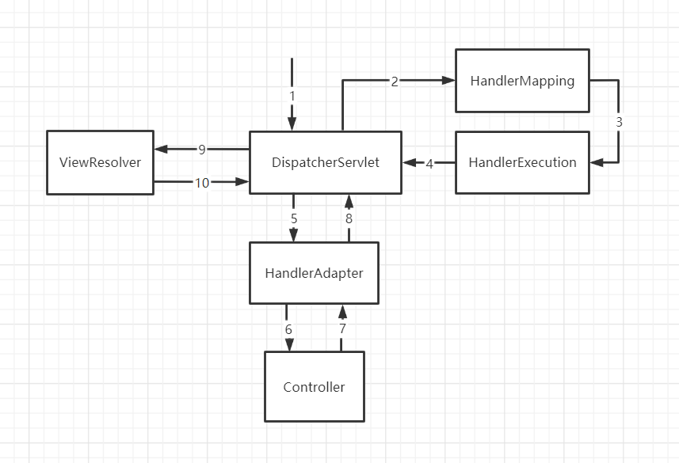
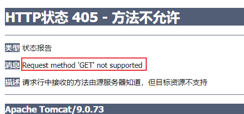
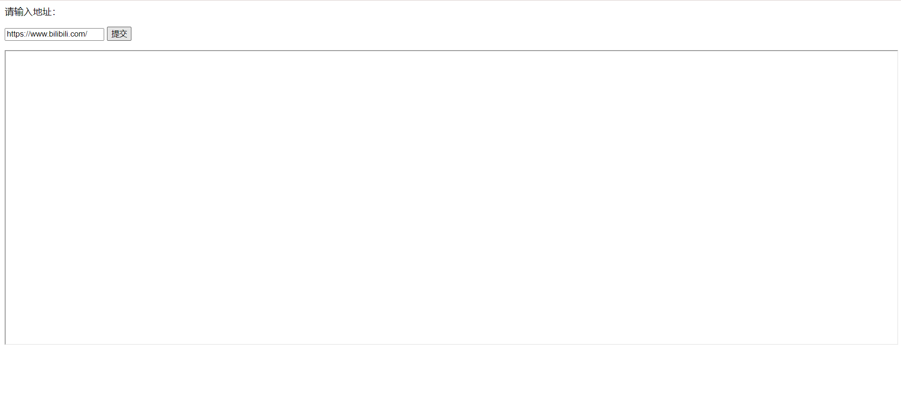
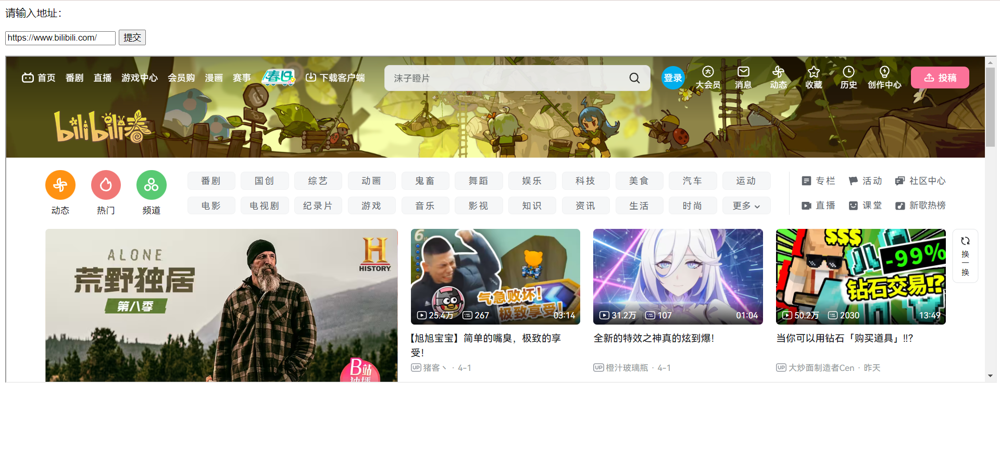
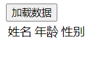

# 1. 回顾 Servlet

## 1.1 web.xml

==web.xml:	servlet（注册 HelloServlet）==

```xml
<servlet>
    <servlet-name>hello</servlet-name>
    <servlet-class>com.isaiah.servlet.HelloServlet</servlet-class>
</servlet>
```

==web.xml:	servlet-mapping==

+ 将 HelloServlet 关联到指定的 url 上，当请求此 url 时就由 HelloServlet 做出响应

```xml
<servlet-mapping>
    <servlet-name>hello</servlet-name>
    <url-pattern>/hello</url-pattern>
</servlet-mapping>
```


## 1.2 form.jsp

+ ${pageContextPath}/hello 的请求，使用 post 的方法进行提交
+ 输入框接收信息，name 属性值为 name，提交时生成 key 为 method 的键值对
+ submit 提交信息

```jsp
<%@ page contentType="text/html;charset=UTF-8" language="java" %>
<html>
<head>
    <title>$Title$</title>
</head>
<body>
    <form action="${pageContext.request.contextPath}/hello" method="post">
        <label>
            <input type="text" name="method"/>
        </label>
        <input type="submit"/>
    </form>
</body>
</html>
```


## 1.3 HelloServlet.java

+ 通过**继承 HttpServlet 来实现 Servlet 接口**
+ **获得 ${pageContextPath}/hello 中提交的信息**，即获得 method 对应的值
+ **业务代码**处理信息
+ 通过 session 以键值对的形式**存储信息**
+ 页面**重定向（或转发）**到另一个页面 test.jsp

```java
package com.isaiah.servlet;

import javax.servlet.ServletException;
import javax.servlet.http.HttpServlet;
import javax.servlet.http.HttpServletRequest;
import javax.servlet.http.HttpServletResponse;
import java.io.IOException;

// HttpServlet 的父类实现了 Servlet 接口
public class HelloServlet extends HttpServlet {
    @Override
    protected void doGet(HttpServletRequest req, HttpServletResponse resp) throws ServletException, IOException {
        // 1. 获取前端参数
        String method = req.getParameter("method");
        if ("add".equals(method)) {
            req.getSession().setAttribute("msg", "执行了 add 方法");
        }
        if ("delete".equals(method)) {
            req.getSession().setAttribute("msg", "执行了 delete 方法");
        }
        // 2. 调用业务层 service

        // 3. 页面转发或重定向
        req.getRequestDispatcher("/WEB-INF/jsp/test.jsp").forward(req, resp);
    }

    @Override
    protected void doPost(HttpServletRequest req, HttpServletResponse resp) throws ServletException, IOException {
        doGet(req, resp);
    }
}
```


## 1.4 test.jsp

+ 在请求中解析得到信息
+ 输出信息到页面上

```jsp
<%@ page contentType="text/html;charset=UTF-8" language="java" %>
<html>
<head>
    <title>$Title$</title>
</head>
<body>
${msg}
</body>
</html>
```


# 2. SpringMVC 概要

SSM：MyBatis + Spring + SpringMVC

MVC：模型（dao，service）视图（jsp）控制器（servlet）

SpringMVC 三大件：**处理器映射器**，**处理器适配器**，**视图解析器**

```sql
create database if not exists mybatis;
USE mybatis;

create table if not exists `user`(
	`id` int(20) not null,
	`name` varchar(30),
	`pwd` varchar(30),
	primary key(`id`)
)ENGINE=INNODB DEFAULT CHARSET=utf8;

insert into `user`(`id`, `name`, `pwd`) VALUES(1, '张三', '123');
insert into `user`(`id`, `name`, `pwd`) VALUES(2, '李四', '123');
insert into `user`(`id`, `name`, `pwd`) VALUES(3, '王五', '123');
```


## 2.1 原理结构图

映射 -> 适配 -> 视图解析




## 2.2 web.xml

==web.xml:	servlet（注册 dispatcherServlet）==

+ servlet 名字为 springmvc

+ servlet 关联 DispatcherServlet 类来调度页面

+ servlet 关联配置文件 springmvc-servlet.xml 初始化时执行

+ servlet 设置启动级别为 1 确保Servlet在Web应用程序启动时立即加载

```xml
<!--    注册 dispatcherServlet-->
    <servlet>
        <servlet-name>springmvc</servlet-name>
        <servlet-class>org.springframework.web.servlet.DispatcherServlet</servlet-class>
<!--        关联一个 springmvc的配置文件 -->
        <init-param>
            <param-name>contextConfigLocation</param-name>
            <param-value>classpath:springmvc-servlet.xml</param-value>
        </init-param>
<!--        启动级别-1-->
        <load-on-startup>1</load-on-startup>
    </servlet>
```

==web.xml:	servlet-mapping（为 dispatcherServlet 匹配需要处理的 url 请求）==

+ dispatcherServlet 拆解请求的 url 得到对应的 jsp 文件名（不带后缀）

```xml
<!--    / 匹配不包括.jsp的请求-->
<!--    /* 匹配所有的请求（包括.jsp）会造成循环添加.jsp后缀的问题-->
    <servlet-mapping>
        <servlet-name>springmvc</servlet-name>
        <url-pattern>/</url-pattern>
    </servlet-mapping>
```


## 2.3 springmvc-servlet.xml

==springmvc-servlet.xml:	处理器映射器（HandlerMapping）==

```xml
<!--    处理器映射器-->
    <bean class="org.springframework.web.servlet.handler.BeanNameUrlHandlerMapping"/>
```

==springmvc-servlet.xml:	处理器适配器（HandlerAdapter）==

```xml
<!--    处理器适配器-->
    <bean class="org.springframework.web.servlet.mvc.SimpleControllerHandlerAdapter"/>
```

==springmvc-servlet.xml:	视图解析器（ViewResolver）==

+ 根据得到的 jsp 文件名，解析出该 jsp 文件的完整路径

```xml
<!--    视图解析器：解析 dispatcherServlet 给的 ModelAndView-->
    <bean class="org.springframework.web.servlet.view.InternalResourceViewResolver" id="internalResourceViewResolver">
<!--        前缀-->
        <property name="prefix" value="/WEB-INF/jsp/"/>
<!--        后缀-->
        <property name="suffix" value=".jsp"/>
    </bean>
```

==springmvc-servlet.xml:	处理器映射器要映射的类（Handler）==

+ 注册控制器（HelloController）到 spring

```xml
<!--    BeanNameUrlHandlerMapping-->
    <bean id="/hello" class="com.isaiah.controller.HelloController"/>
```


## 2.4 HelloController.java

```java
package com.isaiah.controller;


import org.springframework.web.servlet.ModelAndView;
import org.springframework.web.servlet.mvc.Controller;

import javax.servlet.http.HttpServletRequest;
import javax.servlet.http.HttpServletResponse;

public class HelloController implements Controller {

    public ModelAndView handleRequest(HttpServletRequest request, HttpServletResponse response) throws Exception {
        ModelAndView mv = new ModelAndView();
        // 业务代码：封装对象
        mv.addObject("msg", "HelloSpringMVC");
        // 视图跳转：封装要跳转的视图
        mv.setViewName("test");    // /WEB-INF/jsp/test.jsp
        return mv;
    }
}
```


## 2.5 test.jsp

```jsp
<%@ page contentType="text/html;charset=UTF-8" language="java" %>
<html>
<head>
    <title>Title</title>
</head>
<body>
${msg}	<!-- HelloSpringMVC -->
</body>
</html>
```


# 3. 注解开发 SpringMVC

### 注意事项

+ 在视图解析器中，**将所有的视图都放在 WEB-INF 中**，以保证视图安全（WEB-INF 中的文件，客户端不能直接访问）

+ SpringMVC 三大件：**处理器映射器**，**处理器适配器**，**视图解析器**
+ 通常我们只需要**手动配置视图解析器，而处理器映射器和处理器适配器只需要开启注解驱动即可**，省去了大量的 xml 配置
+ update tomcat
  + update resources 更新静态资源
  + update classes and resources 更新 java，jsp 和静态资源
  + redeployed 更新 controller 重新部署而不重启 tomcat
  + restart server 重启 tomcat

## 3.1 开发步骤

+ 新建一个 web 项目
  + 新建一个空的 maven 项目
  + 右键 add framework support
  + 添加 web application 支持
+ 导入相关的 jar 包
  + 打开 project structure 中的 artifacts
  + 在 output layout 中查看输出的布局
  + 在 WEB-INF 中新建 lib 文件夹，导入所需要的 jar 包
+ 编写 web.xml，注册 DispatcherServlet
  + servlet
  + servlet-mapping
+ 编写 DispatcherServlet 的配置文件
  + 指定注解所在的包，自动扫描
  + 请求的映射与适配，servlet-handler
  + 注解的解析，annotation-driven
+ 创建对应的控制类 controller
  + 在指定的包中编写控制器类
  + @Controller
+ 完善前端视图与 controller 之间的关系
  + @RequestMapping
  + 为控制器类编写方法
  + 为方法传入一个模型
  + 方法中更改模型（比如添加一个键值对）
  + 返回一个字符串，指定跳转的目的地（被视图解析器处理）


## 3.2 web.xml

```xml
<servlet>
    <servlet-name>myDispatcherServlet</servlet-name>
    <servlet-class>org.springframework.web.servlet.DispatcherServlet</servlet-class>
    <init-param>
        <param-name>contextConfigLocation</param-name>
        <param-value>classpath:myDispatcherServlet-servlet.xml</param-value>
    </init-param>
    <load-on-startup>1</load-on-startup>
</servlet>
<servlet-mapping>
    <servlet-name>myDispatcherServlet</servlet-name>
    <url-pattern>/</url-pattern>
</servlet-mapping>
```


## 3.3 myDispatcherServlet-servlet.xml

```xml
<?xml version="1.0" encoding="utf-8" ?>
<beans xmlns="http://www.springframework.org/schema/beans"
       xmlns:xsi="http://www.w3.org/2001/XMLSchema-instance"
       xmlns:context="http://www.springframework.org/schema/context"
       xmlns:mvc="http://www.springframework.org/schema/mvc"
       xsi:schemaLocation="http://www.springframework.org/schema/beans
        http://www.springframework.org/schema/beans/spring-beans.xsd
        http://www.springframework.org/schema/context
        http://www.springframework.org/schema/context/spring-context.xsd
        http://www.springframework.org/schema/mvc
        http://www.springframework.org/schema/mvc/spring-mvc.xsd">

<!--    自动扫描包，让包中的注解生效，由 IOC 容器统一管理-->
    <context:component-scan base-package="com.isaiah.controller"/>
    <mvc:default-servlet-handler/>
    <mvc:annotation-driven/>

<!--    视图解析器-->
    <bean class="org.springframework.web.servlet.view.InternalResourceViewResolver"
            id="internalResourceViewResolver">
        <property name="prefix" value="/WEB-INF/jsp/"/>
        <property name="suffix" value=".jsp"/>
    </bean>
</beans>
```


## 3.4 HelloController.java

==@Controller==

代表这个类会被 Spring 接管

被注解的类里面的所有方法，如果返回值是 String 类型，就会被视图解析器解析

```java
package com.isaiah.controller;

import org.springframework.stereotype.Controller;
import org.springframework.ui.Model;
import org.springframework.web.bind.annotation.RequestMapping;

@Controller
@RequestMapping("/hello")
public class HelloController {
    // localhost:8080/hello/h1
    @RequestMapping("/h1")
    public String hello(Model model) {
        model.addAttribute("msg", "Hello, SpringMVC_Annotation");
        return "hello";     // 会被视图解析器处理 /WEB-INF/jsp/hello.jsp
    }
}
```


# 4. RestFul 风格（@PathVariable）

## 4.1 初窥门径

==传统风格==

```java
@Controller
public class RestFullController {
    // http://localhost:8080/add?a=1&b=2
    @RequestMapping("/add")
    public String test1(int a, int b, Model model) {
        int rst = a + b;
        model.addAttribute("msg", "结果为 " + rst);
        return "test";  // 结果为 3
    }
}
```

==RestFul 风格==

```java
@Controller
public class RestFullController {
    // http://localhost:8080/add/1/2
    @RequestMapping("/add/{a}/{b}")
    public String test2(@PathVariable int a, @PathVariable int b, Model model) {
        int rst = a + b;
        model.addAttribute("msg", "结果为 " + rst);
        return "test";  // 结果为 3
    }
}
```


## 4.2 小试牛刀

==POST 方法==

```java
@Controller
public class RestFullController {	
	@PostMapping("/add/{a}/{b}")
    public String test3(@PathVariable int a, @PathVariable int b, Model model) {
        int rst = a + b;
        model.addAttribute("msg", "结果为 " + rst);
        return "test";
    }
}
```

==web/a.jsp==

http://localhost:8080/a.jsp

http://localhost:8080/add/1/2	**根据 url 无法判断是用什么方法提交的**

```jsp
<%@ page contentType="text/html;charset=UTF-8" language="java" %>
<html>
<head>
    <title>Title</title>
</head>
<body>
    <form action="${pageContext.request.contextPath}/add/1/2" method="post">
        <input type="submit"/>
    </form>
</body>
</html>
```

**如果不用指定的方法提交，就会提示 405 错误**




## 4.3 新的写法（path, method）

```java
@RequestMapping(path = "/add/{a}/{b}", method = RequestMethod.GET)
public String test2(@PathVariable int a, @PathVariable int b, Model model) {
    int rst = a + b;
    model.addAttribute("msg", "结果为 " + rst);
    return "test";  // 结果为 3
}
```


## 4.4 好的方面

简洁，高效，安全


# 5. 转发与重定向

**注释掉视图解析器**，即 DispatcherServlet 的配置文件中只开启了扫描包中注解的功能

==请求转发（默认）==

```java
@RequestMapping("m1/t1")
public String test1(Model model) {
    // 请求转发（url 没变）
    model.addAttribute("msg", "ModelTest1");
    return "forward:/WEB-INF/jsp/test.jsp";
}
```

==重定向==

```java
@RequestMapping("m1/t1")
public String test1(Model model) {
    // 重定向（url 变了）
    model.addAttribute("msg", "ModelTest1");
    return "redirect:/index.jsp";
}
```


# 6. 前后端的信息传递

## 6.1 后端接收前端传来的信息

### 6.1.1 后端接收的是一个值

==@RequestParam== 保证从前端请求中接收的 key 为 name，如果不是就报错

```java
@Controller
public class UserController {
    @GetMapping("/user/t1")
    public String test1(@RequestParam("name") String name, Model model) {
        // 1. 接收前端参数
        System.out.println("前端参数为: " + name);

        // 2. 将处理之后的结果返回给前端 Model
        model.addAttribute("msg", "后端输出结果到前端显示: " + name);

        // 3. 视图跳转
        return "test";
    }
}
```


### 6.1.2 后端接收的是一个对象

+ 前端提交的表单域中的各个 name 字段值和对象的属性名需要保持一致
+ 表单域和属性名不一样的话，显示 null 或 0
+ 后端接收，参数使用对象即可

http://localhost:8080/user/t2?name=isaiah&id=1&age=23

```java
@GetMapping("/user/t2")
public String test2(User user) {
    System.out.println(user);	// User(id=1, name=isaiah, age=23)
    return "test";
}
```


## 6.2 前端接收后端传来的信息

Model：简化了模型这一概念的理解与运用，设计明确，方便新手使用

ModelMap：继承了 LinkedMap

ModelAndView：可以在存储数据的同时，进行视图跳转


# 7. 乱码问题

## 7.1 回顾过滤器（filter）

==EncodingFilter.java==

```java
package com.isaiah.filter;


import javax.servlet.*;
import java.io.IOException;

public class EncodingFilter implements Filter {
    @Override
    public void init(FilterConfig filterConfig) throws ServletException {

    }

    @Override
    public void doFilter(ServletRequest servletRequest, ServletResponse servletResponse, FilterChain filterChain) throws IOException, ServletException {
        servletRequest.setCharacterEncoding("UTF-8");
        servletResponse.setCharacterEncoding("UTF-8");
        filterChain.doFilter(servletRequest, servletResponse);
    }

    @Override
    public void destroy() {

    }
}
```

==web.xml==

```xml
<filter>
    <filter-name>EncodingFilter</filter-name>
    <filter-class>com.isaiah.filter.EncodingFilter</filter-class>
</filter>
<filter-mapping>
    <filter-name>EncodingFilter</filter-name>
    <url-pattern>/e</url-pattern>
</filter-mapping>
```


## 7.2 Spring 实现乱码过滤器

==web.xml==

```xml
<!--    配置 SpringMVC 的乱码过滤器-->
    <filter>
        <filter-name>encoding</filter-name>
        <filter-class>org.springframework.web.filter.CharacterEncodingFilter</filter-class>
        <init-param>
            <param-name>encoding</param-name>
            <param-value>utf-8</param-value>
        </init-param>
    </filter>
    <filter-mapping>
        <filter-name>encoding</filter-name>
        <url-pattern>/e</url-pattern>
    </filter-mapping>
```


# 8. Json

**注意 1：**

```xml
<dependency>
    <groupId>com.fasterxml.jackson.core</groupId>
    <artifactId>jackson-databind</artifactId>
    <version>2.14.2</version>
</dependency>
<dependency>
    <groupId>org.projectlombok</groupId>
    <artifactId>lombok</artifactId>
    <version>1.18.26</version>
</dependency>
```


**注意 2：**

+ 作用在类上的 @RestController 和作用在方法上的 @ResponseBody 实现的功能是一样的
+ 都是将返回值直接显示在前端页面上，省去写测试页面的麻烦

## 8.1 json 乱码问题

```xml
<mvc:annotation-driven>
    <mvc:message-converters>
        <bean class="org.springframework.http.converter.StringHttpMessageConverter">
            <constructor-arg value="UTF-8"/>
        </bean>
        <bean class="org.springframework.http.converter.json.MappingJackson2HttpMessageConverter">
            <property name="objectMapper">
                <bean class="org.springframework.http.converter.json.Jackson2ObjectMapperFactoryBean">
                    <property name="failOnEmptyBeans" value="false"/>
                </bean>
            </property>
        </bean>
    </mvc:message-converters>
</mvc:annotation-driven>
```


## 8.2 对象转换为 json 数据

```java
package utils;

import com.fasterxml.jackson.core.JsonProcessingException;
import com.fasterxml.jackson.databind.ObjectMapper;

import java.text.SimpleDateFormat;

public class JsonUtils {
    public static String getJson(Object obj) {
        return getJson(obj, "yyyy-MM-dd HH:mm:ss");
    }

    public static String getJson(Object obj, String dataFormat) {
        ObjectMapper objectMapper = new ObjectMapper();
        SimpleDateFormat simpleDateFormat = new SimpleDateFormat(dataFormat);
        objectMapper.setDateFormat(simpleDateFormat);
        try {
            return objectMapper.writeValueAsString(obj);
        } catch (JsonProcessingException e) {
            throw new RuntimeException(e);
        }
    }
}
```

```java
package controller;

import org.springframework.web.bind.annotation.RequestMapping;
import org.springframework.web.bind.annotation.ResponseBody;
import org.springframework.web.bind.annotation.RestController;
import pojo.User;
import utils.JsonUtils;

import java.util.Date;

@RestController
public class UserController {
    @RequestMapping("/json")
    public String test() {
        User user = new User(1, "张三", 12);
//        Date date = new Date();
        return JsonUtils.getJson(user);	// {"id":1,"name":"张三","age":12}
    }
}
```


# 9. ssm 整合（ssmbuild）

[ssmbuild](./ssmbuild.md)


# 10. Ajax

AJAX = Asynchronous JavaScript and XML (异步的 JavaScript 和 XML)

是一种不用重新加载整个页面就可以部分个更新网页的技术

html 中的 iframe 可以实现类似的事情

==web.test.html==

```html
<html>
<head>
    <meta charset="UTF-8">
    <title>iframe 体验页面无刷新</title>
</head>
<body>
    <script>
        function go() {
            document.getElementById("if1").src = document.getElementById("url").value;
        }
    </script>
    <div>
        <p>请输入地址：</p>
        <p>
            <label for="url">
                <input type="text" id="url" value="https://www.bilibili.com/">
            </label>
            <input type="button" value="提交" onclick="go()">
        </p>
    </div>
    <div>
        <iframe id="if1" style="width: 100%;height: 500px;"></iframe>
    </div>
</body>
</html>
```





## 10.1 状态码

200：成功 ok

300：重定向或转发

400：客户端出问题

500：服务端出问题


## 10.2 $.ajax

==$.each(collection, function(index, value){;})==

```js
// jQuery的each方法是一种遍历集合（如数组和对象）的通用方法
// collection 是要遍历的集合，可以是数组、对象、类数组对象或jQuery对象
// callback 是每个元素执行的回调函数，它接收两个参数：index表示当前元素的索引或键，value表示当前元素的值
jQuery.each(collection, callback);

// 遍历数组
var arr = [1, 2, 3];
jQuery.each(arr, function(index, value) {
    console.log(index, value);
});

// 遍历对象
var obj = { foo: 1, bar: 2, baz: 3 };
jQuery.each(obj, function(key, value) {
    console.log(key, value);
});

// each方法经常用于对DOM元素进行遍历和操作
$('form button').each(function(index, element) {
    $(element).on('click', function() {
        alert('Button ' + (index + 1) + ' clicked!');
    });
});
```

==ajax 源码==

```js
// 使用jQuery的each方法循环遍历数组["get", "post"]，对于数组中的每个元素，执行传入的回调函数
jQuery.each( [ "get", "post" ], function( _i, method ) {
    // method 为 get 或 post
	jQuery[ method ] = function( url, data, callback, type ) {

		// Shift arguments if data argument was omitted
		if ( isFunction( data ) ) {
			type = type || callback;
			callback = data;
			data = undefined;
		}

		// The url can be an options object (which then must have .url)
        // jQuery.extend 用于将两个或多个对象合并成一个对象
		return jQuery.ajax( jQuery.extend( {
			url: url,
			type: method,
			dataType: type,
			data: data,
			success: callback
		}, jQuery.isPlainObject( url ) && url ) );
	};
} );
```

==ajax 原理==


==web.index.jsp==

```jsp
<%@ page contentType="text/html;charset=UTF-8" language="java" %>
<html>
  <head>
    <title>$Title$</title>
    <script src="${pageContext.request.contextPath}/static/js/jquery-3.6.4.js"></script>
    <script>
      $.ajax()
      function a() {
        $.post({
          url:"${pageContext.request.contextPath}/a1",
          data:{"name":$("#username").val()},
          success:function(data, status) {
            console.log("data=" + data);
            console.log("status=" + status);
          },
          error:function() {
            ;
          }
        })
      }
    </script>
  </head>
  <body>
  username: <input type="text" id="username" onblur="a()">
  </body>
</html>
```

==controller.AjaxController==

```java
@RequestMapping("/a1")
public void a1(String name, HttpServletResponse response) throws IOException {
    System.out.println("a1:param=>" + name);
    if ("isaiah".equals(name)) {
        response.getWriter().print("true");
    } else {
        response.getWriter().print("false");
    }
}
```


## 10.3 ajax 获取响应的数据

==pojo.User.java==

```java
package com.isaiah.pojo;

import lombok.AllArgsConstructor;
import lombok.Data;
import lombok.NoArgsConstructor;

@Data
@NoArgsConstructor
@AllArgsConstructor
public class User {
    private String name;
    private int age;
    private String sex;
}
```

==controller.AjaxController.java==

```java
@RequestMapping("/a2")
public List<User> a2() {
    List<User> userList = new ArrayList<>();
    // 添加数据
    userList.add(new User("isaiah", 12, "男"));
    userList.add(new User("jacob", 11, "男"));
    userList.add(new User("altman", 15, "女"));
    return userList;
}
```

==web.test2.jsp==

```jsp
<%@ page contentType="text/html;charset=UTF-8" language="java" %>
<html>
<head>
    <title>Title</title>
    <script src="${pageContext.request.contextPath}/static/js/jquery-3.6.4.js"></script>
    <script>
      $(function(){
        $("#btn").click(function a(){
          $.post("${pageContext.request.contextPath}/a2", function(data){
            // console.log(data);
              let html = "";
              for (let i = 0; i < data.length; i++) {
                  html+=`<tr>
                            <td>`+data[i].name+`</td>
                            <td>`+data[i].age+`</td>
                            <td>`+data[i].sex+`</td>
                        </tr>`
              }
              $("#content").html(html);
          })
        })
      })
    </script>
</head>
<body>
<input type="button" value="加载数据" id="btn"/>
<table>
  <tr>
    <td>姓名</td>
    <td>年龄</td>
    <td>性别</td>
  </tr>
  <tbody id="content">

  </tbody>
</table>

</body>
</html>
```




## 10.4 ajax 登录检测

==controller.AjaxController.java==

```java
@RequestMapping("/a3")
public String a3(String name, String pwd) {
    String msg="";
    if (name != null) {
        if ("admin".equals(name)) {
            msg = "ok";
        } else {
            msg = "用户名有误";
        }
    }
    if (pwd != null) {
        if ("123456".equals(pwd)) {
            msg = "ok";
        } else {
            msg = "密码有误";
        }
    }
    return msg;
}
```

==applicationContext.xml==

**需要处理 json 乱码**

```xml
<!--    json 乱码-->
    <mvc:annotation-driven>
        <mvc:message-converters>
            <bean class="org.springframework.http.converter.StringHttpMessageConverter">
                <constructor-arg value="UTF-8"/>
            </bean>
            <bean class="org.springframework.http.converter.json.MappingJackson2HttpMessageConverter">
                <property name="objectMapper">
                    <bean class="org.springframework.http.converter.json.Jackson2ObjectMapperFactoryBean">
                        <property name="failOnEmptyBeans" value="false"/>
                    </bean>
                </property>
            </bean>
        </mvc:message-converters>
    </mvc:annotation-driven>
```

==web.login.jsp==

```jsp
<%@ page contentType="text/html;charset=UTF-8" language="java" %>
<html>
<head>
    <title>Title</title>
    <script src="${pageContext.request.contextPath}/static/js/jquery-3.6.4.js"></script>
    <script>
        function a1() {
            $.post({
              url:"${pageContext.request.contextPath}/a3",
              data:{"name":$("#name").val()},
              success:function(data){
                  if (data === 'ok') {
                      $("#userinfo").css("color", "green").html(data);
                  } else {
                    $("#userinfo").css("color", "red").html(data);
                  }
              }
            })
        }
        function a2() {
            $.post({
                url:"${pageContext.request.contextPath}/a3",
                data:{"pwd":$("#pwd").val()},
                success:function(data) {
                  if (data === 'ok') {
                      $("#pwdInfo").css("color", "green").html(data);
                  } else {
                      $("#pwdInfo").css("color", "red").html(data);
                  }
                }
            })
        }
    </script>
</head>
<body>
    <p>
        <label for="name"></label>
        用户名：<input type="text" id="name" onblur="a1()">
        <span id="userinfo"></span>
    </p>
    <p>
        <label for="pwd"></label>
        密码：<input type="text" id="pwd" onblur="a2()">
        <span id="pwdInfo"></span>
    </p>
</body>
</html>
```


# 11. 拦截器

## 11.1 拦截器初探

**过滤器：**

+ 是 servlet 规范中的一部份，任何 java web 项目都可以使用
+ 在 url-pattern 中配置了 /* 之后，可以对所有要访问的资源进行拦截

**拦截器：**

+ 是 SpringMVC 框架独有的，只有导入了此框架的依赖才可以使用
+ 拦截器只会拦截对控制器的访问，如果访问的是 jsp/html/css/js/image 都不会拦截

==applicationContext.xml==

```xml
<!--    拦截器配置-->
    <mvc:interceptors>
        <mvc:interceptor>
<!--            /** 即 / 下面所有文件夹，所有请求-->
            <mvc:mapping path="/**"/>
            <bean class="com.isaiah.config.MyInterceptor"/>
        </mvc:interceptor>
    </mvc:interceptors>
```

对比 filter 过滤器，interceptor 拦截器是用 **spring 的方法（AOP）**，filter 是用 **tomcat 容器的方法**

==filter 对照==

```xml
<filter>
    <filter-name>encoding</filter-name>
    <filter-class>org.springframework.web.filter.CharacterEncodingFilter</filter-class>
    <init-param>
        <param-name>encoding</param-name>
        <param-value>utf-8</param-value>
    </init-param>
</filter>
<filter-mapping>
    <filter-name>encoding</filter-name>
    <url-pattern>/*</url-pattern>
</filter-mapping>
```

由于是使用 aop 的方法定义的，需要注入一个（实现了） interceptor 的对象

==com.isaiah.config.MyInterceptor==

```java
package com.isaiah.config;

import org.springframework.web.servlet.HandlerInterceptor;
import org.springframework.web.servlet.ModelAndView;

import javax.servlet.http.HttpServletRequest;
import javax.servlet.http.HttpServletResponse;

public class MyInterceptor implements HandlerInterceptor {
    @Override	// return true 执行下一个拦截器放行，return false 不通过
    public boolean preHandle(HttpServletRequest request, HttpServletResponse response, Object handler) throws Exception {
        System.out.println("=============处理前=============");
        return true;
    }

    @Override	// 提供拦截日志
    public void postHandle(HttpServletRequest request, HttpServletResponse response, Object handler, ModelAndView modelAndView) throws Exception {
        System.out.println("===================处理后================");
    }

    @Override	// 提供拦截日志
    public void afterCompletion(HttpServletRequest request, HttpServletResponse response, Object handler, Exception ex) throws Exception {
        System.out.println("==========================清理=========================");
    }
}
```

用于测试的 controller 类

==InterceptorController.java==

```java
package com.isaiah.controller;

import org.springframework.web.bind.annotation.RequestMapping;
import org.springframework.web.bind.annotation.RestController;

@RestController
public class InterceptorController {
    @RequestMapping("/t1")
    public String test() {
        System.out.println("test() 执行");
        return "OK";
    }
}
```


## 11.2 拦截器登录判断


**WEB-INF：**

+ **下面的所有页面或资源**，只能通过 **controller 或 servlet** 进行访问，也即**只能通过后端访问**

+ 由于只能通过后端访问，所以**只能使用转发**访问里面的页面，**重定向会导致 404 错误**

==error==

```html
javax.servlet.ServletException: Servlet[springmvc]的Servlet.init（）引发异常
```

原因是无法为 dispatcherServlet 初始化：即 applicationContext.xml 中有错误，含有不能被初始化的 bean


==index.jsp==

```jsp
<%@ page contentType="text/html;charset=UTF-8" language="java" %>
<html>
  <head>
    <title>$Title$</title>
  </head>
  <body>
  <h1><a href="${pageContext.request.contextPath}/user/goLogin">登录页面</a></h1>
  <h1><a href="${pageContext.request.contextPath}/user/main">首页</a></h1>

  </body>
</html>
```

==login.jsp==	登录页

```jsp
<%@ page contentType="text/html;charset=UTF-8" language="java" %>
<html>
<head>
    <title>Title</title>
</head>
<body>
<h1>登录页面</h1>
<form action="${pageContext.request.contextPath}/user/login" method="post">
    用户名：<input type="text" name="username">
    密  码：<input type="text" name="password">
    <input type="submit" value="提交">
</form>

</body>
</html>
```

==main.jsp==	首页

```jsp
<%@ page contentType="text/html;charset=UTF-8" language="java" %>
<html>
<head>
    <title>title</title>
</head>
<body>
    <h1>首页</h1>
<span>${username}</span>
<p>
    <a href="${pageContext.request.contextPath}/user/logout">注销</a>
</p>
</body>
</html>
```

==controller.LoginController==

```java
package com.isaiah.controller;

import org.springframework.stereotype.Controller;
import org.springframework.ui.Model;
import org.springframework.web.bind.annotation.RequestMapping;

import javax.servlet.http.HttpSession;

@Controller
@RequestMapping("/user")
public class LoginController {
    @RequestMapping("/goLogin")
    public String goLogin() {
    return "login";
}

    @RequestMapping("/login")
    public String login(HttpSession session, String username, String password, Model model) {
        System.out.println("login=>" + username);
        // 把用户信息存在 session 中
        session.setAttribute("userLoginInfo", username);
        model.addAttribute("username", username);
        return "main";
    }

    @RequestMapping("/main")
    public String Main() {
        return "main";
    }

    @RequestMapping("/logout")
    public String logOut(HttpSession session) {
        session.setAttribute("userLoginInfo", null);
        System.out.println("logout=>" + session.getAttribute("userLoginInfo"));
        return "main";
    }

}
```

==config.LoginInterceptor==

```java
package com.isaiah.config;

import org.springframework.web.servlet.HandlerInterceptor;

import javax.servlet.http.HttpServletRequest;
import javax.servlet.http.HttpServletResponse;
import javax.servlet.http.HttpSession;

public class LoginInterceptor implements HandlerInterceptor {
    @Override
    public boolean preHandle(HttpServletRequest request, HttpServletResponse response, Object handler) throws Exception {
        // 如果是访问登录页或填写信息后提交登录请求，都予以放行
        if (request.getRequestURI().contains("goLogin")) {
            return true;
        }

        if (request.getRequestURI().contains("login")) {
            return true;
        }

        // session 中获取到登录信息就予以放行
        if (request.getSession().getAttribute("userLoginInfo") != null && request.getSession().getAttribute("userLoginInfo") != "") {
            return true;
        }

        // 如果有违规的地方，就转发到登录页
        request.getRequestDispatcher("/WEB-INF/jsp/login.jsp").forward(request, response);
        return false;
    }
}
```

==applicationContext.xml==	注册拦截器

```xml
<mvc:interceptor>
    <mvc:mapping path="/user/**"/>
    <bean class="com.isaiah.config.LoginInterceptor"/>
</mvc:interceptor>
```

**session 注销的方法：**

```java
session.invalidate();	// 销毁全部 session
session.removeAttribute("userLoginInfo");	// 销毁指定的 session
session.setAttribute("userLoginInfo", null);	// 销毁指定的 session
```

 需要注销两次，才能够跳回登录页......
