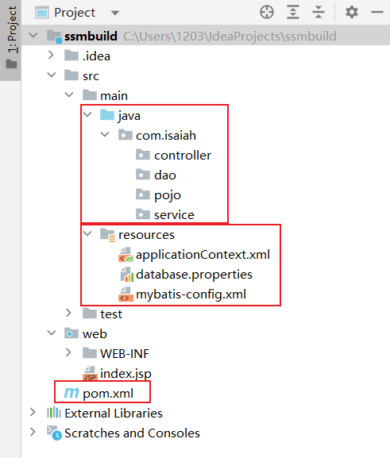
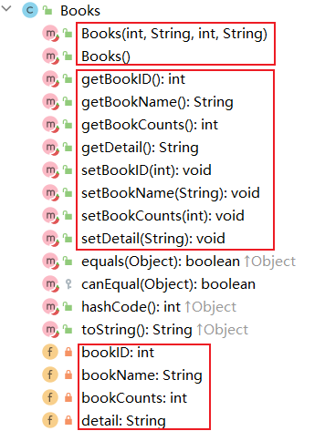
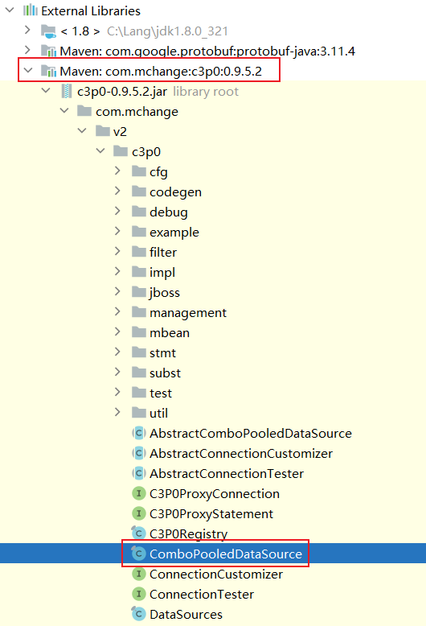
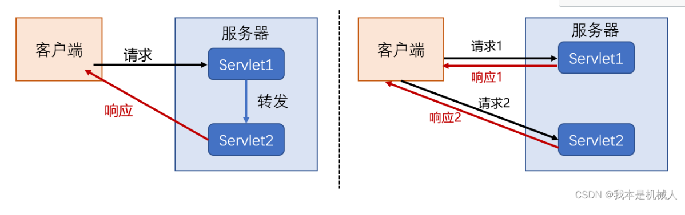
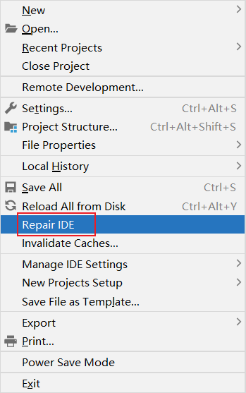
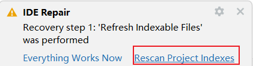

# 1. pom.xml

## 1.1 依赖问题

```xml

    <dependencies>
<!--        junit-->
        <dependency>
            <groupId>junit</groupId>
            <artifactId>junit</artifactId>
            <version>4.13.2</version>
            <scope>test</scope>
        </dependency>
<!--        数据库驱动-->
        <dependency>
            <groupId>mysql</groupId>
            <artifactId>mysql-connector-java</artifactId>
            <version>8.0.32</version>
        </dependency>
<!--        数据库连接池-->
        <dependency>
            <groupId>com.mchange</groupId>
            <artifactId>c3p0</artifactId>
            <version>0.9.5.2</version>
        </dependency>
<!--        servlet-jsp-jstl-->
        <dependency>
            <groupId>javax.servlet</groupId>
            <artifactId>servlet-api</artifactId>
            <version>2.3</version>
        </dependency>
        <dependency>
            <groupId>javax.servlet.jsp</groupId>
            <artifactId>jsp-api</artifactId>
            <version>2.2</version>
        </dependency>
        <dependency>
            <groupId>javax.servlet</groupId>
            <artifactId>jstl</artifactId>
            <version>1.2</version>
        </dependency>
<!--        mybatis-->
        <dependency>
            <groupId>org.mybatis</groupId>
            <artifactId>mybatis</artifactId>
            <version>3.5.2</version>
        </dependency>
        <dependency>
            <groupId>org.mybatis</groupId>
            <artifactId>mybatis-spring</artifactId>
            <version>2.0.2</version>
        </dependency>
<!--        spring-->
        <dependency>
            <groupId>org.springframework</groupId>
            <artifactId>spring-webmvc</artifactId>
            <version>5.1.9.RELEASE</version>
        </dependency>
        <dependency>
            <groupId>org.springframework</groupId>
            <artifactId>spring-jdbc</artifactId>
            <version>5.1.9.RELEASE</version>
        </dependency>
    </dependencies>
```


## 1.2 静态资源导出

```xml
<build>
    <resources>
        <resource>
            <directory>src/main/java</directory>
            <includes>
                <include>**/*.properties</include>
                <include>**/*.xml</include>
            </includes>
            <filtering>false</filtering>
        </resource>
        <resource>
            <directory>src/main/resources</directory>
            <includes>
                <include>**/*.properties</include>
                <include>**/*.xml</include>
            </includes>
            <filtering>false</filtering>
        </resource>
    </resources>
</build>
```


# 2. 项目结构



# 3. 初始化工作

==mybatis-config.xml==

```xml
<?xml version="1.0" encoding="UTF-8" ?>
<!DOCTYPE configuration
        PUBLIC "-//mybatis.org//DTD Config 3.0//EN"
        "https://mybatis.org/dtd/mybatis-3-config.dtd">
<configuration>

</configuration>
```


==applicationContext.xml==

```xml
<?xml version="1.0" encoding="UTF-8"?>
<beans xmlns="http://www.springframework.org/schema/beans"
       xmlns:xsi="http://www.w3.org/2001/XMLSchema-instance"
       xsi:schemaLocation="http://www.springframework.org/schema/beans
        https://www.springframework.org/schema/beans/spring-beans.xsd">

</beans>
```


==database.properties==

**mysql 8.0+ url 连接时区：serverTimeZone=Asia/Shanghai**

```properties
jdbc.driver=com.mysql.jdbc.Driver
jdbc.url=jdbc:mysql://localhost:3306/ssmbuild?useSSL=true&useUnicode=true&characterEncoding=utf8&serverTimeZone=Asia/Shanghai
jdbc.username=root
jdbc.password=123456
```


# 4. MyBatis 层内容

**mybatis-config.xml（为项目中的类添加别名）**

```xml
<typeAliases>
    <package name="com.isaiah.pojo"/>
</typeAliases>
```


**创建类 pojo.Books（属性名与字段名对应）**

```java
public class Books {
    private int bookID;
    private String bookName;
    private int bookCounts;
    private String detail;
}
```


**pom.xml（添加 lombok 依赖）**

```xml
<dependency>
    <groupId>org.projectlombok</groupId>
    <artifactId>lombok</artifactId>
    <version>1.18.26</version>
</dependency>
```


**pojo.Books 中添加注解**

```java
@Data
@NoArgsConstructor
@AllArgsConstructor
```



**dao.BooksMapper 编写 dao 接口**

```java
package com.isaiah.dao;

import com.isaiah.pojo.Books;

import java.util.List;

public interface BooksMapper {
    // 增加一本书
    int addBook(Books book);
    // 删除一本书
    int deleteBookById(int id);
    // 更新一本书
    int updateBook(Books books);
    // 查询一本书
    Books queryBookById(int id);
    // 查询全部的书
    List<Books> queryAllBook();
}
```


**dao.BooksMapper.xml 可以用 mybatis-config.xml 改出来**

```xml
<?xml version="1.0" encoding="UTF-8" ?>
<!DOCTYPE mapper
        PUBLIC "-//mybatis.org//DTD Config 3.0//EN"
        "https://mybatis.org/dtd/mybatis-3-mapper.dtd">
<mapper>
    
</mapper>
```


**dao.BooksMapper.xml 与 dao.BookMapper.java 对照书写**

```xml
<?xml version="1.0" encoding="UTF-8" ?>
<!DOCTYPE mapper
        PUBLIC "-//mybatis.org//DTD Config 3.0//EN"
        "https://mybatis.org/dtd/mybatis-3-mapper.dtd">
<mapper namespace="com.isaiah.dao.BooksMapper">
    <insert id="addBook" parameterType="Books">
        insert into ssmbuild.books (bookName, bookCounts, detail)
        values (#{bookName}, #{bookCounts}, #{detail});
    </insert>

    <delete id="deleteBookById" parameterType="int">
        delete from ssmbuild.books
               where bookID = #{bookId};
    </delete>

    <update id="updateBook" parameterType="Books">
        update ssmbuild.books
        set bookName = #{bookName}, bookCounts = #{bookCounts}, detail = #{detail}
        where bookID = #{books.bookID};
    </update>

    <select id="queryBookById" resultType="Books">
        select * from ssmbuild.books
                 where bookID = #{bookId};
    </select>

    <select id="queryAllBooks" resultType="Books">
        select * from ssmbuild.books;
    </select>
</mapper>
```

```java
int deleteBookById(@Param("bookId") int id);
Books queryBookById(@Param("bookId") int id);
```


**mybatis-config.xml 中注册 mapper**

```xml
<mappers>
    <mapper class="com.isaiah.dao.BooksMapper"/>
</mappers>
```


**service.BooksService 使用之前 dao.BooksMapper 的代码**

```java
 package com.isaiah.service;

import com.isaiah.pojo.Books;

import java.util.List;

public interface BooksService {
    // 增加一本书
    int addBook(Books book);
    // 删除一本书
    int deleteBookById(int id);
    // 更新一本书
    int updateBook(Books books);
    // 查询一本书
    Books queryBookById(int id);
    // 查询全部的书
    List<Books> queryAllBook();
}
```


**编写业务层的实现类 service.BooksServiceImpl**

```java
package com.isaiah.service;

import com.isaiah.dao.BooksMapper;
import com.isaiah.pojo.Books;

import java.util.List;

public class BooksServiceImpl implements BooksService {
    // 业务层调用 dao 层：组合 dao
    private BooksMapper booksMapper;

    public BooksMapper getBooksMapper() {
        return booksMapper;
    }

    public void setBooksMapper(BooksMapper booksMapper) {
        this.booksMapper = booksMapper;
    }

    @Override
    public int addBook(Books book) {
        return booksMapper.addBook(book);
    }

    @Override
    public int deleteBookById(int id) {
        return booksMapper.deleteBookById(id);
    }

    @Override
    public int updateBook(Books books) {
        return booksMapper.updateBook(books);
    }

    @Override
    public Books queryBookById(int id) {
        return booksMapper.queryBookById(id);
    }

    @Override
    public List<Books> queryAllBook() {
        return booksMapper.queryAllBooks();
    }
}
```


# 5. Spring 层内容

## 5.1 Spring 整合 dao 层

==resources.spring-dao.xml==

```xml
<?xml version="1.0" encoding="UTF-8"?>
<beans xmlns="http://www.springframework.org/schema/beans"
       xmlns:xsi="http://www.w3.org/2001/XMLSchema-instance"
       xmlns:context="http://www.springframework.org/schema/context"
       xsi:schemaLocation="http://www.springframework.org/schema/beans
        https://www.springframework.org/schema/beans/spring-beans.xsd
        http://www.springframework.org/schema/context
        http://www.springframework.org/schema/context/spring-context.xsd">
<!--    1. 关联数据库配置文件-->
    <context:property-placeholder location="classpath:database.properties"/>
    
    
<!--    2. 连接池 dbcp 半自动化操作，不能自动连接
                 c3p0 自动化操作（自动化地加载配置文件，并且可以自动设置到对象中）
                 druid null：hikari null-->
    <bean id="dataSource" class="com.mchange.v2.c3p0.ComboPooledDataSource">
        <property name="driverClass" value="${jdbc.driver}"/>
        <property name="jdbcUrl" value="${jdbc.url}"/>
        <property name="user" value="${jdbc.username}"/>
        <property name="password" value="${jdbc.password}"/>
    </bean>
    
    
<!--    3. sqlSessionFactory-->
    <bean id="sqlSessionFactory" class="org.mybatis.spring.SqlSessionFactoryBean">
<!--        引入数据源-->
        <property name="dataSource" ref="dataSource"/>
<!--        绑定 MyBatis 的配置文件-->
        <property name="configLocation" value="classpath:mybatis-config.xml"/>
    </bean>
    
    
<!--    4. 配置 dao 接口扫描包，动态地实现了 dao 接口可以注入到 spring 容器中-->
    <bean class="org.mybatis.spring.mapper.MapperScannerConfigurer">
<!--        注入 sqlSessionFactory-->
        <property name="sqlSessionFactoryBeanName" value="sqlSessionFactory"/>
<!--        要扫描的 dao 包-->
        <property name="basePackage" value="com.isaiah.dao"/>
    </bean>
</beans>
```





## 5.2 Spring 整合 service 层

==resources.spring-service.xml==

```xml
<?xml version="1.0" encoding="UTF-8"?>
<beans xmlns="http://www.springframework.org/schema/beans"
       xmlns:xsi="http://www.w3.org/2001/XMLSchema-instance"
       xmlns:context="http://www.springframework.org/schema/context"
       xsi:schemaLocation="http://www.springframework.org/schema/beans
        https://www.springframework.org/schema/beans/spring-beans.xsd
        http://www.springframework.org/schema/context
        http://www.springframework.org/schema/context/spring-context.xsd">
<!--   1. 扫描service下的包-->
    <context:component-scan base-package="com.isaiah.service"/>
<!--    2. 将我们的所有业务类注入到Spring，可以通过配置或注解实现-->
    <bean id="bookServiceImpl" class="com.isaiah.service.BooksServiceImpl">
        <property name="booksMapper" ref="booksMapper"/>
    </bean>
<!--    3. 声明式事务配置-->
    <bean id="transactionManager" class="org.springframework.jdbc.datasource.DataSourceTransactionManager">
<!--        注入数据源-->
        <property name="dataSource" ref="dataSource"/>
    </bean>
<!--    4. aop事务支持-->
</beans>
```


==resources.applicationContext.xml== 注意：booksMapper 是别的配置文件中配置的内容，想要使用需要进行整合操作

```xml
<import resource="classpath:spring-dao.xml"/>
<import resource="classpath:spring-service.xml"/>
```


# 6. SpringMVC 层内容

## 6.1 dispatcherServlet && filter && session

==web.WEB-INF.web.xml==

```xml
<?xml version="1.0" encoding="UTF-8"?>
<web-app xmlns="http://xmlns.jcp.org/xml/ns/javaee"
         xmlns:xsi="http://www.w3.org/2001/XMLSchema-instance"
         xsi:schemaLocation="http://xmlns.jcp.org/xml/ns/javaee http://xmlns.jcp.org/xml/ns/javaee/web-app_4_0.xsd"
         version="4.0">
<!--    DispatcherServlet-->
    <servlet>
        <servlet-name>springmvc</servlet-name>
        <servlet-class>org.springframework.web.servlet.DispatcherServlet</servlet-class>
        <init-param>
            <param-name>contextConfigLocation</param-name>
            <param-value>classpath:applicationContext.xml</param-value>
        </init-param>
<!--        与tomcat一起启动-->
        <load-on-startup>1</load-on-startup>
    </servlet>
    <servlet-mapping>
        <servlet-name>springmvc</servlet-name>
        <url-pattern>/</url-pattern>
    </servlet-mapping>

<!--    乱码过滤-->
    <filter>
        <filter-name>encodingFilter</filter-name>
        <filter-class>org.springframework.web.filter.CharacterEncodingFilter</filter-class>
        <init-param>
            <param-name>encoding</param-name>
            <param-value>UTF-8</param-value>
        </init-param>
    </filter>
    <filter-mapping>
        <filter-name>encodingFilter</filter-name>
        <url-pattern>/*</url-pattern>
    </filter-mapping>

<!--    Session过期时间(分钟)-->
    <session-config>
        <session-timeout>15</session-timeout>
    </session-config>
</web-app>
```


## 6.2 注解驱动 && 静态资源过滤 && 扫描controller && 视图解析器

==resources.spring-mvc.xml==

```xml
<?xml version="1.0" encoding="UTF-8" ?>
<beans xmlns="http://www.springframework.org/schema/beans"
       xmlns:xsi="http://www.w3.org/2001/XMLSchema-instance" xmlns:mvc="http://www.springframework.org/schema/mvc"
       xmlns:context="http://www.springframework.org/schema/context"
       xsi:schemaLocation="http://www.springframework.org/schema/beans
        http://www.springframework.org/schema/beans/spring-beans.xsd
        http://www.springframework.org/schema/mvc
        http://www.springframework.org/schema/mvc/spring-mvc.xsd
        http://www.springframework.org/schema/context
        http://www.springframework.org/schema/context/spring-context.xsd">
<!--    1. 注解驱动-->
    <mvc:annotation-driven/>
<!--    2. 静态资源过滤-->
    <mvc:default-servlet-handler/>
<!--    3. 扫描包：controller-->
    <context:component-scan base-package="com.isaiah.controller"/>
<!--    4. 视图解析器-->
    <bean class="org.springframework.web.servlet.view.InternalResourceViewResolver">
        <property name="prefix" value="/WEB-INF/jsp/"/>
        <property name="suffix" value=".jsp"/>
    </bean>
</beans>
```


# 7. 查询书籍功能

## 7.1 Controller

==controller.BooksController==

```java
package com.isaiah.controller;

import com.isaiah.pojo.Books;
import com.isaiah.service.BooksService;
import org.springframework.beans.factory.annotation.Autowired;
import org.springframework.beans.factory.annotation.Qualifier;
import org.springframework.stereotype.Controller;
import org.springframework.ui.Model;
import org.springframework.web.bind.annotation.RequestMapping;

import java.util.List;

@Controller
@RequestMapping("/book")
public class BooksController {
    // controller 调用 service 层
    @Autowired
    @Qualifier("booksServiceImpl")
    private BooksService booksService;

    // 查询全部的书籍，并且返回到书籍展示页面
    @RequestMapping("/allBooks")
    public String list(Model model) {
        List<Books> books = booksService.queryAllBook();
        model.addAttribute("list", books);
        return "allBooks";
    }
}
```


## 7.2 前端页面

==index.jsp==

```jsp
<%@ page contentType="text/html;charset=UTF-8" language="java" %>
<html>
  <head>
    <title>首页</title>
    <style>
      a {
        text-decoration: none;
        color: black;
        font-size: 9rem;
      }
      div {
        width: 80rem;
        height: 10rem;
        margin: 20rem auto;
        text-align: center;
        line-height: 10rem;
        background: deepskyblue;
        /*border-radius: 20px;*/
      }
    </style>
  </head>
  <body>
  <div>
    <a href="${pageContext.request.contextPath}/book/allBooks">进入库存书籍页面</a>
  </div>
  </body>
</html>

```


==jsp.allBooks==

```jsp
<%@ taglib prefix="c" uri="http://java.sun.com/jsp/jstl/core" %>
<%@ page contentType="text/html;charset=UTF-8" language="java" %>
<html>
<head>
    <title>库存书籍</title>
<%--    bootStrap 美化界面--%>
    <link href="https://cdn.bootcdn.net/ajax/libs/twitter-bootstrap/3.4.1/css/bootstrap.css" rel="stylesheet">

</head>
<body>
<div class="container">
    <div class="row">
        <!-- 标题 -->
        <div class="col-md-12">
            <div class="page-header">
                <h1>
                    <small>书籍列表——显示所有的书籍</small>
                </h1>
            </div>
        </div>
        
        <!-- 新増书籍按钮 -->
        <div class="col-md-9">
            <a class="btn btn-primary" href="${pageContext.request.contextPath}/book/toAddBook">新増书籍</a>
        </div>
        
        <!-- 列表标题，列表内容，jstl取出内容 -->
        <div class="col-md-12">
            <table class="table table-hover table-striped">
                <thread>
                    <tr>
                        <th>书籍编号</th>
                        <th>书籍名称</th>
                        <th>书籍数量</th>
                        <th>书籍详情</th>
                    </tr>
                </thread>
                <%--                书籍从数据库中查询出来，从list遍历出来--%>
                <tbody>
                <c:forEach var="book" items="${list}">
                    <tr>
                        <td>${book.bookID}</td>
                        <td>${book.bookName}</td>
                        <td>${book.bookCounts}</td>
                        <td>${book.detail}</td>
                    </tr>
                </c:forEach>
                </tbody>
            </table>
        </div>
    </div>
</div>

</body>
</html>
```


# 8. 添加书籍功能

处理 `/book/toAddBook` 请求，跳转到 `/book/addBook` 页面

处理 `/book/addBook` 请求，重定向到 `/book/allBooks` 页面

```java
// 跳转到增加书籍页面
@RequestMapping("/toAddBook")
public String toAddBook() {
    return "addBook";
}

// 添加书籍的请求
@RequestMapping("/addBook")
public String addBooks(Books books) {
    System.out.println("addBook=>" + books);
    booksService.addBook(books);
    return "redirect:/book/allBooks";
}
```

、

allBooks.jsp 添加新増书籍按钮

```jsp
<div class="row">
    <div class="col-md-4">
        <a class="btn btn-primary" href="${pageContext.request.contextPath}/book/toAddBook">新増书籍</a>
    </div>
</div>
```


==jsp.addBook== 提交到 `/book/addBook`

表单为空，禁止提交 = required

name 属性必须与数据库的属性，实体类的属性对应

```jsp
<%@ page contentType="text/html;charset=UTF-8" language="java" %>
<html>
<head>
    <title>Title</title>
    <%--    bootStrap 美化界面--%>
    <link href="https://cdn.bootcdn.net/ajax/libs/twitter-bootstrap/3.4.1/css/bootstrap.min.css" rel="stylesheet">
</head>
<body>
<div class="container">
    <div class="row">
        <div class="col-md-12">
            <div class="page-header">
                <h1>
                    <small>新増书籍</small>
                </h1>
            </div>
        </div>

        <form action="${pageContext.request.contextPath}/book/addBook" method="post" class="col-md-12">
            <div class="form-group">
                <label for="bkname">书籍名称：</label>
                <input type="text" name="bookName" class="form-control" id="bkname" required>
            </div>
            <div class="form-group">
                <label for="bkcounts">书籍数量：</label>
                <input type="text" name="bookCounts" class="form-control" id="bkcounts" required>
            </div>
            <div class="form-group">
                <label for="bkdetail">书籍描述：</label>
                <input type="text" name="detail" class="form-control" id="bkdetail" required>
            </div>
            <div class="form-group">
                <input type="submit" class="btn btn-primary col-md-12" value="添加">
            </div>
        </form>
    </div>
</div>

</body>
</html>
```


结果：addBook=>Books(bookID=0, bookName=java-test, bookCounts=123, detail=good)


# 9. 修改/删除书籍功能

处理 `/book/toUpdateBook` 请求，跳转到 `/book/updateBook` 页面（普通风格，RestFul风格）

```jsp
<c:forEach var="book" items="${list}">
    <tr>
        <td>${book.bookID}</td>
        <td>${book.bookName}</td>
        <td>${book.bookCounts}</td>
        <td>${book.detail}</td>
        <td>
            <a href="${pageContext.request.contextPath}/book/toUpdateBook?id=${book.bookID}">修改</a>
            &nbsp; | &nbsp;
            <a href="${pageContext.request.contextPath}/book/deleteBook/${book.bookID}">删除</a>
        </td>
    </tr>
</c:forEach>
```


处理 `/book/updateBook` 请求，重定向到 `/book/allBooks` 页面

点击==修改|删除==后，跳到的页面要有当前的信息，使用 model 传递 id2book 键值对

```java
// 跳转到修改页面
@RequestMapping("/toUpdateBook")
public String toUpdateBook(int id, Model model) {
    Books book = booksService.queryBookById(id);
    model.addAttribute("id2book", book);
    return "updateBook";
}

// 修改书籍
@RequestMapping("/updateBook")
public String updateBook(Books book) {
    System.out.println("updateBook=>" + book);
    booksService.updateBook(book);
    return "redirect:/book/allBooks";
}

// 删除书籍（RestFul风格）
@RequestMapping("/deleteBook/{bookID}")
public String deleteBook(@PathVariable("bookID") int id) {
    booksService.deleteBookById(id);
    return "redirect:/book/allBooks";
}
```


==jsp.updateBook==

提供修改页面 `/book/toUpdateBook?id=#`

取出 id2book 键值对，预填写相关的信息

逻辑上不能更改 bookId，所以没有列在页面上，但是前端需要传 bookID 给后端

针对 bookID 完成 SQL 命令

```xml
<%@ page contentType="text/html;charset=UTF-8" language="java" %>
<html>
<head>
    <title>修改书籍</title>
  <%--    bootStrap 美化界面--%>
  <link href="https://cdn.bootcdn.net/ajax/libs/twitter-bootstrap/3.4.1/css/bootstrap.min.css" rel="stylesheet">
</head>
<body>
<div class="container">
  <div class="row">
    <div class="col-md-12">
      <div class="page-header">
        <h1>
          <small>修改书籍</small>
        </h1>
      </div>
    </div>

    <form action="${pageContext.request.contextPath}/book/updateBook" method="post" class="col-md-12">
      <input type="hidden" name="bookID" value="${id2book.bookID}"/>
      <div class="form-group">
        <label for="bkname">书籍名称：</label>
        <input type="text" name="bookName" class="form-control" id="bkname" value="${id2book.bookName}" required>
      </div>
      <div class="form-group">
        <label for="bkcounts">书籍数量：</label>
        <input type="text" name="bookCounts" class="form-control" id="bkcounts" value="${id2book.bookCounts}" required>
      </div>
      <div class="form-group">
        <label for="bkdetail">书籍描述：</label>
        <input type="text" name="detail" class="form-control" id="bkdetail" value="${id2book.detail}" required>
      </div>
      <div class="form-group">
        <input type="submit" class="btn btn-primary col-md-12" value="修改">
      </div>
    </form>
  </div>
</div>

</body>
</html>
```


# 10. 搜索功能

==dao.BooksMapper==

```java
// 通过书名查询书籍
List<Books> queryBooksByName(@Param("bookName") String bookName);
```

==dao.BooksMapper.xml==

如果查询的字符串为空或null就返回空列表

```xml
<select id="queryBooksByName" resultType="Books">
    select * from ssmbuild.books
    where bookName like concat('%', #{bookName}, '%')
    <if test="bookName == null or bookName == ''"> and false </if>
</select>
```

==service.BooksService==

```java
// 通过书名查询书籍
List<Books> queryBooksByName(String bookName);
```

==service.BooksServiceImpl==

```java
@Override
public List<Books> queryBooksByName(String bookName) {
    return booksMapper.queryBooksByName(bookName);
}
```

==controller.BooksController==

如果sql的结果是空列表（也就是查询失败），就打印出所有的库存书籍，同时提示没查到书籍

如果sql的结果不是空列表，就列出查询的结果

```java
 // 查询书籍
@RequestMapping("/queryBook")
public String queryBook(String queryBookName, Model model) {
    List<Books> books = booksService.queryBooksByName(queryBookName);
    System.err.println("books=> " + books);
    if (books.isEmpty()) {
        model.addAttribute("list", booksService.queryAllBook());
        model.addAttribute("error", "抱歉！没查到");
    } else {
        model.addAttribute("list", books);
    }
    return "allBooks";
}
```


# 11. 可能出现的问题

## 11.1 idea 没有及时建立文件之间的数据依赖






## 11.2 一个或多个筛选器启动失败

原因是 idea 在 Artifacts 中没有在 lib 文件夹下导入相应的包

解决方法：手动导入依赖的包


##  11.3 sql 查询显示参数为null

要注意mapper的参数名是否对应

要注意前端传值的name与controller接收值的参数名是否对应


## 11.4 jsp 中使用 if...else

To simulate **if** , you can use:

```jsp
<c:if test="condition"></c:if>
```

To simulate **if...else**, you can use:

```jsp
<c:choose>
    <c:when test="${param.enter=='1'}">
        pizza. 
        <br />
    </c:when>    
    <c:otherwise>
        pizzas. 
        <br />
    </c:otherwise>
</c:choose>
```

动态选择 placeholder 的值：

```jsp
<input type="text" name="queryBookName" class="form-control" placeholder=
            <c:choose>
                <c:when test="${error != null}">
                    "${error}"
                </c:when>
                <c:otherwise>
                    "请输入要查询的书籍名称"
                </c:otherwise>
            </c:choose>
/>
```
