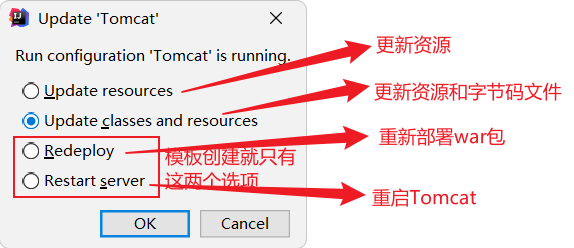
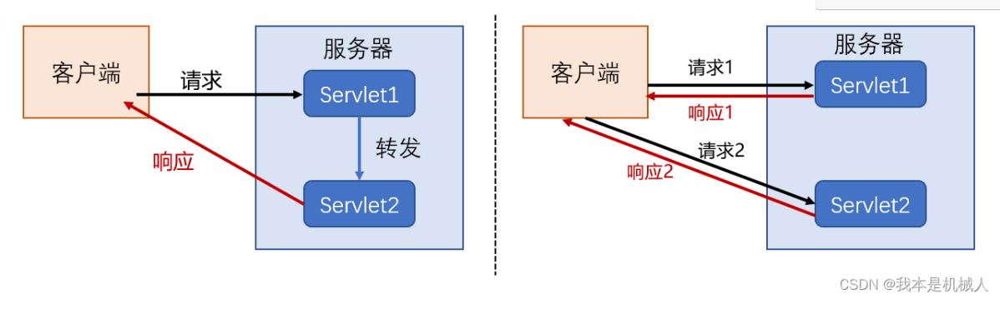
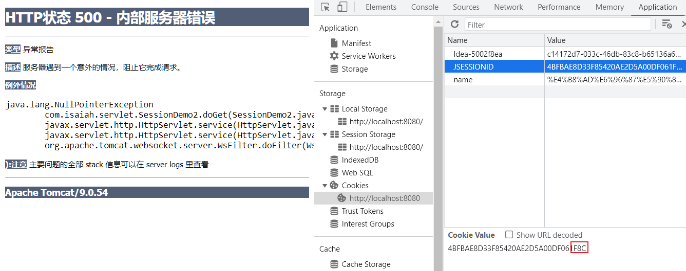

# 1. 准备工作

## 1.1 hello word 中文乱码

响应解码为 utf-8

```java
response.setContentType("text/html");
response.setCharacterEncoding("utf-8");
```

## 1.2 maven 依赖

javax.servlet-api `java 扩展包`

```xml
<dependency>
    <groupId>javax.servlet</groupId>
    <artifactId>javax.servlet-api</artifactId>
    <version>3.1.0</version>
    <scope>provided</scope>
</dependency>
```

## 1.3 Tomcat 设置


## 1.4 IDEA 创建maven 项目

没有勾选模板，普通的maven 项目如何添加WEB 功能？

**添加框架支持**


**添加WEB 应用支持**


和最开始选择模板进行创建不同，之中方式生成的**web 文件夹并不在resources 文件夹下面，而是与src 文件夹并列**

推荐使用提供的模板进行创建，更加正规


模板创建和后面添加框架支持的不同还体现在**Tomcat 的功能选项**上

**resources**：指的是HTML，JS，CSS 等静态的资源

**classes**：指的是Java，jsp等需要部署的，提供动态功能的部分（访问页面->jsp编译为java编译为class）

**修改了web.xml 就要重启Tomcat 以应用更改**



# 2. 请求转发

```java
package com.isaiah;

import javax.servlet.ServletContext;
import javax.servlet.ServletException;
import javax.servlet.http.HttpServlet;
import javax.servlet.http.HttpServletRequest;
import javax.servlet.http.HttpServletResponse;
import java.io.IOException;

public class SetServlet extends HttpServlet {
    @Override
    protected void doGet(HttpServletRequest req, HttpServletResponse resp) throws ServletException, IOException {
        ServletContext servletContext = this.getServletContext();
        servletContext.setAttribute("username", "isaiah");

        // 获得初始化参数
        String url = servletContext.getInitParameter("url");
        resp.getWriter().print(url);

        // 请求转发
        resp.getWriter().print("enter SetUserName");
        servletContext.getRequestDispatcher("/getUserName").forward(req, resp);
    }

    @Override
    protected void doPost(HttpServletRequest req, HttpServletResponse resp) throws ServletException, IOException {
        doGet(req, resp);
    }
}
```

```java
package com.isaiah;

import javax.servlet.ServletContext;
import javax.servlet.ServletException;
import javax.servlet.http.HttpServlet;
import javax.servlet.http.HttpServletRequest;
import javax.servlet.http.HttpServletResponse;
import java.io.IOException;

public class GetServlet extends HttpServlet {
    @Override
    protected void doGet(HttpServletRequest req, HttpServletResponse resp) throws ServletException, IOException {
        ServletContext servletContext = this.getServletContext();
        String username = (String) servletContext.getAttribute("username");
        resp.getWriter().print("username = " + username);
    }

    @Override
    protected void doPost(HttpServletRequest req, HttpServletResponse resp) throws ServletException, IOException {
        doGet(req, resp);
    }
}
```


```java
// 请求转发，从 "/setUserName"转发到 "/getUserName" 直接打印出 username = isaiah
servletContext.getRequestDispatcher("/getUserName").forward(req, resp);
```

```xml
<servlet>
    <servlet-name>setUserName</servlet-name>
    <servlet-class>com.isaiah.SetServlet</servlet-class>
</servlet>
<servlet-mapping>
    <servlet-name>setUserName</servlet-name>
    <url-pattern>/setUserName</url-pattern>
</servlet-mapping>

<servlet>
    <servlet-name>getUserName</servlet-name>
    <servlet-class>com.isaiah.GetServlet</servlet-class>
</servlet>
<servlet-mapping>
    <servlet-name>getUserName</servlet-name>
    <url-pattern>/getUserName</url-pattern>
</servlet-mapping>
```




# 3. ServletContext

```java
// 获得初始化参数
String url = servletContext.getInitParameter("url");
resp.getWriter().print(url);
```

```xml
<context-param>
    <param-name>url</param-name>
    <param-value>jdbc:mysql://localhost:3306/isaiah?useSSL=false</param-value>
</context-param>
```


# 4. HttpServletResponse 应用


## 4.1 文件下载

```java
package com.isaiah;

import javax.servlet.ServletException;
import javax.servlet.ServletOutputStream;
import javax.servlet.http.HttpServlet;
import javax.servlet.http.HttpServletRequest;
import javax.servlet.http.HttpServletResponse;
import java.io.FileInputStream;
import java.io.IOException;

public class FileServlet extends HttpServlet {
    @Override
    protected void doGet(HttpServletRequest req, HttpServletResponse resp) throws ServletException, IOException {
        // 设置文件路径和下载文件的文件名
        String filePath = "D:\\PICTURE\\19luca.jpg";
        String fileName = filePath.substring(filePath.lastIndexOf("\\")+1);
        // 下载文件的文件输入流
        FileInputStream fileInputStream = new FileInputStream(filePath);

        // 设置响应头
        resp.setHeader("Content-Disposition", "attachment; filename=" + fileName);
        // 创建输出流对象
        ServletOutputStream outputStream = resp.getOutputStream();
        // 文件输入流写入到buffer，输出流将缓冲区中的数据输出到客户端
        byte[] buffer = new byte[1024];
        while (fileInputStream.read(buffer) > 0){
            outputStream.write(buffer, 0, buffer.length);
        }

        fileInputStream.close();
        outputStream.close();
    }

    @Override
    protected void doPost(HttpServletRequest req, HttpServletResponse resp) throws ServletException, IOException {
        doGet(req, resp);
    }
}

```

```xml
<servlet>
    <servlet-name>down</servlet-name>
    <servlet-class>com.isaiah.FileServlet</servlet-class>
</servlet>
<servlet-mapping>
    <servlet-name>down</servlet-name>
    <url-pattern>/down</url-pattern>
</servlet-mapping>
```


## 4.2 验证码

```java
package com.isaiah;

import javax.imageio.ImageIO;
import javax.servlet.ServletException;
import javax.servlet.http.HttpServlet;
import javax.servlet.http.HttpServletRequest;
import javax.servlet.http.HttpServletResponse;
import java.awt.*;
import java.awt.image.BufferedImage;
import java.io.IOException;
import java.util.Random;

public class ImageServlet extends HttpServlet {
    @Override
    protected void doGet(HttpServletRequest req, HttpServletResponse resp) throws ServletException, IOException {
        // 1 second 1 F5
        resp.setHeader("refresh", "1");
        // create an image in buffer
        BufferedImage image = new BufferedImage(80, 20, BufferedImage.TYPE_INT_RGB);
        // draw picture
        Graphics2D g = (Graphics2D) image.getGraphics();
        // white rectangle be the background
        g.setColor(Color.white);
        g.fillRect(0,0,80,20);
        // write string on the white rectangle
        g.setColor(Color.blue);
        g.setFont(new Font(null, Font.BOLD, 20));
        g.drawString(makeNum(), 0, 20);
        // set response
        resp.setContentType("image/jpeg");
        // no browser buffer
//        resp.setDateHeader("expires", -1);
//        resp.setHeader("Cache-Control", "no-cache");
//        resp.setHeader("Pragma", "no-cache");
        // write image back to browser
        ImageIO.write(image, "jpg", resp.getOutputStream());
    }

    private String makeNum() {
        Random random = new Random();
        String num = random.nextInt(9999999) + "";
        StringBuilder sb = new StringBuilder();
        sb.append(num);
        for (int i = 0; i < 7 - num.length(); i++) {
            sb.append("0");
        }
        return sb.toString();
    }

    @Override
    protected void doPost(HttpServletRequest req, HttpServletResponse resp) throws ServletException, IOException {
        doGet(req, resp);
    }
}

```

```xml
<servlet>
    <servlet-name>image</servlet-name>
    <servlet-class>com.isaiah.ImageServlet</servlet-class>
</servlet>
<servlet-mapping>
    <servlet-name>image</servlet-name>
    <url-pattern>/img</url-pattern>
</servlet-mapping>
```


## 4.3 重定向

```java
package com.isaiah;

import javax.servlet.ServletException;
import javax.servlet.http.HttpServlet;
import javax.servlet.http.HttpServletRequest;
import javax.servlet.http.HttpServletResponse;
import java.io.IOException;

public class RedirectServlet extends HttpServlet {
    @Override
    protected void doGet(HttpServletRequest req, HttpServletResponse resp) throws IOException {
        /*
        resp.setHeader("Location", "/aaa/img");
        resp.setStatus(302);
         */
        resp.sendRedirect("/aaa/img"); // 重定向
    }

    @Override
    protected void doPost(HttpServletRequest req, HttpServletResponse resp) throws ServletException, IOException {
        doGet(req, resp);
    }
}

```


## 4.4 重定向和转发的区别

**相同点：**

+ 页面都会跳转

**不同点：**

+ 请求转发的时候url不会变化 **307**
+ 重定向的时候url会发生变化 **302**


# 5. HttpServletRequest 应用

HttpServletRequest 代表浏览器的请求，用户通过HTTP 协议访问服务器即HTTP请求

HTTP 请求中的所有信息都会被封装到HttpServletRequest 中，我们可以通过 HttpServletRequest 的方法获得浏览器的所有信息


## 5.1 登陆操作

在浏览器上输入信息，提交信息，生成请求。服务端接收到请求，解析请求中的信息。***顺便复习了一下请求转发***

```java
package com.isaiah;

import javax.servlet.ServletException;
import javax.servlet.http.HttpServlet;
import javax.servlet.http.HttpServletRequest;
import javax.servlet.http.HttpServletResponse;
import java.io.IOException;
import java.util.Arrays;

public class LoginServlet extends HttpServlet {
    @Override
    protected void doGet(HttpServletRequest req, HttpServletResponse resp) throws ServletException, IOException {
        // 解决后台中文乱码
        req.setCharacterEncoding("UTF-8");      // 将发来的请求信息编码为UTF-8

        String username = req.getParameter("username");
        String password = req.getParameter("password");
        String[] hobbies = req.getParameterValues("hobby");
        System.out.println("----------------------------------");
        System.out.println(username);
        System.out.println(password);
        System.out.println(Arrays.toString(hobbies));
        System.out.println("----------------------------------");

        // 请求转发
        req.getRequestDispatcher("/success.html").forward(req, resp);
    }

    @Override
    protected void doPost(HttpServletRequest req, HttpServletResponse resp) throws ServletException, IOException {
        doGet(req, resp);
    }
}

```

```jsp
<%@ page contentType="text/html;charset=UTF-8" language="java" %>
<html>
<head>
    <title>Login</title>
</head>
<body>
    <h1>登陆</h1>
    <div style="text-align: center">
<%--        post 方式提交表单--%>
        <form action="${pageContext.request.contextPath}/login" method="post">
            用户名：<input type="text" name="username"> <br>
            密 码：<input type="password" name="password"> <br>
            爱 好：
            <input type="checkbox" name="hobby" value="女孩子">女孩子
            <input type="checkbox" name="hobby" value="少女">少女
            <input type="checkbox" name="hobby" value="女生">女生
            <input type="checkbox" name="hobby" value="女子">女子
            <input type="checkbox" name="hobby" value="妇人">妇人 <br>
            <input type="submit">
        </form>
    </div>

</body>
</html>

```

```jsp
<meta charset="UTF-8">
<html>
<head>
    <title>Login_OK</title>
</head>
<body>
<h1>登陆成功！</h1>
</body>
</html>

```


# 6. Cookie & Session


## 6.1 会话的概念

**会话：**用户打开一个浏览器，访问多个WEB资源，关闭浏览器，这个过程称之为会话

**有状态会话：**一个同学来过教室，下次再来这个教室，我们就会知道这个同学曾经来过

> 如何证明某人是某学校的学生

发票：给学生开一个发票

学校登记：学校标记某学生来过

> 网站怎么证明某人访问过

服务端给浏览器一个信件，浏览器下次带上信件访问就可以了 **cookie**

服务器登记你来过了，下次来的时候进行匹配 **session**


## 6.2 保存会话的两种技术

**cookie**

+ 客户端技术（响应，请求）

**session**

+ 服务端技术，利用这个技术可以保存用户的会话信息，我们可以把信息放在session中

**常见应用**

+ 网站登陆之后，下次就不用登陆了


## 6.3 Cookie


### 6.3.1 Cookie 的基本操作

```java
import javax.servlet.ServletException;
import javax.servlet.http.Cookie;
import javax.servlet.http.HttpServlet;
import javax.servlet.http.HttpServletRequest;
import javax.servlet.http.HttpServletResponse;
import java.io.IOException;
import java.io.PrintWriter;
import java.util.Date;

// 保存用户上一次访问的时间
public class CookieDemo1 extends HttpServlet {
    @Override
    protected void doGet(HttpServletRequest req, HttpServletResponse resp) throws ServletException, IOException {
        // 解决中文乱码问题
        req.setCharacterEncoding("utf-16");
        resp.setCharacterEncoding("utf-16");

        PrintWriter writer = resp.getWriter();

        // 从客户端（浏览器）获取 cookies
        Cookie[] cookies = req.getCookies();

        if (cookies != null) {
            writer.write("上一次访问的时间是：");
            for (Cookie cookie : cookies) {
                if ("lastLoginTime".equals(cookie.getName())) {
                    long lastLoginTime = Long.parseLong(cookie.getValue());
                    Date date = new Date(lastLoginTime);
                    writer.write(date.toLocaleString());
                }
            }
            // else 访问不到，因为一直有各种默认的cookies
        } else {
            writer.write("这是第一次访问本站");
        }

        // 服务端给浏览器（响应）一个 cookie
        Cookie cookie = new Cookie("lastLoginTime", System.currentTimeMillis()+"");
        resp.addCookie(cookie);
    }

    @Override
    protected void doPost(HttpServletRequest req, HttpServletResponse resp) throws ServletException, IOException {
        doGet(req, resp);
    }
}

```

**第一次访问**的时候没有key 为lastLoginTime 的cookie，服务器给浏览器响应了一个cookie 作为下次访问的凭证（附加信息）：


**第二次访问**的时候就有了服务器响应的lastLoginTime 信息（上一次的current，这一次的lastTime）输出上一次访问的时间：


可以看到上次访问记录到的访问时间**1673513168424**正是这一次的输出

根据cookie 技术可以储存访问时间，并在下一次访问时输出cookie 所存储的内容


如果**关闭浏览器**再访问url，就会发现cookie 不见了，因为会话结束了


设置cookie 的存留时间

```java
cookie.setMaxAge(24*60*60);
```


在**关闭浏览器**之后，cookie 依然存在着，在响应里面记录着到期的时间

```java
Cookie[] cookies = new req.getCookies();   // 获得cookie
cookie.getName();   // 获得cookie 中的key
cookie.getValue();   // 获得cookie 中的value
new Cookie("#1", "123435663");   // 新建一个cookie
cookie.setMaxAge(3);   // 设置cookie 的有效期（3秒）
resp.addCookie(cookie);   // 响应给浏览器一个cookie
```

**Chrome的Cookie数据**位于：**%LOCALAPPDATA%\Google\Chrome\User Data\Default\Network** 目录中，名为Cookies的文件


### 6.3.2 关于cookie 的极限问题

+ 一个cookie 只能保存一条信息<key, value>
+ 一个域名可以给浏览器发送多个cookie，有最多存放的限制
+ cookie 大小有限制 4KB


### 6.3.3 Cookie 的删除

+ 不设置有效期，关闭浏览器即自动失效（如上）
+ 设置有效期时间为 0（如下）

```java
import javax.servlet.ServletException;
import javax.servlet.http.Cookie;
import javax.servlet.http.HttpServlet;
import javax.servlet.http.HttpServletRequest;
import javax.servlet.http.HttpServletResponse;
import java.io.IOException;

public class CookieDemo2 extends HttpServlet {
    @Override
    protected void doGet(HttpServletRequest req, HttpServletResponse resp) throws ServletException, IOException {
        // 新建与欲删除cookie 同名的cookie
        Cookie cookie = new Cookie("lastLoginTime", "");
        // 设定其有效期为0
        cookie.setMaxAge(0);
        resp.addCookie(cookie);
    }

    @Override
    protected void doPost(HttpServletRequest req, HttpServletResponse resp) throws ServletException, IOException {
        doGet(req, resp);
    }
}

```


###  6.3.4 中文信息的传递

一般来讲，在网络传输中会出现乱码的问题，所以要对传输的字符串进行编码解码的操作

```java
import javax.servlet.ServletException;
import javax.servlet.http.Cookie;
import javax.servlet.http.HttpServlet;
import javax.servlet.http.HttpServletRequest;
import javax.servlet.http.HttpServletResponse;
import java.io.IOException;
import java.io.PrintWriter;
import java.net.URLDecoder;
import java.net.URLEncoder;

public class CookieDemo3 extends HttpServlet {
    @Override
    protected void doGet(HttpServletRequest req, HttpServletResponse resp) throws ServletException, IOException {
        req.setCharacterEncoding("utf-16");
        resp.setCharacterEncoding("utf-16");

        // 从浏览器的请求中获取cookie 以utf-8字符串编码为
        Cookie[] cookies = req.getCookies();
        PrintWriter writer = resp.getWriter();
        for (Cookie cookie : cookies) {
            if ("name".equals(cookie.getName())) {
                writer.write(URLDecoder.decode(cookie.getValue(), "utf-8"));
            }
        }

        // 添加一个中文cookie 设定字符串编码为utf-8
        Cookie cookie = new Cookie("name", URLEncoder.encode("中文名字", "utf-8"));
        resp.addCookie(cookie);
    }

    @Override
    protected void doPost(HttpServletRequest req, HttpServletResponse resp) throws ServletException, IOException {
        doGet(req, resp);
    }
}

```

指定服务器响应给浏览器的编码，浏览器也根据这个参数对其接受到的数据进行解码

```java
resp.setContentType("text/html;charset=utf-8");
```

指定服务器响应给浏览器的编码

```java
resp.setCharacterEncoding("utf-8");
```

解决POST乱码

```java
req.setCharacterEncoding("utf-8");
```

解决GET乱码可以修改tomcat的server.xml中的 URIEncoding属性或：

```java
str = new String(str.getBytes("iso-8859-1"),"utf-8");
```

对于发送数据，服务器按照**resp.setCharacterEncoding**—>**contentType**—>**pageEncoding**的顺序，对要发送的数据进行编码

## 6.4 Session


### 6.4.1 Session 的基本操作

什么是Session：

+ 服务器会给每一个客户端（浏览器）分配一个 Session 对象
+ 一个浏览器对应一个 Session，只要浏览器没关闭，这个 Session 就存在
+ 用户登录之后，保存用户的信息，保存购物车的信息

**Session 和 Cookie 的区别：**

+ Cookie 是把用户数据交给客户端保存（可以保存多个）
+ Session 是把用户数据交由服务端保存（保存重要的信息，避免服务器资源的浪费）
+ Session 对象是由服务端创建

**Session 的使用场景：**

+ 保存登录用户的信息
+ 购物车信息
+ 在网站中经常使用的信息

```java
package com.isaiah.servlet;

import com.isaiah.entity.Person;

import javax.servlet.ServletException;
import javax.servlet.http.*;
import java.io.IOException;

public class SessionDemo1 extends HttpServlet {
    @Override
    protected void doGet(HttpServletRequest req, HttpServletResponse resp) throws ServletException, IOException {
        resp.setContentType("text/html;charset=utf-8");
        HttpSession session = req.getSession();
        // 数据存入 session (可以存入对象)
        session.setAttribute("name", new Person("中文名字", 11));
        // 获取 session 的ID
        String id = session.getId();
        // 判断 session 是不是新创建的
        if (session.isNew()) {
            resp.getWriter().write("session 创建成功，其ID为：" + id);
        } else {
            resp.getWriter().write("session 已经创建了，其ID为：" + id);
        }
        // session 创建的时候做了什么事
        // Cookie cookie = new Cookie("JSESSIONID", id);
        // resp.addCookie(cookie);
    }

    @Override
    protected void doPost(HttpServletRequest req, HttpServletResponse resp) throws ServletException, IOException {
        doGet(req, resp);
    }
}

```


```java
package com.isaiah.servlet;

import com.isaiah.entity.Person;

import javax.servlet.ServletException;
import javax.servlet.http.HttpServlet;
import javax.servlet.http.HttpServletRequest;
import javax.servlet.http.HttpServletResponse;
import javax.servlet.http.HttpSession;
import java.io.IOException;

public class SessionDemo2 extends HttpServlet {
    @Override
    protected void doGet(HttpServletRequest req, HttpServletResponse resp) throws ServletException, IOException {
        resp.setContentType("text/html;charset=utf-8");

        HttpSession session = req.getSession();
        // 按照 key 得到 session 存入的值
        Person name = (Person) session.getAttribute("name");
        System.out.println(name.toString());
    }

    @Override
    protected void doPost(HttpServletRequest req, HttpServletResponse resp) throws ServletException, IOException {
        doGet(req, resp);
    }
}

```


### 6.4.2 Session 的注销

+ 自动注销 session：

```java
package com.isaiah.servlet;

import javax.servlet.ServletException;
import javax.servlet.http.HttpServlet;
import javax.servlet.http.HttpServletRequest;
import javax.servlet.http.HttpServletResponse;
import javax.servlet.http.HttpSession;
import java.io.IOException;

public class SessionDemo3 extends HttpServlet {
    @Override
    protected void doGet(HttpServletRequest req, HttpServletResponse resp) throws ServletException, IOException {
        HttpSession session = req.getSession();
        // 删除 key 为 name 的键值对
        session.removeAttribute("name");
        // 注销 session
        session.invalidate();
    }

    @Override
    protected void doPost(HttpServletRequest req, HttpServletResponse resp) throws ServletException, IOException {
        doGet(req, resp);
    }
}
```




```xml
<!--    设置 session 失效时间-->
    <session-config>
<!--        以分钟为单位-->
        <session-timeout>1</session-timeout>
    </session-config>
```


# 7. JSP (Java Server Pages)

## 7.1 什么是 JSP

Java 服务端页面，也和Servlet 一样，用于动态WEB技术

最大的特点：写JSP就像是在写HTML

**JSP与HTML的区别：**

+ HTML只提供静态的数据
+ JSP页面中可以嵌入JAVA代码，为用户提供动态数据


## 7.2 JSP 原理

**考察 JSP 文件如何转变为 Servlet：**

首先在 target 文件夹下并没有发现 IDEA 帮助我们做了什么，JSP 还是那个 JSP


那就只能是Tomcat 帮我们做了工作，考察Tomcat 的工作目录，发现作为Demo 的JSP 文件被转换为了相应的java 文件和 class 文件


但我们想知道我们的项目里，那些JSP 文件是怎么完成Demo 那样的转化的

于是，在C 盘的用户文件夹下面，由.intelliJIdea 文件夹下的system/tomcat 一路向下就可找到对应项目的文件


打开index_jsp.java，可以发现原来的 JSP 文件

```jsp
<html>
<body>
<h2>Hello World!</h2>
</body>
</html>
```

被转写为了下面的样子

```java
/*
 * Generated by the Jasper component of Apache Tomcat
 * Version: Apache Tomcat/9.0.54
 * Generated at: 2023-01-16 05:55:36 UTC
 * Note: The last modified time of this file was set to
 *       the last modified time of the source file after
 *       generation to assist with modification tracking.
 */
```

稍微简化一下：

```java
public final class index_jsp extends org.apache.jasper.runtime.HttpJspBase {

  // 初始化
  public void _jspInit() {
  }

  // 销毁
  public void _jspDestroy() {
  }

  // 可以看到熟悉的 HttpServletRequest 和 HttpServletResponse 即 请求与响应
  public void _jspService(final HttpServletRequest request, final HttpServletResponse response) {
      // 判断请求
      if (!"GET".equals(_jspx_method) && !"POST".equals(_jspx_method) && !"HEAD".equals(_jspx_method)) {
          response.setHeader("Allow","GET, HEAD, POST, OPTIONS");
          response.sendError(HttpServletResponse.SC_METHOD_NOT_ALLOWED, "JSP 只允许 GET、POST 或 HEAD。Jasper 还允许 OPTIONS");
          return;
      
    // 内置对象
    final javax.servlet.jsp.PageContext pageContext;	// 页面上下文
    javax.servlet.http.HttpSession session = null;	// session
    final javax.servlet.ServletContext application;	// applicationContext
    final javax.servlet.ServletConfig config;	// config
    javax.servlet.jsp.JspWriter out = null;		// out
    final java.lang.Object page = this;		// page: 当前页
    javax.servlet.jsp.JspWriter _jspx_out = null;
    javax.servlet.jsp.PageContext _jspx_page_context = null;


    try {
      // 输出页面前的代码
      response.setContentType("text/html");	// 设置响应的页面类型
      pageContext = _jspxFactory.getPageContext(this, request, response,
      			null, true, 8192, true);
      _jspx_page_context = pageContext;
      application = pageContext.getServletContext();
      config = pageContext.getServletConfig();
      session = pageContext.getSession();
      out = pageContext.getOut();
      _jspx_out = out;

      // 输出页面
      out.write("<html>\n");
      out.write("<body>\n");
      out.write("<h2>Hello World!</h2>\n");
      out.write("</body>\n");
      out.write("</html>\n");
    }
  }
}

```

我们可以得到结论：

+ 每次重启服务，**work 文件夹**都会被删掉，对应页面的 jsp.java 和 jsp.class 会在在访问该页面的时候重新生成
+ 浏览器向服务器发送请求，**本质上是在访问 Servlet**
+ **JSP 本质上就是 Servlet**

在 JSP 页面中：

+ JAVA 代码会原封不动地输出
+ HTML 代码会转化为 **out.write(“<title>Title</title>\r\n”)** 输出


## 7.3 JSP 的基础语法

### **JSP 表达式**

作用：用来将java 表达式的结果输出到客户端（浏览器）

公式：<%= 变量或表达式%>

### **JSP 脚本片段**

```jsp
<%
    int sum = 0;
    for (int i = 0; i < 5; i++) {
        sum += i;
    }
    out.println("<h1>"+sum+"</h1>");
%>

<%--在Java代码中嵌入HTML片段--%>
<%
	for (int i = 0; i < 5; i++) {
%>
	<h1>hello, world <%= i%> </h1>
<%
	}
%>
```


### **JSP 声明**

```jsp
<%!
    static {
      System.out.println("Service loading");
    }

    private int globalVar = 0;
    public void method() {
      System.out.println("enter into the method of method");
    }
%>
```

**<%! %> 之间的部分会被提取到 jsp.java 的类中，其它的都会被生成到 _jspService(req, resp) 方法中**


### **JSP 注释**

JSP 的注释不会在浏览器的网页源代码中显示，而HTML 注释会

```jsp
<%--  JSP 注释--%>
<!--  HTML 注释-->
```


## 7.4 JSP 指令

```jsp
<%@ page contentType="text/html;charset=UTF-8" language="java" %>
<%--定制错误页面--%>
<%@ page errorPage="error/500.jsp"%>
<%--导包--%>
<%@ page import="java.util.Date" %>
```


插入片段

```jsp
<%@ page contentType="text/html;charset=UTF-8" language="java" %>
<h1>我是一个 Header</h1>

<%@ page contentType="text/html;charset=UTF-8" language="java" %>
<h1>我是一个 Footer</h1>
```

```jsp
<%@ page contentType="text/html;charset=UTF-8" language="java" %>
<html>
<head>
    <title>Title</title>
</head>
<body>

    <%@include file="common/Header.jsp"%>
    <h1>网页主体</h1>
    <%@include file="common/Footer.jsp"%>
    
    <hr>

    <jsp:include page="common/Header.jsp"/>
    <h1>网页主体</h1>
    <jsp:include page="common/Footer.jsp"/>

</body>
</html>
```


## 7.5 九大内置对象

+ pageContext：保存的数据只在一个页面中有效（存东西）
+ request：保存的数据只在一次请求中有效，请求转发会携带这个数据（存东西）
+ response：
+ session：保存的数据只在一次会话中有效，从打开浏览器到关闭浏览器（存东西）
+ application：【servletContext】保存的数据只在服务器中有效，从打开服务器到关闭服务器（存东西）
+ config：【servletConfig】
+ out：
+ page：
+ exception：

```jsp
<%@ page contentType="text/html;charset=UTF-8" language="java" %>
<html>
<head>
    <title>Title</title>
</head>
<body>
    <%
        pageContext.setAttribute("name1", "中文名字1");
        request.setAttribute("name2", "中文名字2");
        session.setAttribute("name3", "中文名字3");
        application.setAttribute("name4", "中文名字4");
    %>

    <%
        String name1 = (String) pageContext.findAttribute("name1");
        String name2 = (String) pageContext.findAttribute("name2");
        String name3 = (String) pageContext.findAttribute("name3");
        String name4 = (String) pageContext.findAttribute("name4");
        String name5 = (String) pageContext.findAttribute("name5");
    %>

    <h1>取出的值为：</h1>
    <h3>${name1}</h3>
    <h3>${name2}</h3>
    <h3>${name3}</h3>
    <h3>${name4}</h3>
    <h3>${name5}</h3>
    <%= name5%>
</body>
</html>
```

**注意：**

${} 标识EL 表达式，遇到了没定义的变量不会报错，并直接忽略；遇到了null 值也会直接忽略

虽然<%= %> 有和${} 差不多的用法，但是遇到了没有定义的变量会直接报错；遇到了null 值会输出出来


若是在另一个页面（JSP）取值 name1~name4，则会变成


说明session 和 application 存入的东西是可以跨页存取的，进一步可以得到作用域的升序 

**pageContext > request > session > applicationContext**


request：客户端向服务端发送请求，产生的数据，用户看完就没用了（新闻）

session：客户端向服务端发送请求，产生的数据，用户一会儿还有用（购物车）

applicationContext：客户端向服务端发送请求，产生的数据，其它用户还能用（聊天数据）


**getAttribute() 和 findAttribute() 的区别？**

**getAttribute**的作用域仅为**pageContext**，如果没有找到就返回null，而**findAttribute**则是**从小到大不断去找**，没有找到返回null


分析 setAttribute()


```jsp
    <%
        pageContext.setAttribute("name1", "中文名字1", PageContext.SESSION_SCOPE);
        request.setAttribute("name2", "中文名字2");
        session.setAttribute("name3", "中文名字3");
        application.setAttribute("name4", "中文名字4");
    %>
```


```jsp
<%
	// 实现转发
    pageContext.forward("/index.jsp");
    // request.getRequestDispatcher("/index.jsp").forward();
%>
```


## 7.6 JSP 标签，JSTL 标签，EL 表达式

```xml
<dependency>
    <groupId>jstl</groupId>
    <artifactId>jstl</artifactId>
    <version>1.2</version>
</dependency>
<dependency>
    <groupId>taglibs</groupId>
    <artifactId>standard</artifactId>
    <version>1.1.2</version>
</dependency>
```

### EL 表达式 

**${ } express language**

+ 获取数据
+ 执行运算
+ 获取web 开发的常用对象
+ ~~调用java 方法~~


### JSP 标签

传递参数 + 转发

```jsp
<%@ page contentType="text/html;charset=UTF-8" language="java" %>
<html>
<head>
    <title>Title</title>
</head>
<body>
    <p1>tag1</p1>
<%--   相当于 http://localhost:8080/jsptag1.jsp?name=isaiah&age=12--%>
    <jsp:forward page="/jsptag2.jsp">
        <jsp:param name="name" value="isaiah"/>
        <jsp:param name="age" value="12"/>
    </jsp:forward>
</body>
</html>
```

取出参数

```jsp
<%@ page contentType="text/html;charset=UTF-8" language="java" %>
<html>
<head>
    <title>Title</title>
</head>
<body>
    <p1>tag2</p1>
<%--取出参数--%>
    <%=request.getParameter("name")%>
    <%=request.getParameter("age")%>
</body>
</html>

```


### JSTL 标签

引用核心库：

```jsp
<%@ taglib prefix="c" uri="http://java.sun.com/jsp/jstl/core" %>
```

JSTL 标签库是为了弥补HTML 标签的不足，标签的功能和Java 代码一样

**使用步骤：**

+ 引入对应的 taglib
+ 在 Tomcat 中也应该引入 jstl 的包，否则会出现JSTL 解析错误
+ 使用其中的方法

**c:if 用法**

```jsp
<%@ page contentType="text/html;charset=UTF-8" language="java" %>
<%--引入JSTL 标签库--%>
<%@ taglib prefix="c" uri="http://java.sun.com/jsp/jstl/core" %>
<html>
<head>
    <title>Title</title>
</head>
<body>
    <h4>if 测试</h4>
    <hr>
    <form action="coreif.jsp" method="get">
<%--        EL 表达式获取表单中的数据
            ${param.参数名}
--%>
        <input type="text" name="username" value="${param.username}">
        <input type="submit" value="登录">
    </form>

<%--    判断如果提交的用户是管理员就登陆成功--%>
    <c:if test="${param.username=='admin'}" var="isAdmin">
        <c:out value="管理员欢迎您"/>
    </c:if>
    <c:out value="${isAdmin}"/>
</body>
</html>
```

**c:choose c:when 用法**

```jsp
<%@ page contentType="text/html;charset=UTF-8" language="java" %>
<%--引入JSTL 标签库--%>
<%@ taglib prefix="c" uri="http://java.sun.com/jsp/jstl/core" %>
<html>
<head>
    <title>Title</title>
</head>
<body>
    <c:set var="score" value="85"/>
    <c:choose>
        <c:when test="${score >= 90}">
            你的成绩为优秀
        </c:when>
        <c:when test="${score >= 85}">
            你的成绩为良好
        </c:when>
        <c:when test="${score >= 60}">
            你的成绩为及格
        </c:when>
        <c:when test="${score < 60}">
            你的成绩为不及格
        </c:when>
    </c:choose>
</body>
</html>

```

**c:forEach 用法**

```jsp
<%@ page import="java.util.ArrayList" %>
<%@ page contentType="text/html;charset=UTF-8" language="java" %>
<%--引入JSTL 标签库--%>
<%@ taglib prefix="c" uri="http://java.sun.com/jsp/jstl/core" %>
<html>
<head>
    <title>Title</title>
</head>
<body>
    <%
        ArrayList<String> aclass = new ArrayList<>();
        aclass.add(0, "张三");
        aclass.add(1, "李四");
        aclass.add(2, "王五");
        aclass.add(3, "赵六");
        aclass.add(4, "田七");
        request.setAttribute("list", aclass);
    %>

    <c:forEach var="people" items="${list}">
        <c:out value="${people}"/> <br>
    </c:forEach>
    
    <hr>

    <c:forEach var="people" items="${list}" begin="1" end="3" step="1">
        <c:out value="${people}"/>
    </c:forEach>
</body>
</html>

```


## 7.7 JavaBean

**就是实体类**

JavaBean 有特殊的写法：

+ 必须有一个无参构造
+ 属性必须私有
+ 必须有对应的set/get 方法

**一般用来和数据库的字段做映射 ORM**

ORM：对象关系映射

+ 表---类
+ 字段---属性
+ 一行数据---对象

```jsp
<%@ page contentType="text/html;charset=UTF-8" language="java" %>
<html>
<head>
    <title>Title</title>
</head>
<body>

<%
//    People people = new People();
//    people.setId(123);
//    people.setAge(3);
//    people.setName("isaiah");
//    people.setAddress("1省2市3区4街道5社区6单元7楼8室");
%>

<%
//  out.println(people.getId());
//  out.println(people.getAge());
//  out.println(people.getName());
//  out.println(people.getAddress());
%>

<jsp:useBean id="people" class="com.isaiah.entity.People" scope="page"/>
<jsp:setProperty name="people" property="id" value="123"/>
<jsp:setProperty name="people" property="age" value="3"/>
<jsp:setProperty name="people" property="name" value="isaiah"/>
<jsp:setProperty name="people" property="address" value="1省2市3区4街道5社区6单元7楼8室"/>

ID：<jsp:getProperty name="people" property="id"/>
姓名：<jsp:getProperty name="people" property="name"/>
年龄：<jsp:getProperty name="people" property="age"/>
地址：<jsp:getProperty name="people" property="address"/>

</body>
</html>
```


# 8. MVC 三层架构

Model：模型

View：视图

Controller：控制器

## 8.1 早期情况


用户直接访问控制层，控制层就可以直接操作数据库

弊端：程序十分臃肿，不利于维护

Servlet 代码中：处理请求，处理响应，视图跳转， 处理JDBC，处理业务代码，处理逻辑代码

架构：没有什么是加一层解决不了的！

## 8.2 现实情况


Model

+ 业务处理：业务逻辑（Service）
+ 数据持久层：CRUD （Dao）

View

+ 展示数据
+ 提供链接，发起Servlet 请求 （a，form，img……）

Controller

+ 接收用户的请求：（req：请求参数，Session 信息……）
+ 交给业务层处理对应的代码
+ 控制视图的跳转

```txt
登录 --- 接受用户的登录请求 --- 处理用户的请求（获取用户登录的参数，username，password）--- 交给业务层处理登录业务（判断用户密码是否正确：事务） --- Dao 层查询用户和密码是否正确 --- 数据库
```


# 9. 过滤器（重点）

Filter：用来过滤网站的数据

+ 处理中文乱码
+ 登录验证


```java
package com.isaiah.filter;

import javax.servlet.*;
import java.io.IOException;

public class CharacterEncodingFilter implements Filter {

    // 初始化：web服务器启动就进行初始化
    public void init(FilterConfig filterConfig) throws ServletException {
        System.out.println("CharacterEncoding 初始化");
    }

    // filterChain 链
    public void doFilter(ServletRequest servletRequest, ServletResponse servletResponse, FilterChain filterChain) throws IOException, ServletException {
        servletRequest.setCharacterEncoding("utf-8");
        servletResponse.setCharacterEncoding("utf-8");
        servletResponse.setContentType("text/html;charset=UTF-8");

        System.out.println("CharacterEncoding 执行前……");
        // 让请求继续走，如果不写，程序到这里就被拦截停止
        filterChain.doFilter(servletRequest, servletResponse);
        System.out.println("CharacterEncoding 执行后……");
    }

    // 销毁：web服务器关闭，过滤器销毁
    public void destroy() {
        System.out.println("CharacterEncoding 销毁");
    }
}

```

```xml
<filter>
    <filter-name>CharacterEncoding</filter-name>
    <filter-class>com.isaiah.filter.CharacterEncodingFilter</filter-class>
</filter>
<filter-mapping>
    <filter-name>CharacterEncoding</filter-name>
    <url-pattern>/servlet/*</url-pattern>
</filter-mapping>
```


# 10. 监听器

实现一个监听器的接口（有很多种监听器，比如鼠标事件监听等等）

1. 编写一个监听器，实现监听器接口的方法

```java
package com.isaiah.listener;

import javax.servlet.ServletContext;
import javax.servlet.http.HttpSessionEvent;
import javax.servlet.http.HttpSessionListener;

// 统计网站在线人数：统计 session
public class OnlineCountListener implements HttpSessionListener {
    // 创建 session 监听
    // 一旦创建 session 就会触发一次这个事件
    public void sessionCreated(HttpSessionEvent se) {
        ServletContext servletContext = se.getSession().getServletContext();
        Integer onlineCount = (Integer) servletContext.getAttribute("OnlineCount");
        if (onlineCount == null) {
            onlineCount = 1;
        } else {
            onlineCount++;
        }
        servletContext.setAttribute("OnlineCount", onlineCount);
    }

    // 销毁 session 监听
    // 一旦销毁 session 就会触发一次这个事件
    public void sessionDestroyed(HttpSessionEvent se) {
        ServletContext servletContext = se.getSession().getServletContext();
        Integer onlineCount = (Integer) servletContext.getAttribute("OnlineCount");
        if (onlineCount == null) {
            onlineCount = 0;
        } else {
            onlineCount++;
        }
        servletContext.setAttribute("OnlineCount", onlineCount);
    }

    /* session 销毁：
    1. 手动销毁
    2. 自动销毁
     */
}

```

2. web.xml 中注册监听器

```xml
<listener>
    <listener-class>com.isaiah.listener.OnlineCountListener</listener-class>
</listener>
```


# 11. GUI 中的监听器

```java
package com.isaiah.listener;

import java.awt.*;
import java.awt.event.WindowAdapter;
import java.awt.event.WindowEvent;
import java.awt.event.WindowListener;

public class GuiListener {
    public static void main(String[] args) {
        Frame frame = new Frame("新春快乐");
        frame.setLayout(null);
        frame.setBounds(300,300,500,500);
        frame.setBackground(Color.blue);

        Panel panel = new Panel(null);
        panel.setBounds(50,50,300,300);
        panel.setBackground(Color.red);

        frame.setVisible(true);
        frame.add(panel);
        frame.addWindowListener(new WindowListener() {
            public void windowOpened(WindowEvent e) {
                System.out.println("打开");
            }

            public void windowClosing(WindowEvent e) {
                System.out.println("关闭ing");
                System.exit(0);
            }

            public void windowClosed(WindowEvent e) {
                System.out.println("关闭ed");
            }

            public void windowIconified(WindowEvent e) {

            }

            public void windowDeiconified(WindowEvent e) {

            }

            public void windowActivated(WindowEvent e) {
                System.out.println("激活");
            }

            public void windowDeactivated(WindowEvent e) {
                System.out.println("未激活");
            }
        });

//        frame.addWindowListener(new WindowAdapter() {
//            @Override
//            public void windowClosing(WindowEvent e) {
//                System.out.println("关闭ing");
//                System.exit(0);
//            }
//        });
    }
}

```


# 12. Filter 实现权限控制

用户登录后能进入主页，注销后就不能进入主页了

1. 用户登录之后，将用户的数据存入 Session
2. 进入主页之前要判断用户是否已经登录，要求在过滤器中实现

 登录页面 Login.jsp完成前端的信息接收与提交，提交信息到 ./servlet/login（applicationContext/servlet/login）

```jsp
<%@ page contentType="text/html;charset=UTF-8" language="java" %>
<html>
<head>
    <title>Title</title>
</head>
<body>
    <form action="servlet/login" method="post">
        <input type="text" name="username">
        <input type="submit">
    </form>
</body>
</html>

```

信息提交成功的话，重定向到 sys/success.jsp 页面，提供注销链接（注释里面是在jsp中实现第二条需求）

注销链接到 ../servlet/logout （applicationContext/servlet/logout）交由 LogoutServlet.java 处理

```jsp
<%@ page contentType="text/html;charset=UTF-8" language="java" %>
<html>
<head>
    <title>Title</title>
</head>
<body>

<%--<%--%>
<%--    Object user_session = request.getSession().getAttribute("USER_SESSION");--%>
<%--    if (user_session == null) {--%>
<%--        response.sendRedirect("../Login.jsp");--%>
<%--    }--%>
<%--%>--%>
    <h1>主页</h1>
    <p><a href="../servlet/logout">注销</a></p>
</body>
</html>

```

错误页面 error.jsp 提示出错，提供返回登陆页面的链接

```jsp
 <%@ page contentType="text/html;charset=UTF-8" language="java" %>
<html>
<head>
    <title>Title</title>
</head>
<body>
    <h1>错误</h1>
    <h3>权限错误，用户名和密码不匹配</h3>

    <p><a href="Login.jsp">返回登录页面</a></p>
</body>
</html>

```

LoginServlet.java 绑定 applicationContext/servlet/login 获得从 Login.jsp 登录页面请求的参数，判断后重定向至 success 或 error

如果请求的是 admin 则将此信息存入 session 中，重定向到 success 页面

由于此时是在 servlet 路径下，所以需要先返回上一级

```java
package com.isaiah.servlet;

import com.isaiah.util.Constant;

import javax.servlet.ServletException;
import javax.servlet.http.HttpServlet;
import javax.servlet.http.HttpServletRequest;
import javax.servlet.http.HttpServletResponse;
import java.io.IOException;

public class LoginServlet extends HttpServlet {
    @Override
    protected void doGet(HttpServletRequest req, HttpServletResponse resp) throws ServletException, IOException {
        // 获得前端请求的参数
        String username = req.getParameter("username");
        if ("admin".equals(username)) {
            req.getSession().setAttribute(Constant.USER_SESSION, req.getSession().getId());
            resp.sendRedirect("../sys/success.jsp");
        } else {
            resp.sendRedirect("../error.jsp");
        }
    }

    @Override
    protected void doPost(HttpServletRequest req, HttpServletResponse resp) throws ServletException, IOException {
        doGet(req, resp);
    }
}

```

```xml
<servlet>
    <servlet-name>LoginServlet</servlet-name>
    <servlet-class>com.isaiah.servlet.LoginServlet</servlet-class>
</servlet>
<servlet-mapping>
    <servlet-name>LoginServlet</servlet-name>
    <url-pattern>/servlet/login</url-pattern>
</servlet-mapping>
```

LogoutServlet.java 处理点击注销链接之后的事情

先是把 USER_SESSION 去除，然后重定向到登录页面

为了程序的鲁棒性，防止多次注销后的空白页面，也规定注销时没有 session 就重定向到登录页面

```java
package com.isaiah.servlet;

import com.isaiah.util.Constant;

import javax.servlet.ServletException;
import javax.servlet.http.HttpServlet;
import javax.servlet.http.HttpServletRequest;
import javax.servlet.http.HttpServletResponse;
import java.io.IOException;

public class LogoutServlet extends HttpServlet {
    @Override
    protected void doGet(HttpServletRequest req, HttpServletResponse resp) throws ServletException, IOException {
        Object user_session = req.getSession().getAttribute(Constant.USER_SESSION);
        if (user_session != null) {
            req.getSession().removeAttribute(Constant.USER_SESSION);
            resp.sendRedirect("../Login.jsp");
        } else {
            resp.sendRedirect("../Login.jsp");
        }
    }

    @Override
    protected void doPost(HttpServletRequest req, HttpServletResponse resp) throws ServletException, IOException {
        doGet(req, resp);
    }
}

```

```xml
<servlet>
    <servlet-name>LogoutServlet</servlet-name>
    <servlet-class>com.isaiah.servlet.LogoutServlet</servlet-class>
</servlet>
<servlet-mapping>
    <servlet-name>LogoutServlet</servlet-name>
    <url-pattern>/servlet/logout</url-pattern>
</servlet-mapping>
```

SysFilter.java 过滤器应用在 sys 路径下的所有页面，如果没有 USER_SESSION 就跳转到 error 页面

```java
package com.isaiah.filter;

import com.isaiah.util.Constant;

import javax.servlet.*;
import javax.servlet.http.HttpServletRequest;
import javax.servlet.http.HttpServletResponse;
import java.io.IOException;

public class SysFilter implements Filter {
    public void doFilter(ServletRequest servletRequest, ServletResponse servletResponse, FilterChain filterChain) throws IOException, ServletException {
        if (((HttpServletRequest) servletRequest).getSession().getAttribute(Constant.USER_SESSION) == null) {
            ((HttpServletResponse) servletResponse).sendRedirect("../error.jsp");
        }
        filterChain.doFilter(servletRequest, servletResponse);
    }

    public void init(FilterConfig filterConfig) throws ServletException {

    }

    public void destroy() {

    }
}

```

```xml
<filter>
    <filter-name>SysFilter</filter-name>
    <filter-class>com.isaiah.filter.SysFilter</filter-class>
</filter>
<filter-mapping> 
    <filter-name>SysFilter</filter-name>
    <url-pattern>/sys/*</url-pattern>
</filter-mapping>
```


# 13. JDBC


# 14. 超市订单管理系统

+ 项目包结构


+ Server returns invalid timezone. Go to Advanced tab and set servertimezone property manually


+ 数据库用户名，密码：root，123456

+ 关于properties文件

A .properties file is a simple collection of key-value pairs that can be parsed by the [`java.util.Properties`](http://java.sun.com/javase/6/docs/api/java/util/Properties.html) class.

Properties files are widely used for many purposes in all kinds of Java applications, often to store configuration or localization data.

+ The **forName()** method of [**java.lang.Class class**](https://www.geeksforgeeks.org/java-lang-class-class-java-set-1/) is used to get the instance of this Class with the specified class name. This class name is specified as the string parameter.
+ execute() executeQuery() executeUpdate()

**The execute() method:** This method is used to execute SQL DDL statements, it returns a boolean value specifying weather the ResultSet object can be retrieved.

**executeUpdate():** This method is used to execute statements such as insert, update, delete. It returns an integer value representing the number of rows affected.

**executeQuery():** This method is used to execute statements that returns tabular data (example select). It returns an object of the class ResultSet.

+ web.xml 4.0

```xml
<?xml version="1.0" encoding="UTF-8"?>
<web-app version="4.0" xmlns="http://xmlns.jcp.org/xml/ns/javaee"
   xmlns:xsi="http://www.w3.org/2001/XMLSchema-instance"
   xsi:schemaLocation="http://xmlns.jcp.org/xml/ns/javaee 
   http://xmlns.jcp.org/xml/ns/javaee/web-app_4_0.xsd">

</web-app>
```

+ 

