# 1. 什么是 CSS

Cascading Style Sheet 层叠级联样式表

美化网页：字体，颜色，高度，宽度，背景图片，网页定位，网页浮动


# 2. 发展史

CSS 1.0

CSS 2.0 DIV（块） +  CSS ，HTML与CSS结构分离的思想，网页变得简单

CSS 2.1 浮动，定位

CSS 3.0 圆角，阴影，动画，，浏览器兼容性


# 3. 快速入门


## 3.1 基本语法

在html中可以在\<style>\<\style>中编写CSS代码，每一个声明最好使用分号结尾

```html
选择器 {
	声明1;
	声明2;		
	声明3;
}
```

外部引用：

```html
<link rel="stylesheet" href="css/styel.css">
```


## 3.2 CSS 的优势

+ 内容和表现分离
+ 网页结构表现统一，可以实现复用
+ 样式十分的丰富
+ 利于SEO，容易被搜索引擎收录


## 3.3 idea 生成html标签

```html
div#out>div.in$*3>span{$}
		||
<div id="out">
    <div class="in1"><span>1</span></div>
    <div class="in2"><span>2</span></div>
    <div class="in3"><span>3</span></div>
</div>

! = 
<html>
    <head>
        <meta charset="utf-8">
    </head>
    <body>
        
    </body>
</html>
```


# 4. 三种导入方式

```html
行内样式：在标签元素中，编写一个style属性
<h1 style="color: red">
    你好，世界
</h1>

内部样式
<style>
    h1 {
        color: green;
    }
</style>

外部样式
h1 {
    color: blue;
}
<link rel="stylesheet" href="css/style.css">
```

**优先级：行内样式 > 内部样式 外部样式**
**内部样式和外部样式显示哪一个，是看谁离所指代码更近**

**拓展：外部样式的两种导入方式**

+ 链接式：直接渲染出来（html标签）

```html
<link rel="stylesheet" href="css/style.css">
```

+ 导入式：先显示骨架html，再后面渲染页面（CSS 2.1特有）

```html
<style>
	@import url("css/style.css")
</style>
```


# 5. 选择器（重要）

作用：选择页面上的某一个或某一类元素


## 5.1 基本选择器

+ 标签选择器
  +  h1{} 选择h1标签 p{} 选择p标签
+ 类选择器 class
  + 可以归类多个标签，即class属性为同一个值的归为一类（复用跨标签）
  + .class{}
+ id 选择器
  + id 必须保证全局唯一
  + #id{}

基本选择器的优先级：

+ 不遵循就近原则，其优先级是固定的
+ id 选择器 > class 选择器 > 标签选择器


## 5.2 层次选择器

```html
<body>
    <p>p0</p>
    <p>p1</p>
    <p>p2</p>
    <p>p3</p>
    <ul>
        <li id="active">
            <p>p4</p>
        </li>
        <li>
            <p>p5</p>
        </li>
        <li>
            <p>p6</p>
        </li>
    </ul>
    <p>p4</p>
    <p>p5</p>
</body>
```

1. 后代选择器：在**某个元素后面都选择**（空格）

```html
body p {
	background: red;
}
```

2. 子选择器：**子一代**（大于）

```html
body>p {
	background: red;
}
```

3. 相邻兄弟选择器：同层里面相邻的**下一个**（加号）

```html
#active+p {
	background: red;
}
```

4. 通用兄弟选择器：当前选中元素的**所有向下兄弟元素**

```html
#active~p {
	background: red;
}
```


## 5.3 结构伪类选择器

```html
<body>
<p>p0</p>
<p>p1</p>
<p>p2</p>
<p>p3</p>
<ul>
    <li>
        li1
    </li>
    <li>
        li2
    </li>
    <li>
        <p>li3</p>
    </li>
</ul>
<p>p4</p>
</body>
```

**伪类：**

是选择器的一种，用于**选择处于特定状态（这一类型的第一个元素时，鼠标悬停在元素上面时）的元素**

它们表现得像是向HTML的某个部分应用了一个类一样，**帮助减少多余的类**

```css
ul下面li中的第一个子元素
ul li:first-child {
    background-color: red;
}

ul下面li中的最后一个子元素
ul li:last-child {
    background-color: red;
}

选中父元素下的第6个元素，若此元素为p元素则生效
p:nth-child(6) {
    background-color: green;
}

选中父元素下各个层次的第1个类型为p的元素
p:nth-of-type(1) {
    background-color: yellow;
}

```


## 5.4 属性选择器（常用）

在方括号中选择属性

```html
id=first 的a元素
a[id=first] {
	background: yellow;
}

class 中含有links的a元素
a[class*=links] {
	background: yellow;
}

= 绝对等于 
*= 包含这个元素
^= 以这个开头
$= 以这个结尾
```


# 6. 美化页面

**span 标签：重要的文字用span标签（约定俗成）**


## 6.1 字体样式


### 6.1.1 字体CSS属性

**font-family：**字体（可以同时指定英文字体和中文字体）

**font-size：**字体大小（50px）

**font-weight：**字体粗细（normal bold 100~900）

**color：**字体颜色（green yellow）


### 6.1.2 size单位区分
```html
<div>
    我是父元素div
    <p>
        我是子元素p
        <span>我是孙元素span</span>
    </p>
</div>
```

px像素，是相对长度单位，是相对于显示器屏幕分辨率而言的

em是相对长度单位，默认是1em = 16px，相对于父元素调整大小

```html
div {
      font-size: 40px;
      width: 10em; /* 400px */
      height: 10em;
      border: solid 1px black;
}
p {
      font-size: 0.5em; /* 20px */ 
      width: 10em; /* 200px */
      height: 10em;
      border: solid 1px red;
}
span {
      font-size: 0.5em;  /* 10px */
      width: 10em;	/* 100px*/
      height: 10em;
      border: solid 1px blue;
      display: block;
}
```

rem即 root em，相对于根元素调整大小（给html元素设置字体大小）

```html
html {
    font-size: 10px;
}
div {
    font-size: 4rem; /* 40px */
    width: 30rem;  /* 300px */
    height: 30rem;
    border: solid 1px black;
}
p {
    font-size: 2rem; /* 20px */
    width: 15rem;
    height: 15rem;
    border: solid 1px red;
}
span {
    font-size: 1.5rem;
    width: 10rem;
    height: 10rem;
    border: solid 1px blue;
    display: block;
} 
```

**em和rem的区别：**

**em相对于父元素，rem相对于根元素**


## 6.2 文本样式

颜色：color（rgb rgba）

文本对齐方式：text-align: center

首行缩进：text-indent：2em

行高：line-height

装饰：text-decoration

文本图片水平对齐：vertical-align: middle

**超链接伪类**

```css
鼠标悬浮的状态
a:hover {
    color: orange;
    font-size: 50px;
}

鼠标按住未释放
a:active {
    color: green;
}
```

 **文本阴影**

```css
阴影颜色，水平偏移，垂直偏移，阴影粗细
#price {
    text-shadow: blue 10px -10px 2px
}
```


## 6.3 列表样式

```css
ul li {
    list-style: none;
}

none: 去掉每个li前面的标记
circle: 空心圆点
decimal: 数字
square: 正方形
```


## 6.4 盒子模型

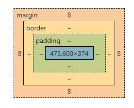

**margin**：外边距

**border**：边框

**padding**：内边距

**四边的设置顺序为：上右下左，即从上开始的顺时针**


## 6.5 display & float

block：块元素

inline：行内元素

inline-block：是块元素，但可以在一行

none：不显示

**div块元素，span行内元素**

```html
<!doctype html>
<html lang="en">
<head>
    <meta charset="UTF-8">
    <title>CSS</title>
    <style>
        div {
            width: 100px;
            height: 100px;
            border: 1px solid blueviolet;
            /*display: block;*/
        }

        span {
            width: 100px;
            height: 100px;
            border: 1px solid indianred;
            /*display: inline;*/
        }
    </style>
</head>
<body>
    <div>div块元素</div>
    <span>span行内元素</span>
</body>
</html>
```

原始状态下，div为块元素独占一行（相当于display: block），span为行内元素被挤到下一行（相当于display: inline）

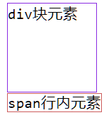

inline inline

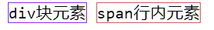

block block

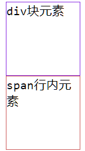

inline-block inline-block

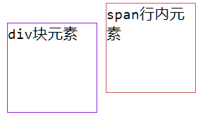

```html
<!doctype html>
<html lang="en">
<head>
    <meta charset="UTF-8">
    <title>CSS</title>
    <style>
        div {
            
        }
        .father {
            
        }
        .l1 {
            
        }
        .l2 {
            
        }
        .l3 {
            
        }
    </style>
</head>
<body>
    <div class="father">
        <div class="l1"></div>
        <div class="l2"></div>
        <div class="l3"></div>
    </div>
</body>
</html>
```

初始状态下：

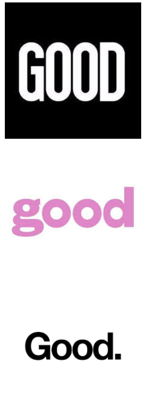

soild 实线 dashed 虚线

```html
<style>
    div {
        margin: 10px;
        padding: 5px;
    }
    .father {
        border: 1px solid red;
    }
    /*white*/
    .l1 {
        display: inline-block;
        border: 1px blueviolet dashed;
        float: left;
    }
    /*pink*/
    .l2 {
        display: inline-block;
        border: 1px dashed blueviolet;
        float: left;
    }
    /*black*/
    .l3 {
        display: inline-block;
        border: blueviolet dashed 1px;
        float: left;
    }
</style>
```

在father的框之上浮起来

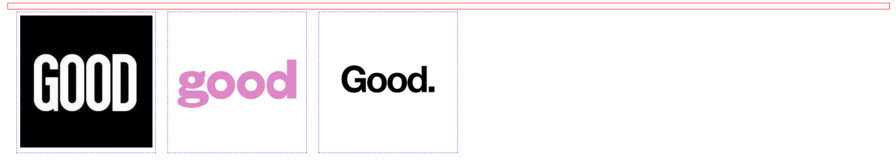

```html
<style>
    div {
        margin: 10px;
        padding: 5px;
    }
    .father {
        border: 1px solid red;
    }
    /*white*/
    .l1 {
        display: inline-block;
        border: 1px blueviolet dashed;
        float: right;
    }
    /*pink*/
    .l2 {
        display: inline-block;
        border: 1px dashed blueviolet;
        float: right;
    }
    /*black*/
    .l3 {
        display: inline-block;
        border: blueviolet dashed 1px;
        float: left;
    }
</style>
```

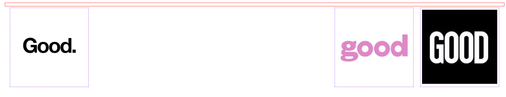

## 6.6 定位

### 6.6.1 相对定位

相对原来的位置进行偏移

position: relative; 相对定位

bottom: 10px 即相对底部距离10px，实际效果上是向上偏移的

### 6.6.2 绝对定位

相对浏览器进行偏移

position: absolute;

### 6.6.3 固定定位

相对完整的页面进行偏移

position: fixed;

```html
<!doctype html>
<html lang="en">
<head>
    <meta charset="UTF-8">
    <title>CSS</title>
    <style>
        body {
            height: 1000px;
        }
        div:nth-of-type(1) {
            width: 100px;
            height: 100px;
            background-color: red;
            position: absolute;
            right: 0;
            bottom: 0;
        }
        div:nth-of-type(2) {
            width: 50px;
            height: 50px;
            background-color: yellow;
            position: fixed;
            right: 0;
            bottom: 100px;
        }
    </style>
</head>
<body>
    <div>div1</div>
    <div>div2</div>
</body>
</html>
```

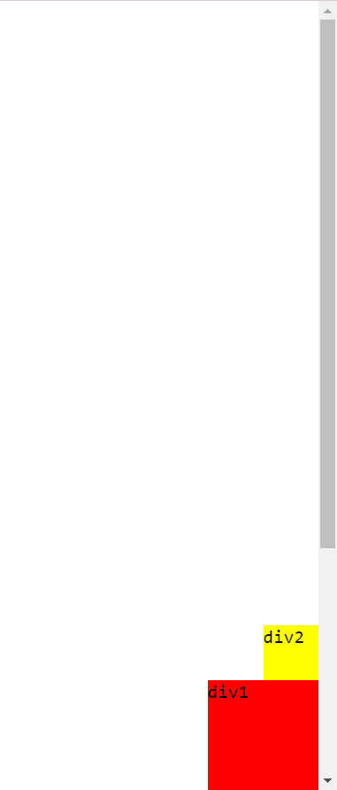

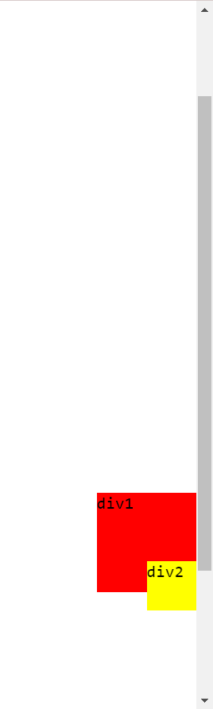


### 6.6.4 z-index

CSS 中有图层的概念，z-index 指定元素在第几层，数值越大越在上面

```html
<!doctype html>
<html lang="en">
<head>
    <meta charset="UTF-8">
    <title>CSS</title>
    <style>
        #content {
            width: 380px;
            font-size: 20px;
            line-height: 25px;
            border: 1px red solid;
            padding: 0;
            margin: 0;
            overflow: hidden;
        }
        img {
            border: 1px red solid;
        }
        ul, li {
            padding: 0;
            margin: 0;
            list-style: none;
        }
        .text, .bg {
            position: absolute;
            width: 250px;
            height: 25px;
            top: 200px;
        }
        .text {
            color: white;
            z-index: 999;
        }
        .bg {
            background-color: black;
            opacity: 0.5;
        }
    </style>
</head>
<body>
    <div id="content">
        <ul>
            <li>
                
            </li>
            <li class="text">这是一个安静的晚上</li>
            <li class="bg">我一个人坐在摇椅里乘凉</li>
            <li>时间：2025/3/15</li>
            <li>地点：太平洋基地</li>
        </ul>
    </div>
</body>
</html>
```

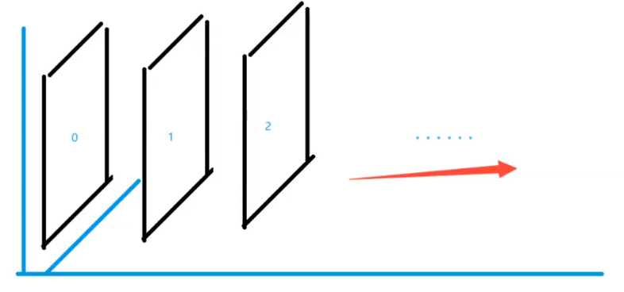

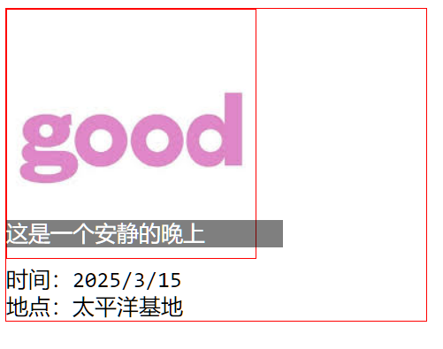


# 7. 练习

## 7.1 练习一：文本及列表样式

```html
<!doctype html>
<html lang="en">
<head>
    <meta charset="UTF-8">
    <title>CSS</title>

    <style>
        .nav {
            width: 18rem;
            background-color: gainsboro;
        }
        .title {
            font-size: larger;
            font-weight: bolder;
            font-family: 宋体,serif;
            text-indent: 2rem;
            line-height: 3rem;
            width: 18rem;
            background-color: red;
        }
        ul li {
            list-style: none;
            height: 2rem;
        }
        a {
            text-decoration: none;
            background-color: greenyellow;
            color: deeppink;
        }
        a:hover {
            color: blueviolet;
            text-decoration: line-through;
        }
    </style>
</head>
<body>
<h2 class="title">导引目录</h2>
<div class="nav">
    <ul>
        <li><a href="#">1########################</a></li>
        <li><a href="#">2########################</a></li>
        <li><a href="#">3########################</a></li>
        <li><a href="#">4########################</a></li>
        <li><a href="#">5########################</a></li>
        <li><a href="#">6########################</a></li>
        <li><a href="#">7########################</a></li>
        <li><a href="#">8########################</a></li>
        <li><a href="#">9########################</a></li>
    </ul>
</div>
</body>
</html>
```

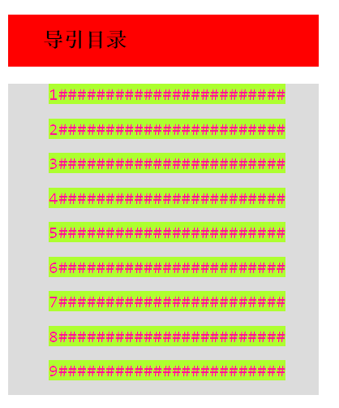

## 7.2 练习二：方块定位

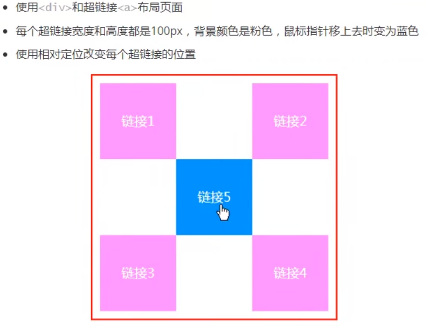

```html
<body>
    <div id="box">
        <a href="#" class="l1">链接1</a>
        <a href="#" class="l2">链接2</a>
        <a href="#" class="l3">链接3</a>
        <a href="#" class="l4">链接4</a>
        <a href="#" class="l5">链接5</a>
    </div>
</body>
```

```css
#box {
    border: 2px red solid;
    width: 300px;
    height: 300px;
    padding: 10px;
}
a {
    display: block;
    background-color: pink;
    width: 100px;
    height: 100px;
    text-decoration: none;
    line-height: 100px;
    text-align: center;
    color: white;
}
a:hover {
    background-color: blue;
}
.l2, .l4 {
    position: relative;
    right: -200px;
    top: -100px
}
.l5 {
    position: relative;
    top: -300px;
    right: -100px;
}
```

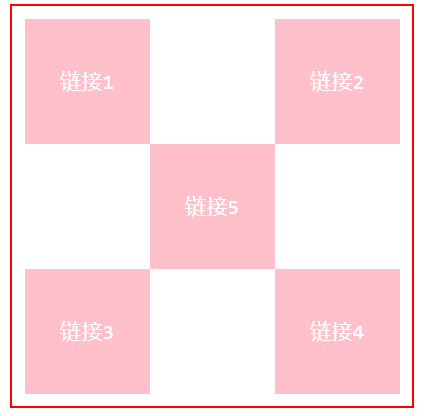

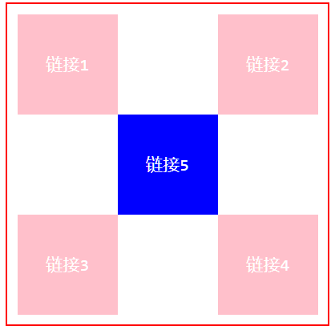


