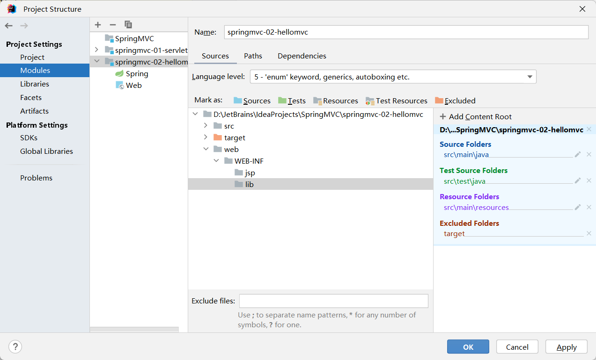
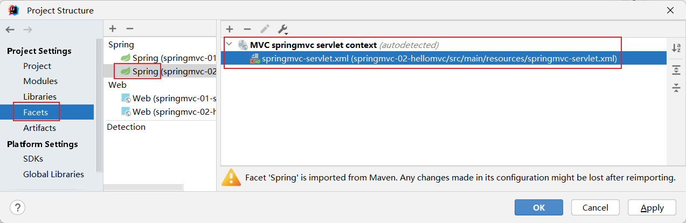
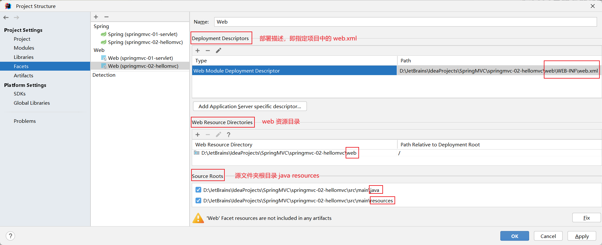
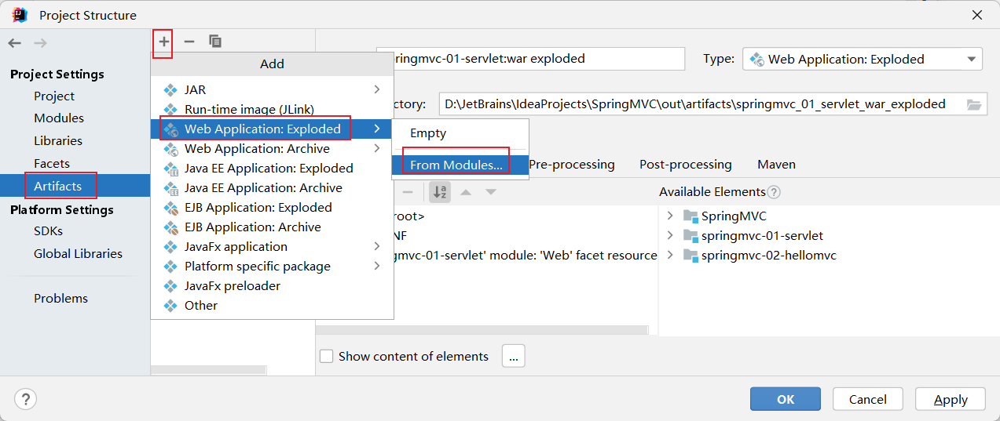

## 1. tomcat 日志输出乱码

找到**Tomcat**目录下**conf**文件夹中的**logging.properties**文件

打开**logging.properties**文件，找到文件中的**java.util.logging.ConsoleHandler.encoding = UTF-8**

将其中的**UTF-8**改为**GBK**，保存后重启Tomcat服务

## 2. idea 配置使用 tomcat + artifact

+ 打开 project structure

+ 检查模块的结构是否符合预期

+ 检查对应模块的 spring 配置文件

+ 配置对应的 web 模块，检查 web.xml web java resources 的位置是否正确

+ 从配置好的模块中，创建对应的 artifact

