# 1. 什么是 JS

**JavaScript 是一门弱类型脚本语言**

其源代码在发往客户端运行之前不需要经过编译，

而是将文本格式的字符代码发送给浏览器，由浏览器解释执行

**ECMAScript** 可以理解为是JavaScript的一个标准

最新版本已经到es6版本~ 但是大部分浏览器还只支持es5代码

开发环境 和 线上环境，版本不一致


# 2. 快速入门

```html
内部标签
<script>
    alert("hello, world")
</script>

外部引入
<script src="js/qj.js"></script>

注释
<script>
	//...
</script>
```

**注意：script标签必须成对出现**


## 2.1 数据类型

js 不区分小数和整数

**NaN** = not a number（与所有的数值都不相等，包括其自身，只能通过isNaN进行判断）

**Infinity** = 无限大

**== 等于**（类型不一样，值一样就会判定为相等）

**=== 绝对等于**（类型和值都一样才会判定为等于）

**注意：== 的存在是js的一个缺陷，坚持使用===进行比较**


## 2.2 数组

Java 中的数组元素必须是相同类型的，JS 中不需要这样

**注意：为了代码的可读性，尽量使用 []来标记数组**

```js
var arr = [1, 2, 3, "hello", null, true];
new Array(1, 2, 3, 'hello', null);
```

**数组下标越界提示 undefined**


## 2.3 对象

每个属性之间用逗号（,）隔开，最后一行不需要加逗号

```js
var person = {
    name: "isaiah",
    age: 3,
    tags: ['js', 'java', 'python']
}
```

**注意：数组用中括号，对象用大括号！**


# 3. 基本语法

**注意：‘use strict’	严格检查模式，必须写在JS 的第一行**

**注意：JS 中的所有键都是字符串，而值可以是任意对象**


## 3.1 字符串部分

 **多行字符串编写：**

```js
'use strict';
let msg = `你的
名字
是什么？
我的
名字
是这个`
```


**模板字符串：**

```js
'use strict';
let name = "isaiah";
let age = 3;
let msg = `你好呀，我是${name}`  // msg.length = 12
```


**字符串长度：**

```js
console.log(str.length);
```

**字符串的可变性：JS 中的字符串是不可变的**

```js
'use strict';
let name = "isaiah";
console.log(name[0]);
name[0] = 'a';
console.log(name);
```


**字符串中的大小写转换：不改变字符串本身**

```js
'use strict';
let name = "isAiAh";
console.log(name);
console.log(name.toUpperCase());
console.log(name);
console.log(name.toLowerCase());
```


**indexOf & substring（substring不改变原来字符串的值）**

```js
'use strict';
let name = "isaiah";
console.log(name.indexOf('a'));
console.log(name.substring(0,2));
console.log(name);
```


## 3.2 数组部分

**数组可以包含任意的数据类型**

```js
'use strict';
let arr = [1,2,3,4,'a',3.14,[1,2,3]];
console.log(arr[0]);
arr[0] = 2;
console.log(arr);
```


**数组arr 的长度由arr.length 限定，若给其赋值，arr 数组长度就会发生变化**

```js
'use strict';
let arr = [1,2,3,4,'a',3.14,[1,2,3]];
console.log(arr.length);   // 原来是 7
// 通过改变length的值，放大数组
arr.length = 10;
console.log(arr);
// 通过改变length的值，缩小数组
arr.length = 3;
console.log(arr);
// 缩小后再放大显示数据丢失
arr.length = 5;
console.log(arr);
```


**数组和字符串一样，也有indexOf方法**

**数组和字符串的substring 一样，有slice 方法，返回一个新的数组**

```js
'use strict';
let arr = [1,'1',2,3,4,'a',3.14,[1,2,3]];
console.log(arr.indexOf(1));
console.log(arr.indexOf('1'));
console.log(arr.slice(0, 2));
console.log(arr);
```


**push & pop（尾部）：**

**push 返回数组的新长度，pop 返回弹出的值，两个操作都是对数组本身作用的**

```js
'use strict';
let arr = [1,'1',3.14,[1,2,3]];
console.log(arr.push('#####'));
console.log(arr);
console.log(arr.pop());
console.log(arr);
```


**unshift & shift（头部）：同上**

```js
'use strict';
let arr = [1,'1',3.14,[1,2,3]];
console.log(arr.unshift("@@@"));
console.log(arr);
console.log(arr.shift());
console.log(arr);
```


**sort**

The **`sort()`** method sorts the elements of an array *[in place](https://en.wikipedia.org/wiki/In-place_algorithm)* and returns the reference to the same array, now sorted. The default sort order is ascending, built upon converting the elements into strings, then comparing their sequences of UTF-16 code units values.

```js
const months = ['March', 'Jan', 'Feb', 'Dec'];
months.sort();
console.log(months);
// Expected output: Array ["Dec", "Feb", "Jan", "March"]

const array1 = [1, 30, 4, 21, 100000];
array1.sort();
console.log(array1);
// Expected output: Array [1, 100000, 21, 30, 4]
```


**reverse**

```js
use strict';
let arr = [1,'1',3.14,[1,2,3]];
console.log(arr);
console.log(arr.reverse());
```


**concat：与push 不同，其不改变原来的数组**

```js
'use strict';
let arr = [1,'1',3.14,[1,2,3]];
console.log(arr.concat('@@@'));
console.log(arr);
```


**join：用指定的字符串拼接数组的各个元素，组成一个字符串**

```js
use strict';
let arr = [1,'1',3.14,[1,2,3]];
console.log(arr.join('@@@'));
console.log(arr);
```


## 3.3 面向对象部分

```js
'use strict';
let person = {
    name: 'isaiah',
    age: 3,
    hobby: 'play'
}
```

**使用一个不存在的属性，不会报错，只是提示 undefined**

```js
person.haha
undefined
```

**动态的移除对象的属性，使用 delete 关键字**

```js
delete person.name
true
person
```


**动态的为对象添加属性，直接给新属性赋值即可**

```js
person.haha = 'haha'
'haha'
person
```


**判断指定的属性是否在对象中：‘属性’   in   对象**

```js
'name' in person
true
name in person
false
```


**每个对象都继承了一些方法和属性，可以用hasOwnProperty 方法来判断方法或属性是不是自身的**

```js
person.hasOwnProperty('toString');
false
person.hasOwnProperty('name');
true
```


JS 早期漏洞

```js
 'use strict';
let arr = [3,4,5];
arr.name = 123;
console.log(arr);
```


## 3.4 循环结构

```js
'use strict';
// for 循环
for (let i = 0; i < 5; i++) {
    console.log(i);
}
// forEach 循环
let arr = [1,3,4,2,2,1,5,8];
arr.forEach(function (e) {
    console.log(e);
});
// for...in 循环(不推荐)
for (let arrKey in arr) {
    console.log(arr[arrKey]);
}
// for...of 循环（推荐）
for (let x of arr) {
    console.log(x);
}
```


## 3.5 容器部分

**JS 之中只有两个容器：Map 和 Set**

**Map**

```js
'use strict';
let map = new Map([['tom', 100], ['jack', 90], ['ja', 80]]);
let name = map.get('tom');
map.set('admin', 1234);
console.log(map);
map.delete('tom');
console.log(map);
```


**Set**

```js
use strict';
let set = new Set([1,23,12,12,23,1,12]);
set.add(2);
console.log(set);
set.delete(1);
console.log(set);
```


## 3.6 iterator

es6 新特性


# 4. 函数

## 4.1 定义函数

> 方式一

```js
function abs(x) {
    if (x < 0) {
        return -x;
    } else {
        return x;
    }
}
```

函数执行到 return 语句代表函数结束，返回结果！

若函数没有 return 语句，执行到最后也会返回结果，结果是 undefined

> 方式二

```js
let abs = function(x) {
    if (x < 0) {
        return -x;
    } else {
        return x;
    }
}
```

function 是一个匿名函数，可以把结果赋值给 abs，通过 abs 就可以调用函数

**方式一和方式二等价**


## 4.2 调用函数

```js
abs(-10)	// 10
```

参数问题：JS 可以传入任意个参数，甚至也可以不传递参数~

```js
let abs = function(x) {
    if (x < 0) {
        return -x;
    } else {
        return x;
    }
};
console.log(abs(-10));		// 10
console.log(abs());			// undefined
```

可以对参数进行判断，规避参数不存在的情况

```js
let abs = function(x) {
    if (typeof x !== 'number') {
        throw 'not a number';
    }
    if (x < 0) {
        return -x;
    } else {
        return x;
    }
};
console.log(abs(-10));
console.log(abs());
```


> arguments 关键字

这个关键字代表传递进来的所有参数，是一个数组

```js
let abs = function(x) {
    console.log('我们期望的参数'+x);
    for (let i = 0; i < arguments.length; i++) {
        console.log(arguments[i]);
    }
    if (x < 0) {
        return -x;
    } else {
        return x;
    }
};
console.log(abs(1,2,3,5,-4,-3,-3));
```


> rest 关键字

es6 引入的新特性，获取除了已经定义的参数之外的所有参数

```js
// rest 参数只能写在最后，且必须用...标识
let aaa = function(a,b,...rest) {
    console.log('a ---> ' + a);
    console.log('b ---> ' + b);
    console.log(rest);
};
console.log(1,2,3,4,5,6,7);
```


# 5. 变量

**JavaScript 中，函数及变量的声明都将被提升到函数的最顶部**；也就是说，**变量可以先使用再声明**

```js
// 这样是可以的，但是不推荐，应该把变量的声明放在最前面
x = 5; // 变量 x 设置为 5
elem = document.getElementById("demo"); // 查找元素
elem.innerHTML = x;                     // 在元素中显示 x
var x; // 声明 x
```

**JavaScript 只有声明的变量会提升，初始化的不会**

```js
// 这样的y会显示undefined，也就是初始化的操作不会提升
var x = 5; // 初始化 x
elem = document.getElementById("demo"); // 查找元素
elem.innerHTML = x + " " + y;           // 显示 x 和 y
var y = 7; // 初始化 y
```


## 5.1 全局作用域

**JS 实际上只有一个全局作用域（window）**，任何变量（包括函数，函数也被视为变量）

```js
var x = 'hello world';
alert(x);
window.alert(window.x);
```

上下是等价的，下面window.alert 失效（全局变量冲突）

```js
var x = 'hello world';
alert(x);
window.alert = function() {

};
window.alert(window.x);
```

**由于我们所有的全局变量都会绑定到window 上面，如果不同的 js 文件使用了同名的全局变量，将会造成冲突**

**解决办法：使用命名空间，减少全局变量的冲突**


## 5.2 局部作用域 let

```js
'use strict';
let aaa = function() {
    for (var i = 0; i < 5; i++) {
        console.log(i);
    }
    // 不会是5吧
    console.log(i);
}
```


**使用let 定义 i 避免出乎意料的结果**

```js
'use strict';
let aaa = function() {
    for (let i = 0; i < 5; i++) {
        console.log(i);
    }
    // 不会是5吧
    console.log(i);
}
```


**建议用 let 去定义局部作用域的变量**


## 5.3 常量 const

在ES6 之前，用大写字母定义的都是常量，而这只是规范而已，修改这样的常量是不会报错的

```js
'use strict';
const PI = "3.14";
PI = "3";
```


# 6. 方法

**方法就是把函数放在对象里面**，对象只有两个部分：**属性 & 方法**

```js
 'use strict';
let  student = {
    name: 'isaiah',
    birth: 2000,
    age: function() {
        let now = new Date().getFullYear();
        return now - this.birth;
    }
};
console.log(student.name);	// isaiah
console.log(student.age());		// 2023 - 2000 = 23
```

上面的代码还可以拆开写，结果是一样的

```js
'use strict';
let getAge = function() {
    let now = new Date().getFullYear();
    return now - this.birth;
};

let  student = {
    name: 'isaiah',
    birth: 2000,
    age: getAge
};
console.log(student.name);	// isaiah
console.log(student.age());		// 2023 - 2000 = 23
```

**这里的this 指向调用它的那个对象**

**在JS 中可以用apply 来控制this 的指向，类似Java 中的 invoke()** 

```js
'use strict';
let getAge = function() {
    let now = new Date().getFullYear();
    return now - this.birth;
};

let  student = {
    name: 'isaiah',
    birth: 2000,
    age: getAge
};
// this 指向了 student，参数为空
getAge.apply(student, []);
```


# 7. 内部对象

## 7.1 标准对象


## 7.2 Date 类

### 7.2.1 基本使用

```js
'use strict';
let now = new Date();   // Wed Feb 08 2023 19:48:38 GMT+0800 (中国标准时间)
now.getFullYear();      // 年
now.getMonth();     // 月
now.getDate();      // 日

now.getDay();   // 星期
now.getHours();     // 时
now.getMinutes();   // 分
now.getSeconds();   // 秒

now.getTime();      // 时间戳，世界统一，1970/1/1 0:0:0 毫秒数
```

### 7.2.2 时间转换

```js
'use strict';
// 通过时间戳获得真实的时间
let now = new Date(1578106175991);  // Sat Jan 04 2020 10:49:35 GMT+0800 (中国标准时间)
now.toLocaleString();       // 2020/1/4 10:49:35
console.log(now.toISOString());     // 2020-01-04T02:49:35.991Z
```


## 7.3 JSON 类

### 7.3.1 JSON 是什么

早期，所有的数据传输习惯使用XML文件

+ JSON（JavaScript Object Notation）是一种轻量级的数据交换格式
+ 易于阅读和编写，同时也易于计算机解析和生成，提升了传输效率

在JS 中一切皆对象，在格式上，JSON 和 JS 对象都用大括号，数组都用中括号，属性和方法使用键值对

### 7.3.2 JSON 字符串与 JS 对象的转化

```js
'use strict';
let user = {
    name: 'isaiah',
    age: 20,
    hobby: 'read'
};
let json_encode = JSON.stringify(user);
console.log(json);
let json_decode = JSON.parse(json);
console.log(json_decode);
```


# 8. 面向对象编程

## 8.1 原型

**JS 中有原型的概念，原型可以让对象指定自己的父类**

```js
'use strict';
let student = {
    name: 'isaiah',
    age: 15,
    run: function () {
        console.log(this.name + " run...");
    }
};
var jack = {
    name: 'jack'
};

// jack 继承自 student 所以有了run 的方法
jack.__proto__ = student;

var bird = {
    fly: function () {
        console.log(this.name + " fly...");
    }
};

// jack 继承自 bird，所以有了fly 的方法
jack.__proto__ = bird;
```

事实上，一种极其常见的对象定义模式是：

**在构造器（函数体）中定义属性**、**在 `prototype` 属性上定义方法**

如此，构造器只包含属性定义，而方法则分装在不同的代码块，**代码更具可读性**

```js
'use strict';
function Person(name, age) {
    this.name = name;
    this.age = age;
}
// 为Person对象的原型添加属性
Person.prototype.eat = function() {
    console.log("eat something...")
};
let person = new Person('isaiah', 18);
console.log(person);	// 可以看到eat方法已经放到Person的原型里面了
person.eat();	// eat something...
```

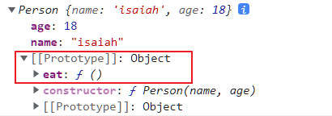


```js
'use strict';
function Person(name, age) {
    this.name = name;
    this.age = age;
}

// 可以被继承的方法
Person.prototype.eat = function() {
    console.log('can eat something...');
};
Person.prototype.walk = function() {
    console.log('can do walk...');
};
let person = new Person('isaiah', 15);
```

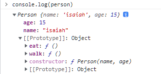


## 8.2 class 继承

` class `关键字是在ES6 引入的

1. 定义一个包含属性和方法的类

```js
'use strict';
class Student {
    constructor(name) {
        this.name = name;
    }
    hello() {
        alert('hello world');
    }
}

class XioaStudent extends Student {
    constructor(name, grade) {
        super(name);
        this.grade = grade;
    }
    myGrade() {
        alert('xiao student: ' + this.grade + ' grade');
    }
}
let xiaoming = new Student('xiaoming');
let xiaohong = new XioaStudent('xiaohong', 3);
```

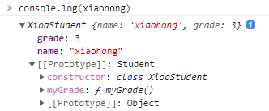

**不难发现，原型对象是基于父类的**


# 9. 操作BOM 对象（重点）

**BOM：浏览器对象模型**

**JS 和浏览器的关系：JS 诞生之初就是为了让它在浏览器中运行**


**window 代表浏览器窗口**

```js
window.alert(1)
undefined
window.innerHeight
1279
window.innerWidth
150
window.outerHeight
1399
window.outerWidth
1294
```


**Navigator 封装了浏览器的信息**

```js
navigator.appName
'Netscape'
navigator.appVersion
'5.0 (Windows NT 10.0; Win64; x64) AppleWebKit/537.36 (KHTML, like Gecko) Chrome/109.0.0.0 Safari/537.36'
navigator.userAgent
'Mozilla/5.0 (Windows NT 10.0; Win64; x64) AppleWebKit/537.36 (KHTML, like Gecko) Chrome/109.0.0.0 Safari/537.36'
navigator.platform
'Win32'
```

大多数时候，我们不会使用`navigator`对象，因为这个对象可以被认为修改


**screen 代表屏幕尺寸**

```js
screen.width
2560
screen.height
1440
```


**location 代表当前页面的URL 信息**

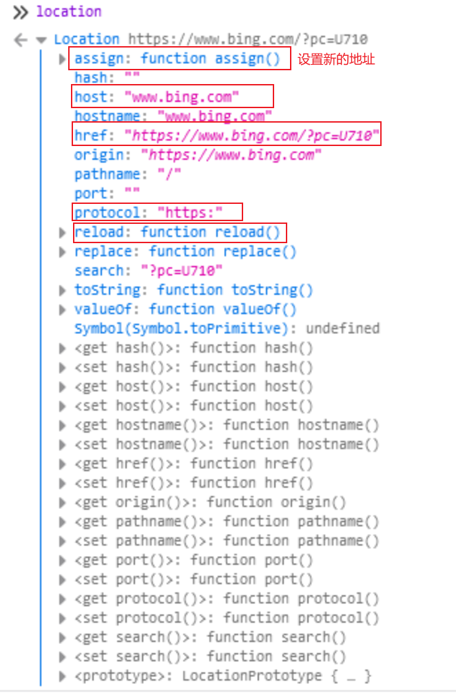


**document 代表当前的页面，HTML DOM 文档树**

```js
document.title
"Netflix"
document.title = '我说叫什么名就叫什么名！！！'
"我说叫什么名就叫什么名！！！" 
```

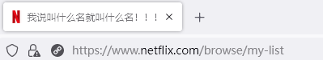

**获取具体的文档树节点**

```html
<dl id="app">
    <dt>Java</dt>
    <dd>JavaSE</dd>
    <dd>JavaSE</dd>
</dl>

<script>
    let dl = document.getElementById('app');
</script>
```

**获取 cookies**

```properties
document.cookie
"nfvdid=BQFmAAEBEBEz7ImlB0MYQXjYhvmkeBtgMlw7OFlR7Xxm9HpBCvQ-DKlfDMDHu7BaKTaZsE-Hd2IfbIXSF4E4KU-K3aXikX59KKQiKlfNbaHbfBns-uG3X__N1aZmD7_ECuwzUSlor1GjE18n4GWZF5joJIaN54AR; memclid=47c68057-2ee9-4fce-ac46-c1ff7d3b38e2; OptanonAlertBoxClosed=2022-02-25T07:35:39.555Z; netflix-sans-normal-3-loaded=true; netflix-sans-bold-3-loaded=true; flwssn=c1e1f544-98b8-4110-9ff2-346ace2470a6; OptanonConsent=isIABGlobal=false&datestamp=Mon+Feb+13+2023+18%3A16%3A27+GMT%2B0800+(%E4%B8%AD%E5%9B%BD%E6%A0%87%E5%87%86%E6%97%B6%E9%97%B4)&version=202301.1.0&consentId=43ad38a2-b097-4c16-8de4-d20de9bafca3&interactionCount=1&landingPath=NotLandingPage&groups=C0001%3A1%2CC0002%3A1%2CC0003%3A1%2CC0004%3A1&hosts=&AwaitingReconsent=false&geolocation=HK%3BHCW&isGpcEnabled=0; profilesNewSession=0" 
```

使用document 可以轻易地获得cookie 的信息，所以要小心恶意的脚本劫持cookie


**history 代表浏览器的历史记录**

```js
history.back() // 后退 back
history.forward() // 前进 forward
```

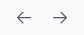


# 10. 操作 DOM对象（重点）

**浏览器网页就是一个 DOM 树形结构**

+ **更新**：更新 DOM 节点
+ **遍历**：得到任意的 DOM 节点
+ **删除**：移除一个 DOM 节点
+ **添加**：添加一个新的 DOM 节点


### 获得 DOM 节点（选择器）

```html
<div id="father">
    <h1>标题一</h1>
    <p id="p1">p1</p>
    <p class="p2">p2</p>
</div>
```

```js
// 类型选择器
let h1 = document.getElementsByTagName('h1');
// id 选择器
let p1 = document.getElementById('p1');
// class 属性选择器
let p2 = document.getElementsByClassName('p2');

// 获取父节点下的所有子节点
let father = document.getElementById('father');
let children = father.children;
// 指定的孩子
father.firstChild
father.lastChild
```

以上是原生代码的写法，之后尽量用JS 的一个常用的库 jQurey

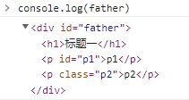

**注意：getElementsByTagName / ClassName 是有复数的，getElementById 是没有复数的**


### 更新节点（文本和样式）

```ja
let id1 = document.getElementById('id1');
id1.innerText = '在标签内部添加文本';
id1.innerHTML = '<span style="color:indianred">在标签里面加入标签</span>';
```

操作文本：`innerText 属性` `innerHTML 属性`

操作CSS：`style.color` `style.fontsize` `style.padding`

**注意：这里的属性都是接收字符串类型的**


### 删除节点（remove）

+ 先获取父节点，再通过父节点删除指定的节点 parentElement / removeChild
+ 直接用 remove 方法

```html
<div id="father">
    <h1>标题一</h1>
    <p id="p1">p1</p>
    <p class="p2">p2</p>
</div>

<script>
    let self = document.getElementById('p1');
    let father = self.parentElement;
    father.removeChild(self);
    document.getElementsByClassName('p2')[0].remove();
</script>
```

**注意：删除是一个动态的过程，是一行一行边解释边执行的**

```html
<script>
    let father = document.getElementById('father');

    father.removeChild(father.children[0]);
    father.removeChild(father.children[1]);
    father.removeChild(father.children[2]);
</script>
```

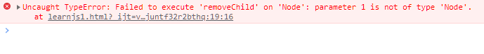

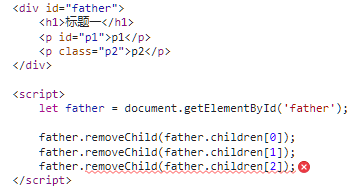


### 插入节点（css script div...）

获得了某个 DOM 节点，如果原来就有 innerHTML 再去添加，就会覆盖，我们可以选择追加

```html
<p id="js">JavaScript</p>
<div id="list">
    <p id="se">JavaSE</p>
    <p id="ee">JavaEE</p>
    <p id="me">JavaME</p>
</div>

<script>
    let js = document.getElementById('js');
    let list = document.getElementById('list');
    list.appendChild(js);
</script>
```

原始的 html 文件

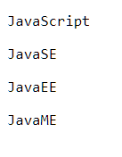

JS 改变之后的 html 文件

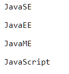

```html
<p id="js">JavaScript</p>
<div id="list">
    <p id="se">JavaSE</p>
    <p id="ee">JavaEE</p>
    <p id="me">JavaME</p>
</div>

<script>
    let js = document.getElementById('js');
    let list = document.getElementById('list');

    // 通过 JS 创建一个新的节点
    let newP = document.createElement('p'); // 创建一个 p 标签
    newP.id = 'newP';
    newP.innerText = 'hello new p tag';
    document.getElementById('list').appendChild(newP);

    // 通过 JS 创建一个 JS 标签
    let myScript = document.createElement('script');
    // setAttribute 为属性设置值
    myScript.setAttribute('type', 'text/javaScript');
    myScript.innerText = `alert('hello world from myScript')`;
    document.getElementsByTagName('head')[0].appendChild(myScript);

    // 通过 JS 可以创建 Style 标签，改变样式
    let myStyle = document.createElement('style');
    myStyle.setAttribute('type', 'text/css');
    myStyle.innerText = `body {border: solid 2px red;}`;
    document.getElementsByTagName('head')[0].appendChild(myStyle);
</script>
```

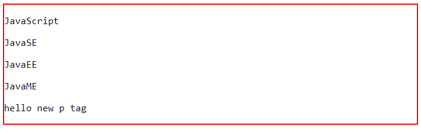

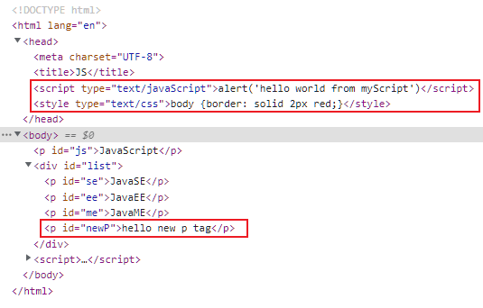


# 11. 操作表单（form）

+ 文本框 text
+ 下拉框 \<select\>
+ 单选框 radio
+ 多选框 checkbox
+ 隐藏域 hidden
+ 密码框 password

### 表单控制（radio text）

```html
<form action="#" method='post'>
    <p>
    	<span>用户名：</span>
		<input type="text" id="user-name-label">
    </p>
	<p>
        <span>性别：</span>
    	<input type="radio" name="sex" value="male" id="sex-radio-male">
        <input type="radio" name="sex" vale="female" id="sex-radio-female">
     </p>
</form>

<script>
    let userName = document.getElementById('user-name-label');
    
	// 得到输入框的值（type="text"）
    console.log(userName.value);
    // 修改输入框中的值
    userName.value = 'isaiah';

    // 对于单选框，多选框等固定的value值
    // 就应该用checked来查看或修改结果
    console.log(document.getElementById('sex-radio-male').checked);
    document.getElementById('sex-radio-female').checked = true;
</script>
```

### 提交表单（md5）

**表单绑定提交事件：onsubmit=提交监测函数（函数放回 true[可以提交] 或 false[不可以提交]）**

**onsubmit= “return aaa()”**

```html
<script src="https://cdnjs.cloudflare.com/ajax/libs/blueimp-md5/2.19.0/js/md5.js"></script>

<form method="post" action="https://bing.com" onsubmit="return aaa()">
    <p>
        <span>用户名：</span>
        <input type="text" id="user-name-label" name="user-name">
    </p>
    <p>
        <span>密码：</span>
        <input type="password" id="input-password" name="password">
    </p>
    <input type="hidden" id="md5-password">
    <!--        绑定事件：onclick 被点击就提交-->
    <button type="submit">提交</button>
</form>

<script>
        function aaa() {
            alert('inside aaa()');
            let userName = document.getElementById('user-name-label');
            let passWord = document.getElementById('input-password');
            let md5PassWord = document.getElementById('md5-password');

            md5PassWord.value = md5(passWord.value);
            passWord.value = md5PassWord;
            return true;
        }
</script>
```

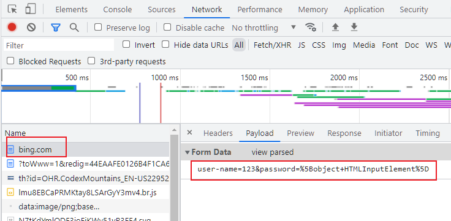


# 12. jQuery	$(selector).action()


## 12.1 简单了解

点击“click me” 链接，得到“hello world from jQuery” 弹窗

```html
<script src="https://code.jquery.com/jquery-3.6.3.min.js"></script>
<a href="" id="test-jQuery">click me!</a>
<script>
    $('#test-jQuery').click(function() {
    	alert('hello world from jQuery');
	});
</script>
```

**$(选定区域).响应/作出动作**

+ 选定canvas区域，响应鼠标移动事件，通过事件得到此时鼠标得坐标位置
+ 选定mouseMove区域，输出文本（鼠标的坐标位置）

```html
<script src="https://code.jquery.com/jquery-3.6.3.min.js"></script>
<style>
    #canvas {
        width: 500px;
        height: 500px;
        border: solid 1px red;
    }
</style>

<div>
    mouse: <span id="mouseMove"></span>
</div>
<div id="canvas">
    请在这里移动鼠标
</div>

<script>
    // 当网页元素加载完毕之后，响应事件
    $(function() {
        $('#canvas').mousemove(function(e) {
            $('#mouseMove').text('x: ' + e.pageX + 'y: ' + e.pageY)
        })
	});
</script>
```

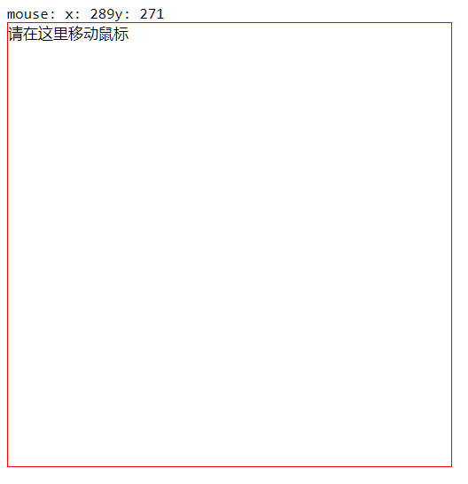

## 12.2 操作 DOM

```html
<ul>
    <li name="python">python no.1</li>
    <li name="java">java no.1</li>
    <li name="c++">c++ no.1</li>
    <li name="golang">go no.1</li>
</ul>
```

### 节点文本操作（text html）

```js
$('ul li[name=java]').text();
'java no.1'

$('ul li[name=java]').text('java no.2');
E.fn.init [li, prevObject: E.fn.init(1)]0: lilength: 1prevObject: E.fn.init [document][[Prototype]]: Object(0)

$('ul').html();
'\n        <li name="python">python no.1</li>\n        <li name="java">java no.2</li>\n        <li name="c++">c++ no.1</li>\n        <li name="golang">go no.1</li>\n    '

$('ul').html('<strong>123</strong>');
E.fn.init [ul, prevObject: E.fn.init(1)]
```

### 操作 CSS	.css(‘key’, ‘value’)

```js
$('ul li[name=python]').css('color', 'red');
E.fn.init [li, prevObject: E.fn.init(1)]
```

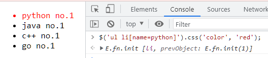

### 元素的显示与隐藏（display: none）

```js
$('ul li[name=c\\+\\+]').hide();
E.fn.init [li, prevObject: E.fn.init(1)]
$('ul li[name=c\\+\\+]').show();
E.fn.init [li, prevObject: E.fn.init(1)]
```

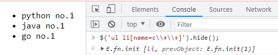

### 娱乐测试

```js
$(window).width();
$(window).height();
$('ul li[name=python]').toggle();
```

