# 1. 什么是 JS

**JavaScript 是一门弱类型脚本语言**

其源代码在发往客户端运行之前不需要经过编译，

而是将文本格式的字符代码发送给浏览器，由浏览器解释执行

**ECMAScript** 可以理解为是JavaScript的一个标准

最新版本已经到es6版本~ 但是大部分浏览器还只支持es5代码

开发环境 和 线上环境，版本不一致


# 2. 快速入门

```html
内部标签
<script>
    alert("hello, world")
</script>

外部引入
<script src="js/qj.js"></script>

注释
<script>
	//...
</script>
```

**注意：script标签必须成对出现**


## 2.1 数据类型

js 不区分小数和整数

**NaN** = not a number（与所有的数值都不相等，包括其自身，只能通过isNaN进行判断）

**Infinity** = 无限大

**== 等于**（类型不一样，值一样就会判定为相等）

**=== 绝对等于**（类型和值都一样才会判定为等于）

**注意：== 的存在是js的一个缺陷，坚持使用===进行比较**


## 2.2 数组

Java 中的数组元素必须是相同类型的，JS 中不需要这样

**注意：为了代码的可读性，尽量使用 []来标记数组**

```js
var arr = [1, 2, 3, "hello", null, true];
new Array(1, 2, 3, 'hello', null);
```

**数组下标越界提示 undefined**


## 2.3 对象

每个属性之间用逗号（,）隔开，最后一行不需要加逗号

```js
var person = {
    name: "isaiah",
    age: 3,
    tags: ['js', 'java', 'python']
}
```

**注意：数组用中括号，对象用大括号！**


# 3. 基本语法

**注意：‘use strict’	严格检查模式，必须写在JS 的第一行**

**注意：JS 中的所有键都是字符串，而值可以是任意对象**


## 3.1 字符串部分

 **多行字符串编写：**

```js
'use strict';
let msg = `你的
名字
是什么？
我的
名字
是这个`
```

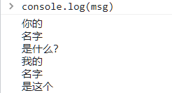

**模板字符串：**

```js
'use strict';
let name = "isaiah";
let age = 3;
let msg = `你好呀，我是${name}`  // msg.length = 12
```

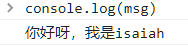

**字符串长度：**

```js
console.log(str.length);
```

**字符串的可变性：JS 中的字符串是不可变的**

```js
'use strict';
let name = "isaiah";
console.log(name[0]);
name[0] = 'a';
console.log(name);
```

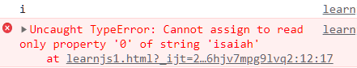

**字符串中的大小写转换：不改变字符串本身**

```js
'use strict';
let name = "isAiAh";
console.log(name);
console.log(name.toUpperCase());
console.log(name);
console.log(name.toLowerCase());
```

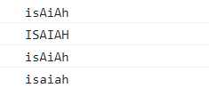

**indexOf & substring（substring不改变原来字符串的值）**

```js
'use strict';
let name = "isaiah";
console.log(name.indexOf('a'));
console.log(name.substring(0,2));
console.log(name);
```

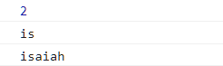

## 3.2 数组部分

**数组可以包含任意的数据类型**

```js
'use strict';
let arr = [1,2,3,4,'a',3.14,[1,2,3]];
console.log(arr[0]);
arr[0] = 2;
console.log(arr);
```

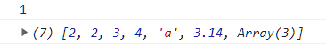

**数组arr 的长度由arr.length 限定，若给其赋值，arr 数组长度就会发生变化**

```js
'use strict';
let arr = [1,2,3,4,'a',3.14,[1,2,3]];
console.log(arr.length);   // 原来是 7
// 通过改变length的值，放大数组
arr.length = 10;
console.log(arr);
// 通过改变length的值，缩小数组
arr.length = 3;
console.log(arr);
// 缩小后再放大显示数据丢失
arr.length = 5;
console.log(arr);
```

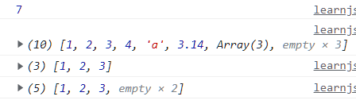

**数组和字符串一样，也有indexOf方法**

**数组和字符串的substring 一样，有slice 方法，返回一个新的数组**

```js
'use strict';
let arr = [1,'1',2,3,4,'a',3.14,[1,2,3]];
console.log(arr.indexOf(1));
console.log(arr.indexOf('1'));
console.log(arr.slice(0, 2));
console.log(arr);
```

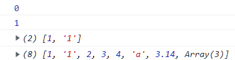

**push & pop（尾部）：**

**push 返回数组的新长度，pop 返回弹出的值，两个操作都是对数组本身作用的**

```js
'use strict';
let arr = [1,'1',3.14,[1,2,3]];
console.log(arr.push('#####'));
console.log(arr);
console.log(arr.pop());
console.log(arr);
```

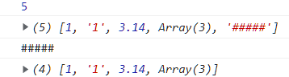


**unshift & shift（头部）：同上**

```js
'use strict';
let arr = [1,'1',3.14,[1,2,3]];
console.log(arr.unshift("@@@"));
console.log(arr);
console.log(arr.shift());
console.log(arr);
```

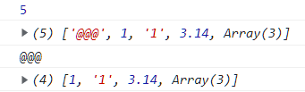

**sort**

The **`sort()`** method sorts the elements of an array *[in place](https://en.wikipedia.org/wiki/In-place_algorithm)* and returns the reference to the same array, now sorted. The default sort order is ascending, built upon converting the elements into strings, then comparing their sequences of UTF-16 code units values.

```js
const months = ['March', 'Jan', 'Feb', 'Dec'];
months.sort();
console.log(months);
// Expected output: Array ["Dec", "Feb", "Jan", "March"]

const array1 = [1, 30, 4, 21, 100000];
array1.sort();
console.log(array1);
// Expected output: Array [1, 100000, 21, 30, 4]
```


**reverse**

```js
use strict';
let arr = [1,'1',3.14,[1,2,3]];
console.log(arr);
console.log(arr.reverse());
```

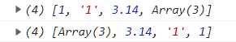

**concat：与push 不同，其不改变原来的数组**

```js
'use strict';
let arr = [1,'1',3.14,[1,2,3]];
console.log(arr.concat('@@@'));
console.log(arr);
```

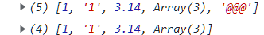


**join：用指定的字符串拼接数组的各个元素，组成一个字符串**

```js
use strict';
let arr = [1,'1',3.14,[1,2,3]];
console.log(arr.join('@@@'));
console.log(arr);
```

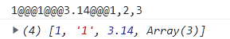


## 3.3 面向对象部分

```js
'use strict';
let person = {
    name: 'isaiah',
    age: 3,
    hobby: 'play'
}
```

**使用一个不存在的属性，不会报错，只是提示 undefined**

```js
person.haha
undefined
```

**动态的移除对象的属性，使用 delete 关键字**

```js
delete person.name
true
person
```

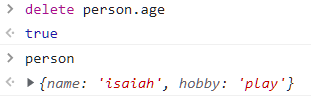

**动态的为对象添加属性，直接给新属性赋值即可**

```js
person.haha = 'haha'
'haha'
person
```

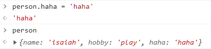

**判断指定的属性是否在对象中：‘属性’   in   对象**

```js
'name' in person
true
name in person
false
```

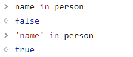

**每个对象都继承了一些方法和属性，可以用hasOwnProperty 方法来判断方法或属性是不是自身的**

```js
person.hasOwnProperty('toString');
false
person.hasOwnProperty('name');
true
```


JS 早期漏洞

```js
 'use strict';
let arr = [3,4,5];
arr.name = 123;
console.log(arr);
```

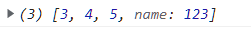


## 3.4 循环结构

```js
'use strict';
// for 循环
for (let i = 0; i < 5; i++) {
    console.log(i);
}
// forEach 循环
let arr = [1,3,4,2,2,1,5,8];
arr.forEach(function (e) {
    console.log(e);
});
// for...in 循环(不推荐)
for (let arrKey in arr) {
    console.log(arr[arrKey]);
}
// for...of 循环（推荐）
for (let x of arr) {
    console.log(x);
}
```


## 3.5 容器部分

**JS 之中只有两个容器：Map 和 Set**

**Map**

```js
'use strict';
let map = new Map([['tom', 100], ['jack', 90], ['ja', 80]]);
let name = map.get('tom');
map.set('admin', 1234);
console.log(map);
map.delete('tom');
console.log(map);
```

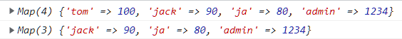

**Set**

```js
use strict';
let set = new Set([1,23,12,12,23,1,12]);
set.add(2);
console.log(set);
set.delete(1);
console.log(set);
```

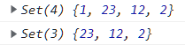


## 3.6 iterator

es6 新特性


# 4. 函数

## 4.1 定义函数

> 方式一

```js
function abs(x) {
    if (x < 0) {
        return -x;
    } else {
        return x;
    }
}
```

函数执行到 return 语句代表函数结束，返回结果！

若函数没有 return 语句，执行到最后也会返回结果，结果是 undefined

> 方式二

```js
let abs = function(x) {
    if (x < 0) {
        return -x;
    } else {
        return x;
    }
}
```

function 是一个匿名函数，可以把结果赋值给 abs，通过 abs 就可以调用函数

**方式一和方式二等价**


## 4.2 调用函数

```js
abs(-10)	// 10
```

参数问题：JS 可以传入任意个参数，甚至也可以不传递参数~

```js
let abs = function(x) {
    if (x < 0) {
        return -x;
    } else {
        return x;
    }
};
console.log(abs(-10));		// 10
console.log(abs());			// undefined
```

可以对参数进行判断，规避参数不存在的情况

```js
let abs = function(x) {
    if (typeof x !== 'number') {
        throw 'not a number';
    }
    if (x < 0) {
        return -x;
    } else {
        return x;
    }
};
console.log(abs(-10));
console.log(abs());
```

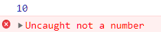

> arguments 关键字

这个关键字代表传递进来的所有参数，是一个数组

```js
let abs = function(x) {
    console.log('我们期望的参数'+x);
    for (let i = 0; i < arguments.length; i++) {
        console.log(arguments[i]);
    }
    if (x < 0) {
        return -x;
    } else {
        return x;
    }
};
console.log(abs(1,2,3,5,-4,-3,-3));
```


> rest 关键字

es6 引入的新特性，获取除了已经定义的参数之外的所有参数

```js
// rest 参数只能写在最后，且必须用...标识
let aaa = function(a,b,...rest) {
    console.log('a ---> ' + a);
    console.log('b ---> ' + b);
    console.log(rest);
};
console.log(1,2,3,4,5,6,7);
```

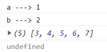

# 5. 变量

**JavaScript 中，函数及变量的声明都将被提升到函数的最顶部**；也就是说，**变量可以先使用再声明**

```js
// 这样是可以的，但是不推荐，应该把变量的声明放在最前面
x = 5; // 变量 x 设置为 5
elem = document.getElementById("demo"); // 查找元素
elem.innerHTML = x;                     // 在元素中显示 x
var x; // 声明 x
```

**JavaScript 只有声明的变量会提升，初始化的不会**

```js
// 这样的y会显示undefined，也就是初始化的操作不会提升
var x = 5; // 初始化 x
elem = document.getElementById("demo"); // 查找元素
elem.innerHTML = x + " " + y;           // 显示 x 和 y
var y = 7; // 初始化 y
```


## 5.1 全局作用域

**JS 实际上只有一个全局作用域（window）**，任何变量（包括函数，函数也被视为变量）

```js
var x = 'hello world';
alert(x);
window.alert(window.x);
```

上下是等价的，下面window.alert 失效（全局变量冲突）

```js
var x = 'hello world';
alert(x);
window.alert = function() {

};
window.alert(window.x);
```

**由于我们所有的全局变量都会绑定到window 上面，如果不同的 js 文件使用了同名的全局变量，将会造成冲突**

**解决办法：使用命名空间，减少全局变量的冲突**


## 5.2 局部作用域 let

```js
'use strict';
let aaa = function() {
    for (var i = 0; i < 5; i++) {
        console.log(i);
    }
    // 不会是5吧
    console.log(i);
}
```

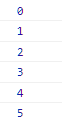

**使用let 定义 i 避免出乎意料的结果**

```js
'use strict';
let aaa = function() {
    for (let i = 0; i < 5; i++) {
        console.log(i);
    }
    // 不会是5吧
    console.log(i);
}
```


**建议用 let 去定义局部作用域的变量**


## 5.3 常量 const

在ES6 之前，用大写字母定义的都是常量，而这只是规范而已，修改这样的常量是不会报错的

```js
'use strict';
const PI = "3.14";
PI = "3";
```

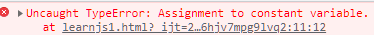


# 6. 方法

**方法就是把函数放在对象里面**，对象只有两个部分：**属性 & 方法**

```js
 'use strict';
let  student = {
    name: 'isaiah',
    birth: 2000,
    age: function() {
        let now = new Date().getFullYear();
        return now - this.birth;
    }
};
console.log(student.name);	// isaiah
console.log(student.age());		// 2023 - 2000 = 23
```

上面的代码还可以拆开写，结果是一样的

```js
'use strict';
let getAge = function() {
    let now = new Date().getFullYear();
    return now - this.birth;
};

let  student = {
    name: 'isaiah',
    birth: 2000,
    age: getAge
};
console.log(student.name);	// isaiah
console.log(student.age());		// 2023 - 2000 = 23
```

**这里的this 指向调用它的那个对象**

**在JS 中可以用apply 来控制this 的指向，类似Java 中的 invoke()** 

```js
'use strict';
let getAge = function() {
    let now = new Date().getFullYear();
    return now - this.birth;
};

let  student = {
    name: 'isaiah',
    birth: 2000,
    age: getAge
};
// this 指向了 student，参数为空
getAge.apply(student, []);
```


# 7. 内部对象

## 7.1 标准对象

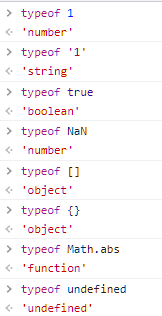


## 7.2 Date 类

### 7.2.1 基本使用

```js
'use strict';
let now = new Date();   // Wed Feb 08 2023 19:48:38 GMT+0800 (中国标准时间)
now.getFullYear();      // 年
now.getMonth();     // 月
now.getDate();      // 日

now.getDay();   // 星期
now.getHours();     // 时
now.getMinutes();   // 分
now.getSeconds();   // 秒

now.getTime();      // 时间戳，世界统一，1970/1/1 0:0:0 毫秒数
```

### 7.2.2 时间转换

```js
'use strict';
// 通过时间戳获得真实的时间
let now = new Date(1578106175991);  // Sat Jan 04 2020 10:49:35 GMT+0800 (中国标准时间)
now.toLocaleString();       // 2020/1/4 10:49:35
console.log(now.toISOString());     // 2020-01-04T02:49:35.991Z
```


## 7.3 JSON 类

### 7.3.1 JSON 是什么

早期，所有的数据传输习惯使用XML文件

+ JSON（JavaScript Object Notation）是一种轻量级的数据交换格式
+ 易于阅读和编写，同时也易于计算机解析和生成，提升了传输效率

在JS 中一切皆对象，在格式上，JSON 和 JS 对象都用大括号，数组都用中括号，属性和方法使用键值对

### 7.3.2 JSON 字符串与 JS 对象的转化

```js
'use strict';
let user = {
    name: 'isaiah',
    age: 20,
    hobby: 'read'
};
let json_encode = JSON.stringify(user);
console.log(json);
let json_decode = JSON.parse(json);
console.log(json_decode);
```

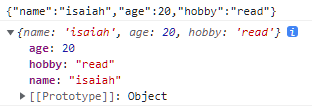


# 8. 面向对象编程

**JS 中有原型的概念，原型可以让对象指定自己的父类**

```js
'use strict';
let student = {
    name: 'isaiah',
    age: 15,
    run: function () {
        console.log(this.name + " run...");
    }
};
var jack = {
    name: 'jack'
};

// jack 继承自 student 所以有了run 的方法
jack.__proto__ = student;

var bird = {
    fly: function () {
        console.log(this.name + " fly...");
    }
};

// jack 继承自 bird，所以有了fly 的方法
jack.__proto__ = bird;
```

**用原型化的方法添加对象的可以节约内存空间**

```js
'use strict';
function Person(name, age) {
    this.name = name;
    this.age = age;
}
Person.prototype.eat = function() {
    console.log("这个方法是所有对象共有的")
};
let per1 = new Person('小明', 25);
let per2 = new Person('小红', 24);
console.log(per1 === per2);  //false
```


