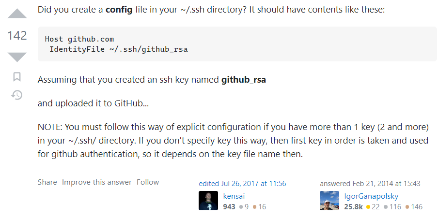

## 1. SSH 原理

1. 先将**客户端的公钥交给服务器**，用以之后验证该客户端的登录请求

2. 客户端向服务器**发起登录请求**

3. 服务器根据请求中的信息**索引对应该客户端的公钥**
4. 服务器**随机生成一个数字，并用这个公钥加密**，发给客户端
   1. 验证这个发送登录请求的客户端**是否有能够证明身份的私钥**
   2. 验证的方法就是看发送请求的客户端是否有解密的能力
5. 客户端**将解出来的随机数发送给服务器**
6. 服务器将**结果和答案进行对照**，如果相同则登录成功

+ **Public key –** Everyone can see it, no need to protect it. (for encryption function)

+ **Private key –** Stays in computer, must be protected. (for decryption function)

  

## 2. windows 的前期准备

+ 可选功能 - > OpenSSH 客户端

+ 在 cmd 中可以运行 ssh 指令即为成功

若用 win 作为 ssh 服务端，需要OpenSSH 服务端并编辑 tcp:22 的入站规则（TCP 端口和 UDP 端口是分开算的）

从另一台电脑访问该 win 主机的ssh服务`ssh 1203@192.168.8.120`

`@`前是远程服务器 win 主机的登录名，`@`后是该服务器的 IP 地址


## 3. ssh-keygen

进入到 ~/.ssh 目录（windows 下为 C:\users\1203）

打开 git bash 输入命令

```bash
# -t 指定生成密钥所用的算法 -C 指定邮箱作为标签
$ ssh-keygen -t ed25519 -C "your_email@example.com"
# id_ALGORITHM 可以换成 id_isaiah 否则会有同名的困扰
> Enter a file in which to save the key (/c/Users/YOU/.ssh/id_ALGORITHM):[Press enter]
> Enter passphrase (empty for no passphrase): [Type a passphrase]
> Enter same passphrase again: [Type passphrase again]
```

> ```txt
> -C comment
> 			Provides a new comment.
> ```

命令执行之后会生成 id_isaiah 私钥 和 id_isaiah.pub 公钥

把私钥交给 ssh-agent 管理

```bash
$ ssh-add ~/.ssh/id_ed25519
```


## 4. ssh-agent

ssh agent 意为 **ssh 代理**，是一个**客户端密钥管理器**

ssh-agent 是 ssh 默认的代理，Pageant 是客服端 PuTTY 的代理

**windows 开启 ssh-agent**

>  services.msc -> OpenSSH Authentication Agent -> 自动 启动 / 自动启动

**windows 在 git-bash 中开启 ssh-agent**

```bash
# 在后台开启 ssh-agent
$ eval "$(ssh-agent -s)"
> Agent pid 59566
```

> eval 是shell 内置命令，它**可以将一个变量中包含的字符串扩展成shell 脚本并执行**。 当我们通过字符串拼接的方式生成一个 Linux 命令时，可以用eval 来执行它

> 运行ssh-agent，它会打印出来它使用的环境和变量 -s：生成Bourne shell 风格的命令输出


ssh 命令默认连接服务器的 22 端口

The **.bashrc**（bash runcom） file is a script file that’s executed when a user logs in.


test

Shell中的 test 命令用于检查某个条件是否成立，它可以进行数值、字符和文件三个方面的测试

-f 文件名	如果文件存在且为普通文件则为真


## 5. github

Using the SSH protocol, you can connect and authenticate to remote servers and services. With SSH keys, you can connect to GitHub without supplying your username and personal access token at each visit. You can also use an SSH key to sign commits.


## 6. git 配置

```bash
git clone 克隆到本地
git init 初始化一个空的本地仓库
git add .
git commit -am 23/3/10
```
git config --global --user.name="ahematova"

git config --global --user.email="123@gmail.com"

git config --global http.proxy http://127.0.0.1:7890	设置代理

git config --global --unset http.proxy	取消代理


git config --list 	查看 git 所有配置

git config --global --edit	编辑配置文件


git push origin master

git pull origin master

git branch -d [本地分支] 删除本地分支

git branch -a 查看所有分支，包括本地远程

git push origin --delete main 删除远程库

git config --global -l 列出config中的用户配置信息

git log 显示历史情况

git reflog 显示包括撤回的历史情况

git show HEAD 指针指向

git status 本地库状态

git remote -v 显示远程库

git commit -m "add new file"

git rm note.txt 从暂存区和工作区删除

git rm --cached note.txt 从暂存区删除


### 如何 clone 指定的分支

要克隆 Git 项目的不同分支，可以使用以下命令：

```
git clone -b <branch_name> <remote_repo_url>
```

其中，`<branch_name>` 是要克隆的分支名称，`<remote_repo_url>` 是远程 Git 仓库的 URL。

例如，如果要克隆名为`my-branch`的分支，可以使用以下命令：

```
git clone -b my-branch https://github.com/myuser/myproject.git
```

这将克隆远程 Git 仓库 `https://github.com/myuser/myproject.git` 的 `my-branch` 分支到当前目录下的 `myproject` 目录中。

如果您已经克隆了项目，可以在项目目录中使用以下命令来获取特定分支的更新：

```
git checkout <branch_name>
```

其中，`<branch_name>` 是要检出的分支名称。这将切换您的本地 Git 仓库到特定分支，以便您可以访问和修改该分支的代码。

### clone 指定 tag 呢

要克隆 Git 项目的指定 tag，可以使用以下命令：

```
git clone --branch <tag_name> --single-branch <remote_repo_url>
```

其中，`<tag_name>` 是要克隆的 tag 名称，`<remote_repo_url>` 是远程 Git 仓库的 URL。

例如，如果要克隆名为`v1.0.0`的 tag，可以使用以下命令：

```
git clone --branch v1.0.0 --single-branch https://github.com/myuser/myproject.git
```

这将克隆远程 Git 仓库 `https://github.com/myuser/myproject.git` 的 `v1.0.0` tag 到当前目录下的 `myproject` 目录中。

如果您已经克隆了项目，可以在项目目录中使用以下命令来获取指定 tag 的更新：

```
git checkout <tag_name>
```

其中，`<tag_name>` 是要检出的 tag 名称。这将切换您的本地 Git 仓库到指定的 tag，以便您可以访问和修改该 tag 的代码。


## 7. 异常情况

### 7.1 ssh-add 异常

ssh-add returns with: "Error connecting to agent: No such file or directory"

说明 ssh-agent 没有打开，不能使用 ssh-add 功能来添加私钥到 ssh-agent


### 7.2 no clone 但想要提交到远程仓库


### 7.3 github 拒绝了对 22 端口的访问

ssh: connect to host github.com port 22: Connection refused

```bash
$ git pull
ssh: connect to host github.com port 22: Connection refused
fatal: Could not read from remote repository.

Please make sure you have the correct access rights
and the repository exists.
```

**解决方法：**

使用 github 的 443 端口，也即使用 https 的端口

~~~bash
$ vim ~/.ssh/config
```
# Add section below to it
Host github.com
  Hostname ssh.github.com
  Port 443
```
$ ssh -T git@github.com
Hi xxxxx! You've successfully authenticated, but GitHub does not
provide shell access.
~~~


### 7.4 github 公钥拒绝

GitHub's Permission denied (publickey) error

原因是没有在 ssh-agent 中添加对应的私钥

每次使用 ssh 服务都要添加一次很是麻烦，尤其是考虑到有多个私钥的情况

解决办法是在 ~/.ssh/config 中配置相关的属性，把私钥和 github.com 对应上


