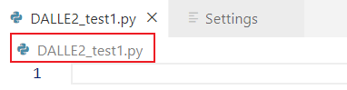
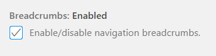

## 1. 面包屑功能（Settings）

## 2. 常用快捷键

Navigate between recently opened folders and workspaces
Open Recent

Keyboard Shortcut: Ctrl+R

Navigate between recently opened files
Repeat the Quick Open keyboard shortcut to cycle quickly between recently opened files.

keyboard Shortcut: Ctrl + P

You can also create language specific settings with the **Configure Language Specific Settings** command.

Integrated Terminal
Keyboard Shortcut: Ctrl+`

Toggle Sidebar
Keyboard Shortcut: Ctrl+B

Zen mode
Keyboard Shortcut: Ctrl+K Z

Press Esc twice to exit Zen Mode.

Multi cursor selection
To add cursors at arbitrary positions, select a position with your mouse and use Alt+Click

To set cursors above or below the current position use:

Keyboard Shortcut: Ctrl+Alt+Up or Ctrl+Alt+Down

You can add additional cursors to all occurrences of the current selection with Ctrl+Shift+L.

If you do not want to add all occurrences of the current selection, you can use Ctrl+D instead. This only selects the next occurrence after the one you selected so you can add selections one by one.

You can select blocks of text by holding Shift+Alt (Shift+Option on macOS) while you drag your mouse. A separate cursor will be added to the end of each selected line.

Move line up and down
Keyboard Shortcut: Alt+Up or Alt+Down

You can group the symbols by kind by adding a colon, `@:`.