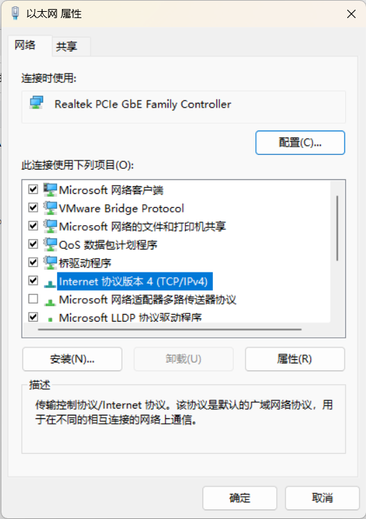

## 1. 正确连接上了网络，但是系统在任务栏依然显示未连接的图标（小地球）

### 1.1 原理

#### 1.1.1 名词解释（NLA, NCSI, FQDN）

Network Location Awareness (**NLA**) 网络位置识别

Network Connectivity Status Indicator (**NCSI**) 网络连接状态指示器

Fully qualified domain name (**FQDN**) 全限定域名

#### 1.1.2 工作流程

> Windows uses the `NLA` service to detect the properties of a network and determine how to manage connections to that network. 
> 
> NLA uses a component that is named the `NCSI` to determine whether the computer has successfully connected to the network, and whether the network has intranet or internet connectivity.

NCSI uses both **active** and **passive** probes.

Active Probe 会从两个角度进行测试:

- **DNS 解析**
- **HTTP 连接**

两个测试任意一个不过都会导致 **无 Internet, 已连接** 这个结果。除了图标的显示有差别外，Windows 其实把 Active Probe 的结果用在了很多系统内置条件的判断上，网络不通会导致非常多的功能不可用 

**任何网络接口的变化都会引起 NCSI 的检测** These probes are triggered by ==changes in any of the network interfaces==

**Windows 10 or later versions:**

1. NCSI sends a **DNS request** to resolve the address of the `www.msftconnecttest.com` FQDN.
2. If NCSI receives a valid response from a DNS server, NCSI sends a plain **HTTP GET request** to `http://www.msftconnecttest.com/connecttest.txt`.
3. If NCSI successfully downloads the text file, it makes sure that the file contains ==Microsoft Connect Test==.
4. NCSI sends another **DNS request** to resolve the address of the `dns.msftncsi.com` FQDN.
   - **If any of these requests fails, the network alert appears in the Task Bar.** If you hover over the icon, you see a message such as "No connectivity" or "Limited Internet access" (depending on which requests failed).
   - If all of these requests succeed, the Task Bar shows the usual network icon. If you hover over the icon, you see a message such as "Internet access."

**Windows 8.1 or earlier versions:**

1. NCSI sends a **DNS request** to resolve the address of the `www.msftncsi.com` FQDN.
2. If NCSI receives a valid response from a DNS server, NCSI sends a plain **HTTP GET request** to `http://www.msftncsi.com/ncsi.txt`.
3. If NCSI successfully downloads the text file, it makes sure that the file contains Microsoft NCSI.
4. NCSI sends another **DNS request** to resolve the address of the `dns.msftncsi.com` FQDN.
   - **If any of these requests fails, the network alert appears in the Task Bar.** If you hover over the icon, you see a message such as "No connectivity" or "Limited Internet access" (depending on which requests failed).
   - If all of these requests succeed, the Task Bar shows the usual network icon. If you hover over the icon, you see a message such as "Internet access."

> NCSI and the NLA service combine these responses with other information to build a profile of the network connection, or identify its existing profile. The network connection profile provides the information that Windows needs to configure the appropriate Windows Firewall profile:
> 
> - For Active Directory-authenticated networks: Firewall domain profile.
> - For networks that the user has marked as "private": Firewall private profile.
> - For networks that the user has marked as "public": Public firewall profile.

### 1.2 引用

[An Internet Explorer or Edge window opens when your computer connects to a corporate network or a public network](https://learn.microsoft.com/en-US/troubleshoot/windows-client/networking/internet-explorer-edge-open-connect-corporate-public-network)

[Windows 用来检测网络连通性的 IP 似乎被劫持了](https://v2ex.com/t/806309)

### 1.3 解决办法（regedit）

http://www.msftconnecttest.com/connecttest.txt 不行就换成 win10 之前的 http://www.msftncsi.com/ncsi.txt

打开注册表：win + R 输入 regedit

`计算机\HKEY_LOCAL_MACHINE\SYSTEM\CurrentControlSet\Services\NlaSvc\Parameters\Internet`


**注意：EnableActiveProbing 要设置为 1 开启**

## 2. 局域网共享文件夹中可以看到别人但是看不到自己

控制面板 – 程序 – 启用或关闭系统功能，选中 SMB 1.0/CIFS 文件共享支持，并点击确定

服务和应用程序 – 服务，确保 TCP/IP NetBIOS Helper 以及 Computer Browser 服务处于正在运行状态

高级电脑设置 – 计算机名，确保局域网内所有计算机的工作组名称一致

## 3. 使用 windows 自带的远程桌面（mstsc）

win + R 中运行 mstsc 打开远程桌面

计算机：host 主机的计算机名 （DESKTOP-11）

用户名：MicrosoftAccout\\[微软账户名（注册时候的邮箱）]

**账户密码都对但还是不行 / 凭据问题：**

+ 设置本地账户

+ 点击桌面左下角的开始按钮，然后点击你的账户头像，注销该账户

+ 退回到登录界面，然后不要用pin密码登录而是用微软账户的密码登录

## 4. 使用开机自启动

### 4.1 通过桌面快捷方式

win + R 进入 shell:startup

### 4.2 通过注册服务的方式

可以借助[Windows Service Wrapper](https://github.com/winsw/winsw/releases)小工具，将需要安装的程序转换为Windows服务。

多个服务启动的顺序会有先后依赖，如Springboot启动依赖MySQL和Redis

因此开机自启动注册服务时，需要设置它们的依赖关系

### 4.3 任务计划程序库中设置

可以任意定义何时何地执行脚本

[Windows10系统设置定时任务 开机启动.bat文件](https://blog.csdn.net/circle_do/article/details/84861028)

## 5. ping 不通win计算机

### 5.1 ipv4


tcping 可以指定端口进行 tcp 连接的测试，比如 mstsc 就是用 3389 端口进行 tcp 连接的

### 5.2 ipv6

如果是 ping ipv6 的话还需要进行开启下面的两个使能


仅仅是这样还不能从公网 ping 通 ipv6 地址，需要如下的设置


## 6. zerotier ping 不通

将 clash 设置为 ipv6 可以有效防止冲突问题（开了 clash 就连不上 earth）


## 7. 指定局域网中设备的静态 ip

设置 —> 网络和 Internet —> 高级网络设置 —> 更多适配器选项

选中网络适配器，右键属性，ipv4 属性，设置静态 ip




# 8. 无法运行脚本

```bash
. : 无法加载文件 C:\Users\Administrator\Documents\WindowsPowerShell\Microsoft.PowerShell_profile.ps1，因为在此系统上禁
止运行脚本。有关详细信息，请参阅 https:/go.microsoft.com/fwlink/?LinkID=135170 中的 about_Execution_Policies。
所在位置 行:1 字符: 3
+ . 'C:\Users\Administrator\Documents\WindowsPowerShell\Microsoft.Power ...
+   ~~~~~~~~~~~~~~~~~~~~~~~~~~~~~~~~~~~~~~~~~~~~~~~~~~~~~~~~~~~~~~~~~~~
    + CategoryInfo          : SecurityError: (:) []，PSSecurityException
    + FullyQualifiedErrorId : UnauthorizedAccess
```

1.  以管理员身份运行 terminal;
2.  执行：**get-ExecutionPolicy**，显示**Restricted**，表示状态是禁止的;
3.  执行：**set-ExecutionPolicy RemoteSigned**;
4.  这时再执行**get-ExecutionPolicy**，就显示**RemoteSigned;**
5. 这样就可以解决了。
