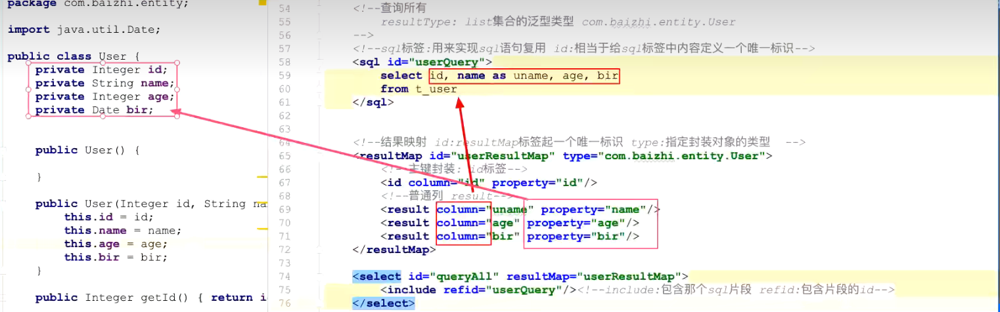
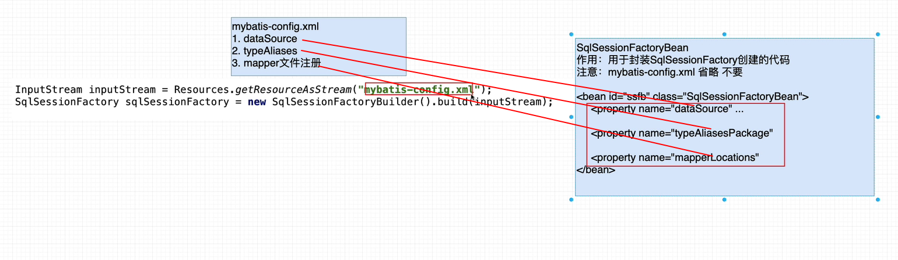
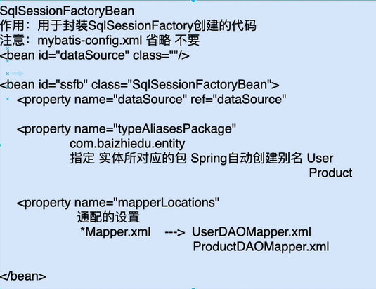
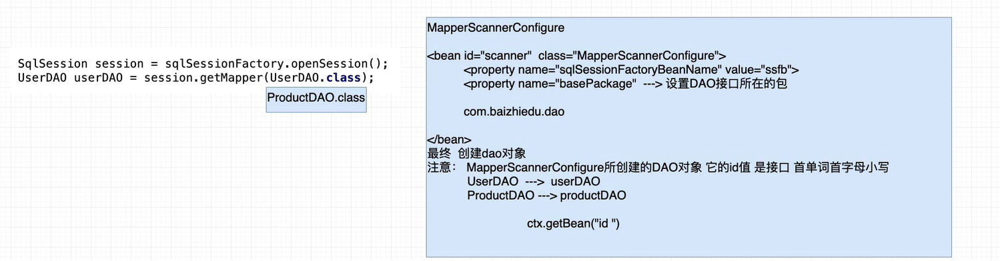
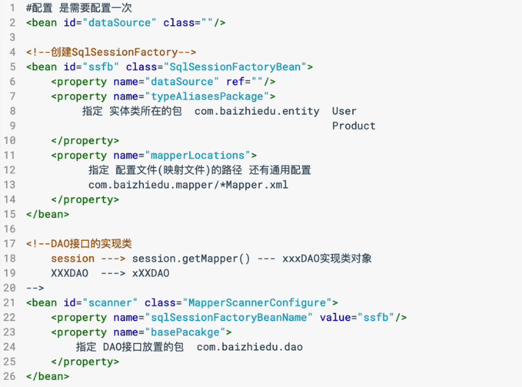

# 1. 环境及其测试

+ 创建maven项目

+ 引入mybatis依赖和mysql驱动

+ mybatis的主配置文件

  ```xml
  <?xml version="1.0" encoding="UTF-8" ?>
  <!DOCTYPE configuration
          PUBLIC "-//mybatis.org//DTD Config 3.0//EN"
          "https://mybatis.org/dtd/mybatis-3-config.dtd">
  <configuration>
  
  <!--    环境操作的是哪个数据库 environments 环境复数 prod dev test-->
      <environments default="prod">
  <!--        生产环境-->
          <environment id="prod">
              <transactionManager type="JDBC"/>
              <dataSource type="POOLED">
                  <property name="driver" value="com.mysql.jdbc.Driver"/>
                  <property name="url" value="jdbc:mysql://localhost:3306/mybatis?useSSL=false&amp;characterEncoding=utf8"/>
                  <property name="username" value="root"/>
                  <property name="password" value="123456"/>
              </dataSource>
          </environment>
  
      </environments>
  
  <!--    注册项目中的mapper配置文件-->
      <mappers>
          <mapper resource="com/isaiah/mapper/userDAO.xml"/>
      </mappers>
  </configuration>
  ```

  

+ 获取sqlSession

  ```java
  package com.isaiah;
  
  import com.isaiah.dao.UserDAO;
  import com.isaiah.entity.User;
  import org.apache.ibatis.io.Resources;
  import org.apache.ibatis.session.SqlSession;
  import org.apache.ibatis.session.SqlSessionFactory;
  import org.apache.ibatis.session.SqlSessionFactoryBuilder;
  
  import javax.annotation.Resource;
  import java.io.IOException;
  import java.io.InputStream;
  import java.util.Date;
  
  public class TestMyBatis {
      public static void main(String[] args) throws IOException {
          // 读取xml文件
          InputStream in = Resources.getResourceAsStream("./mybatis-config.xml");
          // 创建mybatis核心对象sqlSessionFactory
          SqlSessionFactory sqlSessionFactory = new SqlSessionFactoryBuilder().build(in);
          // 获取sqlSession
          SqlSession sqlSession = sqlSessionFactory.openSession();
  
          System.out.println("sqlSession = " + sqlSession);
      }
  }
  
  ```

  

+ 建表

  ```sql
  CREATE TABLE `t_user` (
    `id` int(6) NOT NULL AUTO_INCREMENT,
    `name` varchar(40) DEFAULT NULL,
    `age` int(3) DEFAULT NULL,
    `bir` timestamp NULL DEFAULT NULL,
    PRIMARY KEY (`id`)
  ) ENGINE=InnoDB DEFAULT CHARSET=utf8;
  ```

+ 实体对象 entity model     com.isaiah.entity / com.isaiah.model

  ```java
  package com.isaiah.entity;
  
  import java.util.Date;
  
  public class User {
      private Integer id;
      private String name;
      private Integer age;
      private Date bir;
  
      public User() {
      }
  
      public User(Integer id, String name, Integer age, Date bir) {
          this.id = id;
          this.name = name;
          this.age = age;
          this.bir = bir;
      }
  
      @Override
      public String toString() {
          return "User{" +
                  "id=" + id +
                  ", name='" + name + '\'' +
                  ", age=" + age +
                  ", bir=" + bir +
                  '}';
      }
  
      public Integer getId() {
          return id;
      }
  
      public void setId(Integer id) {
          this.id = id;
      }
  
      public String getName() {
          return name;
      }
  
      public void setName(String name) {
          this.name = name;
      }
  
      public Integer getAge() {
          return age;
      }
  
      public void setAge(Integer age) {
          this.age = age;
      }
  
      public Date getBir() {
          return bir;
      }
  
      public void setBir(Date bir) {
          this.bir = bir;
      }
  }
  
  ```

+ 开发DAO接口

  ```java
  // 注意：mybatis要求接口中不能定义方法的重载（接口中的方法名字必须不同）
  // User findByUser(Integer id);
  // User findByUser(Integer age);
  
  package com.isaiah.dao;
  
  import com.isaiah.entity.User;
  
  public interface UserDAO {
      // 保存用户
      int save(User user);
  }
  
  ```

  

+ 开发Mapper配置文件

  ```xml
  // 注意：mybatis中一个DAO接口对应一个Mapper配置文件
  // 注意：在idea中建立配置文件中的目录使用“/”
  
  <?xml version="1.0" encoding="UTF-8" ?>
  <!DOCTYPE mapper
          PUBLIC "-//mybatis.org//DTD Mapper 3.0//EN"
          "https://mybatis.org/dtd/mybatis-3-mapper.dtd">
  
  <!--namespace属性： 命名空间 指明当前mapper配置文件是对哪个DAO接口的实现-->
  <mapper namespace="com.isaiah.dao.UserDAO">
      <!--    id 方法名 parameterType 参数类型 包.类-->
  <!--    useGeneratedKeys="true"（默认） 使用数据库的自动递增，只对mysql有效-->
  <!--    keyProperty="id" 当使用自动生成主键策略时，将自动生成的主键赋值给哪个属性-->
      <insert id="save" parameterType="com.isaiah.entity.User" useGeneratedKeys="true" keyProperty="id">
          insert into t_user values (#{id}, #{name}, #{age}, #{bir})
      </insert>
  </mapper>
  ```

+ 测试userDAO

  ```java
  package com.isaiah;
  
  import com.isaiah.dao.UserDAO;
  import com.isaiah.entity.User;
  import org.apache.ibatis.io.Resources;
  import org.apache.ibatis.session.SqlSession;
  import org.apache.ibatis.session.SqlSessionFactory;
  import org.apache.ibatis.session.SqlSessionFactoryBuilder;
  
  import javax.annotation.Resource;
  import java.io.IOException;
  import java.io.InputStream;
  import java.util.Date;
  
  public class TestMyBatis {
      public static void main(String[] args) throws IOException {
          // 读取xml文件
          InputStream in = Resources.getResourceAsStream("./mybatis-config.xml");
          // 创建mybatis核心对象sqlSessionFactory
          SqlSessionFactory sqlSessionFactory = new SqlSessionFactoryBuilder().build(in);
          // 获取sqlSession
          SqlSession sqlSession = sqlSessionFactory.openSession();
  
  //        System.out.println("sqlSession = " + sqlSession);
          // 获取DAO对象
          UserDAO userDAO = sqlSession.getMapper(UserDAO.class);
  
          try {
              User user = new User(null, "小王", 23, new Date());
              int count = userDAO.save(user);
              System.out.println("影响的条数 = " + count);
              // 通过keyProperty="id"赋值
              System.out.println("本次数据库生成id"+user.getId());
              sqlSession.commit(); // 提交事务
          } catch (Exception e) {
              e.printStackTrace();
              sqlSession.rollback(); // 回滚
          } finally {
              sqlSession.close(); // 释放资源
          }
      }
  }
  
  ```

# 2. MyBatis中的CRUD

```java
package com.isaiah.test;

import com.isaiah.dao.UserDAO;
import com.isaiah.entity.User;
import com.isaiah.utils.MyBatisUtil;
import org.apache.ibatis.io.Resources;
import org.apache.ibatis.session.SqlSession;
import org.apache.ibatis.session.SqlSessionFactory;
import org.apache.ibatis.session.SqlSessionFactoryBuilder;
import org.junit.Test;

import java.io.IOException;
import java.io.InputStream;
import java.util.Date;
import java.util.List;

public class TestCRUD {

    // 保存操作
    @Test
    public void save() throws IOException {
        // 拿到sqlSession
        InputStream is = Resources.getResourceAsStream("./mybatis-config.xml");
        SqlSessionFactory sqlSessionFactory = new SqlSessionFactoryBuilder().build(is);
        SqlSession sqlSession = sqlSessionFactory.openSession();

        try {
            UserDAO userDAO = sqlSession.getMapper(UserDAO.class);
            User user = new User(null, "小三", 23, new Date());
            userDAO.save(user);
            sqlSession.commit();
        } catch (Exception e) {
            e.printStackTrace();
            sqlSession.rollback();
        } finally {
            sqlSession.close();
        }
    }

    @Test
    public void update() throws IOException {
        InputStream is = Resources.getResourceAsStream("./mybatis-config.xml");
        SqlSessionFactory sqlSessionFactory = new SqlSessionFactoryBuilder().build(is);
        SqlSession sqlSession = sqlSessionFactory.openSession();

        try {
            UserDAO userDAO = sqlSession.getMapper(UserDAO.class);
            User user = new User(1, "小李", null, null);
            // 有值更新，没有值保留原始值：
            // 1.先查再改
            // 2.动态sql
            int update = userDAO.update(user);
            System.out.println("修改的条数 = " + update);
            sqlSession.commit();
        } catch (Exception e) {
            e.printStackTrace();
            sqlSession.rollback();
        } finally {
            sqlSession.close();
        }
    }

    @Test
    public void delete() throws IOException {
        InputStream is = Resources.getResourceAsStream("./mybatis-config.xml");
        SqlSessionFactory sqlSessionFactory = new SqlSessionFactoryBuilder().build(is);
        SqlSession sqlSession = sqlSessionFactory.openSession();

        try {
            UserDAO userDAO = sqlSession.getMapper(UserDAO.class);
            int delete = userDAO.delete(1);
            System.out.println("删除的条数 = " + delete);
            sqlSession.commit();
        } catch (Exception e) {
            e.printStackTrace();
            sqlSession.rollback();
        } finally {
            sqlSession.close();
        }
    }

    // 查询所有
    @Test
    public void testQueryAll() throws IOException {
        SqlSession sqlSession = MyBatisUtil.getSqlSession();
        UserDAO userDAO = sqlSession.getMapper(UserDAO.class);
        List<User> users = userDAO.queryAll();
        users.forEach(System.out::println);
        MyBatisUtil.close(sqlSession);
    }

    // 查询一个
    @Test
    public void testQueryById() throws IOException {
        SqlSession sqlSession = MyBatisUtil.getSqlSession();
        UserDAO userDAO = sqlSession.getMapper(UserDAO.class);
        User user = userDAO.queryById(5);
        System.out.println("user = " + user);
        MyBatisUtil.close(sqlSession);
    }

    // 模糊查询
    @Test
    public void testQueryLike() throws IOException {
        SqlSession sqlSession = MyBatisUtil.getSqlSession();
        UserDAO userDAO = sqlSession.getMapper(UserDAO.class);
        List<User> users = userDAO.queryLikeByName("三");
        users.forEach(System.out::println);
        MyBatisUtil.close(sqlSession);
    }

    // 分页查询
    @Test
    public void testQueryByPage() throws IOException {
        SqlSession sqlSession = MyBatisUtil.getSqlSession();
        UserDAO userDAO = sqlSession.getMapper(UserDAO.class);
        // 规律：start = （当前页-1）*rows
        List<User> users = userDAO.queryByPage(4, 2);
        users.forEach(System.out::println);
        MyBatisUtil.close(sqlSession);
    }

    // 查询总条数
    @Test
    public void testQueryTotalCounts() throws IOException {
        SqlSession sqlSession = MyBatisUtil.getSqlSession();
        UserDAO userDAO = sqlSession.getMapper(UserDAO.class);
        Long aLong = userDAO.queryTotalCounts();
        System.out.println("aLong = " + aLong);
        MyBatisUtil.close(sqlSession);
    }
}

```

```xml
<?xml version="1.0" encoding="UTF-8" ?>
<!DOCTYPE mapper
        PUBLIC "-//mybatis.org//DTD Mapper 3.0//EN"
        "https://mybatis.org/dtd/mybatis-3-mapper.dtd">

<!--namespace属性： 命名空间 指明当前mapper配置文件是对哪个DAO接口的实现-->
<mapper namespace="com.isaiah.dao.UserDAO">
    <!--    id 方法名 parameterType 参数类型 包.类-->
<!--    useGeneratedKeys="true"（默认） 使用数据库的自动递增，只对mysql有效-->
<!--    keyProperty="id" 当使用自动生成主键策略时，将自动生成的主键赋值给哪个属性-->
    <insert id="save" parameterType="com.isaiah.entity.User" useGeneratedKeys="true" keyProperty="id">
        insert into t_user values (#{id}, #{name}, #{age}, #{bir})
    </insert>
    
<!--    更新方法-->
    <update id="update" keyProperty="com.isaiah.entity.User">
        update t_user
#         set 标签动态去掉赋值语句前后多余的逗号
            <set>
                <if test="name!=null and name!=''">
                    name=#{name},
                </if>
                <if test="age!=null">
                    age=#{age},
                </if>
                <if test="bir!=null">
                    bir=#{bir}
                </if>
            </set>
        where id=#{id}
    </update>

<!--    删除方法-->
    <delete id="delete" parameterType="Integer">
        delete from t_user where id=#{id}
    </delete>

<!--    sql复用-->
    <sql id="userQuery">
        `id`, `name`, `age`, `bir`
    </sql>
<!--    查询所有-->
    <select id="queryAll" resultType="com.isaiah.entity.User">
        select
        <include refid="userQuery"/>
        from t_user
    </select>
<!--    查询一个-->
    <select id="queryById" resultType="com.isaiah.entity.User" parameterType="Integer">
        select
        <include refid="userQuery"/>
        from t_user
        where id=#{id}
    </select>
<!--    模糊查询-->
    <select id="queryLikeByName" parameterType="String" resultType="com.isaiah.entity.User">
        select
        <include refid="userQuery"/>
        from t_user where `name` like concat('%', #{name}, '%')
    </select>
<!--    分页查询：多个参数parameter-->
    <select id="queryByPage" resultType="com.isaiah.entity.User">
        select <include refid="userQuery"/> from t_user
        limit #{start}, #{rows}
    </select>
<!--    查询总条数-->
    <select id="queryTotalCounts" resultType="Long">
# 主键默认加索引 ≈ count(1)
        select count(id) from t_user
    </select>
</mapper>
```

```java
package com.isaiah.dao;

import com.isaiah.entity.User;
import org.apache.ibatis.annotations.Param;

import java.util.List;

public interface UserDAO {
    // 保存用户
    int save(User user);
    // 更新方法
    int update(User user);
    // 删除方法
    int delete(Integer id);
    // 查询所有
    List<User> queryAll();
    // 查询一个
    User queryById(Integer id);
    // 模糊查询
    List<User> queryLikeByName(String name);
    // 分页查询：参数1=起始位置    参数2：每页显示记录数
    List<User> queryByPage(@Param("start") Integer start, @Param("rows") Integer rows);
    // 查询总条数
    Long queryTotalCounts();
}


```

```java
// 工具类
package com.isaiah.utils;

import org.apache.ibatis.io.Resources;
import org.apache.ibatis.session.SqlSession;
import org.apache.ibatis.session.SqlSessionFactory;
import org.apache.ibatis.session.SqlSessionFactoryBuilder;

import java.io.IOException;
import java.io.InputStream;

public class MyBatisUtil {

    private static SqlSessionFactory sqlSessionFactory;

    // 静态代码块 static 特点：类加载时执行 只执行一次
    static {
        InputStream is = null;
        try {
            is = Resources.getResourceAsStream("./mybatis-config.xml");
            sqlSessionFactory = new SqlSessionFactoryBuilder().build(is);
        } catch (IOException e) {
            e.printStackTrace();
        } finally {
            try {
                is.close();
            } catch (IOException e) {
                e.printStackTrace();
            }
        }
    }

    // 提供sqlSession
    public static SqlSession getSqlSession() throws IOException {
        return sqlSessionFactory.openSession();
    }

    // 关闭sqlSession
    public static void close(SqlSession sqlSession){
        sqlSession.close();
    }
}

```

# 4. ResultType 和 ResultMap 区别

总结：resultType、resultMap都是用来对数据库中返回的结果进行封装的

+ resultType 只能封装简单类型的对象：对象中没有对象类型的属性
+ resultMap 封装复杂类型的对象：处理库表关联关系 -> 一对一、一对多、多对多



# 5. MyBatis处理关联关系

## 5.1 一对一关联关系处理

```sql
-- 一对一的关系
DROP TABLE IF EXISTS `t_person`;
CREATE TABLE `t_person`  (
  `id` int(6) NOT NULL AUTO_INCREMENT,
  `name` varchar(40),
  `age` int(3),
  `cardno` varchar(18),
  PRIMARY KEY (`id`),
);

DROP TABLE IF EXISTS `t_info`;
CREATE TABLE `t_info`  (
  `id` int(6) NOT NULL AUTO_INCREMENT,
  `cardno` varchar(18),
  `address` varchar(100),
  PRIMARY KEY (`id`),
);
```

```xml
<?xml version="1.0" encoding="UTF-8" ?>
<!DOCTYPE configuration
        PUBLIC "-//mybatis.org//DTD Config 3.0//EN"
        "https://mybatis.org/dtd/mybatis-3-config.dtd">
<configuration>

<!--    环境操作的是哪个数据库 environments 环境复数 prod dev test-->
    <environments default="prod">
<!--        生产环境-->
        <environment id="prod">
            <transactionManager type="JDBC"/>
            <dataSource type="POOLED">
                <property name="driver" value="com.mysql.jdbc.Driver"/>
                <property name="url" value="jdbc:mysql://localhost:3306/mybatis?useSSL=false&amp;characterEncoding=utf8"/>
                <property name="username" value="root"/>
                <property name="password" value="123456"/>
            </dataSource>
        </environment>

    </environments>

<!--    注册项目中的mapper配置文件-->
    <mappers>
<!--        <mapper resource="com/isaiah/mapper/UserDAO.xml"/>-->
<!--        用户信息-->
        <mapper resource="com/isaiah/mapper/PersonDAO.xml"/>
<!--        身份信息-->
        <mapper resource="com/isaiah/mapper/InfoDAO.xml"/>
    </mappers>
</configuration>
```

```xml
<?xml version="1.0" encoding="UTF-8" ?>
<!DOCTYPE mapper
        PUBLIC "-//mybatis.org//DTD Mapper 3.0//EN"
        "https://mybatis.org/dtd/mybatis-3-mapper.dtd">

<!--namespace属性： 命名空间 指明当前mapper配置文件是对哪个DAO接口的实现-->
<mapper namespace="com.isaiah.dao.PersonDAO">
    <sql id="personSQL">
        `id`, `name`, `age`, `cardno`
    </sql>

    <insert id="save" parameterType="com.isaiah.entity.Person" keyProperty="id">
        insert into t_person(`id`, `name`, `age`, `cardno`) values (#{id}, #{name}, #{age}, #{cardno})
    </insert>

    <resultMap id="personMap" type="com.isaiah.entity.Person">
        <id column="id" property="id"/>
        <result column="name" property="name"/>
        <result column="age" property="age"/>
        <result column="cardno" property="cardno"/>
<!--        处理一对一关联关系-->
        <association property="info" javaType="com.isaiah.entity.Info">
            <id column="iid" property="id"/>
            <result column="address" property="address"/>
            <result column="icardno" property="cardno"/>
        </association>
    </resultMap>
    <select id="queryAll" resultMap="personMap">
        select tp.id, tp.name, tp.age, tp.cardno,
               ti.id as iid, ti.address, ti.cardno as icardno
        from t_person tp
        left join t_info ti on tp.cardno = ti.cardno
    </select>
</mapper>
```

```xml
<?xml version="1.0" encoding="UTF-8" ?>
<!DOCTYPE mapper
        PUBLIC "-//mybatis.org//DTD Mapper 3.0//EN"
        "https://mybatis.org/dtd/mybatis-3-mapper.dtd">

<!--namespace属性： 命名空间 指明当前mapper配置文件是对哪个DAO接口的实现-->
<mapper namespace="com.isaiah.dao.InfoDAO">
<!--    <sql id="personSQL">-->
<!--        <set>-->
<!--            `id`, `name`, `age`, `cardno`-->
<!--        </set>-->
<!--    </sql>-->

    <insert id="save" parameterType="com.isaiah.entity.Person" keyProperty="id">
        insert into t_info values (#{id}, #{cardno}, #{address})
    </insert>
</mapper>
```

```java
package com.isaiah.entity;

public class Person {
    private Integer id;
    private String name;
    private Integer age;
    private String cardno;

    // 关系属性：对象体现关系  // 定义一个身份对象接收当前用户身份信息
    private Info info;

    public Info getInfo() {
        return info;
    }

    public void setInfo(Info info) {
        this.info = info;
    }

    public Person(Integer id, String name, Integer age, String cardno) {
        this.id = id;
        this.name = name;
        this.age = age;
        this.cardno = cardno;
    }

    public Person() {
    }

    public Integer getId() {
        return id;
    }

    public void setId(Integer id) {
        this.id = id;
    }

    public String getName() {
        return name;
    }

    public void setName(String name) {
        this.name = name;
    }

    public Integer getAge() {
        return age;
    }

    public void setAge(Integer age) {
        this.age = age;
    }

    public String getCardno() {
        return cardno;
    }

    public void setCardno(String cardno) {
        this.cardno = cardno;
    }

    @Override
    public String toString() {
        return "Person{" +
                "id=" + id +
                ", name='" + name + '\'' +
                ", age=" + age +
                ", cardno='" + cardno + '\'' +
                '}';
    }
}

```

```java
package com.isaiah.entity;

public class Info {
    private Integer id;
    private String cardno;
    private String address;

    public Info() {
    }

    public Info(Integer id, String cardno, String address) {
        this.id = id;
        this.cardno = cardno;
        this.address = address;
    }

    public Integer getId() {
        return id;
    }

    public void setId(Integer id) {
        this.id = id;
    }

    public String getCardno() {
        return cardno;
    }

    public void setCardno(String cardno) {
        this.cardno = cardno;
    }

    public String getAddress() {
        return address;
    }

    public void setAddress(String address) {
        this.address = address;
    }

    @Override
    public String toString() {
        return "Info{" +
                "id=" + id +
                ", cardno='" + cardno + '\'' +
                ", address='" + address + '\'' +
                '}';
    }
}

```

```java
package com.isaiah.dao;

import com.isaiah.entity.Person;

import java.util.List;

public interface PersonDAO {
    int save(Person person);
    List<Person> queryAll();
}


package com.isaiah.dao;

import com.isaiah.entity.Info;

public interface InfoDAO {
    int save(Info info);
}

```

```java
package com.isaiah.test;

import com.isaiah.dao.InfoDAO;
import com.isaiah.dao.PersonDAO;
import com.isaiah.entity.Info;
import com.isaiah.entity.Person;
import com.isaiah.utils.MyBatisUtil;
import org.apache.ibatis.session.SqlSession;
import org.junit.Test;

import java.io.IOException;

public class TestJoin {
    @Test
    public void testPerson() throws IOException {
        SqlSession sqlSession = MyBatisUtil.getSqlSession();
        try {
            PersonDAO personDAO = sqlSession.getMapper(PersonDAO.class);
            Person person = new Person();
            person.setName("小陈");
            person.setAge(23);
            person.setCardno("123456123456123456");
            int save = personDAO.save(person);
            System.out.println("save = " + save);
            sqlSession.commit();
        } catch (Exception e) {
            e.printStackTrace();
            sqlSession.rollback();
        } finally {
            MyBatisUtil.close(sqlSession);
        }
    }

    @Test
    public void testInfo() throws IOException {
        SqlSession sqlSession = MyBatisUtil.getSqlSession();
        try {
            InfoDAO infoDAO = sqlSession.getMapper(InfoDAO.class);
            Info info = new Info();
            info.setCardno("123456123456123456");
            info.setAddress("北京市朝阳区");
            int save = infoDAO.save(info);
            System.out.println("save = " + save);
            sqlSession.commit();
        } catch (Exception e) {
            e.printStackTrace();
            sqlSession.rollback();
        } finally {
            MyBatisUtil.close(sqlSession);
        }
    }

    // 查询用户信息：一对一
    @Test
    public void testQueryAll() throws IOException {
        SqlSession sqlSession = MyBatisUtil.getSqlSession();
        PersonDAO personDAO = sqlSession.getMapper(PersonDAO.class);
        personDAO.queryAll().forEach(person -> {
            System.out.println(person);
            System.out.println(person.getInfo());
        });
        MyBatisUtil.close(sqlSession);
    }
}

```

## 5.2 一对多关联关系处理

```sql
-- 部门表
CREATE TABLE t_dept(
	id INT(6) PRIMARY KEY auto_increment,
	name VARCHAR(40)
);

-- 员工表
CREATE TABLE t_emp(
	id int(6) PRIMARY KEY auto_increment,
	name VARCHAR(40),
	age int(3),
	bir TIMESTAMP
);

-- 注意：在处理一对多关联关系时最好放在多的一方
```

```java
// entity

package com.isaiah.entity;

import java.util.List;

public class Dept {
    private Integer id;
    private String name;

    // 关系属性：员工
    private List<Emp> emps;

    public List<Emp> getEmps() {
        return emps;
    }

    public void setEmps(List<Emp> emps) {
        this.emps = emps;
    }

    public Dept() {
    }

    public Dept(Integer id, String name) {
        this.id = id;
        this.name = name;
    }

    public Integer getId() {
        return id;
    }

    public void setId(Integer id) {
        this.id = id;
    }

    public String getName() {
        return name;
    }

    public void setName(String name) {
        this.name = name;
    }

    @Override
    public String toString() {
        return "Dept{" +
                "id=" + id +
                ", name='" + name + '\'' +
                '}';
    }
}


package com.isaiah.entity;

import java.util.Date;

public class Emp {
    private Integer id;
    private String name;
    private Integer age;
    private Date bir;
    private Integer dept;

    public Emp(Integer id, String name, Integer age, Date bir, Integer dept) {
        this.id = id;
        this.name = name;
        this.age = age;
        this.bir = bir;
        this.dept = dept;
    }

    public Emp() {
    }

    public Integer getId() {
        return id;
    }

    public void setId(Integer id) {
        this.id = id;
    }

    public String getName() {
        return name;
    }

    public void setName(String name) {
        this.name = name;
    }

    public Integer getAge() {
        return age;
    }

    public void setAge(Integer age) {
        this.age = age;
    }

    public Date getBir() {
        return bir;
    }

    public void setBir(Date bir) {
        this.bir = bir;
    }

    public Integer getDept() {
        return dept;
    }

    public void setDept(Integer dept) {
        this.dept = dept;
    }

    @Override
    public String toString() {
        return "Emp{" +
                "id=" + id +
                ", name='" + name + '\'' +
                ", age=" + age +
                ", bir=" + bir +
                ", dept=" + dept +
                '}';
    }
}

```

```java
// dao

package com.isaiah.dao;

import com.isaiah.entity.Dept;

import java.util.List;

public interface DeptDAO {
    List<Dept> queryAll();
}


package com.isaiah.dao;

import com.isaiah.entity.Emp;

import java.util.List;

public interface EmpDAO {
    // 查询所有部门并将每个部门的的员工信息查询出来
    List<Emp> queryAll();
}

```

```xml
<?xml version="1.0" encoding="UTF-8" ?>
<!DOCTYPE mapper
        PUBLIC "-//mybatis.org//DTD Mapper 3.0//EN"
        "https://mybatis.org/dtd/mybatis-3-mapper.dtd">

<!--namespace属性： 命名空间 指明当前mapper配置文件是对哪个DAO接口的实现-->
<mapper namespace="com.isaiah.dao.DeptDAO">
    <resultMap id="DeptMap" type="com.isaiah.entity.Dept">
        <id column="id" property="id"/>
        <result column="name" property="name"/>
<!--        封装员工信息 处理一对多-->
<!--        javaType: 关系属性的类型-->
<!--        ofType: 关系属性中泛型的类型-->
        <collection property="emps" javaType="List" ofType="com.isaiah.entity.Emp">
            <id column="eid" property="id"/>
            <id column="ename" property="name"/>
            <id column="bir" property="bir"/>
        </collection>
    </resultMap>
    <select id="queryAll" resultMap="DeptMap">
        select td.id, td.name,
               te.id as eid, te.name as ename, te.age, te.bir
        from t_dept td
            left join t_emp te on td.id = te.dept
    </select>
</mapper>


<?xml version="1.0" encoding="UTF-8" ?>
<!DOCTYPE mapper
        PUBLIC "-//mybatis.org//DTD Mapper 3.0//EN"
        "https://mybatis.org/dtd/mybatis-3-mapper.dtd">

<!--namespace属性： 命名空间 指明当前mapper配置文件是对哪个DAO接口的实现-->
<mapper namespace="com.isaiah.dao.EmpDAO">

</mapper>
```

```java
// 一对多
@Test
public void testQueryAll_1() throws IOException {
    SqlSession sqlSession = MyBatisUtil.getSqlSession();
    DeptDAO deptDAO = sqlSession.getMapper(DeptDAO.class);
    deptDAO.queryAll().forEach(dept -> {
        System.out.println("部门信息 = " + dept);
        dept.getEmps().forEach(emp -> System.out.println("      员工信息 = " + emp));
        System.out.println("=============================================");
    });
    MyBatisUtil.close(sqlSession);
}
```


## 5.3 多对多关联关系处理

```sql
-- 学生表
create table t_student(
	id int(6) primary key auto_increment,
    name varchar(2)
);

-- 课程表
create table t_course(
	id int(6) primary key auto_increment,
    name varchar(2)
);

-- 中间表：数据库没法处理多对多关系，只能拆解为一对多（避免冗余）
create table t_student_course(
	id int(6) primary key auto_increment,
    sid int(6),
    cid int(6)
)
```


```java
// entity

package com.isaiah.entity;

import java.util.List;

public class Student {
    private Integer id;
    private String name;

    // 关系属性
    private List<Course> courses;

    public List<Course> getCourses() {
        return courses;
    }

    public void setCourses(List<Course> courses) {
        this.courses = courses;
    }

    public Student() {
    }

    public Student(Integer id, String name) {
        this.id = id;
        this.name = name;
    }

    public Integer getId() {
        return id;
    }

    public void setId(Integer id) {
        this.id = id;
    }

    public String getName() {
        return name;
    }

    public void setName(String name) {
        this.name = name;
    }

    @Override
    public String toString() {
        return "Student{" +
                "id=" + id +
                ", name='" + name + '\'' +
                '}';
    }
}


package com.isaiah.entity;

import java.util.List;

public class Course {
    private Integer id;
    private String name;

    // 关系属性：当前课程被哪些学生选择
    private List<Student> students;

    public List<Student> getStudents() {
        return students;
    }

    public void setStudents(List<Student> students) {
        this.students = students;
    }

    public Course() {
    }

    public Course(Integer id, String name) {
        this.id = id;
        this.name = name;
    }

    public Integer getId() {
        return id;
    }

    public void setId(Integer id) {
        this.id = id;
    }

    public String getName() {
        return name;
    }

    public void setName(String name) {
        this.name = name;
    }

    @Override
    public String toString() {
        return "Course{" +
                "id=" + id +
                ", name='" + name + '\'' +
                '}';
    }
}

```

```java
// dao

package com.isaiah.dao;

import com.isaiah.entity.Student;

import java.util.List;

public interface StudentDAO {
    // 查询学生信息并其所选课程
    Student queryById(Integer id);
}

```

```xml
<?xml version="1.0" encoding="UTF-8" ?>
<!DOCTYPE mapper
        PUBLIC "-//mybatis.org//DTD Mapper 3.0//EN"
        "https://mybatis.org/dtd/mybatis-3-mapper.dtd">

<!--namespace属性： 命名空间 指明当前mapper配置文件是对哪个DAO接口的实现-->
<mapper namespace="com.isaiah.dao.StudentDAO">
    <resultMap id="studentMap" type="com.isaiah.entity.Student">
        <id column="id" property="id"/>
        <result column="name" property="name"/>
        <collection property="courses" javaType="List" ofType="com.isaiah.entity.Course">
            <id column="cid" property="id"/>
            <result column="cname" property="name"/>
        </collection>
    </resultMap>
    <select id="queryById" parameterType="Integer" resultMap="studentMap">
        SELECT s.id, s.name, c.id as cid, c.name as cname
        FROM t_student s
                 LEFT JOIN t_student_course tsc ON s.id = tsc.sid
                 LEFT JOIN t_course c ON tsc.cid = c.id
        where s.id = #{id};
    </select>
</mapper>
```

```java
// 多对多
@Test
public void testQueryById_3() throws IOException {
    SqlSession sqlSession = MyBatisUtil.getSqlSession();
    StudentDAO studentDAO = sqlSession.getMapper(StudentDAO.class);
    Student student = studentDAO.queryById(12);
    System.out.println("学生信息 = " + student);
    student.getCourses().forEach(course ->
                                 System.out.println("    课程信息 = " + course));
    MyBatisUtil.close(sqlSession);
}
```


# 6. MyBatis与Spring整合








