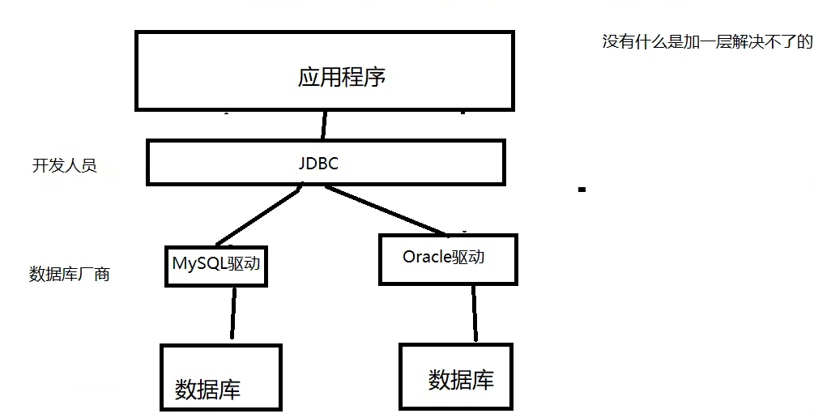

# 1. 初识Mysql

## 1.1 连接数据库

+ 在 MySql 官网下载 Windows (x86, 64-bit), ZIP Archive
+ 在指定路径下解压
+ 在 mysql 程序路径下，新建 `my.ini` 文件
+ 在客户端设置默认字符集
+ 在服务端（mysqld）设置 `basedir` 和 `datadir`，服务端字符集设置，引擎设置

注意：utf8 这里是没有短横线的

```ini
[client]
default-character-set=utf8

[mysqld]
port=3306
basedir=D:\\Environment\\mysql-winx64
datadir=D:\\Environment\\mysql-winx64\\sqldata
character-set-server=utf8
default-storage-engine=INNODB
```

+ 之后在 mysql 路径下的 bin 文件夹中，`以管理员权限打开 cmd`
+ 执行 `mysqld --initialize --console` 初始化 mysql 服务
+ 注意，此时会在显示 `[Note]` 行中显示 mysql 临时为 root 用户生成的密码
+ 执行 `mysqld intall` 安装 mysql 服务
+ 执行 `net start mysql` 来开启 mysql 服务端
+ 执行 `mysql -h 主机名 -u 用户名 -p密码` 来进行登录

```sql
mysql -uroot -p123456 -- 连接数据库
update mysql.user set authentication_string('123456') where user='root' and Host='localhost'; -- 修改用户密码
alter user 'root'@'localhost' identified by '123456' -- 修改密码
flush privileges -- 刷新权限

-- 所有的语句都使用分号结尾
show databases; -- 查看所有的数据库
use xxdb; -- 切换数据库
show tables; -- 查看数据库所有的表
describe xxtb; -- 显示表中的所有信息
create database xxdb -- 创建数据库
exit; -- 退出连接
-- 单行注释 	/*多行注释*/
```

DDL -- 数据库定义语言
DML -- 数据库操作语言
DQL -- 数据库查询语言*
DCL -- 数据库控制语言


# 2. 操作数据库

操作数据库 -> 操作数据库中的表 -> 操作数据库中的表中的数据

mysql关键字不区分大小写

```sql
CREATE DATABASE [IF NOT EXISTS] isaiah; -- 创建数据库
DROP DATABASE [IF EXISTS] school; -- 删除数据库
-- 若使用关键字作为名称可使用反引号
-- 创建数据库 基字符集：utf-8  数据库排序规则：utf_general_ci
```

## 2.1 数据库的列类型

> 数值

tinyint			   十分小的数据			   1B

smallint			较小的数据				   2B

mediumint       中等大小的数据	       3B

**int 					标准的证书				    4B**

bigint				较大的数据				   8B

float				 单精度浮点数			    4B

double			 双精度浮点数                8B

decimal			字符串形式的浮点数     用于金融计算

> 字符串

char                   字符串固定大小的        0~255

**varchar              可变字符串	               0~65535**

tinytest			  微型文本					   2^8-1

**text 					文本串						  2^16-1**

> 时间日期

data                  YYYY-MM-DD                 日期格式

time                  HH:mm:ss                       时间格式

**datatime          YYYY-MM-DD HH:mm:ss 最常用的时间格式**

**timestamp       时间戳                              1970/1/1到现在的毫秒数**

year                   年份表示

> null

不要使用null进行运算，结果也是null

## 2.3 数据库的字段属性

Unsigned		 声明了该列不能为负数

zerofill              零填充

autoincreament 

自动在上一条记录的基础上加一（默认），通常用来设定唯一的主键，可以自定义起始值和步长

not null     不给赋值就会报错

default               设置默认的值，如果不指定的话就会有默认的值

## 2.4 创建数据库表

```sql
CREATE TABLE IF NOT EXISTS `student`(
	`id` INT(4) NOT NULL AUTO_INCREMENT COMMENT '学号',
	`name` VARCHAR(30) NOT NULL DEFAULT '匿名' COMMENT '姓名',
	`pwd` VARCHAR(20) NOT NULL DEFAULT '123456' COMMENT '密码',
	`sex` VARCHAR(2) NOT NULL DEFAULT '男' COMMENT '性别',
	`birth` DATETIME DEFAULT NULL COMMENT '出生日期',
	`address` VARCHAR(100) DEFAULT NULL COMMENT '家庭住址',
	`email` VARCHAR(50) DEFAULT NULL COMMENT '邮箱',
	PRIMARY KEY(`id`) 
)ENGINE=INNODB DEFAULT CHARSET=utf8


CREATE TABLE [IF NOT EXISTS] `表名`(
	`字段名` [列类型] [索引] [注释],
    `字段名` [列类型] [索引] [注释],
    `字段名` [列类型] [索引] [注释],
    `字段名` [列类型] [索引] [注释]
)[表类型][字符集设置][注释]
```

## 2.5 数据表的类型

```sql
-- 数据库引擎
-- INNODB 默认
-- MYISAM 早些年使用
```

|              | MYISAM | INNODB         |
| ------------ | ------ | -------------- |
| 事务支持     | 不支持 | 支持           |
| 数据行锁定   | 不支持 | 支持           |
| 外键约束     | 不支持 | 支持           |
| 全文索引     | 支持   | 不支持         |
| 表空间的大小 | 较小   | 较大，约有两倍 |

常规使用：

+ MYISAM：节约空间，速度较快
+ INNODB：安全性高，事务处理，多表多用户操作

> 在物理空间中的位置

所有数据库文件都在data目录下

本质还是文件存储

> MySQL引擎在物理文件上的区别

> 设置数据库表中的字符集编码

my.ini 中配置

~~~ sql
character-set-server=utf8
~~~

```sql
DESC student -- 显示表结构
SHOW CREATE TABLE student -- 显示创表语句
SHOW CREATE DATABASE isaiah -- 显示创建数据库的语句
```

## 2.6 修改和删除表

```sql
-- 修改表
ALTER TABLE `student` RENAME AS `student1` -- 修改表明
ALTER TABLE `student1` ADD `age1` INT(11) -- 增加表的字段

ALTER TABLE `student1` MODIFY age1 VARCHAR(11) -- 修改约束
ALTER TABLE `student1` CHANGE age1 age2 INT(1) -- 字段重命名

ALTER TABLE `student1` DROP age1 -- 删除表的字段
```

```sql
-- 删除表
DROP TABLE [IF EXISTS] student1
```

所有的创建和删除操作都尽量加上判断


# 3. MySQL数据管理

## 3.1 外键（了解）

```sql
CREATE TABLE IF NOT EXISTS `grade`(
	`gradeid` INT(10) NOT NULL AUTO_INCREMENT COMMENT '年级id',
	`gradename` VARCHAR(50) NOT NULL COMMENT '年级名称',
	PRIMARY KEY (`gradeid`)
 ) ENGINE=INNODB DEFAULT CHARSET=utf8;

-- student表的gradeid字段要去引用grade表中的gradeid字段
-- 定义外键key
-- 给这个外键添加约束（执行引用）
CREATE TABLE IF NOT EXISTS `student` (
  `id` INT(4) NOT NULL AUTO_INCREMENT COMMENT '学号',
  `name` VARCHAR(30) NOT NULL DEFAULT '匿名' COMMENT '姓名',
  `pwd` VARCHAR(20) NOT NULL DEFAULT '123456' COMMENT '密码',
  `sex` VARCHAR(2) NOT NULL DEFAULT '男' COMMENT '性别',
  `birth` DATETIME DEFAULT NULL COMMENT '出生日期',
  `gradeid` INT(10) NOT NULL COMMENT '学生的年级',
  `address` VARCHAR(100) DEFAULT NULL COMMENT '家庭住址',
  `email` VARCHAR(50) DEFAULT NULL COMMENT '邮箱',
  PRIMARY KEY (`id`)
  -- key `FK_gradeid` (`gradeid`),
  -- constraint `FK_gradeid` foreign key(`gradeid`) references `grade`(`gradeid`)
) ENGINE=INNODB DEFAULT CHARSET=utf8;

ALTER TABLE `student`
ADD CONSTRAINT `FK_gradeid` FOREIGN KEY(`gradeid`) REFERENCES `grade`(`gradeid`);
```

删除有外键关系的表时，必须先删除从表（有外键的表，引用别人），再删除主表（被引用的表）

以上都是物理外键，数据库级别的外键，不建议使用

> 最佳实践

+ 数据库就是单纯的表，只有行（数据）和列（字段）
+ 外键用程序去实现


## 3.2 DML语言

数据库意义：数据存储、数据管理

DML：数据操作语言


## 3.3 添加 insert into

```sql
-- 插入操作
INSERT INTO `grade`(`gradename`) VALUES ('大一'), ('大二'), ('大三'), ('大四'); 

INSERT INTO `student`(`name`, `pwd`, `sex`)
VALUES ('aa', 'aaaa', 'm'), ('bb', 'bbbb', 'wo'), ('cc', 'ccccc', 'wo');
```


## 3.4 修改 update set

```sql
-- 更新操作
UPDATE `student` SET `birth`=CURRENT_TIME WHERE `name`='aa' AND `sex`='m';
-- 注意要是不加where筛选，就会更改整个表
UPDATE `student` SET `name`='zz'; 
```


## 3.5 删除

```sql
 CREATE TABLE `test`(
	`id` INT(4) NOT NULL AUTO_INCREMENT,
	`doll` VARCHAR(20) NOT NULL,
	PRIMARY KEY(`id`)
 )ENGINE=INNODB DEFAULT CHARSET=utf8;
 
 INSERT INTO `test`(`doll`) VALUES ('123'), ('456');
 
 DELETE FROM `test`;	-- 删除之后再插入数据，会从原来的自增
 TRUNCATE `test`;	-- 删除数据之后，自增归零，另外truncate不会影响事务
```

DELETE 删除的问题

+ InnoDB：重启数据库自增就会清零（存在内存当中，断电即失）
+ MyISAM：重启数据库后继续从上一个自增量开始（存在文件中，不会丢失）


# 4. DQL查询数据

## 4.1 DQL

数据查询语言 Date Query Language ：数据库最核心的语言

## 4.2 指定查询字段

```sql
-- 查询全部
SELECT * FROM `student`;

-- 查询指定字段
SELECT `studentno`, `studentname` FROM `student`;

-- AS可以给字段和表起别名
SELECT `studentno` AS 学号, `studentname` AS 学生姓名 FROM `student` 学生;

-- 函数concat(a, b)
SELECT CONCAT('姓名：', `studentname`) AS 新名字 FROM `student`;

-- 数据去重
SELECT DISTINCT `studentno` FROM `result`;

-- 查询系统版本（函数）
SELECT VERSION();
-- 用来计算（表达式）
SELECT 100*3+1 AS 计算结果;
-- 查询自增的步长（变量）
SELECT @@auto_increment_increment;

-- 查看学员成绩+1
SELECT `studentno`, `studentresult`+1 AS 提分后 FROM `result`;

```

## 4.3 where条件子句

##### **where子句的结果为布尔值**

> 逻辑运算符

```sql
-- [90, 100]
SELECT studentno, studentresult FROM result
WHERE studentresult >=90 AND studentresult <= 100;

-- != 85
SELECT studentno, studentresult FROM result
WHERE studentresult != 85;

-- >= 60
SELECT studentno, studentresult FROM result
WHERE NOT studentresult < 60;
```

> 比较运算符（模糊查询）

```sql
-- [85, 90]
SELECT studentno, studentresult FROM result
WHERE studentresult BETWEEN 85 AND 90;

-- 姓张的同学
SELECT studentno, studentname FROM student
WHERE studentname LIKE '张%';

-- 姓张且名为一个字的同学
SELECT studentno, studentname FROM student
WHERE studentname LIKE '张_';

-- 名字中含有张的同学
SELECT studentno, studentname FROM student
WHERE studentname LIKE '%张%';

-- 条目中只要有括号中内容的一条对应即为真
SELECT studentno, studentname FROM student
WHERE sex IN (0, 1);

-- 出生日期字段不为空
SELECT studentno, studentname FROM student
WHERE borndate IS NULL;

-- 出生日期字段为空
SELECT studentno, studentname FROM student
WHERE borndate IS NOT NULL;

```

## 4.4 联表查询

> JOIN对比

```sql
```


## 4.5 分页和排序

> 分页 limit 排序 order by 升序 ASC 降序DESC


## 4.6 子查询

```sql
-- 查询 C语言-1 的所有考试结果（学号、科目编号、成绩）降序排列
-- 方式一：连接查询
SELECT studentno, re.subjectno, studentresult FROM result re
INNER JOIN `subject` sub ON re.subjectno = sub.subjectno
WHERE sub.subjectname = 'C语言-1'
ORDER BY studentresult DESC;
-- 方式二：子查询
SELECT studentno, subjectno, studentresult FROM result
WHERE subjectno = (
	SELECT subjectno FROM `subject`
	WHERE subjectname = 'C语言-1'
)
ORDER BY studentresult DESC;

-- 分数不小于80分的学生的学号和姓名
-- 方式一：连接查询
SELECT DISTINCT stu.studentno, studentname FROM student stu
INNER JOIN result rst ON stu.studentno = rst.studentno
WHERE studentresult >= 80; 
-- 方式二：子查询
SELECT DISTINCT studentno, studentname FROM student
WHERE studentno IN(
	SELECT studentno FROM result
	WHERE studentresult >= 80
);
```


# 5. MySQL函数

## 5.1 常用函数


## 5.2 聚合函数


## 5.3 MD5加密

```sql
-- 明文密码
INSERT INTO testmd5(`name`, `pwd`) VALUES ('lang', '123456');
-- 加密
UPDATE testmd5 SET pwd=MD5(pwd);
-- 校验密码
SELECT * FROM testmd5 WHERE pwd=MD5(123456);
```


# 6. 事务

## 6.1 什么是事务

> 将一组SQL放在一个批次中执行

事务原则：ACID原则：原子性、一致性、隔离性、持久性

**原子性（Atomicity）**

要么都成功，要么都失败

**一致性（Consistency）**

事务前后的数据完整性要保持一致

**隔离性（Isolation）**

多个用户并发地访问数据库时，数据库为每一个用户开启的事务不能被其它事务的操作所干扰

**持久性（Durability）**

事务一旦提交则不可逆，被持久化到数据库中


> 隔离性的问题

**脏读**

指的是一个事务读取了另一个事务未提交的数据

**不可重复读**

在一个事务内部读取表中的某一行数据，多次读取的结果不同

**虚读（幻读）**

指的是一个事务读取了别的事务插入的数据，导致前后读取不一致

```sql
-- mysql默认开启事务
set autocommit = 0 -- 关闭
SET autocommit = 1 -- 开启（默认）

-- 手动开启事务
set autocommit = 0	-- 关闭自动提交
start transaction	-- 事务开启
-- XXX XXX
commit		-- 提交：持久化
rollback	-- 回滚：回到原来的样子
SET autocommit = 1 -- 事务结束，开启自动提交

savepoint 保存点名	-- 设置一个事务的保存点
rollback to savepoint 保存点名	-- 回滚到保存点
release savepoint 保存点名	-- 撤销保存点
```

```sql
-- 模拟场景（转账）
CREATE DATABASE shop CHARACTER SET utf8 COLLATE utf8_general_ci; -- 指定字符集及字符集排序规则
USE shop;

CREATE TABLE `account`(
	`id` INT(3) NOT NULL AUTO_INCREMENT,
	`name` VARCHAR(30) NOT NULL,
	`money` DECIMAL(9,2) NOT NULL, -- 一共九位，小数部分占两位
	PRIMARY KEY (`id`)
)ENGINE=INNODB DEFAULT CHARSET=utf8;
INSERT INTO account(`name`, `money`) VALUES ('A', 2000.00),('B', 1000.00);

-- 模拟转账：事务
SET autocommit=0; -- 关闭自动提交
START TRANSACTION; -- 开启一个事务

UPDATE account SET money=money-500 WHERE `name`='A'; -- A失去500
UPDATE account SET money=money+500 WHERE `name`='B'; -- B得到500

COMMIT; -- 提交事务
ROLLBACK; -- 回滚
SET autocommit=1; -- 恢复默认值
```

# 7. 索引

## 7.1 索引的分类

+ 主键索引 （PRIMARY KEY）
  + 唯一的标识，不可重复，
+ 唯一索引 （UNIQUE KEY）
  + 避免重复的列出现，可以重复，多个列都可以标识为唯一索引
+ 常规索引 （KEY/INDEX）
  + 默认的
+ 全文索引 （FULLTEXT）
  + 在特定的数据库引擎下才有MyISAM
  + 快速定位数据

## 7.2 测试索引

```sql
show index from student; -- 显示所有表中索引信息
alter table school.student
add FULLTEXT index `i`(`studentname`); -- 增加一个全文索引：索引名（列名）
explain select * from student; -- explain分析sql的执行状况

CREATE TABLE `app_user` (
`id` BIGINT(20) UNSIGNED NOT NULL AUTO_INCREMENT,
`name` VARCHAR(50) DEFAULT'' COMMENT'用户昵称',
`email` VARCHAR(50) NOT NULL COMMENT'用户邮箱',
`phone` VARCHAR(20) DEFAULT'' COMMENT'手机号',
`gender` TINYINT(4) UNSIGNED DEFAULT '0'COMMENT '性别（0：男;1:女）',
`password` VARCHAR(100) NOT NULL COMMENT '密码',
`age` TINYINT(4) DEFAULT'0'  COMMENT '年龄',
`create_time` DATETIME DEFAULT CURRENT_TIMESTAMP,
`update_time` TIMESTAMP NOT NULL DEFAULT CURRENT_TIMESTAMP ON UPDATE CURRENT_TIMESTAMP,
PRIMARY KEY (`id`)
) ENGINE=INNODB DEFAULT CHARSET=utf8 COMMENT = 'app用户表'

-- 插入100万条数据
DELIMITER $$ -- 写函数之前必须要写
CREATE FUNCTION sim_data()
RETURNS INT
BEGIN
	DECLARE num INT DEFAULT 1000000;
	DECLARE i INT DEFAULT 0;
	WHILE i < num DO
		INSERT INTO app_user(`name`, `email`, `phone`, `gender`, `password`, `age`)
		VALUES (CONCAT('用户', i), '12092@qq.com', 
		CONCAT('18', FLOOR(RAND()*((999999999-100000000)+100000000))),
		FLOOR(RAND()*2), UUID(), FLOOR(RAND()*100));
		SET i = i + 1;
	END WHILE;
	RETURN i;
END;

SELECT sim_data();
SELECT * FROM app_user WHERE `name` = '用户9999';

SELECT * FROM app_user;
CREATE INDEX id_app_user_name ON app_user(`name`);

```

## 7.3 索引原则

+ 索引不是越多越好
+ 不要对进程变动数据加索引
+ 小数据量不需要加索引
+ 索引一般加在经常查询的字段上

> 索引的额数据结构

Hash 类型的索引

BTree：InnoDB的默认数据结构

# 8. 权限管理和备份

## 8.1 用户管理

```sql
create user joy identified by '123456'; -- 创建用户
set password = password('123456'); -- 更改密码
set password for joy = password('111111');
rename user joy to love; -- 用户重命名
grant all privileges on *.* to love; -- 和root用户的区别：不能给别人授权
show grants for love; -- 查询用户权限
show grants for root@localhost;
GRANT ALL PRIVILEGES ON *.* TO 'root'@'localhost' WITH GRANT OPTION -- root权限
revoke all privileges on *.* from love; -- 撤销权限
drop user love; -- 删除用户
```

## 8.2 MySQL备份

> 为什么要备份

+ 保证数据不丢失
+ 数据转移

> 怎么备份

+ 直接拷贝物理文件
+ 在可视化工具中手动导出
+ 使用命令行 mysqldump

```bash
mysqldump -hlocalhost -uroot -p123456 school result > d:/a.sql # 数据库转储到物理文件中
# 登录的情况下
use school
source d:/a.sql
```

# 9. 数据库设计

## 9.1 设计流程

+ 分析需求：分析业务和需要处理的数据
+ 概要设计：设计关系图E-R图

## 9.2 三大范式

+ 信息重复
+ 更新异常
+ 插入异常（无法正常显示信息）
+ 删除异常（丢失有效信息）

**第一范式（1NF）**

原子性，保证每列不可再分

**第二范式（2NF）**

前提：满足第一范式

每张表只描述一件事情

**第三范式（3NF）**

前提：满足第二范式

数据表中，每一列数据都和主键直接相关，而非间接相关

**规范性 和 性能 的问题**

+ 关联查询不要超过三张表
+ 故意给某些表增加一些冗余字段（从多表查询转变为单表查询）
+ 故意增加一些计算列（从大数据量转变为小计算量的查询：索引）

# 10. JDBC

## 10.1 数据库驱动

驱动：声卡、显卡、数据库


程序会通过驱动和数据库打交道

## 10.2 JDBC

SUN公司为了简化数据库操作，提供了一个JAVA操作数据库的规范，即JDBC（Java Database Connectivity）

这些规范的实现由数据库厂商去做



```sql
CREATE DATABASE `jdbcStudy` CHARACTER SET utf8 COLLATE utf8_general_ci;
USE `jdbcStudy`;

CREATE TABLE IF NOT EXISTS `users`(
 `id` INT PRIMARY KEY,
 `NAME` VARCHAR(40),
 `PASSWORD` VARCHAR(40),
 `email` VARCHAR(60),
 `birthday` DATE
);

INSERT INTO `users`(`id`,`NAME`,`PASSWORD`,`email`,`birthday`)
VALUES('1','zhangsan','123456','zs@sina.com','1980-12-04'),
('2','lisi','123456','lisi@sina.com','1981-12-04'),
('3','wangwu','123456','wangwu@sina.com','1979-12-04');
```

```java
// 第一个JDBC程序
package com.isaiah;

import java.sql.*;

public class JdbcFirstDemo {
    public static void main(String[] args) throws ClassNotFoundException, SQLException {
        // 1.加载驱动（可能找不到类）
        Class.forName("com.mysql.jdbc.Driver");
        // 2.用户信息和URL
        String url = "jdbc:mysql://localhost:3306/jdbcstudy?useUnicode=true&characterEncoding=utf8&useSSL=false";
        String userName = "root";
        String passWord = "123456";
        // 数据库对象 connection（可能SQL语句由错误）
        Connection connection = DriverManager.getConnection(url, userName, passWord);
        // 执行SQL语句的对象
        Statement statement = connection.createStatement();
        // 执行SQL语句，返回结果集（链表）
        String sql = "select * from users;";
        ResultSet resultSet = statement.executeQuery(sql);
        while(resultSet.next()){
            System.out.println("id="+resultSet.getObject("id"));
            System.out.println("NAME="+resultSet.getObject("NAME"));
            System.out.println("PASSWORD="+resultSet.getObject("PASSWORD"));
            System.out.println("email="+resultSet.getObject("email"));
            System.out.println("birthday="+resultSet.getObject("birthday"));
            System.out.println("========================================================");
        }
        // 关闭连接
        resultSet.close();
        statement.close();
        connection.close();
    }
}

```

```java
// JDBC工具类
package com.isaiah.utils;

import java.io.IOException;
import java.io.InputStream;
import java.sql.*;
import java.util.Properties;

public class JdbcUtils {
    private static String driver=null;
    private static String url=null;
    private static String user=null;
    private static String pwd=null;
    static {
        try{
            // 获得类加载器，拿到资源
            InputStream in = JdbcUtils.class.getClassLoader().getResourceAsStream("./db.properties");
            Properties properties = new Properties();
            properties.load(in);

            driver = properties.getProperty("driver");
            url = properties.getProperty("url");
            user = properties.getProperty("user");
            pwd = properties.getProperty("pwd");

            // 1.驱动只用加载一次
            Class.forName(driver);
        } catch (IOException | ClassNotFoundException e) {
            e.printStackTrace();
        }
    }
    // 2.获取连接
    public static Connection getConnection() throws SQLException {
        return DriverManager.getConnection(url, user, pwd);
    }
    // 3.释放连接
    public static void release(Connection conn, Statement st, ResultSet rs){
        if(rs != null){
            try {
                rs.close();
            } catch (SQLException e) {
                e.printStackTrace();
            }
        }
        if(st != null){
            try {
                st.close();
            } catch (SQLException e) {
                e.printStackTrace();
            }
        }
        if(conn != null) {
            try {
                conn.close();
            } catch (SQLException e) {
                e.printStackTrace();
            }
        }
    }
}

```

```properties
// 配置文件 db.properties
driver=com.mysql.jdbc.Driver
url=jdbc:mysql://localhost:3306/jdbcstudy?useUnicode=true&characterEncoding=utf8&useSSL=false
user=root
pwd=123456
```


```java
// 测试SQL插入语句
package com.isaiah;

import com.isaiah.utils.JdbcUtils;

import java.sql.Connection;
import java.sql.ResultSet;
import java.sql.SQLException;
import java.sql.Statement;

public class TestInsert {
    public static void main(String[] args) {
        Connection conn = null;
        Statement st = null;
        ResultSet rs = null;

        try {
            conn = JdbcUtils.getConnection();
            st = conn.createStatement();
            // 增删改都用executeUpdate("sql"); 查询用executeQuery("sql");
            int i = st.executeUpdate("insert into users(`id`, `NAME`) values('4', 'aaa'), ('5', 'bbb')");
            if (i > 0) {
                System.out.println("insert table users ok");
            }
        } catch (SQLException e) {
            e.printStackTrace();
        } finally {
            JdbcUtils.release(conn, st, rs);
        }
    }
}

```

## 10.3 Statement 对象


```java
// SQL注入：SQL会拼接or

package com.isaiah;

import com.isaiah.utils.JdbcUtils;

import java.sql.Connection;
import java.sql.ResultSet;
import java.sql.SQLException;
import java.sql.Statement;

public class SqlInjection {
    public static void main(String[] args) {
        // 正常登录
//        login("zhangsan", "123456");
        // SQL注入
        login("'or'1=1", "'or'1=1");
    }

    // 业务代码
    public static void login(String user, String password){
        Connection conn;
        Statement st;
        ResultSet rs;

        // SQL语句不区分大小写
        String sql = "select * from users where `name`='"+user+"'and `password`='"+password+"'";

        try {
            conn = JdbcUtils.getConnection();
            st = conn.createStatement();
            rs = st.executeQuery(sql);
            while (rs.next()) {
                System.out.println("NAME = " + rs.getString("name"));
                System.out.println("PASSWORD = " + rs.getString("password"));
                System.out.println("===============================================");
            }
        } catch (SQLException e) {
            e.printStackTrace();
        }
    }
}

```

## 10.4 PreparedStatement 对象

可以防止SQL注入，并且效率更高

```java
// 使用preparedStatement进行插入操作

package com.isaiah;

import com.isaiah.utils.JdbcUtils;

import java.sql.Connection;
import java.sql.PreparedStatement;
import java.sql.ResultSet;
import java.sql.SQLException;
import java.util.Date;

public class preparedStatement {
    public static void main(String[] args) {
        Connection conn = null;
        PreparedStatement pst = null;
        ResultSet rs = null;

        String sql = "insert into users(`id`, `name`, `password`, `email`, `birthday`) values(?,?,?,?,?)";
        try {
            conn = JdbcUtils.getConnection();
            // 使用？占位符代替参数，预编译SQL，不执行
            pst = conn.prepareStatement(sql);

            pst.setInt(1, 6);
            pst.setString(2, "ccc");
            pst.setString(3, "123123");
            pst.setString(4,"123@qq.com");
            // sql.Date  数据库类型
            // util.Date 获得时间戳
            pst.setDate(5, new java.sql.Date(new Date().getTime()));
            // 执行
            int i = pst.executeUpdate();
            if (i > 0) {
                System.out.println("insert ok");
            }

        } catch (SQLException e) {
            e.printStackTrace();
        } finally {
            JdbcUtils.release(conn, pst, rs);
        }
    }
}

```

```java
// 防止SQL注入

package com.isaiah;

import com.isaiah.utils.JdbcUtils;

import java.sql.Connection;
import java.sql.PreparedStatement;
import java.sql.ResultSet;
import java.sql.SQLException;

public class AntiInjection {
    public static void main(String[] args) {
//        login("ccc", "123123");
        login("''or'1=1'", "''or'1=1'");
    }

    public static void login(String user, String password){
        Connection conn = null;
        PreparedStatement pst = null;
        ResultSet rs = null;

        try {
            conn = JdbcUtils.getConnection();
            // preparedStatement防止注入的本质：把传递进来的参数当作字符
            // 假设其中存在特殊字符，比如'会被直接转义
            pst = conn.prepareStatement("select * from users where `name`=? and `password`=?");
            pst.setString(1,  user);
            pst.setString(2, password);
            rs = pst.executeQuery();
            while (rs.next()) {
                System.out.println("name = " + rs.getString("name"));
                System.out.println("password = " + rs.getString("password"));
                System.out.println("=================================================");
            }
        } catch (SQLException e) {
            e.printStackTrace();
        } finally {
            JdbcUtils.release(conn, pst, rs);
        }
    }
}

```


## 10.5 JAVA实现事务

```java
package com.isaiah;

import com.isaiah.utils.JdbcUtils;

import java.sql.Connection;
import java.sql.PreparedStatement;
import java.sql.ResultSet;
import java.sql.SQLException;

public class TestTransaction {
    public static void main(String[] args) {
        Connection conn = null;
        PreparedStatement pst = null;
        ResultSet rs = null;

        try {
            conn = JdbcUtils.getConnection();
            // 关闭数据库的自动提交，自动会开启事务
            conn.setAutoCommit(false);
            String sql0 = "update account set money = money-100 where name='A'";
            pst = conn.prepareStatement(sql0);
            pst.executeUpdate();

            // 报错
//            int x = 1/0; 

            String sql1 = "update account set money = money+100 where name='B'";
            pst = conn.prepareStatement(sql1);
            pst.executeUpdate();

            conn.commit();
            System.out.println("success");
        } catch (SQLException e) {
            // 如果失败默认回滚
//            try {
//                // 如果失败就回滚事务
//                conn.rollback();
//            } catch (SQLException ex) {
//                ex.printStackTrace();
//            }
            e.printStackTrace();
        } finally {
            JdbcUtils.release(conn, pst, rs);
        }
    }
}

```

## 10.6 数据库连接池

数据库的连接到释放十分浪费资源

**池化技术：预先准备好一些资源，连接时可以直接连接**

最小连接数：一般等于常用连接数

最大连接数：根据资源来确定

如果连接数过多则排队等待，等待超时（100ms）则断开连接

**编写连接池：实现DataSource接口**

使用了数据库连接池之后，在项目开发时就不用编写连接数据库的代码了

> 开源实现

DBCP

```properties
// dbconfig.properties 配置文件

#连接设置
driverClassName=com.mysql.jdbc.Driver
url=jdbc:mysql://localhost:3306/jdbcstudy?useUnicode=true&characterEncoding=utf8&useSSL=false
username=root
password=123456

#<!-- 初始化连接 -->
initialSize=10

#最大连接数量
maxActive=50

#<!-- 最大空闲连接 -->
maxIdle=20

#<!-- 最小空闲连接 -->
minIdle=5

#<!-- 超时等待时间以毫秒为单位 6000毫秒/1000等于60秒 -->
maxWait=60000
#JDBC驱动建立连接时附带的连接属性属性的格式必须为这样：【属性名=property;】
#注意："user" 与 "password" 两个属性会被明确地传递，因此这里不需要包含他们。
connectionProperties=useUnicode=true;characterEncoding=UTF8

#指定由连接池所创建的连接的自动提交（auto-commit）状态。
defaultAutoCommit=true

#driver default 指定由连接池所创建的连接的只读（read-only）状态。
#如果没有设置该值，则“setReadOnly”方法将不被调用。（某些驱动并不支持只读模式，如：Informix）
defaultReadOnly=

#driver default 指定由连接池所创建的连接的事务级别（TransactionIsolation）。
#可用值为下列之一：（详情可见javadoc。）NONE,READ_UNCOMMITTED, READ_COMMITTED, REPEATABLE_READ, SERIALIZABLE
defaultTransactionIsolation=READ_UNCOMMITTED
```

```java
// 应用连接池特性，重写JDBC工具类

package com.isaiah.utils;

import org.apache.commons.dbcp.BasicDataSource;
import org.apache.commons.dbcp.BasicDataSourceFactory;

import javax.sql.DataSource;
import java.io.IOException;
import java.io.InputStream;
import java.sql.Connection;
import java.sql.ResultSet;
import java.sql.SQLException;
import java.sql.Statement;
import java.util.Properties;

public class JdbcUtils_DBCP {
    private static DataSource dataSource = null;
    static {
        try {
            InputStream in = JdbcUtils_DBCP.class.getClassLoader().getResourceAsStream("./dbconfig.properties");
            Properties properties = new Properties();
            properties.load(in);
            // 创建数据源：工厂模式创建对象
            dataSource = BasicDataSourceFactory.createDataSource(properties);
        } catch (Exception e) {
            e.printStackTrace();
        }
    }

    public static Connection getConnection() throws SQLException {
        // 从数据源中获取连接
        return dataSource.getConnection();
    }

    public static void release(Connection conn, Statement st, ResultSet rs){
        if(rs != null){
            try {
                rs.close();
            } catch (SQLException e) {
                e.printStackTrace();
            }
        }
        if(st != null){
            try {
                st.close();
            } catch (SQLException e) {
                e.printStackTrace();
            }
        }
        if(conn != null) {
            try {
                conn.close();
            } catch (SQLException e) {
                e.printStackTrace();
            }
        }
    }
}

```

```java
// 测试重写的JDBC工具类

package com.isaiah;

import com.isaiah.utils.JdbcUtils;
import com.isaiah.utils.JdbcUtils_DBCP;

import java.sql.Connection;
import java.sql.ResultSet;
import java.sql.SQLException;
import java.sql.Statement;

public class TestDBCP {
    public static void main(String[] args) {
        Connection conn = null;
        Statement st = null;
        ResultSet rs = null;

        try {
            conn = JdbcUtils_DBCP.getConnection();
            st = conn.createStatement();
            int i = st.executeUpdate("insert into users(`id`, `NAME`) values(8, 'fff')");
            if (i > 0) {
                System.out.println("insert table users ok");
            }
        } catch (SQLException e) {
            e.printStackTrace();
        } finally {
            JdbcUtils_DBCP.release(conn, st, rs);
        }
    }
}

```


C3P0


Druid

