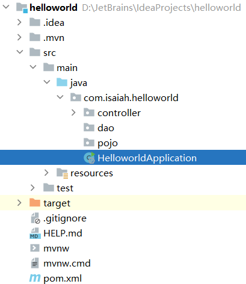
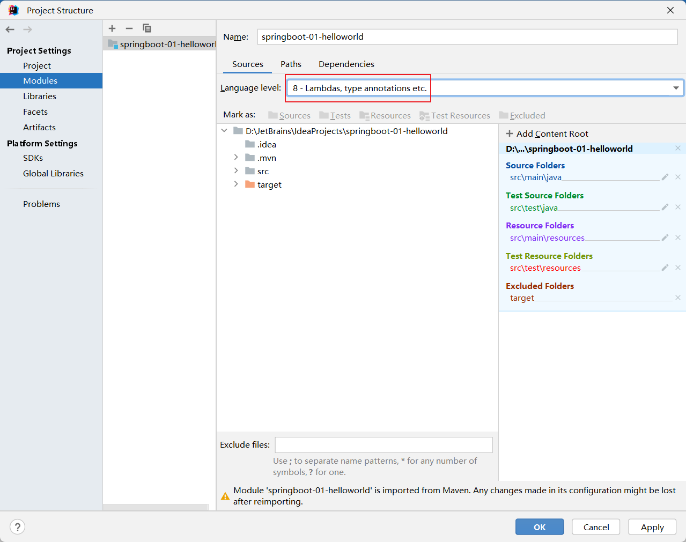
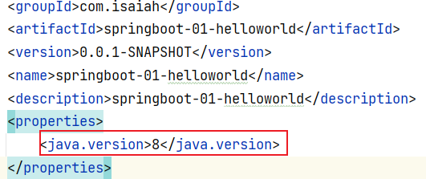
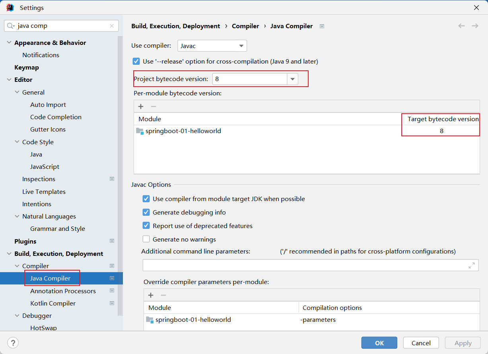
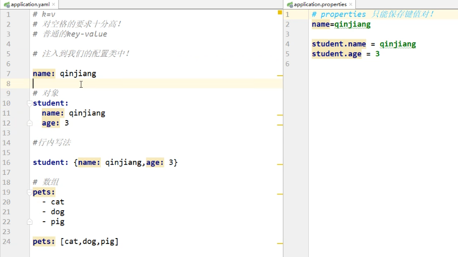
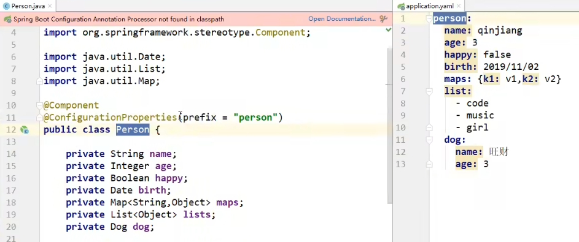
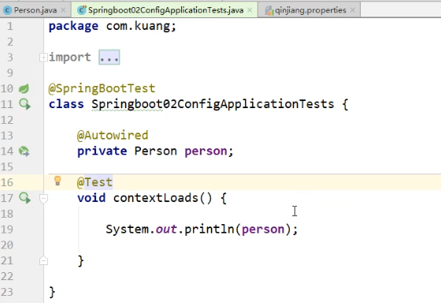
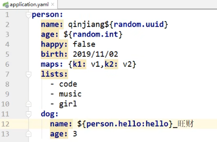
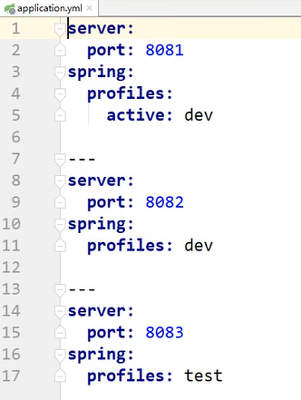

# 1. 微服务阶段

## 1.1 历史阶段

**JavaSE**：OOP

**MySQL**：持久化

**html + css + js + jquery + 框架**：视图

**javaweb**：开发 MVC 三层架构

**ssm**：框架，简化了开发流程，配置也开始较为复杂

## 1.2 微服务阶段

### 1.2.1 SpringBoot

**SpringBoot**：spring 再简化

为了降低 java 开发的复杂性，spring 采用了**四种关键的策略**：

+ 基于 pojo 的轻量级和最小侵入性编程
+ 通过 IOC 依赖注入和面向接口实现松耦合
+ 基于切面和惯例进行声明式编程
+ 通过切面和模版减少样式代码

### 1.2.2 什么是微服务

**微服务是一种架构风格**，应用是一系列小服务的组合，可以通过 **http 的方式进行互通**

​																		**VS**

**单体应用架构（all in one）**是指我们将所有的服务都封装在一个应用中（打包成一个 war 包）：

+ 易于开发测试，易于部署
+ 维护更新都很困难，需要停掉整个服务

 

# 2. 第一个程序

## 2.1 开发环境

+ jdk 1.8
+ maven 3.6.1
+ SpringBoot 最新版
+ IDEA

## 2.2 项目结构



==HelloworldApplication.java== springBoot 项目的入口

```java
package com.isaiah.helloworld;

import org.springframework.boot.SpringApplication;
import org.springframework.boot.autoconfigure.SpringBootApplication;

@SpringBootApplication
public class HelloworldApplication {

	public static void main(String[] args) {
		SpringApplication.run(HelloworldApplication.class, args);
	}

}
```

==pom.xml==

```xml
<?xml version="1.0" encoding="UTF-8"?>
<project xmlns="http://maven.apache.org/POM/4.0.0" xmlns:xsi="http://www.w3.org/2001/XMLSchema-instance"
	xsi:schemaLocation="http://maven.apache.org/POM/4.0.0 https://maven.apache.org/xsd/maven-4.0.0.xsd">
	<modelVersion>4.0.0</modelVersion>
    
    <!--	继承 spring-boot-starter-parent 的依赖，版本控制和打包描述	-->
	<parent>
		<groupId>org.springframework.boot</groupId>
		<artifactId>spring-boot-starter-parent</artifactId>
		<version>2.7.10</version>
		<relativePath/> <!-- lookup parent from repository -->
	</parent>
    
    <!--	maven GAV + name + description	-->
	<groupId>com.isaiah</groupId>
	<artifactId>helloworld</artifactId>
	<version>0.0.1-SNAPSHOT</version>
	<name>helloworld</name>
	<description>Demo project for Spring Boot</description>
    
	<properties>
		<java.version>1.8</java.version>
	</properties>
    
	<dependencies>
        <!--	用于实现 HTTP 接口，使用 Tomcat 作为默认的嵌入式容器	-->
		<dependency>
			<groupId>org.springframework.boot</groupId>
			<artifactId>spring-boot-starter-web</artifactId>
		</dependency>

        <!--	用于单元测试	-->
		<dependency>
			<groupId>org.springframework.boot</groupId>
			<artifactId>spring-boot-starter-test</artifactId>
			<scope>test</scope>
		</dependency>
	</dependencies>

    <!--	构建配置部分，默认使用 spring-boot-maven-plugin 
		配合 spring-boot-starter-parent 打jar包直接运行	-->
	<build>
		<plugins>
			<plugin>
				<groupId>org.springframework.boot</groupId>
				<artifactId>spring-boot-maven-plugin</artifactId>
			</plugin>
		</plugins>
	</build>

</project>
```

## 2.3 可能出现的问题

**java: 警告: 源发行版 17 需要目标发行版 17**






**无效的目标发行版：17**



**java: 无法访问org.springframework.boot.SpringApplication**
  **错误的类文件: /C:/Users/1203/.m2/repository/org/springframework/boot/spring-boot/3.0.5/spring-boot-3.0.5.jar!/org/springframework/boot/SpringApplication.class**
    **类文件具有错误的版本 61.0, 应为 52.0**
    **请删除该文件或确保该文件位于正确的类路径子目录中**

还是换到 2 版本的 springboot 吧，3 版本依赖的是 spring 6 即只能是用 jdk 17

## 2.4 彩蛋

如果没有 web 启动器依赖，启动一半就会停止

```xml
<dependency>
    <groupId>org.springframework.boot</groupId>
    <artifactId>spring-boot-starter-web</artifactId>
</dependency>
```

改端口号

```properties
server.port=1234
```

自定义 banner： 在 resources 下新建一个 banner.txt

```properties
 __       _______.     ___       __       ___       __    __  
|  |     /       |    /   \     |  |     /   \     |  |  |  | 
|  |    |   (----`   /  ^  \    |  |    /  ^  \    |  |__|  | 
|  |     \   \      /  /_\  \   |  |   /  /_\  \   |   __   | 
|  | .----)   |    /  _____  \  |  |  /  _____  \  |  |  |  | 
|__| |_______/    /__/     \__\ |__| /__/     \__\ |__|  |__| 
                                                              
```

## 2.5 原理初探

### 2.5.1 pom.xml

+ 核心依赖在父工程中 spring-boot-dependencies **\<dependencyManagement\>**
+ 我们使用依赖不需要指定版本，因为 spring-boot-dependencies **\<properties\>** 中指定了版本

### 2.5.2 启动器

比如 spring-boot-starter-web 会帮我们自动导入 web 环境所需的所有依赖

+ springboot 将所有的功能场景都封装成了一个个的启动器
+ 我们想要什么功能，就启动对应的启动器 `starter`

### 2.5.3 主程序

#### 2.5.3.1 注解 @SpringBootApplication

**标注这个类是一个 springboot 应用**

+ @SpringBootConfiguration
+ @EnableAutoConfiguration 自动配置
  + @AutoConfigurationPackages 自动配置包
    + @Import({AutoConfigurationImportSelector.class}) 自动配置选择器

**分析结论：**

+ springboot 所有自动配置都是在启动的时候扫描并加载

+ spring.factories： 所有的自动配置类都在这里面
+ 但是不一定生效，要判断条件是否成立，只要导入了对应的 start，就有对应的启动器了
+ 有了启动器，我们自动装配就会生效

1. springboot 在启动的时候，从路径 `/META-INF/spring.factories` 获取指定的值
2. 将这些自动配置的类导入容器，自动配置就会生效
3. 自动配置的东西都在 spring-boot-autoconfigure-2.2.0.RELEASE.jar 这个包下
4. 它会把所有需要导入的组件，以类名的方式返回，这些组件就会被添加到容器中
5. 容器中也会存在非常多的 xxxAutoConfiguration 文件（@Bean）
6. 免去了手动编写配置文件的工作

#### 2.5.3.2 启动 SpringApplication.run()

+ 推断应用的类型，是普通的项目还是 web 项目
+ 查找并加载所有可用的初始化器（starter）设置到 initializers 属性中
+ 找出所有的应用程序监听器，设置到 listeners 属性中
+ 推断并设置 main 方法的定义类，找到运行的主类

# 3. SpringBoot 配置

配置文件的作用：修改 springboot 自动配置的默认值，因为 springboot 在底层都给我们自动配置好了












