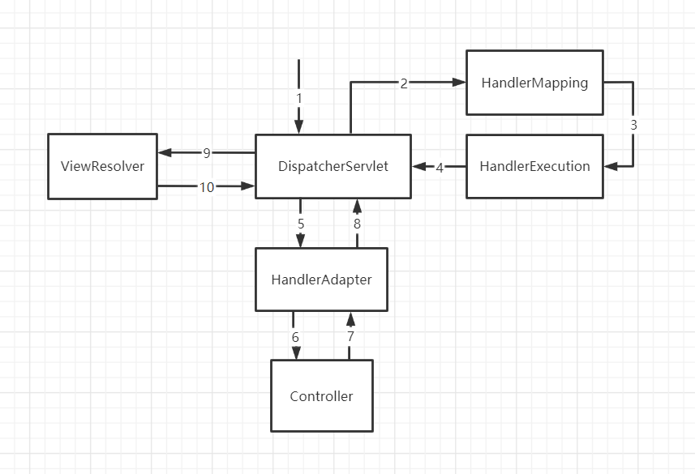
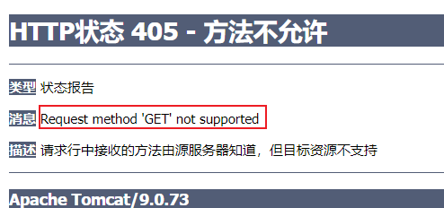
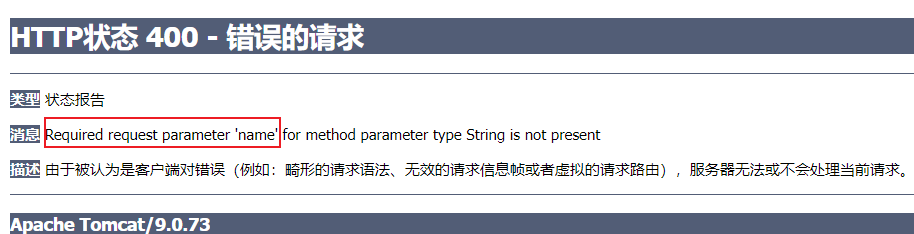

# 1. 回顾 Servlet

## 1.1 准备工作

## 1.2 web.xml

==web.xml:	servlet（注册 HelloServlet）==

```xml
<servlet>
    <servlet-name>hello</servlet-name>
    <servlet-class>com.isaiah.servlet.HelloServlet</servlet-class>
</servlet>
```

==web.xml:	servlet-mapping==

+ 将 HelloServlet 关联到指定的 url 上，当请求此 url 时就由 HelloServlet 做出响应

```xml
<servlet-mapping>
    <servlet-name>hello</servlet-name>
    <url-pattern>/hello</url-pattern>
</servlet-mapping>
```

## 1.3 form.jsp

+ 响应 ${pageContextPath}/hello 的请求，使用 post 的方法进行提交
+ 输入框接收信息，name 属性值为 name，提交时生成 key 为 method 的键值对
+ submit 提交信息

```jsp
<%@ page contentType="text/html;charset=UTF-8" language="java" %>
<html>
<head>
    <title>$Title$</title>
</head>
<body>
    <form action="${pageContext.request.contextPath}/hello" method="post">
        <label>
            <input type="text" name="method"/>
        </label>
        <input type="submit"/>
    </form>
</body>
</html>
```

## 1.4 HelloServlet.java

+ 通过继承 HttpServlet 来实现 Servlet 接口
+ 获得 ${pageContextPath}/hello 中提交的信息，即获得 method 对应的值
+ 业务代码处理信息
+ 通过 session 以键值对的形式存储信息
+ 页面重定向（或转发）到另一个页面 test.jsp

```java
package com.isaiah.servlet;

import javax.servlet.ServletException;
import javax.servlet.http.HttpServlet;
import javax.servlet.http.HttpServletRequest;
import javax.servlet.http.HttpServletResponse;
import java.io.IOException;

// HttpServlet 的父类实现了 Servlet 接口
public class HelloServlet extends HttpServlet {
    @Override
    protected void doGet(HttpServletRequest req, HttpServletResponse resp) throws ServletException, IOException {
        // 1. 获取前端参数
        String method = req.getParameter("method");
        if ("add".equals(method)) {
            req.getSession().setAttribute("msg", "执行了 add 方法");
        }
        if ("delete".equals(method)) {
            req.getSession().setAttribute("msg", "执行了 delete 方法");
        }
        // 2. 调用业务层 service

        // 3. 页面转发或重定向
        req.getRequestDispatcher("/WEB-INF/jsp/test.jsp").forward(req, resp);
    }

    @Override
    protected void doPost(HttpServletRequest req, HttpServletResponse resp) throws ServletException, IOException {
        doGet(req, resp);
    }
}
```

## 1.5 test.jsp

+ 在请求中解析得到信息
+ 输出信息到页面上

```jsp
<%@ page contentType="text/html;charset=UTF-8" language="java" %>
<html>
<head>
    <title>$Title$</title>
</head>
<body>
${msg}
</body>
</html>
```

# 2. SpringMVC 概要

SSM：MyBatis + Spring + SpringMVC

MVC：模型（dao，service）视图（jsp）控制器（servlet）

SpringMVC 三大件：**处理器映射器**，**处理器适配器**，**视图解析器**


## 2.1 准备工作

==所需要的依赖==

```xml
<dependencies>
    <dependency>
        <groupId>junit</groupId> 
        <artifactId>junit</artifactId>
        <version>4.12</version>
    </dependency>
    <dependency>
        <groupId>org.springframework</groupId>
        <artifactId>spring-webmvc</artifactId>
        <version>5.3.24</version>
    </dependency>
    <dependency>
        <groupId>javax.servlet</groupId>
        <artifactId>servlet-api</artifactId>
        <version>2.5</version>
    </dependency>
    <dependency>
        <groupId>javax.servlet.jsp</groupId>
        <artifactId>jsp-api</artifactId>
        <version>2.2</version>
    </dependency>
    <dependency>
        <groupId>javax.servlet</groupId>
        <artifactId>jstl</artifactId>
        <version>1.2</version>
    </dependency>
</dependencies>
```


==数据库 mybatis==


```sql
create database if not exists mybatis;
USE mybatis;

create table if not exists `user`(
	`id` int(20) not null,
	`name` varchar(30),
	`pwd` varchar(30),
	primary key(`id`)
)ENGINE=INNODB DEFAULT CHARSET=utf8;

insert into `user`(`id`, `name`, `pwd`) VALUES(1, '张三', '123');
insert into `user`(`id`, `name`, `pwd`) VALUES(2, '李四', '123');
insert into `user`(`id`, `name`, `pwd`) VALUES(3, '王五', '123');
```


## 2.2 原理结构图




## 2.3 web.xml

==web.xml:	servlet（注册 dispatcherServlet）==

+ servlet 名字为 springmvc
+ servlet 关联 DispatcherServlet 类来调度页面
+ servlet 关联配置文件 springmvc-servlet.xml 初始化时执行
+ servlet 设置启动级别

```xml
<!--    注册 dispatcherServlet-->
    <servlet>
        <servlet-name>springmvc</servlet-name>
        <servlet-class>org.springframework.web.servlet.DispatcherServlet</servlet-class>
<!--        关联一个 springmvc的配置文件：[servlet-name]-servlet.xml-->
        <init-param>
            <param-name>contextConfigLocation</param-name>
            <param-value>classpath:springmvc-servlet.xml</param-value>
        </init-param>
<!--        启动级别-1-->
        <load-on-startup>1</load-on-startup>
    </servlet>
```

==web.xml:	servlet-mapping（为 dispatcherServlet 匹配需要处理的 url 请求）==

+ dispatcherServlet 拆解请求的 url 得到对应的 jsp 文件名（不带后缀）

```xml
<!--    / 匹配不包括.jsp的请求-->
<!--    /* 匹配所有的请求（包括.jsp）会造成循环添加.jsp后缀的问题-->
    <servlet-mapping>
        <servlet-name>springmvc</servlet-name>
        <url-pattern>/</url-pattern>
    </servlet-mapping>
```


## 2.4 springmvc-servlet.xml

==springmvc-servlet.xml:	处理器映射器（HandlerMapping）==

```xml
<!--    处理器映射器-->
    <bean class="org.springframework.web.servlet.handler.BeanNameUrlHandlerMapping"/>
```

==springmvc-servlet.xml:	处理器适配器（HandlerAdapter）==

```xml
<!--    处理器适配器-->
    <bean class="org.springframework.web.servlet.mvc.SimpleControllerHandlerAdapter"/>
```

==springmvc-servlet.xml:	视图解析器（ViewResolver）==

+ 根据得到的 jsp 文件名，解析出该 jsp 文件的完整路径

```xml
<!--    视图解析器：解析 dispatcherServlet 给的 ModelAndView-->
    <bean class="org.springframework.web.servlet.view.InternalResourceViewResolver" id="internalResourceViewResolver">
<!--        前缀-->
        <property name="prefix" value="/WEB-INF/jsp/"/>
<!--        后缀-->
        <property name="suffix" value=".jsp"/>
    </bean>
```

==springmvc-servlet.xml:	处理器映射器要映射的类（Handler）==

+ 注册控制器（HelloController）到 spring

```xml
<!--    BeanNameUrlHandlerMapping-->
    <bean id="/hello" class="com.isaiah.controller.HelloController"/>
```

## 2.5 HelloController.java

```java
package com.isaiah.controller;


import org.springframework.web.servlet.ModelAndView;
import org.springframework.web.servlet.mvc.Controller;

import javax.servlet.http.HttpServletRequest;
import javax.servlet.http.HttpServletResponse;

public class HelloController implements Controller {

    public ModelAndView handleRequest(HttpServletRequest request, HttpServletResponse response) throws Exception {
        ModelAndView mv = new ModelAndView();
        // 业务代码：封装对象
        mv.addObject("msg", "HelloSpringMVC");
        // 视图跳转：封装要跳转的视图
        mv.setViewName("test");    // /WEB-INF/jsp/test.jsp
        return mv;
    }
}
```


## 2.6 test.jsp

```jsp
<%@ page contentType="text/html;charset=UTF-8" language="java" %>
<html>
<head>
    <title>Title</title>
</head>
<body>
${msg}	<!-- HelloSpringMVC -->
</body>
</html>
```


# 3. 注解开发 SpringMVC

### 注意事项

+ 在视图解析器中，**将所有的视图都放在 WEB-INF 中**，以保证视图安全（WEB-INF 中的文件，客户端不能直接访问）

+ SpringMVC 三大件：**处理器映射器**，**处理器适配器**，**视图解析器**
+ 通常我们只需要手动配置视图解析器，而处理器映射器和处理器适配器只需要开启注解驱动即可，省去了大量的 xml 配置
+ update tomcat
  + update resources 更新静态资源
  + update classes and resources 更新 java，jsp 和静态资源
  + redeployed 更新 controller 重新部署而不重启 tomcat
  + restart server 重启 tomcat


## 3.1 开发步骤

+ 新建一个 web 项目
  + 新建一个空的 maven 项目
  + 右键 add framework support
  + 添加 web application 支持
+ 导入相关的 jar 包
  + 打开 project structure 中的 artifacts
  + 在 output layout 中查看输出的布局
  + 在 WEB-INF 中新建 lib 文件夹，导入所需要的 jar 包
+ 编写 web.xml，注册 DispatcherServlet
  + servlet
  + servlet-mapping
+ 编写 DispatcherServlet 的配置文件
  + 指定注解所在的包，自动扫描
  + 请求的映射与适配，servlet-handler
  + 注解的解析，annotation-driven
+ 创建对应的控制类 controller
  + 在指定的包中编写控制器类
  + @Controller
+ 完善前端视图与 controller 之间的关系
  + @RequestMapping
  + 为控制器类编写方法
  + 为方法传入一个模型
  + 方法中更改模型（比如添加一个键值对）
  + 返回一个字符串，指定跳转的目的地（被视图解析器处理）


## 3.2 web.xml

```xml
<servlet>
    <servlet-name>myDispatcherServlet</servlet-name>
    <servlet-class>org.springframework.web.servlet.DispatcherServlet</servlet-class>
    <init-param>
        <param-name>contextConfigLocation</param-name>
        <param-value>classpath:myDispatcherServlet-servlet.xml</param-value>
    </init-param>
    <load-on-startup>1</load-on-startup>
</servlet>
<servlet-mapping>
    <servlet-name>myDispatcherServlet</servlet-name>
    <url-pattern>/</url-pattern>
</servlet-mapping>
```


## 3.3 myDispatcherServlet-servlet.xml

```xml
<?xml version="1.0" encoding="utf-8" ?>
<beans xmlns="http://www.springframework.org/schema/beans"
       xmlns:xsi="http://www.w3.org/2001/XMLSchema-instance"
       xmlns:context="http://www.springframework.org/schema/context"
       xmlns:mvc="http://www.springframework.org/schema/mvc"
       xsi:schemaLocation="http://www.springframework.org/schema/beans
        http://www.springframework.org/schema/beans/spring-beans.xsd
        http://www.springframework.org/schema/context
        http://www.springframework.org/schema/context/spring-context.xsd
        http://www.springframework.org/schema/mvc
        http://www.springframework.org/schema/mvc/spring-mvc.xsd">

<!--    自动扫描包，让包中的注解生效，由 IOC 容器统一管理-->
    <context:component-scan base-package="com.isaiah.controller"/>
    <mvc:default-servlet-handler/>
    <mvc:annotation-driven/>

<!--    视图解析器-->
    <bean class="org.springframework.web.servlet.view.InternalResourceViewResolver"
            id="internalResourceViewResolver">
        <property name="prefix" value="/WEB-INF/jsp/"/>
        <property name="suffix" value=".jsp"/>
    </bean>
</beans>
```


## 3.4 HelloController.java

==@Controller==

代表这个类会被 Spring 接管

被注解的类里面的所有方法，如果返回值是 String 类型，就会被视图解析器解析

```java
package com.isaiah.controller;

import org.springframework.stereotype.Controller;
import org.springframework.ui.Model;
import org.springframework.web.bind.annotation.RequestMapping;

@Controller
@RequestMapping("/hello")
public class HelloController {
    // localhost:8080/hello/h1
    @RequestMapping("/h1")
    public String hello(Model model) {
        model.addAttribute("msg", "Hello, SpringMVC_Annotation");
        return "hello";     // 会被视图解析器处理 /WEB-INF/jsp/hello.jsp
    }
}
```


# 4. RestFul 风格（@PathVariable）

## 4.1 初窥门径

==传统风格==

```java
@Controller
public class RestFullController {
    // http://localhost:8080/add?a=1&b=2
    @RequestMapping("/add")
    public String test1(int a, int b, Model model) {
        int rst = a + b;
        model.addAttribute("msg", "结果为 " + rst);
        return "test";  // 结果为 3
    }
}
```

==RestFul 风格==

```java
@Controller
public class RestFullController {
    // http://localhost:8080/add/1/2
    @RequestMapping("/add/{a}/{b}")
    public String test2(@PathVariable int a, @PathVariable int b, Model model) {
        int rst = a + b;
        model.addAttribute("msg", "结果为 " + rst);
        return "test";  // 结果为 3
    }
}
```


## 4.2 小试牛刀

==POST 方法==

```java
@Controller
public class RestFullController {
	@PostMapping("/add/{a}/{b}")
    public String test3(@PathVariable int a, @PathVariable int b, Model model) {
        int rst = a + b;
        model.addAttribute("msg", "结果为 " + rst);
        return "test";
    }
}
```

==web/a.jsp==

http://localhost:8080/a.jsp

http://localhost:8080/add/1/2	**根据 url 无法判断是用什么方法提交的**

```jsp
<%@ page contentType="text/html;charset=UTF-8" language="java" %>
<html>
<head>
    <title>Title</title>
</head>
<body>
    <form action="${pageContext.request.contextPath}/add/1/2" method="post">
        <input type="submit"/>
    </form>
</body>
</html>
```

**如果不用指定的方法提交，就会提示 405 错误**




## 4.3 新的写法（path, method）

```java
@RequestMapping(path = "/add/{a}/{b}", method = RequestMethod.GET)
public String test2(@PathVariable int a, @PathVariable int b, Model model) {
    int rst = a + b;
    model.addAttribute("msg", "结果为 " + rst);
    return "test";  // 结果为 3
}
```

## 4.4 好的方面

简洁，高效，安全

# 5. 转发与重定向

**注释掉视图解析器**，即 DispatcherServlet 的配置文件中只开启了扫描包中注解的功能

==请求转发（默认）==

```java
@RequestMapping("m1/t1")
public String test1(Model model) {
    // 请求转发（url 没变）
    model.addAttribute("msg", "ModelTest1");
    return "forward:/WEB-INF/jsp/test.jsp";
}
```

==重定向==

```java
@RequestMapping("m1/t1")
public String test1(Model model) {
    // 重定向（url 变了）
    model.addAttribute("msg", "ModelTest1");
    return "redirect:/index.jsp";
}
```

# 6. 前后端的信息传递

## 6.1 后端接收前端传来的信息

### 6.1.1 后端接收的是一个值

==@RequestParam== 保证从前端请求中接收的 key 为 name，如果不是就报错

```java
@Controller
public class UserController {
    @GetMapping("/user/t1")
    public String test1(@RequestParam("name") String name, Model model) {
        // 1. 接收前端参数
        System.out.println("前端参数为: " + name);

        // 2. 将处理之后的结果返回给前端 Model
        model.addAttribute("msg", "后端输出结果到前端显示: " + name);

        // 3. 视图跳转
        return "test";
    }
}
```



### 6.1.2 后端接收的是一个对象

+ 前端提交的表单域中的各个 name 字段值和对象的属性名需要保持一致
+ 表单域和属性名不一样的话，显示 null 或 0
+ 后端接收，参数使用对象即可

http://localhost:8080/user/t2?name=isaiah&id=1&age=23

```java
@GetMapping("/user/t2")
public String test2(User user) {
    System.out.println(user);	// User(id=1, name=isaiah, age=23)
    return "test";
}
```

## 6.2 前端接收后端传来的信息

Model：简化了模型这一概念的理解与运用，设计明确，方便新手使用

ModelMap：继承了 LinkedMap

ModelAndView：可以在存储数据的同时，进行视图跳转

# 7. 乱码问题

## 7.1 回顾过滤器（filter）

==EncodingFilter.java==

```java
package com.isaiah.filter;


import javax.servlet.*;
import java.io.IOException;

public class EncodingFilter implements Filter {
    @Override
    public void init(FilterConfig filterConfig) throws ServletException {

    }

    @Override
    public void doFilter(ServletRequest servletRequest, ServletResponse servletResponse, FilterChain filterChain) throws IOException, ServletException {
        servletRequest.setCharacterEncoding("UTF-8");
        servletResponse.setCharacterEncoding("UTF-8");
        filterChain.doFilter(servletRequest, servletResponse);
    }

    @Override
    public void destroy() {

    }
}
```

==web.xml==

```xml
<filter>
    <filter-name>EncodingFilter</filter-name>
    <filter-class>com.isaiah.filter.EncodingFilter</filter-class>
</filter>
<filter-mapping>
    <filter-name>EncodingFilter</filter-name>
    <url-pattern>/e</url-pattern>
</filter-mapping>
```

## 7.2 Spring 实现乱码过滤器

==web.xml==

```xml
<!--    配置 SpringMVC 的乱码过滤器-->
    <filter>
        <filter-name>encoding</filter-name>
        <filter-class>org.springframework.web.filter.CharacterEncodingFilter</filter-class>
        <init-param>
            <param-name>encoding</param-name>
            <param-value>utf-8</param-value>
        </init-param>
    </filter>
    <filter-mapping>
        <filter-name>encoding</filter-name>
        <url-pattern>/e</url-pattern>
    </filter-mapping>
```
