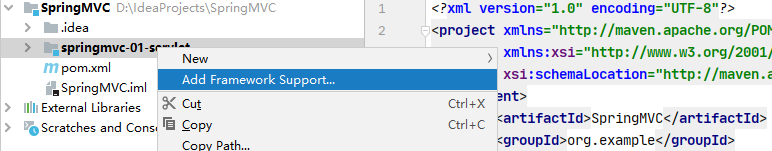
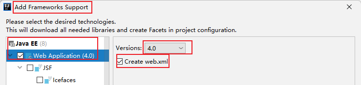
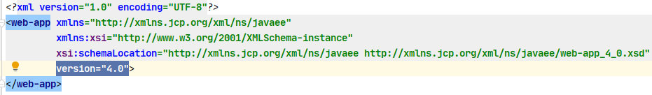

# 1. 准备工作

SSM：MyBatis + Spring + SpringMVC

MVC：模型（dao，service）视图（jsp）控制器（servlet）

```xml
<dependencies>
    <dependency>
        <groupId>junit</groupId>
        <artifactId>junit</artifactId>
        <version>4.12</version>
    </dependency>
    <dependency>
        <groupId>org.springframework</groupId>
        <artifactId>spring-webmvc</artifactId>
        <version>5.3.24</version>
    </dependency>
    <dependency>
        <groupId>javax.servlet</groupId>
        <artifactId>servlet-api</artifactId>
        <version>2.5</version>
    </dependency>
    <dependency>
        <groupId>javax.servlet.jsp</groupId>
        <artifactId>jsp-api</artifactId>
        <version>2.2</version>
    </dependency>
    <dependency>
        <groupId>javax.servlet</groupId>
        <artifactId>jstl</artifactId>
        <version>1.2</version>
    </dependency>
</dependencies>
```

先创建一个 project，删掉 src 文件夹，配置公共的依赖，之后新建 module


# 2. 回顾 Servlet

从一个空白的 maven 项目开始，add framework support -> web application





就会得到 4.0 版本的 web.xml




+ 前端获取提交的信息 http://localhost:8080/springmvc_01_servlet_war_exploded/hello?method=add

```jsp
<%@ page contentType="text/html;charset=UTF-8" language="java" %>
<html>
<head>
    <title>$Title$</title>
</head>
<body>
    <form action="${pageContext.request.contextPath}/hello" method="post">
        <label>
            <input type="text" name="method"/>
        </label>
        <input type="submit"/>
    </form>
</body>
</html>
```


+ 编写后台处理的程序 HelloServlet

```java
package com.isaiah.servlet;

import javax.servlet.ServletException;
import javax.servlet.http.HttpServlet;
import javax.servlet.http.HttpServletRequest;
import javax.servlet.http.HttpServletResponse;
import java.io.IOException;

// HttpServlet 的父类实现了 Servlet 接口
public class HelloServlet extends HttpServlet {
    @Override
    protected void doGet(HttpServletRequest req, HttpServletResponse resp) throws ServletException, IOException {
        // 1. 获取前端参数
        String method = req.getParameter("method");
        if ("add".equals(method)) {
            req.getSession().setAttribute("msg", "执行了 add 方法");
        }
        if ("delete".equals(method)) {
            req.getSession().setAttribute("msg", "执行了 delete 方法");
        }
        // 2. 调用业务层 service

        // 3. 页面转发或重定向
        req.getRequestDispatcher("/WEB-INF/jsp/test.jsp").forward(req, resp);
    }

    @Override
    protected void doPost(HttpServletRequest req, HttpServletResponse resp) throws ServletException, IOException {
        doGet(req, resp);
    }
}
```


+ 后端命令从当前页面转发到另一个页面，用 EL 表达式得到通过 session 传递来的数据

```jsp
<%@ page contentType="text/html;charset=UTF-8" language="java" %>
<html>
<head>
    <title>$Title$</title>
</head>
<body>
${msg}
</body>
</html>
```


+ 在 web.xml 中注册 servlet（把 HelloServlet 映射到 /hello 页面，处理 /hello 的请求与响应）

```xml
<?xml version="1.0" encoding="UTF-8"?>
<web-app xmlns="http://xmlns.jcp.org/xml/ns/javaee"
         xmlns:xsi="http://www.w3.org/2001/XMLSchema-instance"
         xsi:schemaLocation="http://xmlns.jcp.org/xml/ns/javaee http://xmlns.jcp.org/xml/ns/javaee/web-app_4_0.xsd"
         version="4.0">

    <servlet>
        <servlet-name>hello</servlet-name>
        <servlet-class>com.isaiah.servlet.HelloServlet</servlet-class>
    </servlet>
    <servlet-mapping>
        <servlet-name>hello</servlet-name>
        <url-pattern>/hello</url-pattern>
    </servlet-mapping>
</web-app>
```


# 3. 初识 SpringMVC

+ 轻量级，简单易学
+ 与 Spring 兼容性好，无缝结合
+ 约定大于配置
+ 功能强大
