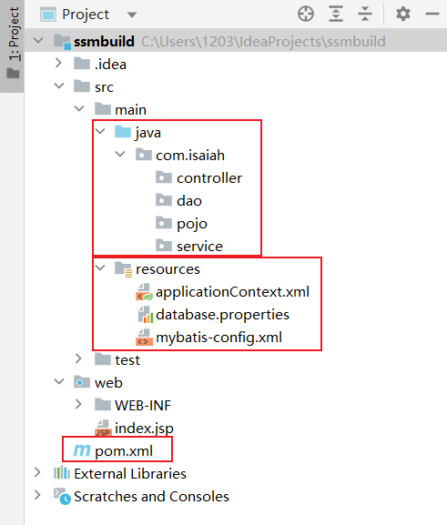
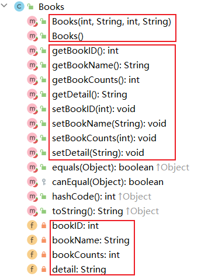
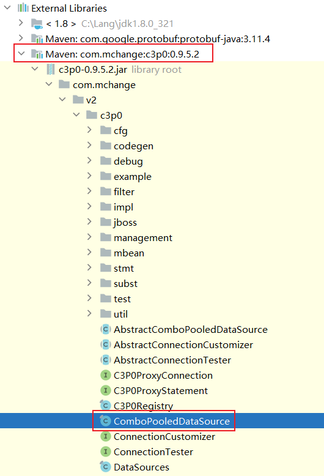
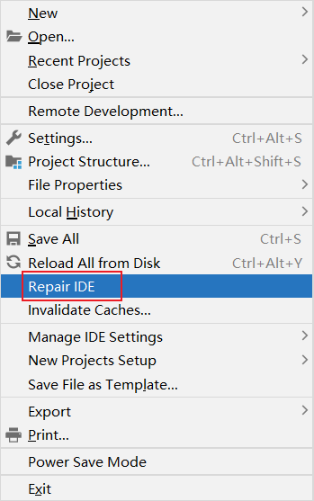
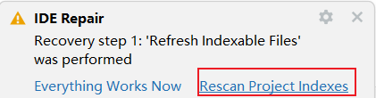

# 1. pom.xml

## 1.1 依赖问题

```xml

    <dependencies>
<!--        junit-->
        <dependency>
            <groupId>junit</groupId>
            <artifactId>junit</artifactId>
            <version>4.13.2</version>
            <scope>test</scope>
        </dependency>
<!--        数据库驱动-->
        <dependency>
            <groupId>mysql</groupId>
            <artifactId>mysql-connector-java</artifactId>
            <version>8.0.32</version>
        </dependency>
<!--        数据库连接池-->
        <dependency>
            <groupId>com.mchange</groupId>
            <artifactId>c3p0</artifactId>
            <version>0.9.5.2</version>
        </dependency>
<!--        servlet-jsp-jstl-->
        <dependency>
            <groupId>javax.servlet</groupId>
            <artifactId>servlet-api</artifactId>
            <version>2.3</version>
        </dependency>
        <dependency>
            <groupId>javax.servlet.jsp</groupId>
            <artifactId>jsp-api</artifactId>
            <version>2.2</version>
        </dependency>
        <dependency>
            <groupId>javax.servlet</groupId>
            <artifactId>jstl</artifactId>
            <version>1.2</version>
        </dependency>
<!--        mybatis-->
        <dependency>
            <groupId>org.mybatis</groupId>
            <artifactId>mybatis</artifactId>
            <version>3.5.2</version>
        </dependency>
        <dependency>
            <groupId>org.mybatis</groupId>
            <artifactId>mybatis-spring</artifactId>
            <version>2.0.2</version>
        </dependency>
<!--        spring-->
        <dependency>
            <groupId>org.springframework</groupId>
            <artifactId>spring-webmvc</artifactId>
            <version>5.1.9.RELEASE</version>
        </dependency>
        <dependency>
            <groupId>org.springframework</groupId>
            <artifactId>spring-jdbc</artifactId>
            <version>5.1.9.RELEASE</version>
        </dependency>
    </dependencies>
```


## 1.2 静态资源导出

```xml
<build>
    <resources>
        <resource>
            <directory>src/main/java</directory>
            <includes>
                <include>**/*.properties</include>
                <include>**/*.xml</include>
            </includes>
            <filtering>false</filtering>
        </resource>
        <resource>
            <directory>src/main/resources</directory>
            <includes>
                <include>**/*.properties</include>
                <include>**/*.xml</include>
            </includes>
            <filtering>false</filtering>
        </resource>
    </resources>
</build>
```


# 2. 项目结构



# 3. 初始化工作

==mybatis-config.xml==

```xml
<?xml version="1.0" encoding="UTF-8" ?>
<!DOCTYPE configuration
        PUBLIC "-//mybatis.org//DTD Config 3.0//EN"
        "https://mybatis.org/dtd/mybatis-3-config.dtd">
<configuration>

</configuration>
```


==applicationContext.xml==

```xml
<?xml version="1.0" encoding="UTF-8"?>
<beans xmlns="http://www.springframework.org/schema/beans"
       xmlns:xsi="http://www.w3.org/2001/XMLSchema-instance"
       xsi:schemaLocation="http://www.springframework.org/schema/beans
        https://www.springframework.org/schema/beans/spring-beans.xsd">

</beans>
```


==database.properties==

**mysql 8.0+ url 连接时区：serverTimeZone=Asia/Shanghai**

```properties
jdbc.driver=com.mysql.jdbc.Driver
jdbc.url=jdbc:mysql://localhost:3306/ssmbuild?useSSL=true&useUnicode=true&characterEncoding=utf8&serverTimeZone=Asia/Shanghai
jdbc.username=root
jdbc.password=123456
```


# 4. MyBatis 层内容

**mybatis-config.xml（为项目中的类添加别名）**

```xml
<typeAliases>
    <package name="com.isaiah.pojo"/>
</typeAliases>
```


**创建类 pojo.Books（属性名与字段名对应）**

```java
public class Books {
    private int bookID;
    private String bookName;
    private int bookCounts;
    private String detail;
}
```


**pom.xml（添加 lombok 依赖）**

```xml
<dependency>
    <groupId>org.projectlombok</groupId>
    <artifactId>lombok</artifactId>
    <version>1.18.26</version>
</dependency>
```


**pojo.Books 中添加注解**

```java
@Data
@NoArgsConstructor
@AllArgsConstructor
```



**dao.BooksMapper 编写 dao 接口**

```java
package com.isaiah.dao;

import com.isaiah.pojo.Books;

import java.util.List;

public interface BooksMapper {
    // 增加一本书
    int addBook(Books book);
    // 删除一本书
    int deleteBookById(int id);
    // 更新一本书
    int updateBook(Books books);
    // 查询一本书
    Books queryBookById(int id);
    // 查询全部的书
    List<Books> queryAllBook();
}
```


**dao.BooksMapper.xml 可以用 mybatis-config.xml 改出来**

```xml
<?xml version="1.0" encoding="UTF-8" ?>
<!DOCTYPE mapper
        PUBLIC "-//mybatis.org//DTD Config 3.0//EN"
        "https://mybatis.org/dtd/mybatis-3-mapper.dtd">
<mapper>
    
</mapper>
```


**dao.BooksMapper.xml 与 dao.BookMapper.java 对照书写**

```xml
<?xml version="1.0" encoding="UTF-8" ?>
<!DOCTYPE mapper
        PUBLIC "-//mybatis.org//DTD Config 3.0//EN"
        "https://mybatis.org/dtd/mybatis-3-mapper.dtd">
<mapper namespace="com.isaiah.dao.BooksMapper">
    <insert id="addBook" parameterType="Books">
        insert into ssmbuild.books (bookName, bookCounts, detail)
        values (#{bookName}, #{bookCounts}, #{detail});
    </insert>

    <delete id="deleteBookById" parameterType="int">
        delete from ssmbuild.books
               where bookID = #{bookId};
    </delete>

    <update id="updateBook" parameterType="Books">
        update ssmbuild.books
        set bookName = #{bookName}, bookCounts = #{bookCounts}, detail = #{detail}
        where bookID = #{books.bookID};
    </update>

    <select id="queryBookById" resultType="Books">
        select * from ssmbuild.books
                 where bookID = #{bookId};
    </select>

    <select id="queryAllBooks" resultType="Books">
        select * from ssmbuild.books;
    </select>
</mapper>
```

```java
int deleteBookById(@Param("bookId") int id);
Books queryBookById(@Param("bookId") int id);
```


**mybatis-config.xml 中注册 mapper**

```xml
<mappers>
    <mapper class="com.isaiah.dao.BooksMapper"/>
</mappers>
```


**service.BooksService 使用之前 dao.BooksMapper 的代码**

```java
 package com.isaiah.service;

import com.isaiah.pojo.Books;

import java.util.List;

public interface BooksService {
    // 增加一本书
    int addBook(Books book);
    // 删除一本书
    int deleteBookById(int id);
    // 更新一本书
    int updateBook(Books books);
    // 查询一本书
    Books queryBookById(int id);
    // 查询全部的书
    List<Books> queryAllBook();
}
```


**编写业务层的实现类 service.BooksServiceImpl**

```java
package com.isaiah.service;

import com.isaiah.dao.BooksMapper;
import com.isaiah.pojo.Books;

import java.util.List;

public class BooksServiceImpl implements BooksService {
    // 业务层调用 dao 层：组合 dao
    private BooksMapper booksMapper;

    public BooksMapper getBooksMapper() {
        return booksMapper;
    }

    public void setBooksMapper(BooksMapper booksMapper) {
        this.booksMapper = booksMapper;
    }

    @Override
    public int addBook(Books book) {
        return booksMapper.addBook(book);
    }

    @Override
    public int deleteBookById(int id) {
        return booksMapper.deleteBookById(id);
    }

    @Override
    public int updateBook(Books books) {
        return booksMapper.updateBook(books);
    }

    @Override
    public Books queryBookById(int id) {
        return booksMapper.queryBookById(id);
    }

    @Override
    public List<Books> queryAllBook() {
        return booksMapper.queryAllBooks();
    }
}
```


# 5. Spring 层内容

## 5.1 Spring 整合 dao 层

==resources.spring-dao.xml==

```xml
<?xml version="1.0" encoding="UTF-8"?>
<beans xmlns="http://www.springframework.org/schema/beans"
       xmlns:xsi="http://www.w3.org/2001/XMLSchema-instance"
       xmlns:context="http://www.springframework.org/schema/context"
       xsi:schemaLocation="http://www.springframework.org/schema/beans
        https://www.springframework.org/schema/beans/spring-beans.xsd
        http://www.springframework.org/schema/context
        http://www.springframework.org/schema/context/spring-context.xsd">
<!--    1. 关联数据库配置文件-->
    <context:property-placeholder location="classpath:database.properties"/>
    
    
<!--    2. 连接池 dbcp 半自动化操作，不能自动连接
                 c3p0 自动化操作（自动化地加载配置文件，并且可以自动设置到对象中）
                 druid null：hikari null-->
    <bean id="dataSource" class="com.mchange.v2.c3p0.ComboPooledDataSource">
        <property name="driverClass" value="${jdbc.driver}"/>
        <property name="jdbcUrl" value="${jdbc.url}"/>
        <property name="user" value="${jdbc.username}"/>
        <property name="password" value="${jdbc.password}"/>
    </bean>
    
    
<!--    3. sqlSessionFactory-->
    <bean id="sqlSessionFactory" class="org.mybatis.spring.SqlSessionFactoryBean">
<!--        引入数据源-->
        <property name="dataSource" ref="dataSource"/>
<!--        绑定 MyBatis 的配置文件-->
        <property name="configLocation" value="classpath:mybatis-config.xml"/>
    </bean>
    
    
<!--    4. 配置 dao 接口扫描包，动态地实现了 dao 接口可以注入到 spring 容器中-->
    <bean class="org.mybatis.spring.mapper.MapperScannerConfigurer">
<!--        注入 sqlSessionFactory-->
        <property name="sqlSessionFactoryBeanName" value="sqlSessionFactory"/>
<!--        要扫描的 dao 包-->
        <property name="basePackage" value="com.isaiah.dao"/>
    </bean>
</beans>
```





# 可能出现的问题

## idea 没有及时建立文件之间的数据依赖




