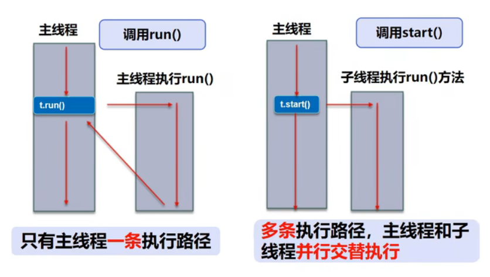
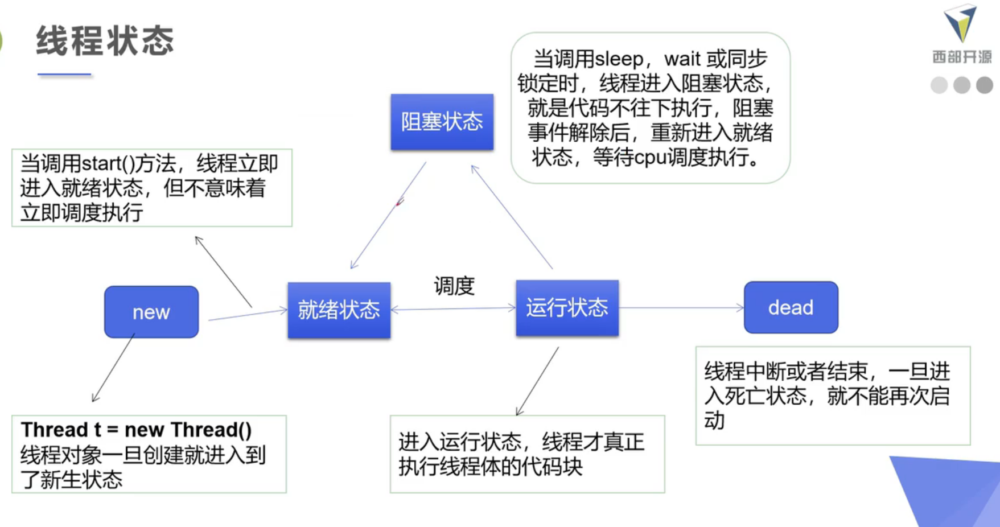
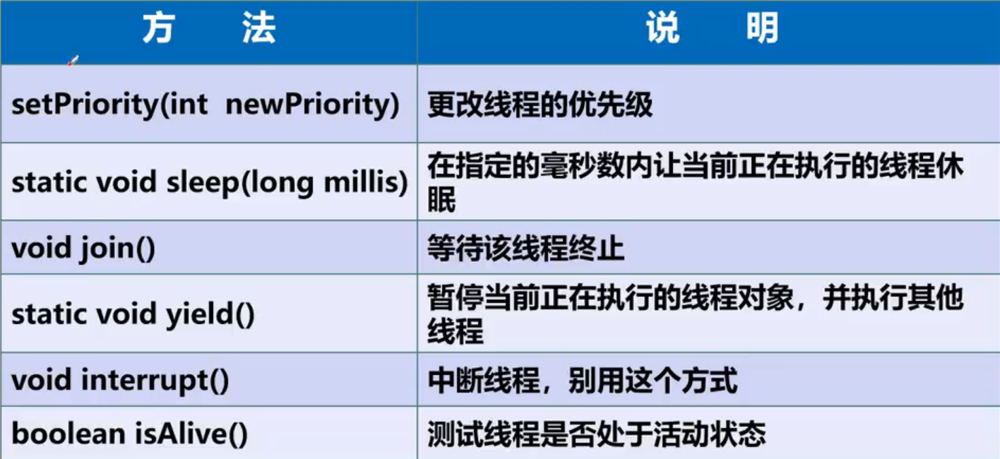

# 1. 线程创建——继承Thread类

```java
// 继承Thread类
package com.isaiah.thread1;

public class TestThread1 extends Thread {
    @Override
    public void run() {
        for (int i = 20; i > 0; i--) {
            System.out.println("in run");
        }
    }

    public static void main(String[] args) {
        TestThread1 testThread1 = new TestThread1();
        // 开启线程
//        testThread1.start();
        // 函数调用
        testThread1.run();

        // 主线程
        for (int i = 2000; i > 0; i--) {
            System.out.println("in main");
        }
    }
}

```




# 2. 多线程下载图片

```java
package com.isaiah.thread2;

import org.apache.commons.io.FileUtils;

import java.io.File;
import java.io.IOException;
import java.net.URL;

public class Downloader {
    private String url;
    private String filePath;

    public Downloader(String url, String filePath) {
        this.url = url;
        this.filePath = filePath;
    }

    public void download() {
        try {
            FileUtils.copyURLToFile(new URL(url), new File(filePath));

        } catch (IOException e) {
            e.printStackTrace();
            System.out.println("Downloader 下载工具出现问题");
        }
    }
}

```

```java
// Thread子类重写run方法，子类的对象调用start方法开启一个线程
package com.isaiah.thread2;

public class TestThread2 extends Thread {
    private String url;
    private String filePath;

    public TestThread2(String url, String filePath) {
        this.url = url;
        this.filePath = filePath;
    }

    public void run() {
        Downloader downloader = new Downloader(url, filePath);
        downloader.download();
        System.out.println("file = " + filePath);
    }

    public static void main(String[] args) {
        TestThread2 t1 = new TestThread2("https://dailyverses.net/images/en/niv/psalms-33-18-2.jpg", "1.jpg");
        TestThread2 t2 = new TestThread2("https://dailyverses.net/images/en/niv/xl/psalms-121-7-8-2.jpg", "2.jpg");
        TestThread2 t3 = new TestThread2("https://dailyverses.net/images/en/niv/mark-11-24.jpg", "3.jpg");
        TestThread2 t4 = new TestThread2("https://dailyverses.net/images/en/niv/john-11-25-26.jpg", "4.jpg");

        t1.start();
        t2.start();
        t3.start();
        t4.start();
    }
}

```


# 3. 线程创建——实现Runnable接口

```java
// 目标类实现Runnable接口
// 创建Thread对象，传入目标类的对象，调用start方法
package com.isaiah.thread3;

import com.isaiah.thread1.TestThread1;

public class TestThread3 implements Runnable {
    @Override
    public void run() {
        for (int i = 20; i > 0; i--) {
            System.out.println("in run");
        }
    }

    public static void main(String[] args) {
        new Thread(new TestThread3()).start();

        for (int i = 2000; i > 0; i--) {
            System.out.println("in main");
        }
    }
}

```


# 4. 多线程买火车票

```java
package com.isaiah.thread4;

// 多个线程使用同一个资源，导致线程不安全
public class TestThread4 implements Runnable {
    private int ticketNum = 10;

    @Override
    public void run() {
        while (ticketNum > 0) {
            try {
                // 模拟时延
                Thread.sleep(200);
            } catch (InterruptedException e) {
                e.printStackTrace();
            }
            System.out.println(Thread.currentThread().getName() + "拿到了第" + ticketNum-- + "张票");
        }
    }

    public static void main(String[] args) {
        // 一份资源
        TestThread4 ticket = new TestThread4();
        // 多个代理
        new Thread(ticket, "a").start();
        new Thread(ticket, "b").start();
        new Thread(ticket, "c").start();
    }
}

```


# 5. 龟兔赛跑

```java
package com.isaiah.race;

public class Race implements Runnable {
    String winner;
    int trace;

    public Race(int trace) {
        this.trace = trace;
    }

    private boolean gameOver(int steps) {
        if (winner != null) {
            return true;
        }
        if (steps >= trace) {
            winner = Thread.currentThread().getName();
            System.out.println(Thread.currentThread().getName() + " is already run " + steps + " steps");
            return true;
        } else {
            return false;
        }
    }

    @Override
    public void run() {
        for (int i = 1; i <= trace; i++) {
            if (gameOver(i)) {
                System.out.println("winner is " + winner);
            } else {
//                if ("rabbit".equals(Thread.currentThread().getName())) {
//                    try {
//                        Thread.sleep(10);
//                    } catch (InterruptedException e) {
//                        e.printStackTrace();
//                    }
//                }
                System.out.println(Thread.currentThread().getName() + " is already run " + i + " steps");
            }
        }
    }

    public static void main(String[] args) {
        Race race = new Race(100);
        new Thread(race, "rabbit").start();
        new Thread(race, "turtle").start();
    }
}
```


# 6. 实现Callable接口（了解）

callable 的好处

1. 可以定义返回值
2. 可以抛出异常

```java
package com.isaiah.callable;

import com.isaiah.thread2.Downloader;

import javax.sql.rowset.CachedRowSet;
import java.util.concurrent.*;

public class TestCallable implements Callable<Boolean> {
    private String url;
    private String filePath;

    public TestCallable(String url, String filePath) {
        this.url = url;
        this.filePath = filePath;
    }

    public Boolean call() {
        Downloader downloader = new Downloader(url, filePath);
        downloader.download();
        System.out.println("file = " + filePath);
        return true;
    }

    public static void main(String[] args) {
        TestCallable t1 = new TestCallable("https://dailyverses.net/images/en/niv/psalms-33-18-2.jpg", "1.jpg");
        TestCallable t2 = new TestCallable("https://dailyverses.net/images/en/niv/xl/psalms-121-7-8-2.jpg", "2.jpg");
        TestCallable t3 = new TestCallable("https://dailyverses.net/images/en/niv/mark-11-24.jpg", "3.jpg");
        TestCallable t4 = new TestCallable("https://dailyverses.net/images/en/niv/john-11-25-26.jpg", "4.jpg");

        // 创建执行服务
        ExecutorService threadPool = Executors.newFixedThreadPool(3);
        // 提交执行
        Future<Boolean> r1 = threadPool.submit(t1);
        Future<Boolean> r2 = threadPool.submit(t2);
        Future<Boolean> r3 = threadPool.submit(t3);
        Future<Boolean> r4 = threadPool.submit(t4);
        // 获取结果
        try {
            System.out.println(r1.get());
            System.out.println(r2.get());
            System.out.println(r3.get());
            System.out.println(r4.get());
        } catch (InterruptedException | ExecutionException e) {
            e.printStackTrace();
        }
        // 关闭服务
        threadPool.shutdown();
    }
}

```


# 7. Lambda表达式

函数式接口（Functional Interface）：只包含一个抽象方法的接口

```java
package com.isaiah.lambda;

public class TestLambda {
    // 静态内部类
    static class Like2 implements ILike {
        @Override
        public void lambda() {
            System.out.println("I like lambda #2");
        }
    }

    public static void main(String[] args) {
        ILike like1 = new Like1();
        like1.lambda();

        ILike like2 = new Like2();
        like2.lambda();

        // 局部内部类
        class Like3 implements ILike {
            @Override
            public void lambda() {
                System.out.println("I like lambda #3");
            }
        }
        ILike like3 = new Like3();
        like3.lambda();

        // 匿名内部类：没有类的名称，必须借助接口或父类
        ILike like4 = new ILike() {
            @Override
            public void lambda() {
                System.out.println("I like lambda #4");
            }
        };
        like4.lambda();

        // 用lambda简化
        ILike like5 = ()-> System.out.println("I like lambda #5");
        like5.lambda();
    }
}

// 实现一个函数式接口
interface ILike {
    void lambda();
}

// 实现类
class Like1 implements ILike {
    @Override
    public void lambda() {
        System.out.println("I like lambda #1");
    }
}
```


# 8. 线程停止






```java
package com.isaiah.state;

public class TestStop implements Runnable {

    // 设置一个标志位
    private boolean flag = true;

    @Override
    public void run() {
        int i = 0;
        while (flag) {
            System.out.println("run thread #" + i++);
        }
    }

    // 设置一个公开的方法停止线程， 转换标志位
    public void stop() {
        flag = false;
    }

    public static void main(String[] args) {
        TestStop testStop = new TestStop();
        new Thread(testStop).start();

        for (int i = 0; i < 1000; i++) {
            System.out.println("main "+ i);
            if (i == 900) {
                testStop.stop();
                System.out.println("线程停止了");
            }
        }
    }
}

```


# 9. 线程休眠

1000ms = 1s

```java
package com.isaiah.state;

import java.text.SimpleDateFormat;
import java.util.Date;

public class TestSleep {
    // countdown simulator
    private static void tenDown() {
        int num = 10;
        while (num > 0) {
            try {
                Thread.sleep(1000);
            } catch (InterruptedException e) {
                e.printStackTrace();
            }
            System.out.println(num--);
        }
    }

    // timer
    private static void timer() {
        Date time = new Date(System.currentTimeMillis());

        while (true) {
            System.out.println(new SimpleDateFormat("HH:mm:ss").format(time));
            try {
                Thread.sleep(1000);
            } catch (InterruptedException e) {
                e.printStackTrace();
            }
            time = new Date(System.currentTimeMillis());
        }
    }

    public static void main(String[] args) {
//        tenDown();
        timer();
    }
}
```


# 10. 线程礼让

+ 礼让不一定成功

```java
package com.isaiah.state;

public class TestYield implements Runnable {
    @Override
    public void run() {
        System.out.println(Thread.currentThread().getName() + " thread started");
        Thread.yield();
        System.out.println(Thread.currentThread().getName() + " thread ended");
    }

    public static void main(String[] args) {
        TestYield testYield = new TestYield();
        new Thread(testYield, "a").start();
        new Thread(testYield, "b").start();
    }
}

```


# 11. 线程强制执行

+ 可以想象成插队

```java
package com.isaiah.state;

public class TestJoin implements Runnable {
    @Override
    public void run() {
        for (int i = 0; i < 100; i++) {
            System.out.println("in thread #" + i);
        }
    }

    public static void main(String[] args) {
        TestJoin testJoin = new TestJoin();
        Thread thread = new Thread(testJoin);
        thread.start();

        for (int i = 0; i < 100; i++) {
            if (i == 5) {
                try {
                    thread.join();
                } catch (InterruptedException e) {
                    e.printStackTrace();
                }
            }
            System.out.println("in main #" + i);
        }
    }
}
```


# 12. 获取线程状态

> Thread.State : 

NEW ：A thread that has not yet started is in this state

RUNNABLE ：A thread executing in the Java virtual machine is in this state

BLOCKED ：A thread that is blocked waiting for a monitor lock is in this state

WAITING ：A thread that is waiting indefinitely for another thread to perform a particular action is in this state

TIMED_WAITING ：A thread that is waiting for another thread to perform an action for up to a specified waiting time is in this state

TERMINATED ：A thread that has exited is in this state

```java
package com.isaiah.state;

public class TestState {
    public static void main(String[] args) {
        Thread thread = new Thread(()->{
            for (int i = 0; i < 3; i++) {
                try {
                    Thread.sleep(1000);
                } catch (InterruptedException e) {
                    e.printStackTrace();
                }
            }
            System.out.println("-------------------------");
        });
        System.out.println(thread.getState());

        thread.start();
        System.out.println(thread.getState());

        while (thread.getState() != Thread.State.TERMINATED) {
            try {
                Thread.sleep(100);
                System.out.println(thread.getState());
            } catch (InterruptedException e) {
                e.printStackTrace();
            }
        }

        // dead thread can not be started again
        thread.start();
    }
}

```


# 13. 线程优先级

1~10

```java
package com.isaiah.state;

class MyThread implements Runnable {
    @Override
    public void run() {
        System.out.println(Thread.currentThread().getName() + " --> " + Thread.currentThread().getPriority());
    }
}

public class TestPriority {
    public static void main(String[] args) {
        // print main thread priority
        System.out.println(Thread.currentThread().getName() + " --> " + Thread.currentThread().getPriority());
        MyThread myThread = new MyThread();
        Thread t1 = new Thread(myThread);
        Thread t2 = new Thread(myThread);
        Thread t3 = new Thread(myThread);

        //t1.setPriority(Thread.MIN_PRIORITY);
        t1.start();
        t2.setPriority(2);
        t2.start();
        t3.setPriority(Thread.MAX_PRIORITY);
        t3.start();
    }
}

```


# 14. 守护线程

**线程**分为**用户线程**和**守护线程**

**main** 是用户线程 **gc** 是守护线程

```java
package com.isaiah.thread.state;

public class TestDaemon {
    public static void main(String[] args) {
        Thread godThread = new Thread(()->{
            while (true) {
                System.out.println("God bless you!");
            }
        });

        Thread mortalThread = new Thread(()->{
            System.out.println("Hello World!");
            for (int i = 0; i < 36500; i++) {
                System.out.println("what a happy day!");
            }
            System.out.println("Goodbye World!");
        });

        godThread.setDaemon(true);
        godThread.start();
        mortalThread.start();
    }
}

```


# 15. 三大不安全案例

```java
// 火车站买票
package com.isaiah.syn;

public class UnsafeBuyTicket {
    public static void main(String[] args) {
        BuyTicket buyTicket = new BuyTicket();
        new Thread(buyTicket).start();
        new Thread(buyTicket).start();
        new Thread(buyTicket).start();
    }
}

class BuyTicket implements Runnable {
    private int ticket = 10;

    @Override
    public void run() {
        while (ticket > 0) {
            try {
                Thread.sleep(100);
            } catch (InterruptedException e) {
                e.printStackTrace();
            }
            System.out.println(Thread.currentThread().getName() + " buy " + ticket--);
        }
    }
}

```

```java
// 银行存取钱
package com.isaiah.syn;

public class UnsafeBank {
    public static void main(String[] args) {
        Account gold = new Account(100, "gold");
        Drawing d1 = new Drawing(gold, 50, "1");
        Drawing d2 = new Drawing(gold, 100, "2");
        d1.start();
        d2.start();
    }
}

class Account {
    int money;
    String name;

    public Account(int money, String name) {
        this.money = money;
        this.name = name;
    }
}

class Drawing extends Thread {
    Account account;
    int drawingMoney;
    String name;

    public Drawing(Account account, int drawingMoney, String name) {
        this.account = account;
        this.drawingMoney = drawingMoney;
        this.name = name;
    }

    @Override
    public void run() {
        if (account.money - drawingMoney >= 0) {
            try {
                Thread.sleep(1000);
            } catch (InterruptedException e) {
                e.printStackTrace();
            } else {
                System.out.println("money is limited");
            }
            account.money -= drawingMoney;
        }
        System.out.println(name + " account : " + account.money);
    }
}

```

```java
// 创建线程
package com.isaiah.syn;

import java.util.ArrayList;
import java.util.List;

public class UnsafeList {
    public static void main(String[] args) {
        List<String> list = new ArrayList<>();
        for (int i = 0; i < 1000; i++) {
            new Thread(()->{
                list.add(Thread.currentThread().getName());
            }).start();
        }
        System.out.println(list.size());
    }
}

```


# 16. 同步方法及同步块

```java
火车站买票：在run方法上加synchronized关键字
public synchronized void run() {
    while (ticket > 0) {
        try {
            Thread.sleep(100);
        } catch (InterruptedException e) {
            e.printStackTrace();
        }
        System.out.println(Thread.currentThread().getName() + " buy " + ticket--);
    }
}

银行存取钱：synchronized同步代码块
public void run() {
    synchronized (account) {
        if (account.money - drawingMoney >= 0) {
            try {
                Thread.sleep(1000);
            } catch (InterruptedException e) {
                e.printStackTrace();
            }
            account.money -= drawingMoney;
        } else {
            System.out.println("money is limited");
        }
        System.out.println(name + " account : " + account.money);
    }
}

创建多个线程：在list上加synchronized关键字
public synchronized void run() {
    while (ticket > 0) {
        try {
            Thread.sleep(100);
        } catch (InterruptedException e) {
            e.printStackTrace();
        }
        System.out.println(Thread.currentThread().getName() + " buy " + ticket--);
    }
}
```


# 17. 死锁

**死锁的四个条件**

互斥资源：一个资源每次只能被一个进程使用

请求与保持条件：一个进程因请求资源而阻塞时，对已获得的资源保持占有

不剥夺条件：进程在未使用完资源前，不能够强行剥夺

循环等待条件：若干进程之间形成了一种头尾相接的循环等待状态

```java
package com.isaiah.syn;

public class DeadLock {
    public static void main(String[] args) {
        Make make0 = new Make("0", 0);
        Make make1 = new Make("0", 1);
        new Thread(make0).start();
        new Thread(make1).start();
    }
}

class A {}

class B {}

class Make implements Runnable {
    A a = new A();
    B b = new B();
    String name;
    int choice;

    public Make(String name, int choice) {
        this.name = name;
        this.choice = choice;
    }

    @Override
    public void run() {
        if (choice == 0) {
            synchronized (A.class) {
                System.out.println(Thread.currentThread().getName() + " get A.");
                synchronized (B.class) {
                    System.out.println(Thread.currentThread().getName() + " get B.");
                }
            }
        } else {
            synchronized (B.class) {
                System.out.println(Thread.currentThread().getName() + " get B.");
                synchronized (A.class) {
                    System.out.println(Thread.currentThread().getName() + " get A.");
                }
            }
        }
    }
}

```

```java
// 解决之道
public void run() {
    if (choice == 0) {
        synchronized (A.class) {
            System.out.println(Thread.currentThread().getName() + " get A.");

        }synchronized (B.class) {
            System.out.println(Thread.currentThread().getName() + " get B.");
        }
    } else {
        synchronized (B.class) {
            System.out.println(Thread.currentThread().getName() + " get B.");

        }synchronized (A.class) {
            System.out.println(Thread.currentThread().getName() + " get A.");
        }
    }
}
```


# 18. Lock 锁

reentrant lock ： 可重入锁

```java
package com.isaiah.syn;

import java.util.concurrent.locks.ReentrantLock;

public class TestLock implements Runnable {
    private int ticket = 10;
    private final ReentrantLock lock = new ReentrantLock();

    @Override
    public void run() {
        while (true) {
            try {
                lock.lock();
                if (ticket > 0) {
                    Thread.sleep(1000);
                    System.out.println(ticket--);
                } else {
                    break;
                }
            } catch (InterruptedException e) {
                e.printStackTrace();
            } finally {
                lock.unlock();
            }
        }
    }

    public static void main(String[] args) {
        TestLock testLock = new TestLock();
        Thread thread1 = new Thread(testLock);
        Thread thread2 = new Thread(testLock);
        thread1.start();
        thread2.start();
    }
}

```


# 19. 生产者与消费者问题

管程法

```java
package com.isaiah.syn;

// 利用缓冲区解决
public class TestPC1 {
    public static void main(String[] args) {
        SynContainer synContainer = new SynContainer();
        new Producer(synContainer).start();
        new Consumer(synContainer).start();
    }
}

class Consumer extends Thread {
    SynContainer container;
    public Consumer(SynContainer container) {
        this.container = container;
    }

    @Override
    public void run() {
        for (int i = 1; i <= 100; i++) {
            System.out.println("buy number " + container.pop().id + " chicken.");
        }
    }
}

class Producer extends Thread {
    SynContainer container;
    public Producer(SynContainer container) {
        this.container = container;
    }

    @Override
    public void run() {
        for (int i = 1; i <= 100; i++) {
            container.push(new Chicken(i));
            System.out.println("grow " + i + " chicken");
        }
    }
}

class Chicken {
    int id;

    public Chicken(int i) {
        id = i;
    }
}

class SynContainer {
    Chicken[] chickens = new Chicken[10];
    int count;

    public synchronized void push(Chicken chicken) {
        if (count == chickens.length) {
            try {
                this.wait();
            } catch (InterruptedException e) {
                e.printStackTrace();
            }
        }
        chickens[count++] = chicken;
        this.notifyAll();
    }

    public synchronized Chicken pop() {
        if (count == 0) {
            try {
                this.wait();
            } catch (InterruptedException e) {
                e.printStackTrace();
            }
        }
        this.notifyAll();
        return chickens[--count];
    }

}
```

```shell
grow 1 chicken
grow 2 chicken
grow 3 chicken
grow 4 chicken
grow 5 chicken
grow 6 chicken
grow 7 chicken
grow 8 chicken
grow 9 chicken
grow 10 chicken
buy number 10 chicken.
buy number 11 chicken.
buy number 9 chicken.
buy number 8 chicken.
buy number 7 chicken.
buy number 6 chicken.
buy number 5 chicken.
buy number 4 chicken.
buy number 3 chicken.
buy number 2 chicken.
grow 11 chicken
grow 12 chicken
buy number 1 chicken.
grow 13 chicken
grow 14 chicken
grow 15 chicken
grow 16 chicken
grow 17 chicken
grow 18 chicken
grow 19 chicken
buy number 13 chicken.
grow 20 chicken
grow 21 chicken
grow 22 chicken
grow 23 chicken
buy number 20 chicken.
buy number 23 chicken.
grow 24 chicken
grow 25 chicken
buy number 24 chicken.
buy number 25 chicken.
buy number 26 chicken.
buy number 22 chicken.
buy number 21 chicken.
buy number 19 chicken.
buy number 18 chicken.
buy number 17 chicken.
buy number 16 chicken.
buy number 15 chicken.
buy number 14 chicken.
buy number 12 chicken.
grow 26 chicken
grow 27 chicken
grow 28 chicken
buy number 27 chicken.
buy number 29 chicken.
buy number 28 chicken.
grow 29 chicken
grow 30 chicken
grow 31 chicken
buy number 30 chicken.
buy number 32 chicken.
buy number 31 chicken.
grow 32 chicken
grow 33 chicken
grow 34 chicken
buy number 33 chicken.
buy number 35 chicken.
buy number 34 chicken.
grow 35 chicken
grow 36 chicken
grow 37 chicken
grow 38 chicken
grow 39 chicken
grow 40 chicken
grow 41 chicken
grow 42 chicken
grow 43 chicken
grow 44 chicken
grow 45 chicken
grow 46 chicken
buy number 36 chicken.
buy number 46 chicken.
buy number 47 chicken.
buy number 45 chicken.
buy number 44 chicken.
buy number 43 chicken.
buy number 42 chicken.
buy number 41 chicken.
buy number 40 chicken.
buy number 39 chicken.
buy number 38 chicken.
buy number 37 chicken.
grow 47 chicken
grow 48 chicken
grow 49 chicken
grow 50 chicken
grow 51 chicken
grow 52 chicken
grow 53 chicken
grow 54 chicken
grow 55 chicken
grow 56 chicken
grow 57 chicken
grow 58 chicken
buy number 48 chicken.
buy number 58 chicken.
grow 59 chicken
buy number 59 chicken.
buy number 60 chicken.
buy number 57 chicken.
grow 60 chicken
grow 61 chicken
grow 62 chicken
grow 63 chicken
buy number 56 chicken.
buy number 63 chicken.
buy number 64 chicken.
grow 64 chicken
grow 65 chicken
grow 66 chicken
buy number 62 chicken.
buy number 66 chicken.
buy number 67 chicken.
buy number 65 chicken.
buy number 61 chicken.
buy number 55 chicken.
buy number 54 chicken.
buy number 53 chicken.
buy number 52 chicken.
buy number 51 chicken.
buy number 50 chicken.
buy number 49 chicken.
grow 67 chicken
grow 68 chicken
grow 69 chicken
grow 70 chicken
grow 71 chicken
grow 72 chicken
grow 73 chicken
grow 74 chicken
grow 75 chicken
grow 76 chicken
grow 77 chicken
grow 78 chicken
buy number 68 chicken.
buy number 78 chicken.
buy number 79 chicken.
buy number 77 chicken.
buy number 76 chicken.
buy number 75 chicken.
buy number 74 chicken.
buy number 73 chicken.
grow 79 chicken
grow 80 chicken
buy number 72 chicken.
buy number 81 chicken.
buy number 80 chicken.
buy number 71 chicken.
buy number 70 chicken.
buy number 69 chicken.
grow 81 chicken
grow 82 chicken
buy number 82 chicken.
buy number 83 chicken.
grow 83 chicken
grow 84 chicken
buy number 84 chicken.
buy number 85 chicken.
grow 85 chicken
grow 86 chicken
buy number 86 chicken.
grow 87 chicken
grow 88 chicken
buy number 87 chicken.
buy number 89 chicken.
buy number 88 chicken.
grow 89 chicken
grow 90 chicken
buy number 90 chicken.
buy number 91 chicken.
grow 91 chicken
grow 92 chicken
buy number 92 chicken.
buy number 93 chicken.
grow 93 chicken
grow 94 chicken
buy number 94 chicken.
buy number 95 chicken.
grow 95 chicken
grow 96 chicken
grow 97 chicken
buy number 96 chicken.
buy number 98 chicken.
grow 98 chicken
grow 99 chicken
grow 100 chicken
buy number 97 chicken.
buy number 100 chicken.
buy number 99 chicken.

Process finished with exit code 0

```


信号灯法

```java
package com.isaiah.syn;

public class TestPC2 {
    public static void main(String[] args) {
        Show show = new Show();
        new Player(show).start();
        new Watcher(show).start();
    }
}

class Player extends Thread {
    Show show;

    public Player(Show show) {
        this.show = show;
    }

    @Override
    public void run() {
        for (int i = 0; i < 20; i++) {
            if (i%2 == 0) {
                this.show.play("cctv1");
            } else {
                this.show.play("cctv2");
            }
        }
    }
}

class Watcher extends Thread {
    Show show;

    public Watcher(Show show) {
        this.show = show;
    }

    @Override
    public void run() {
        for (int i = 0; i < 20; i++) {
            show.watch();
        }
    }
}

class Show {
    String showName;
    boolean flag = true;

    public synchronized void play(String showName) {
        if (!flag) {
            try {
                this.wait();
            } catch (InterruptedException e) {
                e.printStackTrace();
            }
        }
        System.out.println("show name is " + showName);
        this.notifyAll();
        this.showName = showName;
        this.flag = !this.flag;
    }

    public synchronized void watch() {
        if (flag) {
            try {
                this.wait();
            } catch (InterruptedException e) {
                e.printStackTrace();
            }
        }
        System.out.println("audience watch " + showName);
        this.notifyAll();
        this.flag = !this.flag;
    }
}
```

```shell
show name is cctv1
audience watch cctv1
show name is cctv2
audience watch cctv2
show name is cctv1
audience watch cctv1
show name is cctv2
audience watch cctv2
show name is cctv1
audience watch cctv1
show name is cctv2
audience watch cctv2
show name is cctv1
audience watch cctv1
show name is cctv2
audience watch cctv2
show name is cctv1
audience watch cctv1
show name is cctv2
audience watch cctv2
show name is cctv1
audience watch cctv1
show name is cctv2
audience watch cctv2
show name is cctv1
audience watch cctv1
show name is cctv2
audience watch cctv2
show name is cctv1
audience watch cctv1
show name is cctv2
audience watch cctv2
show name is cctv1
audience watch cctv1
show name is cctv2
audience watch cctv2
show name is cctv1
audience watch cctv1
show name is cctv2
audience watch cctv2

Process finished with exit code 0

```


# 20. 使用线程池

```java
package com.isaiah.thread.syn;

import java.util.concurrent.ExecutorService;
import java.util.concurrent.Executors;

public class TestPool {
    public static void main(String[] args) {
        Thread thread = new Thread(() -> {
            System.out.println(Thread.currentThread().getName());
        });

        ExecutorService executorService = Executors.newFixedThreadPool(10);
        executorService.execute(thread);
        executorService.execute(thread);
        executorService.execute(thread);
        executorService.execute(thread);
        executorService.shutdown();
    }
}

```

