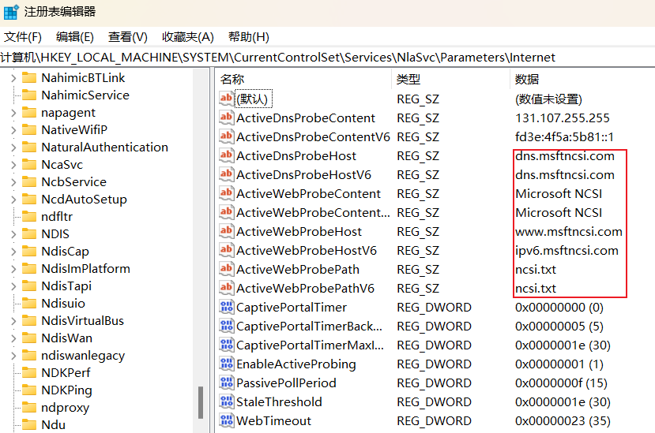

## 1. 正确连接上了网络，但是系统在任务栏依然显示未连接的图标（小地球）

### 1.1 原理

#### 1.1.1 名词解释（NLA, NCSI, FQDN）

Network Location Awareness (**NLA**) 网络位置识别

Network Connectivity Status Indicator (**NCSI**) 网络连接状态指示器

Fully qualified domain name (**FQDN**) 全限定域名

#### 1.1.2 工作流程

> Windows uses the `NLA` service to detect the properties of a network and determine how to manage connections to that network. 
>
> NLA uses a component that is named the `NCSI` to determine whether the computer has successfully connected to the network, and whether the network has intranet or internet connectivity.

NCSI uses both **active** and **passive** probes.

Active Probe 会从两个角度进行测试:

- **DNS 解析**
- **HTTP 连接**

两个测试任意一个不过都会导致 **无 Internet, 已连接** 这个结果。除了图标的显示有差别外，Windows 其实把 Active Probe 的结果用在了很多系统内置条件的判断上，网络不通会导致非常多的功能不可用 

**任何网络接口的变化都会引起 NCSI 的检测** These probes are triggered by ==changes in any of the network interfaces==

**Windows 10 or later versions:**

1. NCSI sends a **DNS request** to resolve the address of the `www.msftconnecttest.com` FQDN.
2. If NCSI receives a valid response from a DNS server, NCSI sends a plain **HTTP GET request** to `http://www.msftconnecttest.com/connecttest.txt`.
3. If NCSI successfully downloads the text file, it makes sure that the file contains ==Microsoft Connect Test==.
4. NCSI sends another **DNS request** to resolve the address of the `dns.msftncsi.com` FQDN.
   - **If any of these requests fails, the network alert appears in the Task Bar.** If you hover over the icon, you see a message such as "No connectivity" or "Limited Internet access" (depending on which requests failed).
   - If all of these requests succeed, the Task Bar shows the usual network icon. If you hover over the icon, you see a message such as "Internet access."

**Windows 8.1 or earlier versions:**

1. NCSI sends a **DNS request** to resolve the address of the `www.msftncsi.com` FQDN.
2. If NCSI receives a valid response from a DNS server, NCSI sends a plain **HTTP GET request** to `http://www.msftncsi.com/ncsi.txt`.
3. If NCSI successfully downloads the text file, it makes sure that the file contains Microsoft NCSI.
4. NCSI sends another **DNS request** to resolve the address of the `dns.msftncsi.com` FQDN.
   - **If any of these requests fails, the network alert appears in the Task Bar.** If you hover over the icon, you see a message such as "No connectivity" or "Limited Internet access" (depending on which requests failed).
   - If all of these requests succeed, the Task Bar shows the usual network icon. If you hover over the icon, you see a message such as "Internet access."

> NCSI and the NLA service combine these responses with other information to build a profile of the network connection, or identify its existing profile. The network connection profile provides the information that Windows needs to configure the appropriate Windows Firewall profile:
>
> - For Active Directory-authenticated networks: Firewall domain profile.
> - For networks that the user has marked as "private": Firewall private profile.
> - For networks that the user has marked as "public": Public firewall profile.

### 1.2 引用

[An Internet Explorer or Edge window opens when your computer connects to a corporate network or a public network](https://learn.microsoft.com/en-US/troubleshoot/windows-client/networking/internet-explorer-edge-open-connect-corporate-public-network)

[Windows 用来检测网络连通性的 IP 似乎被劫持了](https://v2ex.com/t/806309)

### 1.3 解决办法（regedit）

http://www.msftconnecttest.com/connecttest.txt 不行就换成 win10 之前的 http://www.msftncsi.com/ncsi.txt

打开注册表：win + R 输入 regedit

`计算机\HKEY_LOCAL_MACHINE\SYSTEM\CurrentControlSet\Services\NlaSvc\Parameters\Internet`

